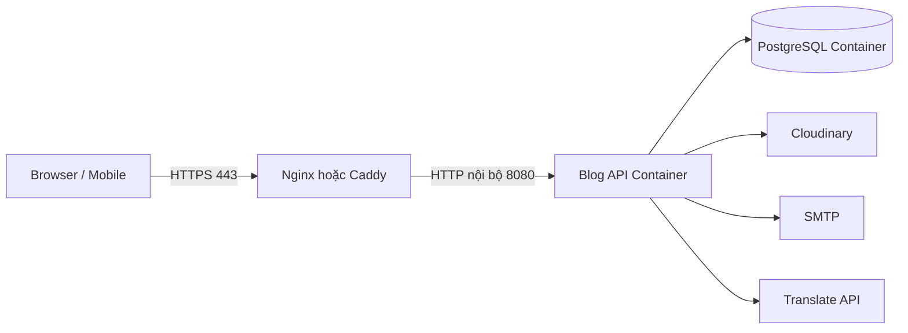
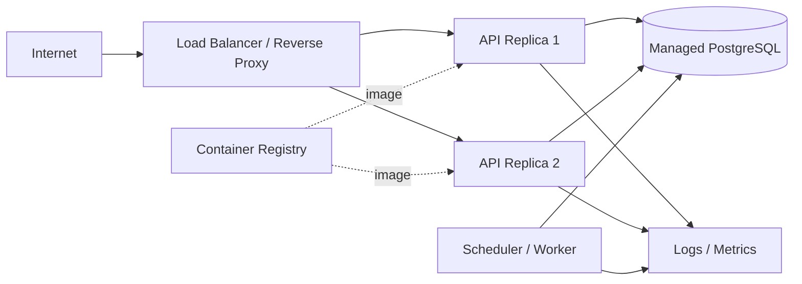

# KẾ HOẠCH TRIỂN KHAI DOCKER — DỰ ÁN QUẢN LÝ BLOG

> Tài liệu mô tả cách container hóa và triển khai backend NestJS + Prisma + PostgreSQL của dự án Quản lý Blog, từ môi trường local đến production. Các cấu hình mẫu đi kèm nằm trong gói `docker-deployment-starter.zip`.

## 1. Thông tin triển khai

| Thuộc tính | Giá trị |
|---|---|
| Backend | NestJS 11, TypeScript |
| Runtime đề xuất | Node.js 22 LTS |
| ORM | Prisma 7 với `@prisma/adapter-pg` |
| Database | PostgreSQL |
| Cổng ứng dụng | `8080` |
| API prefix | `/api/v1` |
| Media | Cloudinary |
| Email | SMTP |
| Kiến trúc triển khai đầu tiên | Docker Compose trên một VPS |
| Kiến trúc production khuyến nghị | Reverse proxy + API container + PostgreSQL/managed DB |
| Trạng thái source hiện tại | Chưa có Dockerfile, Compose và health endpoint |

---

## 2. Mục tiêu

Việc triển khai Docker phải bảo đảm:

1. Build có thể tái tạo bằng `package-lock.json`.
2. Image runtime nhỏ, không chứa source, test hoặc dev dependency không cần thiết.
3. Secret không được ghi vào image hoặc Git.
4. Migration chạy đúng một lần trước khi phiên bản ứng dụng mới nhận traffic.
5. API chỉ được đánh dấu ready khi kết nối database hoạt động.
6. Container dừng mềm khi nhận `SIGTERM`.
7. Database có volume, backup và quy trình restore.
8. Có thể rollback image khi deployment lỗi.
9. Log đi ra `stdout/stderr`.
10. Có khả năng mở rộng từ một container lên nhiều replica mà không chạy cron trùng.

---

## 3. Đánh giá source trước khi container hóa

### 3.1. Những phần đã phù hợp

- Ứng dụng đọc cấu hình qua biến môi trường.
- `APP_PORT` có mặc định `8080`.
- `API_PREFIX` có mặc định `api/v1`.
- Database dùng PostgreSQL.
- Media nằm trên Cloudinary nên API container có thể stateless.
- Refresh token/session nằm trong database, không phụ thuộc memory của một container.
- Build production sử dụng `node dist/main`.
- Có `package-lock.json` để dùng `npm ci`.
- Prisma có migration và seed trong thư mục `database`.

### 3.2. Những phần phải sửa trước production

| Mức | Vấn đề | Hành động |
|---|---|---|
| P0 | Migration đang có khả năng lệch `schema.prisma` | Đồng bộ migration và kiểm thử trên database trống trước deploy |
| P0 | Chưa có health endpoint | Thêm `/api/v1/health/live` và `/api/v1/health/ready` |
| P0 | Chưa bật shutdown hooks | Thêm `app.enableShutdownHooks()` |
| P0 | `.env.example` từng chứa giá trị giống secret thật | Rotate secret và chỉ giữ placeholder |
| P0 | SMTP có tùy chọn bỏ TLS verification | Production phải đặt `MAIL_IGNORE_TLS=false` |
| P1 | `DB_POOL_SIZE` được đọc nhưng chưa truyền vào `pg.Pool` | Truyền `max`, timeout và idle timeout |
| P1 | Maintenance middleware chặn toàn bộ route | Cho liveness đi qua; readiness có thể phản ánh maintenance theo policy |
| P1 | Cleanup cron chạy trong API process | Khi có nhiều replica phải dùng leader lock hoặc worker riêng |
| P1 | Chưa cấu hình `trust proxy` | Bật khi chạy sau Nginx để IP và protocol đúng |
| P1 | CORS chỉ nhận một chuỗi origin | Xây allowlist nếu có nhiều domain |
| P2 | Logger chỉ là console text | Chuyển structured JSON và correlation ID |
| P2 | Chưa có rate limit | Thêm trước khi public production |

---

## 4. Kiến trúc triển khai đề xuất

### 4.1. Giai đoạn đầu — Một VPS



Chỉ Nginx được publish `80/443`. PostgreSQL không được expose ra Internet.

### 4.2. Production trưởng thành



Khi chạy nhiều replica, `ScheduleModule` không được tự do chạy cùng cleanup job trên mọi API container.

---

## 5. Dockerfile multi-stage

Dockerfile mẫu có bốn mục tiêu:

| Target | Mục đích |
|---|---|
| `dependencies` | Cài đầy đủ dependency |
| `build` | Generate Prisma Client và build NestJS |
| `migration` | Chạy `prisma migrate deploy` |
| `production` | Runtime chỉ chứa production dependency và `dist` |

Các nguyên tắc:

- Dùng image Debian slim thay vì Alpine để giảm lỗi native module như `bcrypt`.
- Chạy runtime bằng user `node`.
- Không copy `.env`.
- Không chạy migration trong entrypoint của mọi API replica.
- Prisma Client được generate trước khi prune dev dependency.
- Migration target giữ Prisma CLI; production target không cần Prisma CLI.

Dockerfile mẫu có trong gói starter:

```text
Dockerfile
```

---

## 6. Health check bắt buộc

### 6.1. Liveness

```http
GET /api/v1/health/live
```

Chỉ kiểm tra process/event loop cơ bản, không phụ thuộc database.

Response:

```json
{
  "status": "ok",
  "service": "blog-management-api",
  "uptimeSeconds": 180
}
```

### 6.2. Readiness

```http
GET /api/v1/health/ready
```

Kiểm tra tối thiểu:

- Kết nối PostgreSQL.
- Không đang trong trạng thái khởi tạo.
- Có thể thêm search index/queue khi các hệ thống đó trở thành bắt buộc.

Không nên kiểm tra SMTP, Cloudinary hoặc Translate API trong readiness vì lỗi tạm thời của tích hợp ngoài không nhất thiết phải loại toàn bộ API khỏi load balancer.

### 6.3. Tương tác với maintenance mode

`MaintenanceMiddleware` hiện áp dụng cho mọi route. Cần loại trừ:

```text
/api/v1/health/live
```

Readiness có hai phương án:

- Trả `200` khi app/database sống dù maintenance.
- Trả `503` khi maintenance để load balancer ngừng đưa traffic.

Chọn một policy và ghi rõ; liveness luôn phải còn hoạt động.

---

## 7. Sửa graceful shutdown

Trong `main.ts`:

```ts
const app = await NestFactory.create(AppModule);

app.enableShutdownHooks();
```

Khi Docker gửi `SIGTERM`:

1. Nginx/load balancer ngừng gửi request mới.
2. NestJS chờ request đang xử lý.
3. `PrismaService.onModuleDestroy()` chạy.
4. Pool database đóng.
5. Container thoát trước `stop_grace_period`.

Không dùng `kill -9` trong quy trình deployment thông thường.

---

## 8. Sửa connection pool

Source hiện tạo:

```ts
new Pool({ connectionString: url });
```

`DB_POOL_SIZE` chưa có tác dụng. Nên đổi thành:

```ts
const poolSize = configService.get<number>('database.poolSize') ?? 10;

const pool = new Pool({
  connectionString: url,
  max: poolSize,
  idleTimeoutMillis: 30_000,
  connectionTimeoutMillis: 5_000,
});
```

Công thức sơ bộ:

```text
Tổng connection tối đa
= số API replica × pool mỗi replica
+ worker/migration/admin connections
```

Ví dụ database cho phép 100 connection:

```text
2 API × 15 = 30
1 worker × 10 = 10
migration + reserve = 10
Tổng dự kiến = 50
```

Không đặt pool 50 cho mỗi replica.

---

## 9. Docker Compose local

Compose local gồm:

- PostgreSQL.
- Migration one-shot.
- API.
- Named volume cho database.
- Health check và dependency condition.

Lệnh chạy:

```bash
cp .env.docker.example .env.docker
docker compose -f compose.local.yml up --build
```

Kiểm tra:

```bash
docker compose -f compose.local.yml ps
docker compose -f compose.local.yml logs -f api
curl http://localhost:8080/api/v1/health/live
curl http://localhost:8080/api/v1/health/ready
```

Dừng:

```bash
docker compose -f compose.local.yml down
```

Xóa cả dữ liệu local:

```bash
docker compose -f compose.local.yml down -v
```

Không chạy `down -v` trên production.

---

## 10. Seed dữ liệu

Seed chỉ dùng local, test hoặc môi trường demo.

Sau khi migration hoàn tất:

```bash
docker compose -f compose.local.yml run --rm migrate \
  npx prisma db seed
```

Không tự động seed trong production vì:

- Có thể tạo tài khoản mẫu.
- Có thể ghi đè kỳ vọng dữ liệu.
- Làm deployment khó dự đoán.

Nếu production cần bootstrap Super Admin, dùng một script idempotent riêng, nhận secret từ secret manager và có audit.

---

## 11. Compose production

### 11.1. Dịch vụ

| Service | Vai trò |
|---|---|
| `nginx` | TLS termination và reverse proxy |
| `api` | NestJS runtime |
| `migrate` | One-shot Prisma migration |
| `postgres` | Database nếu chưa dùng managed PostgreSQL |

Khuyến nghị production thật:

- Dùng managed PostgreSQL nếu ngân sách cho phép.
- Loại `postgres` khỏi Compose.
- `DATABASE_URL` trỏ đến private endpoint.
- Backup/PITR do dịch vụ database quản lý.

### 11.2. Network

- `edge`: Nginx ↔ API.
- `backend`: API ↔ PostgreSQL.
- Database network đặt `internal: true`.
- Không publish cổng `5432`.

### 11.3. Hardening container

API:

```yaml
read_only: true
tmpfs:
  - /tmp:size=64m
security_opt:
  - no-new-privileges:true
init: true
```

Ngoài ra:

- Không chạy privileged.
- Không mount Docker socket.
- Không mount source production.
- Không cài SSH trong container.
- Không lưu secret trong layer.
- Pin version image.
- Quét image trước deploy.

---

## 12. Reverse proxy

Nginx chịu trách nhiệm:

- Public `80/443`.
- TLS certificate.
- Forward headers.
- Request size.
- Timeout.
- Access log.
- Có thể rate limit lớp ngoài.

Các header tối thiểu:

```nginx
proxy_set_header Host $host;
proxy_set_header X-Real-IP $remote_addr;
proxy_set_header X-Forwarded-For $proxy_add_x_forwarded_for;
proxy_set_header X-Forwarded-Proto $scheme;
```

Trong NestJS/Express, khi chạy sau proxy tin cậy:

```ts
const expressApp = app.getHttpAdapter().getInstance();
expressApp.set('trust proxy', 1);
```

Không đặt `trust proxy=true` mù quáng nếu có thể truy cập API bỏ qua proxy.

---

## 13. TLS

Ba lựa chọn:

1. Caddy tự cấp Let's Encrypt — đơn giản cho một VPS.
2. Nginx + Certbot.
3. TLS tại cloud load balancer.

Production không nên chạy OAuth, login hoặc refresh token qua HTTP.

Nếu dùng Cloudflare proxy:

- Chọn Full (strict).
- Origin vẫn cần certificate hợp lệ.
- Cấu hình IP forwarding đúng.
- Không dựa duy nhất vào Cloudflare để bảo vệ cổng origin; firewall chỉ mở cần thiết.

---

## 14. Biến môi trường và secret

### 14.1. Không commit

Không commit:

```text
.env
.env.production
.env.deploy
private key
database dump
TLS private key
Cloudinary secret
SMTP password
JWT secret
PASSWORD_PEPPER
```

### 14.2. Local

Dùng `.env.docker`, quyền file:

```bash
chmod 600 .env.docker
```

### 14.3. Production

Ưu tiên:

- Secret manager của cloud.
- Docker secrets với entrypoint đọc `_FILE`.
- CI/CD protected secret.
- File `/opt/blog/shared/.env.production` quyền `600` như bước đầu.

Không truyền secret qua:

- Dockerfile `ARG`.
- Image label.
- Public CI log.
- Command line có thể xuất hiện trong process list.

### 14.4. Tách secret

Phải dùng giá trị khác nhau cho:

- `PASSWORD_PEPPER`.
- Access token secret.
- Refresh token secret.
- OAuth encryption key trong tương lai.
- Database password.

---

## 15. Quy trình build image

### 15.1. Tag

Không deploy bằng `latest` duy nhất.

```text
registry.example.com/blog-api:<git-sha>
registry.example.com/blog-api:v1.4.0
```

Có thể thêm immutable digest.

### 15.2. Build

```bash
docker build \
  --target production \
  --tag registry.example.com/blog-api:${GIT_SHA} \
  .
```

Migration image cần target có Prisma CLI. Có hai cách:

- Build/tag target `migration` riêng.
- Giữ một release image có Prisma CLI.
- Dùng CI artifact/source để chạy migration.

Starter package dùng target riêng; khi áp dụng thực tế cần bảo đảm `compose.prod.yml` trỏ đúng migration image/target. Không giả định runtime image đã có Prisma CLI sau `npm prune --omit=dev`.

Khuyến nghị rõ ràng:

```text
blog-api-runtime:<version>
blog-api-migration:<version>
```

### 15.3. CI checks trước push

```bash
npm ci
npx prisma generate
npm run lint
npm test -- --runInBand
npm run build
docker build --target production .
```

Có thể thêm:

- Dependency audit.
- Secret scan.
- Dockerfile lint.
- Image vulnerability scan.
- Migration test trên PostgreSQL tạm.

---

## 16. Migration production

### 16.1. Chỉ dùng

```bash
npx prisma migrate deploy
```

Không dùng trong production:

```bash
prisma migrate dev
prisma db push
```

### 16.2. Quy trình

```text
Backup
  ↓
Pull migration image
  ↓
Run migrate deploy một lần
  ↓
Start/update API
  ↓
Readiness check
  ↓
Smoke test
  ↓
Complete hoặc rollback image
```

### 16.3. Migration tương thích ngược

Để giảm downtime, áp dụng expand–migrate–contract:

1. Thêm cột/bảng mới nullable hoặc có default.
2. Deploy code đọc được cả schema cũ/mới.
3. Backfill bằng job.
4. Chuyển traffic/code sang field mới.
5. Chỉ drop field cũ ở release sau.

Không tự động rollback database migration bằng cách chạy SQL ngược trong lúc incident nếu chưa kiểm chứng.

### 16.4. Chặn deployment hiện tại

Trước khi deploy source hiện tại, phải giải quyết schema–migration drift đã phát hiện trong tài liệu database. Migration phải được thử trên:

- Database trống.
- Bản sao database có dữ liệu.
- Restore backup thử nghiệm.

---

## 17. Quy trình deploy một VPS

Giả sử cấu trúc:

```text
/opt/blog/
├── compose.prod.yml
├── .env.deploy
├── .env.production
├── docker/
├── scripts/
└── backups/
```

### 17.1. Chuẩn bị server

- Ubuntu/Debian được cập nhật.
- Docker Engine và Compose plugin.
- Firewall chỉ mở `22`, `80`, `443`.
- SSH key, tắt password login nếu có thể.
- User deploy không dùng root thường xuyên.
- Đồng bộ thời gian.
- Đủ disk cho image, log và backup.

### 17.2. Đăng nhập registry

```bash
docker login registry.example.com
```

### 17.3. Deploy

```bash
cd /opt/blog
export APP_VERSION=<git-sha>
./scripts/deploy.sh
```

Script:

1. Pull image.
2. Backup database.
3. Chạy migration.
4. `compose up -d`.
5. In trạng thái container.

### 17.4. Smoke test

```bash
curl --fail https://api.example.com/api/v1/health/live
curl --fail https://api.example.com/api/v1/health/ready
curl --fail "https://api.example.com/api/v1/posts?page=1&limit=1"
```

Kiểm tra thêm:

- Login.
- Refresh token.
- Upload nếu Cloudinary đã cấu hình.
- Forgot password trên staging.
- Cleanup worker status.

---

## 18. CI/CD đề xuất

```mermaid
flowchart LR
    Push[Push / Tag]
    Test[Lint + Test + Build]
    MigTest[Migration Test]
    Image[Build Image]
    Scan[Image Scan]
    Registry[Push Registry]
    Approve[Manual Approval]
    Backup[Backup]
    Migrate[One-shot Migration]
    Deploy[Compose Pull + Up]
    Health[Health + Smoke Test]
    Finish[Release Complete]

    Push --> Test
    Test --> MigTest
    MigTest --> Image
    Image --> Scan
    Scan --> Registry
    Registry --> Approve
    Approve --> Backup
    Backup --> Migrate
    Migrate --> Deploy
    Deploy --> Health
    Health --> Finish
```



Production nên có manual approval ít nhất trong giai đoạn đầu.

### 18.1. Không deploy khi

- Test fail.
- Migration test fail.
- Image scan có lỗ hổng critical chưa được chấp thuận.
- Backup không thành công.
- Disk gần đầy.
- Database không ready.
- Schema drift chưa xử lý.

---

## 19. Rollback

### 19.1. Rollback code/image

Giữ phiên bản trước:

```bash
export APP_VERSION=<previous-git-sha>
docker compose --env-file .env.deploy -f compose.prod.yml pull api
docker compose --env-file .env.deploy -f compose.prod.yml up -d api
```

Sau đó kiểm tra health và smoke test.

### 19.2. Rollback database

Khó và rủi ro hơn rollback image.

Ưu tiên:

- Migration tương thích ngược.
- Roll forward bằng hotfix.
- Restore backup chỉ khi dữ liệu/schema đã hỏng nghiêm trọng.
- Restore phải có runbook và đánh giá mất dữ liệu từ thời điểm backup.

### 19.3. Release thất bại sau migration

Nếu migration additive:

- Rollback API image thường vẫn chạy được.
- Giữ cột/bảng mới chưa dùng.
- Sửa và deploy lại.

Nếu migration destructive:

- Có thể không rollback code được.
- Vì vậy destructive migration phải tách release.

---

## 20. Backup PostgreSQL

### 20.1. Cơ bản

Starter có script `pg_dump --format=custom`.

Tần suất khởi điểm:

| Loại | Tần suất | Retention |
|---|---|---|
| Backup trước deploy | Mỗi deployment | 7–14 bản |
| Daily backup | Mỗi ngày | 14–30 ngày |
| Weekly backup | Mỗi tuần | 8–12 tuần |
| Offsite copy | Mỗi ngày | Theo chính sách |

### 20.2. Quy tắc

- Không chỉ giữ backup trên cùng VPS.
- Mã hóa backup offsite.
- Test restore định kỳ.
- Ghi checksum.
- Theo dõi backup size.
- Alert khi backup không chạy.
- Định nghĩa RPO và RTO.

### 20.3. Managed PostgreSQL

Bật:

- Automated backup.
- Point-in-time recovery.
- Multi-AZ nếu cần.
- Connection limit alert.
- Storage auto-grow có kiểm soát.

---

## 21. Log

Container chỉ log ra stdout/stderr.

Xem local:

```bash
docker compose logs -f --tail=200 api
```

Production:

- Docker logging driver có rotation, hoặc
- Promtail/Loki, Fluent Bit, ELK/OpenSearch, cloud logging.

Cấu hình rotation nếu dùng json-file:

```json
{
  "log-driver": "json-file",
  "log-opts": {
    "max-size": "20m",
    "max-file": "5"
  }
}
```

Không log:

- Password.
- JWT.
- Refresh token.
- Reset token.
- SMTP password.
- Cloudinary secret.
- Full request body mặc định.

---

## 22. Metrics và alert

Metrics tối thiểu:

- Container restarts.
- CPU/memory.
- Disk usage.
- API RPS.
- P50/P95/P99.
- HTTP 4xx/5xx.
- Database pool active/waiting.
- Database connections.
- Migration result.
- Cleanup job result.
- SMTP/Cloudinary failure.
- Event loop lag.

Alert:

| Sự kiện | Ngưỡng ban đầu |
|---|---|
| API health fail | 2–3 lần liên tiếp |
| 5xx rate | >2% trong 5 phút |
| P95 | >1 giây trong 10 phút |
| Container restart | >3 lần/10 phút |
| Disk | >80% |
| DB connection | >80% giới hạn |
| Backup fail | Bất kỳ |
| Migration fail | Bất kỳ |
| Cleanup job fail | Bất kỳ |

---

## 23. Scale nhiều replica

### 23.1. Điều kiện

API có thể scale ngang vì:

- Token/session nằm trong database.
- Media ở Cloudinary.
- Không thấy local session state bắt buộc.

### 23.2. Việc phải sửa

1. Cleanup cron chỉ chạy một nơi.
2. Tổng connection pool.
3. Rate limit cần store dùng chung nếu muốn chính xác toàn hệ thống.
4. Cache/search job cần shared store khi thêm.
5. Log correlation.
6. Nginx/load balancer health check.
7. Migration chỉ chạy một lần.

### 23.3. Tách worker

```text
API_IMAGE_MODE=api
WORKER_IMAGE_MODE=worker
```

Hoặc tạo command riêng:

```text
node dist/worker
```

Worker phụ trách:

- Cleanup.
- Search indexing.
- Email queue.
- Translation job.
- Metrics aggregation.

Không scale API rồi để cron chạy trên từng replica.

---

## 24. Deployment environments

| Environment | Database | TLS | Seed | Debug SQL | Mục đích |
|---|---|---|---|---|---|
| Local | PostgreSQL container | Không bắt buộc | Có | Có thể bật | Development |
| Test/CI | Ephemeral PostgreSQL | Không | Fixture | Tắt | Automated tests |
| Staging | Managed/container riêng | Có | Demo có kiểm soát | Tắt | E2E/release |
| Production | Managed ưu tiên | Có | Không | Tắt | Người dùng thật |

Không dùng chung database hoặc OAuth client giữa staging và production.

---

## 25. Lộ trình triển khai

### Giai đoạn 0 — Chuẩn hóa source

- `DOCKER-001`: Sửa migration drift.
- `DOCKER-002`: Thêm health controller/module.
- `DOCKER-003`: Bật shutdown hooks.
- `DOCKER-004`: Sửa connection pool.
- `DOCKER-005`: Cho health đi qua maintenance middleware.
- `DOCKER-006`: Bật trust proxy có giới hạn.
- `DOCKER-007`: Làm sạch `.env.example`.
- `DOCKER-008`: Thêm config validation bắt buộc.

**DoD:** app build/test được ngoài Docker; migration tạo đúng schema.

### Giai đoạn 1 — Local Docker

- `DOCKER-009`: Dockerfile multi-stage.
- `DOCKER-010`: `.dockerignore`.
- `DOCKER-011`: Compose local.
- `DOCKER-012`: Migration service.
- `DOCKER-013`: Seed command.
- `DOCKER-014`: Health check.
- `DOCKER-015`: README commands.

**DoD:** máy mới chỉ cần Docker để chạy API + DB.

### Giai đoạn 2 — Staging

- `DOCKER-016`: Registry.
- `DOCKER-017`: Compose staging.
- `DOCKER-018`: HTTPS.
- `DOCKER-019`: Secret staging.
- `DOCKER-020`: Migration pipeline.
- `DOCKER-021`: Smoke test.
- `DOCKER-022`: Backup/restore drill.
- `DOCKER-023`: Log rotation.

**DoD:** deploy bằng image tag, không build thủ công trên server.

### Giai đoạn 3 — Production một VPS

- `DOCKER-024`: Harden VPS.
- `DOCKER-025`: Production secrets.
- `DOCKER-026`: Managed TLS.
- `DOCKER-027`: Automated backup offsite.
- `DOCKER-028`: CI/CD approval.
- `DOCKER-029`: Rollback script.
- `DOCKER-030`: Alert cơ bản.
- `DOCKER-031`: Production runbook.

**DoD:** deployment lặp lại được, có backup và rollback.

### Giai đoạn 4 — Scale và độ sẵn sàng cao

- `DOCKER-032`: Tách scheduler/worker.
- `DOCKER-033`: Managed PostgreSQL.
- `DOCKER-034`: Nhiều API replica.
- `DOCKER-035`: Shared rate limit/cache.
- `DOCKER-036`: Zero/low-downtime strategy.
- `DOCKER-037`: Centralized logs/metrics.
- `DOCKER-038`: Disaster recovery test.

**DoD:** mất một API replica không làm hệ thống ngừng phục vụ.

---

## 26. Kế hoạch thực hiện đề xuất

| Tuần | Công việc |
|---:|---|
| 1 | Sửa migration, health, shutdown, pool và config validation |
| 2 | Dockerfile, Compose local, seed, developer documentation |
| 3 | Registry, CI build/test/scan và staging HTTPS |
| 4 | Migration pipeline, backup/restore, smoke test và rollback |
| 5 | Production VPS, monitoring và log rotation |
| 6 | Tách worker/scheduler và chuẩn bị scale nếu cần |

Không cần đợi đủ sáu tuần mới dùng Docker local. Mốc local có thể hoàn thành ngay khi Giai đoạn 0 và 1 đạt DoD.

---

## 27. Checklist deployment

### Trước deploy

- [ ] Test và build thành công.
- [ ] Prisma Client generate thành công.
- [ ] Migration test trên database tạm.
- [ ] Không có schema drift.
- [ ] Secret scan sạch.
- [ ] Image scan không có critical chưa xử lý.
- [ ] Backup thành công.
- [ ] Image tag immutable.
- [ ] Có phiên bản rollback.
- [ ] Maintenance/communication plan nếu migration dài.

### Trong deploy

- [ ] Pull đúng image digest.
- [ ] Chạy migration một lần.
- [ ] Start API.
- [ ] Liveness đạt.
- [ ] Readiness đạt.
- [ ] Nginx upstream healthy.
- [ ] Không tăng lỗi database.

### Sau deploy

- [ ] Smoke test Public API.
- [ ] Test login/refresh.
- [ ] Kiểm tra Cloudinary và email trên staging.
- [ ] Kiểm tra log lỗi.
- [ ] Theo dõi 15–30 phút đầu.
- [ ] Ghi release/version.
- [ ] Xác nhận backup và rollback artifact còn dùng được.

---

## 28. Các file mẫu đi kèm

```text
docker-deployment-starter/
├── Dockerfile
├── .dockerignore
├── .env.docker.example
├── compose.local.yml
├── compose.prod.yml
├── health.controller.example.ts
├── docker/
│   └── nginx.conf
└── scripts/
    ├── deploy.sh
    ├── backup-postgres.sh
    └── restore-postgres.sh
```

Các file là starter, cần điều chỉnh domain, registry, certificate, image strategy và secret trước khi production.

---

## 29. Ghi chú kiểm chứng

Tài liệu được xây từ cấu hình source hiện tại, gồm:

- `package.json`.
- `prisma.config.ts`.
- `src/main.ts`.
- `src/app.module.ts`.
- Các config App, Database, JWT, Mail và Cloudinary.
- `PrismaService`.
- Migration và Prisma schema.

Trong môi trường tạo tài liệu, bước `npm ci` không hoàn tất vì npm registry nội bộ thiếu gói `zeptomatch@2.1.0`. Vì vậy Dockerfile/Compose đã được kiểm tra tĩnh và cấu trúc file đã được tạo, nhưng chưa thể thực hiện một lượt build image hoàn chỉnh tại đây. Khi đưa vào repository, CI của dự án phải chạy `npm ci`, `prisma generate`, test, build và Docker build làm cổng bắt buộc.

---

## 30. Kết luận

Mô hình nên áp dụng ngay:

```text
Nginx/Caddy
    ↓
NestJS API container
    ↓
PostgreSQL
```

Quy trình release:

```text
Build & test
    ↓
Push immutable image
    ↓
Backup
    ↓
Prisma migrate deploy
    ↓
Update API
    ↓
Health + smoke test
    ↓
Monitor hoặc rollback image
```

Ưu tiên gần nhất của Hoàng:

1. Sửa schema–migration drift.
2. Thêm health endpoint và graceful shutdown.
3. Sửa connection pool.
4. Đưa Dockerfile và Compose local vào repository.
5. Thiết lập migration one-shot.
6. Deploy staging trước production.
7. Tách cleanup scheduler trước khi tăng số API replica.
