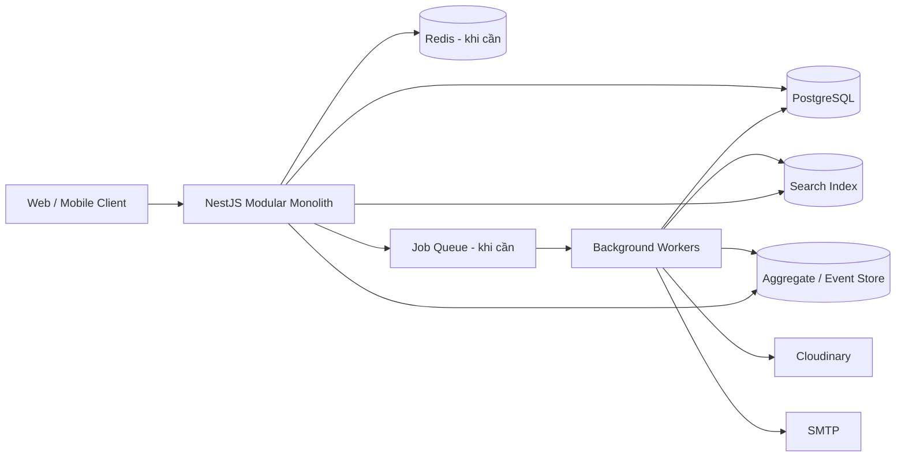
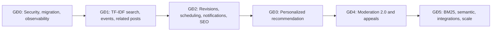

# HƯỚNG PHÁT TRIỂN TƯƠNG LAI — HỆ THỐNG QUẢN LÝ BLOG

> Tài liệu đề xuất các tính năng nâng cao và lộ trình phát triển tiếp theo cho nền tảng Quản lý Blog. Nội dung được xây dựng dựa trên kiến trúc và source backend hiện tại, đồng thời phân biệt rõ chức năng đang có với chức năng mới được đề xuất.

## 1. Thông tin tài liệu

| Thuộc tính | Giá trị |
|---|---|
| Dự án | Quản lý Blog |
| Kiến trúc hiện tại | Modular Monolith |
| Backend | NestJS 11, TypeScript 5.7 |
| ORM / Database | Prisma 7 / PostgreSQL |
| Nhóm API hiện tại | Public, User, Blog Owner, Moderator, Admin |
| Tổng endpoint hiện tại | 83 |
| Trọng tâm roadmap | Search, recommendation, trải nghiệm tác giả, moderation, analytics, vận hành và bảo mật |
| Ngày lập kế hoạch | 30/07/2026 |
| Trạng thái | Đề xuất phát triển; chưa mặc định là chức năng đã hoàn thành |

---

## 2. Mục tiêu phát triển

Roadmap hướng tới việc nâng hệ thống từ một backend quản lý blog có đầy đủ CRUD, phân quyền và kiểm duyệt thành một **nền tảng xuất bản nội dung thông minh, có khả năng cá nhân hóa và vận hành ở quy mô lớn hơn**.

Các mục tiêu chính:

1. Cải thiện chất lượng tìm kiếm và khả năng khám phá nội dung.
2. Cá nhân hóa trải nghiệm đọc theo sở thích của từng người dùng.
3. Cung cấp công cụ chuyên nghiệp hơn cho Blog Owner.
4. Giảm tải thao tác thủ công cho Moderator và Admin.
5. Đo lường được hiệu quả nội dung và hành vi người dùng.
6. Tăng độ an toàn, khả năng quan sát và khả năng phục hồi hệ thống.
7. Giữ kiến trúc đủ đơn giản ở giai đoạn hiện tại nhưng có đường nâng cấp rõ ràng.

---

## 3. Nguyên tắc xây dựng roadmap

### 3.1. Không nhầm lẫn giữa hiện trạng và kế hoạch

Mọi tính năng trong tài liệu được gắn một trong các trạng thái:

| Ký hiệu | Ý nghĩa |
|---|---|
| `CURRENT` | Đang tồn tại trong source hiện tại |
| `IMPROVE` | Đã có nhưng cần nâng cấp |
| `NEW` | Chưa có, cần thiết kế và triển khai mới |
| `RESEARCH` | Cần thử nghiệm trước khi quyết định triển khai production |

### 3.2. Data first

Search, recommendation và analytics chỉ tốt khi dữ liệu đầu vào chính xác. Trước khi dùng thuật toán phức tạp, hệ thống cần:

- Event tracking có cấu trúc.
- Search index đồng bộ.
- Metric rõ ràng.
- Dữ liệu đủ sạch và đủ lớn.
- Quy tắc quyền riêng tư và thời gian lưu dữ liệu.

### 3.3. Không thêm công nghệ khi chưa có nhu cầu đo được

PostgreSQL và Modular Monolith vẫn phù hợp cho giai đoạn gần. Chỉ thêm Redis, queue, Elasticsearch, OpenSearch hoặc vector database khi có số liệu chứng minh:

- Latency vượt ngưỡng mục tiêu.
- Job nền ảnh hưởng request chính.
- Khối lượng dữ liệu vượt khả năng truy vấn hiện tại.
- Chất lượng tìm kiếm không thể cải thiện thêm bằng PostgreSQL/BM25.

### 3.4. Mỗi tính năng phải có tiêu chí nghiệm thu

Không coi một tính năng là hoàn thành chỉ vì endpoint trả `200`. Mỗi hạng mục cần có:

- Yêu cầu nghiệp vụ.
- Thiết kế dữ liệu.
- API contract.
- Unit/integration/e2e test.
- Security review.
- Metrics và dashboard.
- Kế hoạch rollback.

---

## 4. Hiện trạng làm nền cho phát triển

Các nền tảng đã có trong source:

- JWT access token và refresh token theo session.
- Bốn role nghiệp vụ.
- Vòng đời bài viết `DRAFT`, `PENDING_REVIEW`, `PUBLISH`, `REJECT`.
- Bài viết đa ngôn ngữ và liên kết bản dịch.
- Like, bookmark, follow, comment và report.
- Dashboard cho Blog Owner/Admin.
- Upload media qua Cloudinary.
- Gửi email và reset mật khẩu.
- Soft delete và cleanup theo lịch.
- Security log ở mức nền tảng.
- Tìm kiếm hiện tại chủ yếu bằng `contains`.

Các khoảng trống chính:

- Chưa có search engine theo độ liên quan.
- Chưa có recommendation cá nhân hóa.
- Chưa có event analytics đầy đủ.
- Chưa có notification center và real-time event.
- Chưa có version history cho bài viết.
- Chưa có lịch xuất bản/hủy xuất bản tự động.
- Chưa có công cụ moderation bán tự động.
- Chưa có API key, webhook hoặc public developer platform.
- Chưa có cache/queue dùng chung.
- Chưa có observability production hoàn chỉnh.

---

# PHẦN I — CÁC TÍNH NĂNG NÂNG CAO ĐỀ XUẤT

## 5. Search 2.0 — Tìm kiếm theo độ liên quan

**Trạng thái:** `IMPROVE`  
**Ưu tiên:** P1 — hạng mục sản phẩm quan trọng nhất sau khi hoàn tất hardening P0.

### 5.1. Vấn đề hiện tại

Tìm kiếm bằng `contains` có các hạn chế:

- Không đánh giá độ quan trọng của từ khóa.
- Không tìm tốt trên nội dung dài.
- Không xếp hạng theo mức độ liên quan.
- Không xử lý stop word, từ đồng nghĩa và lỗi chính tả.
- Không giải thích trường nào đã khớp.
- Không đo được chất lượng kết quả.

### 5.2. Giai đoạn 1 — TF-IDF có trọng số

Tài liệu tìm kiếm của mỗi bài viết:

```text
searchDocument = title + content + tags + categories + author
```

Trọng số khởi điểm đề xuất:

| Trường | Trọng số |
|---|---:|
| `title` | 4.0 |
| `tags` | 3.0 |
| `categories` | 2.5 |
| `content` | 1.0 |
| `author.username` | 1.0 |

Điểm xếp hạng tổng hợp:

```text
finalScore =
    0.65 × relevanceScore
  + 0.20 × popularityScore
  + 0.10 × freshnessScore
  + 0.05 × authorQualityScore
```

Các trọng số phải được đưa vào cấu hình, không hard-code rải rác trong service.

### 5.3. Pipeline xử lý văn bản

1. Loại bỏ HTML.
2. Chuẩn hóa Unicode.
3. Chuyển về chữ thường.
4. Tách từ theo ngôn ngữ.
5. Loại stop word.
6. Chuẩn hóa từ đồng nghĩa.
7. Có thể áp dụng stemming/lemmatization cho tiếng Anh.
8. Tạo term frequency.
9. Tính document frequency theo từng ngôn ngữ.
10. Sinh vector TF-IDF.

Đối với tiếng Việt, cần word segmentation phù hợp; không nên chỉ dùng `split(' ')`.

### 5.4. API đề xuất

```http
GET /api/v1/search/posts
GET /api/v1/search/suggestions
GET /api/v1/search/trending
GET /api/v1/search/history
DELETE /api/v1/search/history
```

Ví dụ response item:

```json
{
  "id": 501,
  "title": "Hướng dẫn NestJS với Prisma",
  "highlight": "...xây dựng REST API bằng NestJS và Prisma...",
  "relevanceScore": 0.873,
  "matchedFields": ["title", "content", "tags"]
}
```

### 5.5. Giai đoạn 2 — BM25

Sau khi TF-IDF có dữ liệu đánh giá, nghiên cứu BM25 để:

- Giảm ảnh hưởng của tài liệu quá dài.
- Tối ưu độ bão hòa term frequency.
- Cải thiện ranking truy vấn văn bản thực tế.

TF-IDF vẫn hữu ích cho related posts và tạo hồ sơ sở thích; BM25 phù hợp hơn cho truy vấn tìm kiếm.

### 5.6. Giai đoạn 3 — Semantic và hybrid search

**Trạng thái:** `RESEARCH`

Kết hợp:

```text
hybridScore = lexicalScore + semanticScore + businessScore
```

- Lexical: BM25/TF-IDF.
- Semantic: embedding similarity.
- Business: độ mới, chất lượng, an toàn, ngôn ngữ và popularity.

Chỉ triển khai embedding khi:

- Có đủ corpus và query log.
- Có bộ đánh giá offline.
- Có ngân sách lưu vector và inference.
- Chứng minh semantic search cải thiện NDCG/MRR so với BM25.

### 5.7. Chỉ số nghiệm thu

| Chỉ số | Mục tiêu khởi điểm |
|---|---:|
| Search P95 | < 300 ms |
| Zero-result rate | < 10% |
| Search CTR | > 25% |
| `NDCG@10` | Tăng so với baseline `contains` |
| Bài `PUBLISH` chưa index | 0 |
| Reindex thất bại | < 1% |

---

## 6. Bài viết liên quan

**Trạng thái:** `NEW`  
**Ưu tiên:** P1

### 6.1. Mục tiêu

Tăng khả năng khám phá nội dung sau khi người dùng đọc xong một bài.

### 6.2. Thuật toán ban đầu

```text
relatedScore =
    0.55 × contentSimilarity
  + 0.20 × sharedTagScore
  + 0.15 × sharedCategoryScore
  + 0.10 × popularityScore
```

Quy tắc lọc:

- Chỉ bài `PUBLISH` và chưa xóa.
- Cùng ngôn ngữ hoặc có bản dịch phù hợp.
- Loại bài hiện tại.
- Giảm trùng lặp cùng tác giả.
- Không trả nhiều bản dịch của cùng một bài gốc.

### 6.3. API

```http
GET /api/v1/posts/:id/related?limit=6
```

### 6.4. Tối ưu

- Precompute top related post sau khi publish/update.
- Cache theo `postId` và `languageId`.
- Invalidate cache khi bài, tag hoặc category thay đổi.

---

## 7. Recommendation cá nhân hóa

**Trạng thái:** `NEW`  
**Ưu tiên:** P2

### 7.1. Mục tiêu

Tạo feed khác nhau cho từng người dùng dựa trên sở thích và hành vi thực tế.

### 7.2. Nguồn dữ liệu

| Hành vi | Trọng số khởi điểm |
|---|---:|
| Bookmark | 5 |
| Like | 4 |
| Đọc đủ thời gian | 3 |
| Follow tác giả | 3 |
| Comment | 2 |
| Mở bài | 1 |
| Unlike / unbookmark / ẩn đề xuất | Âm |

### 7.3. Content-based recommendation

Tạo `userInterestVector` từ vector nội dung của các bài đã tương tác:

```text
userInterestVector = weightedAverage(interactedPostVectors)
```

Điểm ứng viên:

```text
recommendationScore =
    0.45 × contentSimilarity
  + 0.20 × tagPreference
  + 0.15 × categoryPreference
  + 0.10 × followedAuthorScore
  + 0.10 × qualityAndFreshness
```

### 7.4. Candidate generation

Nguồn ứng viên gồm:

- Bài tương tự bài đã like/bookmark.
- Bài mới từ tác giả đang follow.
- Bài thuộc tag/category yêu thích.
- Bài phổ biến trong ngôn ngữ người dùng.
- Bài mới có quality score tốt.

### 7.5. Cold start

Người dùng mới có thể nhận feed dựa trên:

- Ngôn ngữ hiện tại.
- Tag/category chọn lúc onboarding.
- Tác giả được follow.
- Bài nổi bật theo thời gian.
- Nội dung mới được kiểm duyệt tốt.

### 7.6. API

```http
GET  /api/v1/user/recommendations
POST /api/v1/user/recommendations/:postId/hide
GET  /api/v1/user/interests
PATCH /api/v1/user/interests
DELETE /api/v1/user/personalization-data
```

### 7.7. Quyền riêng tư

- Giải thích vì sao bài được đề xuất.
- Cho phép tắt cá nhân hóa.
- Cho phép xóa lịch sử sở thích.
- Không dùng dữ liệu nhạy cảm không cần thiết.
- Thiết lập retention cho activity log.

### 7.8. Nâng cấp tương lai

- Collaborative filtering.
- Matrix factorization.
- Hybrid recommender.
- Learning-to-rank.
- Multi-armed bandit có kiểm soát.

---

## 8. Activity Tracking và Product Analytics

**Trạng thái:** `NEW`  
**Ưu tiên:** P1 vì là dependency của search/recommendation.

### 8.1. Sự kiện cần thu thập

```text
POST_IMPRESSION
POST_CLICK
POST_VIEW
POST_READ_PROGRESS
POST_READ_COMPLETE
POST_LIKE
POST_UNLIKE
POST_BOOKMARK
POST_UNBOOKMARK
COMMENT_CREATED
AUTHOR_FOLLOW
SEARCH_EXECUTED
SEARCH_RESULT_CLICKED
RECOMMENDATION_IMPRESSION
RECOMMENDATION_CLICKED
REPORT_CREATED
```

### 8.2. Model đề xuất

```prisma
model UserActivity {
  id          BigInt   @id @default(autoincrement())
  userId      Int?
  sessionId   String?
  eventType   String
  postId      Int?
  query       String?
  position    Int?
  durationMs  Int?
  metadata    Json?
  createdAt   DateTime @default(now())

  @@index([userId, createdAt])
  @@index([eventType, createdAt])
  @@index([postId, eventType])
}
```

### 8.3. Nguyên tắc ghi event

- Không làm chậm request nghiệp vụ chính.
- Hỗ trợ idempotency để tránh double count.
- Phân biệt impression, click và view hợp lệ.
- Không tin hoàn toàn duration do client gửi.
- Băm hoặc giảm độ chính xác IP.
- Không lưu access token, refresh token hoặc nội dung nhạy cảm.

### 8.4. Dashboard sản phẩm

- Daily/Monthly Active Users.
- Retention D1/D7/D30.
- Search CTR và zero-result rate.
- Recommendation CTR.
- Tỷ lệ đọc hoàn tất.
- Tỷ lệ chuyển đổi view → like/bookmark/follow.
- Funnel đăng ký → đọc → tương tác → quay lại.

---

## 9. Notification Center và thông báo real-time

**Trạng thái:** `NEW`  
**Ưu tiên:** P2

### 9.1. Loại thông báo

- Có người follow.
- Có người reply comment.
- Bài được like hoặc bookmark theo ngưỡng tổng hợp.
- Bài được duyệt hoặc từ chối.
- Yêu cầu Blog Owner được xử lý.
- Report được giải quyết.
- Tài khoản bị khóa, mở khóa hoặc thay đổi role.
- Nhắc lịch xuất bản.
- Cảnh báo bảo mật: login thiết bị mới, reset mật khẩu.

### 9.2. Kênh phân phối

- In-app notification.
- Email.
- Web Push.
- WebSocket/SSE cho cập nhật real-time.

### 9.3. Model đề xuất

```prisma
model Notification {
  id          BigInt   @id @default(autoincrement())
  userId      Int
  type        String
  title       String
  body        String
  targetType  String?
  targetId    Int?
  metadata    Json?
  readAt      DateTime?
  createdAt   DateTime @default(now())

  @@index([userId, readAt, createdAt])
}
```

### 9.4. API

```http
GET    /api/v1/user/notifications
GET    /api/v1/user/notifications/unread-count
PATCH  /api/v1/user/notifications/:id/read
PATCH  /api/v1/user/notifications/read-all
DELETE /api/v1/user/notifications/:id
GET    /api/v1/user/notification-preferences
PATCH  /api/v1/user/notification-preferences
```

### 9.5. Chống spam

- Gộp nhiều like thành một thông báo.
- Rate limit email.
- Cho phép tắt từng loại thông báo.
- Không gửi lại khi job retry.

---

## 10. Công cụ xuất bản chuyên nghiệp cho Blog Owner

**Trạng thái:** `NEW` / `IMPROVE`  
**Ưu tiên:** P1–P2

### 10.1. Lưu nháp tự động

- Autosave theo revision.
- Không ghi đè thay đổi mới hơn.
- Optimistic locking bằng `version` hoặc `updatedAt`.
- Khôi phục sau mất kết nối.

### 10.2. Lịch sử phiên bản bài viết

```prisma
model PostRevision {
  id          BigInt   @id @default(autoincrement())
  postId      Int
  editorId    Int
  version     Int
  title       String
  content     String
  metadata    Json?
  createdAt   DateTime @default(now())

  @@unique([postId, version])
  @@index([postId, createdAt])
}
```

Tính năng:

- Xem diff giữa hai phiên bản.
- Khôi phục phiên bản cũ.
- Ghi ai đã sửa và thời điểm sửa.
- Không tự động xuất bản lại khi restore.

### 10.3. Lên lịch xuất bản

Các trạng thái có thể mở rộng:

```text
DRAFT → SCHEDULED → PUBLISH → ARCHIVED
```

API đề xuất:

```http
POST   /api/v1/blog-owner/posts/:id/schedule
PATCH  /api/v1/blog-owner/posts/:id/schedule
DELETE /api/v1/blog-owner/posts/:id/schedule
POST   /api/v1/blog-owner/posts/:id/unpublish
POST   /api/v1/blog-owner/posts/:id/archive
```

Yêu cầu:

- Lưu timezone rõ ràng.
- Job idempotent.
- Retry an toàn.
- Không publish bài chưa được duyệt.
- Audit mọi thay đổi lịch.

### 10.4. Preview và share preview

- Preview riêng tư trước publish.
- Signed token có thời hạn.
- Không bị index bởi search engine.
- Có thể thu hồi link preview.

### 10.5. SEO Toolkit

- `slug` duy nhất theo ngôn ngữ.
- Meta title/description.
- Canonical URL.
- Open Graph/Twitter Card.
- JSON-LD Article schema.
- Sitemap và RSS/Atom feed.
- Redirect khi đổi slug.
- Kiểm tra độ dài và cảnh báo SEO.

### 10.6. Kiểm tra chất lượng nội dung

- Thời gian đọc ước tính.
- Mức độ dễ đọc.
- Link hỏng.
- Ảnh thiếu alt text.
- Trùng lặp tiêu đề/nội dung.
- Nội dung quá ngắn.
- Cảnh báo từ cấm trước submit.

### 10.7. Series và collection

Cho phép Blog Owner nhóm bài theo khóa học/chủ đề:

```http
POST /api/v1/blog-owner/series
POST /api/v1/blog-owner/series/:id/posts
GET  /api/v1/series/:slug
```

---

## 11. Nâng cấp hệ thống comment và cộng đồng

**Trạng thái:** `IMPROVE`  
**Ưu tiên:** P2

### 11.1. Mention

- Hỗ trợ `@username`.
- Sinh notification.
- Chỉ mention user hợp lệ và chưa bị xóa.
- Giới hạn số mention trong một comment.

### 11.2. Comment reaction

Thay vì chỉ có comment text:

- Like comment.
- Reaction có danh sách enum giới hạn.
- Chống duplicate bằng unique constraint.

### 11.3. Thread nâng cao

- Giữ giới hạn độ sâu hợp lý.
- Cursor pagination cho thread lớn.
- Collapse/expand.
- Pin comment của tác giả.
- Sort theo mới nhất, cũ nhất hoặc nổi bật.

### 11.4. Moderation cộng đồng

- Tác giả có thể ẩn comment trên bài của mình nhưng không xóa audit.
- Moderator xem lịch sử chỉnh sửa/xóa.
- Slow mode theo bài.
- Khóa comment cho bài cụ thể.
- Chặn user theo phạm vi cá nhân.

### 11.5. Chống spam

- Rate limit theo user, IP và post.
- Phát hiện nội dung lặp.
- Link/domain reputation.
- Trust score của tài khoản.
- Challenge bổ sung khi hành vi bất thường.

---

## 12. Moderation 2.0 và Trust & Safety

**Trạng thái:** `IMPROVE` / `NEW`  
**Ưu tiên:** P1–P2

### 12.1. Moderation queue thống nhất

Một hàng đợi cho:

- Bài chờ duyệt.
- Report bài viết.
- Report comment.
- Nội dung có risk score cao.
- Tài khoản có hành vi spam.

Bộ lọc:

- Loại nội dung.
- Mức độ ưu tiên.
- Lý do report.
- Tuổi của report.
- Số report độc lập.
- Ngôn ngữ.
- Moderator đang xử lý.

### 12.2. Claim/lock công việc

Ngăn hai Moderator xử lý cùng lúc:

- `claimedById`.
- `claimedAt`.
- Lease timeout.
- Optimistic concurrency.

### 12.3. Risk scoring

```text
riskScore =
    reportVolume
  + reporterTrust
  + contentSignals
  + accountSignals
  + velocitySignals
```

Risk score chỉ hỗ trợ ưu tiên; không tự động kết luận vi phạm ở giai đoạn đầu.

### 12.4. AI-assisted moderation

**Trạng thái:** `RESEARCH`

Có thể hỗ trợ:

- Phân loại spam.
- Phát hiện quấy rối.
- Phát hiện nội dung không phù hợp.
- Gợi ý report reason.
- Tóm tắt lịch sử vụ việc.

Yêu cầu bắt buộc:

- Human-in-the-loop.
- Giải thích tín hiệu chính.
- Không auto-ban chỉ từ model score.
- Theo dõi false positive/false negative.
- Bộ dữ liệu đánh giá theo từng ngôn ngữ.
- Cơ chế appeal.

### 12.5. Appeal workflow

Người dùng/tác giả có thể kháng nghị:

```text
ACTION_TAKEN → APPEALED → UNDER_REVIEW → UPHELD / OVERTURNED
```

Mọi quyết định phải có audit trail.

---

## 13. Analytics dành cho Blog Owner

**Trạng thái:** `IMPROVE`  
**Ưu tiên:** P2

Dashboard nâng cao:

- View theo ngày/tuần/tháng.
- Unique reader ước tính.
- Average read time.
- Completion rate.
- Like/bookmark/comment/follow conversion.
- Nguồn traffic.
- Search query dẫn đến bài.
- Bài liên quan/recommendation dẫn đến bài.
- Top quốc gia/ngôn ngữ ở mức tổng hợp, không xâm phạm riêng tư.
- So sánh bài và giai đoạn.
- Hiệu quả theo tag/category.

API đề xuất:

```http
GET /api/v1/blog-owner/analytics/overview
GET /api/v1/blog-owner/analytics/posts/:id
GET /api/v1/blog-owner/analytics/audience
GET /api/v1/blog-owner/analytics/acquisition
GET /api/v1/blog-owner/analytics/export
```

Nguyên tắc:

- Dữ liệu được aggregate theo khoảng thời gian.
- Không trả dữ liệu nhận diện độc giả cá nhân.
- Query dashboard không scan bảng event thô mỗi lần.

---

## 14. Admin Analytics và vận hành nền tảng

**Trạng thái:** `IMPROVE`  
**Ưu tiên:** P1–P2

Dashboard Admin cần mở rộng:

### 14.1. Sức khỏe sản phẩm

- User mới và active user.
- Số bài tạo, gửi duyệt và publish.
- Thời gian duyệt trung bình.
- Tỷ lệ reject.
- Report volume và resolution time.
- Search quality.
- Recommendation engagement.
- Content supply theo ngôn ngữ/category.

### 14.2. Sức khỏe kỹ thuật

- Request rate.
- Error rate.
- P50/P95/P99 latency.
- Database pool usage.
- Slow query.
- Job failure/retry.
- Search indexing lag.
- Email/upload failure.
- Disk/database growth.

### 14.3. Feature flags

Cho phép bật/tắt:

- TF-IDF/BM25 search.
- Recommendation.
- Notification channel.
- Auto moderation suggestion.
- New ranking formula.

Feature flag giúp rollout theo phần trăm, role hoặc môi trường và rollback nhanh.

---

## 15. Hệ thống danh tiếng và chất lượng

**Trạng thái:** `NEW`  
**Ưu tiên:** P3

### 15.1. Author quality score

Tín hiệu có thể gồm:

- Tỷ lệ bài được duyệt.
- Report hợp lệ.
- Read completion.
- Bookmark/view ratio.
- Lịch sử vi phạm.
- Tuổi tài khoản.

Không công khai công thức chính xác để tránh gaming.

### 15.2. User trust score

Dùng để ưu tiên moderation và chống spam, không dùng để phân biệt đối xử:

- Tuổi tài khoản.
- Email verified.
- Report accuracy.
- Spam history.
- Velocity bất thường.

### 15.3. Badge và achievement

Có thể bổ sung:

- Tác giả mới.
- Tác giả nổi bật.
- Chuyên gia theo chủ đề.
- Người đóng góp cộng đồng.

Badge phải dựa trên tiêu chí minh bạch và có thể thu hồi.

---

## 16. Subscription, newsletter và digest

**Trạng thái:** `NEW`  
**Ưu tiên:** P3

Tính năng:

- Theo dõi tag/category ngoài follow author.
- Email digest hàng ngày/tuần.
- Newsletter riêng của tác giả.
- Unsubscribe theo chuẩn.
- Frequency cap.
- Email preference center.

API đề xuất:

```http
POST   /api/v1/user/subscriptions/tags/:id
DELETE /api/v1/user/subscriptions/tags/:id
POST   /api/v1/user/subscriptions/categories/:id
GET    /api/v1/user/digest-preferences
PATCH  /api/v1/user/digest-preferences
```

---

## 17. API Platform, webhook và tích hợp ngoài

**Trạng thái:** `NEW`  
**Ưu tiên:** P3

### 17.1. API key cho ứng dụng tích hợp

- Scope rõ ràng.
- Expiration.
- Rotation.
- Rate limit riêng.
- Audit usage.
- Không dùng access token người dùng dài hạn.

### 17.2. Webhook

Event đề xuất:

```text
post.published
post.updated
post.deleted
comment.created
report.created
blog_owner_request.approved
user.locked
```

Yêu cầu:

- Ký HMAC.
- Retry exponential backoff.
- Idempotency key.
- Delivery log.
- Secret rotation.
- Disable endpoint lỗi liên tục.

### 17.3. Import/export

- Import Markdown.
- Export Markdown/JSON.
- RSS import.
- Backup nội dung của tác giả.
- Data portability cho người dùng.

---

## 18. Accessibility và trải nghiệm đa ngôn ngữ

**Trạng thái:** `IMPROVE`  
**Ưu tiên:** P2

Backend hỗ trợ frontend thực hiện:

- Alt text bắt buộc/khuyến nghị cho ảnh.
- Caption và transcript cho video.
- Locale-aware date/number.
- Fallback language rõ ràng.
- Theo dõi trạng thái bản dịch.
- Translation quality review.
- Không trộn taxonomy giữa ngôn ngữ.
- Hreflang/canonical cho SEO đa ngôn ngữ.

Tính năng dịch nâng cao:

- Translation memory.
- Glossary theo dự án.
- Đồng bộ khi bài gốc thay đổi.
- Đánh dấu bản dịch outdated.
- Workflow reviewer cho bản dịch.

---

## 19. Bảo mật nâng cao

**Trạng thái:** `IMPROVE`  
**Ưu tiên:** P0

Các việc phải hoàn thành trước khi mở rộng mạnh tính năng:

1. Thu hồi và thay toàn bộ credential từng xuất hiện trong file mẫu/source/history.
2. Không log reset token hoặc secret.
3. Bật kiểm tra TLS SMTP.
4. Rate limit login, forgot/reset password, comment, report và upload.
5. Email verification.
6. MFA/TOTP cho Moderator và Super Admin.
7. Login alert và quản lý thiết bị.
8. Session list và revoke từng session.
9. Global security header.
10. Audit log bất biến cho hành động nhạy cảm.
11. File scanning và kiểm tra media thực tế.
12. Secret manager cho staging/production.
13. Dependency scanning và secret scanning trong CI.
14. Backup/restore drill.
15. Chính sách retention và data deletion.

### 19.1. Step-up authentication

Yêu cầu xác thực lại hoặc MFA khi:

- Đổi email/mật khẩu.
- Đổi role.
- Khóa/xóa user.
- Xem hoặc thay secret tích hợp.
- Export dữ liệu nhạy cảm.

---

## 20. Performance, cache và background job

**Trạng thái:** `NEW` / `IMPROVE`  
**Ưu tiên:** P1

### 20.1. Cache

Ứng viên cache:

- Top posts.
- Top authors/tags.
- Public category/language lists.
- Search suggestions.
- Related posts.
- Recommendation page đầu.
- Dashboard aggregate.

Nguyên tắc:

- Cache key có version và language.
- TTL phù hợp từng loại dữ liệu.
- Invalidation theo domain event.
- Không cache response chứa dữ liệu riêng tư chung key.

### 20.2. Queue

Job nên tách khỏi request:

- Gửi email.
- Search indexing.
- Reindex.
- Tính ranking.
- Tạo related posts.
- Notification fan-out.
- Media processing.
- Analytics aggregation.
- Scheduled publishing.

Yêu cầu queue:

- Retry có giới hạn.
- Dead-letter queue.
- Idempotency.
- Job status và metrics.
- Không retry vô hạn lỗi nghiệp vụ.

### 20.3. Pagination

- Offset pagination vẫn phù hợp danh sách nhỏ.
- Cursor pagination cho feed, event, notification và comment lớn.
- Stable sort bắt buộc có tie-breaker bằng `id`.

### 20.4. Database optimization

- Bổ sung composite/partial index theo query thực tế.
- Chạy `EXPLAIN ANALYZE` cho endpoint nóng.
- Aggregate table cho dashboard/ranking.
- Tránh N+1.
- Giới hạn include/select.
- Retention và partition cho activity log khi dữ liệu lớn.

---

## 21. Observability và reliability

**Trạng thái:** `NEW` / `IMPROVE`  
**Ưu tiên:** P0–P1

### 21.1. Structured logging

Mỗi log cần có:

- Timestamp.
- Level.
- Request/correlation ID.
- Route.
- User ID nếu có, không log token.
- Duration.
- Error code.
- Environment/service version.

### 21.2. Metrics

- HTTP requests/errors/latency.
- Database query duration.
- Connection pool.
- Job success/failure/retry.
- Search latency/index lag.
- Email/upload success rate.
- Auth failure và suspicious activity.

### 21.3. Tracing

Theo dõi request qua:

```text
HTTP → Controller → Service → Prisma / Cloudinary / SMTP / Queue
```

### 21.4. Health check

```http
GET /health/live
GET /health/ready
GET /health/dependencies
```

- Liveness không phụ thuộc tất cả dịch vụ ngoài.
- Readiness kiểm tra DB và dependency thiết yếu.
- Không lộ credential hoặc chi tiết nội bộ.

### 21.5. SLO khởi điểm

| Chỉ số | Mục tiêu |
|---|---:|
| Availability API | ≥ 99.9% |
| Public read P95 | < 300 ms |
| Write API P95 | < 500 ms |
| Error rate 5xx | < 0.5% |
| Critical job success | ≥ 99.5% |
| Recovery Point Objective | Theo chính sách backup được phê duyệt |
| Recovery Time Objective | Theo cấp độ môi trường |

---

## 22. Kiểm thử và chất lượng phát triển

**Trạng thái:** `IMPROVE`  
**Ưu tiên:** P0–P1

### 22.1. Test pyramid

- Unit test cho domain logic.
- Integration test với PostgreSQL test.
- E2E test cho workflow chính.
- Contract test cho API.
- Load test cho endpoint nóng.
- Security test cho auth/RBAC/IDOR/rate limit.

### 22.2. Test bắt buộc cho tính năng nâng cao

#### Search

- Unicode/tokenization.
- TF/IDF/BM25.
- Ranking stability.
- Language isolation.
- Reindex idempotency.
- Không index bài chưa publish.

#### Recommendation

- Không lặp bài.
- Không trả nội dung bị xóa/khóa.
- Cold start.
- Privacy opt-out.
- Diversity.

#### Notification

- Không gửi trùng.
- Permission/ownership.
- Mark read idempotent.
- Preference enforcement.

#### Scheduled publishing

- Timezone.
- Retry.
- Không publish bài chưa duyệt.
- Không chạy hai lần.

### 22.3. CI quality gate

Pull request không được merge khi:

- Build thất bại.
- Lint/test thất bại.
- Migration drift.
- Secret scan phát hiện credential.
- Coverage giảm quá ngưỡng cho module thay đổi.
- API contract thay đổi nhưng tài liệu không cập nhật.

---

# PHẦN II — KIẾN TRÚC MỤC TIÊU

## 23. Kiến trúc mở rộng đề xuất



Ở giai đoạn đầu, `SearchIndex` và `Analytics` có thể vẫn nằm trong PostgreSQL. Sơ đồ thể hiện ranh giới logic, không bắt buộc phải tách thành dịch vụ vật lý ngay.

---

## 24. Module mới trong `libs/core`

```text
libs/core/src/modules/
├── activities/
├── analytics/
├── cache/
├── events/
├── feature-flags/
├── jobs/
├── notifications/
├── recommendations/
├── search/
│   ├── normalizer/
│   ├── tokenizer/
│   ├── indexer/
│   ├── ranking/
│   └── metrics/
├── post-revisions/
├── subscriptions/
└── webhooks/
```

Nguyên tắc:

- `libs/core` chứa domain và hạ tầng dùng chung.
- `src/public`, `src/user`, `src/blogowner`, `src/moderator`, `src/admin` giữ adapter/API theo actor.
- Không cho controller truy cập Prisma trực tiếp.
- Event nội bộ phải có schema/version rõ ràng.

---

## 25. Domain event đề xuất

```text
UserRegistered
UserLoggedIn
UserRoleChanged
UserLocked
PostCreated
PostUpdated
PostSubmitted
PostPublished
PostRejected
PostDeleted
PostViewed
PostLiked
PostBookmarked
CommentCreated
CommentReported
ReportResolved
AuthorFollowed
SearchExecuted
NotificationRequested
```

Domain event giúp:

- Tách side effect khỏi transaction chính.
- Đồng bộ search index.
- Gửi notification.
- Cập nhật analytics.
- Invalidate cache.

Cần dùng outbox pattern trước khi phụ thuộc mạnh vào event để tránh mất event giữa DB commit và queue publish.

---

## 26. Mô hình dữ liệu mở rộng dự kiến

Các model có thể cần bổ sung:

| Model | Mục đích |
|---|---|
| `PostRevision` | Lịch sử bài viết |
| `PostSchedule` | Lịch publish/unpublish |
| `SearchTerm` | Từ khóa và IDF |
| `PostSearchTerm` | TF-IDF theo bài |
| `SearchQueryLog` | Đo lường search |
| `UserActivity` | Event hành vi |
| `UserInterest` | Hồ sơ sở thích |
| `PostSimilarity` | Related post precompute |
| `Notification` | Thông báo in-app |
| `NotificationPreference` | Tùy chọn nhận thông báo |
| `PostMetricDaily` | Aggregate analytics |
| `ModerationCase` | Queue kiểm duyệt thống nhất |
| `ModerationAction` | Audit quyết định |
| `Appeal` | Kháng nghị |
| `FeatureFlag` | Rollout tính năng |
| `WebhookEndpoint` | Endpoint tích hợp |
| `WebhookDelivery` | Delivery/retry log |
| `OutboxEvent` | Giao dịch event tin cậy |

Không tạo tất cả model trong một migration. Mỗi giai đoạn chỉ thêm dữ liệu cần thiết cho feature đang triển khai.

---

# PHẦN III — LỘ TRÌNH TRIỂN KHAI

## 27. Thứ tự ưu tiên tổng thể

| Mức | Ý nghĩa |
|---|---|
| P0 | Bắt buộc trước production hoặc trước khi mở rộng dữ liệu |
| P1 | Giá trị cao, cần làm trong chu kỳ phát triển gần nhất |
| P2 | Nâng cao trải nghiệm sau khi nền tảng ổn định |
| P3 | Mở rộng dài hạn hoặc cần thêm dữ liệu/người dùng |

---

## 28. Giai đoạn 0 — Ổn định nền tảng

**Mục tiêu:** loại bỏ rủi ro cản trở triển khai tính năng nâng cao.

### Công việc

1. Đồng bộ `schema.prisma` và migration.
2. Xử lý toàn bộ P0 trong `SECURITY.md`.
3. Chuẩn hóa error code.
4. Chuẩn hóa audit log.
5. Thêm correlation ID và structured logging.
6. Thiết lập health check.
7. Thêm rate limiting.
8. Xây integration/e2e test database.
9. Thiết lập migration check và secret scan trong CI.
10. Đo baseline latency của endpoint hiện tại.

### Tiêu chí hoàn thành

- Không còn credential thật trong repository.
- Migration chạy được từ database rỗng đến phiên bản mới nhất.
- Auth/RBAC critical flow có e2e test.
- Có dashboard lỗi và latency cơ bản.
- Backup và restore được thử nghiệm.

---

## 29. Giai đoạn 1 — Search và dữ liệu hành vi nền tảng

**Mục tiêu:** cải thiện khám phá nội dung và tạo dữ liệu cho các bước sau.

### Công việc

1. Text normalizer/tokenizer đa ngôn ngữ.
2. TF-IDF index và reindex job.
3. API `/search/posts`.
4. Suggestions và trending query.
5. Search event tracking.
6. Related posts.
7. Search metrics dashboard.
8. Cache kết quả phù hợp.
9. Load test và offline relevance evaluation.

### Deliverable

- Search theo title/content/tag/category.
- Ranking theo relevance.
- Highlight và matched fields.
- API related posts.
- Bộ test relevance ban đầu.

### Tiêu chí hoàn thành

- Search P95 đạt mục tiêu.
- Không trả bài chưa publish/soft-delete.
- Reindex idempotent.
- Có zero-result rate và CTR.
- Có rollback về `contains` bằng feature flag.

---

## 30. Giai đoạn 2 — Trải nghiệm tác giả và notification

**Mục tiêu:** giúp Blog Owner làm việc chuyên nghiệp và tăng tương tác.

### Công việc

1. Post revision.
2. Autosave/optimistic locking.
3. Scheduled publishing.
4. Private preview.
5. Notification center.
6. Reply/follow/moderation notification.
7. SEO metadata và slug.
8. Analytics cơ bản cho tác giả.

### Tiêu chí hoàn thành

- Có thể restore revision an toàn.
- Scheduled job không publish trùng.
- Notification không gửi trùng khi retry.
- Tác giả xem được funnel cơ bản của bài.

---

## 31. Giai đoạn 3 — Recommendation và feed cá nhân hóa

**Mục tiêu:** tăng thời gian đọc và tỷ lệ quay lại.

### Công việc

1. User activity pipeline.
2. User interest profile.
3. Content-based recommendation.
4. Cold start.
5. Recommendation impression/click tracking.
6. Hide/not interested.
7. Diversity và freshness control.
8. Privacy opt-out.
9. A/B test ranking.

### Tiêu chí hoàn thành

- Recommendation CTR tốt hơn feed baseline.
- Không lộ nội dung bị khóa/xóa/chưa publish.
- Có giải thích lý do đề xuất.
- Người dùng có thể xóa dữ liệu cá nhân hóa.

---

## 32. Giai đoạn 4 — Moderation và Trust & Safety nâng cao

**Mục tiêu:** tăng tốc xử lý vi phạm mà vẫn giữ quyết định con người.

### Công việc

1. Unified moderation queue.
2. Claim/lease case.
3. Priority/risk score.
4. Appeal workflow.
5. Moderator SLA dashboard.
6. Spam automation.
7. AI-assisted suggestion thử nghiệm.
8. Quality/trust score có kiểm soát.

### Tiêu chí hoàn thành

- Không xử lý một case hai lần.
- Có lịch sử quyết định đầy đủ.
- Thời gian xử lý report giảm.
- AI không tự ban user.
- Có đánh giá bias và false positive.

---

## 33. Giai đoạn 5 — Quy mô lớn và hệ sinh thái

**Mục tiêu:** chuẩn bị mở rộng traffic và tích hợp.

### Công việc

1. BM25 hoặc search engine chuyên dụng nếu cần.
2. Semantic/hybrid search thử nghiệm.
3. Collaborative filtering.
4. Redis và queue production nếu số liệu yêu cầu.
5. API key và webhook.
6. Newsletter/digest.
7. Import/export.
8. Data warehouse/BI khi analytics tăng lớn.
9. Phân tách service chỉ khi có boundary và nhu cầu vận hành rõ.

---

## 34. Roadmap trực quan



Một số workstream có thể chạy song song sau khi Giai đoạn 0 hoàn tất, nhưng Search/Event Tracking phải đi trước Recommendation.

---

# PHẦN IV — BACKLOG ƯU TIÊN

## 35. Backlog gần nhất

| ID | Hạng mục | Ưu tiên | Phụ thuộc | Kết quả |
|---|---|---:|---|---|
| FUT-001 | Đồng bộ Prisma migration | P0 | Không | Deploy DB tin cậy |
| FUT-002 | Secret rotation và hardening | P0 | Không | Giảm rủi ro bảo mật |
| FUT-003 | Global rate limit | P0 | Config/guard | Chống brute force/spam |
| FUT-004 | Structured logging + request ID | P0 | Logger | Truy vết sự cố |
| FUT-005 | Health/readiness endpoints | P0 | DB/config | Vận hành ổn định |
| FUT-006 | Error code catalog | P1 | Exception filter | Frontend xử lý ổn định |
| FUT-007 | Text normalizer/tokenizer | P1 | Language data | Nền tảng search |
| FUT-008 | TF-IDF index schema | P1 | Migration | Search relevance |
| FUT-009 | Index/reindex jobs | P1 | Queue hoặc scheduler | Đồng bộ search |
| FUT-010 | Search API v2 | P1 | FUT-007–009 | Tìm kiếm nâng cao |
| FUT-011 | Search analytics | P1 | Activity events | Đo chất lượng search |
| FUT-012 | Related posts | P1 | TF-IDF vectors | Tăng discovery |
| FUT-013 | UserActivity pipeline | P1 | Privacy policy | Dữ liệu analytics |
| FUT-014 | Aggregate post metrics | P1 | Activity pipeline | Dashboard nhanh |
| FUT-015 | Post revision | P2 | Migration | Khôi phục nội dung |
| FUT-016 | Scheduled publishing | P2 | Job engine | Tự động xuất bản |
| FUT-017 | Notification center | P2 | Events/jobs | Tăng tương tác |
| FUT-018 | SEO slug/metadata | P2 | Post schema | SEO tốt hơn |
| FUT-019 | Blog Owner analytics | P2 | Aggregate metrics | Tối ưu nội dung |
| FUT-020 | Recommendation MVP | P2 | Search + activity | Feed cá nhân hóa |
| FUT-021 | Moderation queue | P2 | Report/post workflows | Xử lý tập trung |
| FUT-022 | Appeal workflow | P2 | Moderation action | Công bằng/quản trị |
| FUT-023 | BM25 experiment | P3 | Search evaluation | Ranking tốt hơn |
| FUT-024 | Semantic search POC | P3 | Corpus/metrics | Tìm theo ý nghĩa |
| FUT-025 | Webhook platform | P3 | Events/security | Tích hợp ngoài |

---

## 36. Backlog riêng cho Hoàng

Với phạm vi hiện tại gồm `libs/core`, `src/public`, `src/user`, `src/admin`, Hoàng có thể phụ trách chính:

### Nền tảng dùng chung

- Thiết kế `SearchModule` trong `libs/core`.
- Text normalization và tokenizer.
- TF-IDF/BM25 ranking service.
- Search index/reindex.
- Activity tracking và aggregate metrics.
- Notification core.
- Feature flag và cache abstraction.
- Error code và audit logging.

### Public

- Search posts.
- Search suggestion/trending.
- Related posts.
- SEO/public metadata.
- Public feed ranking.

### User

- Recommendation feed.
- Search history.
- Interest/preferences.
- Notification center.
- Personalization opt-out và xóa dữ liệu.

### Admin

- Search/recommendation configuration.
- Reindex operation.
- Search metrics.
- Feature flag.
- Platform health dashboard.
- Audit/security report.

Các tính năng Blog Owner/Moderator cần phối hợp với thành viên sở hữu hai module đó, trong khi logic dùng chung vẫn nên đặt tại `libs/core`.

---

# PHẦN V — ĐO LƯỜNG VÀ QUẢN TRỊ RỦI RO

## 37. KPI sản phẩm

| Nhóm | KPI |
|---|---|
| Search | CTR, zero-result rate, MRR, NDCG@10 |
| Discovery | Related-post CTR, pages/session |
| Recommendation | Impression CTR, like/bookmark conversion |
| Content | Read completion, publish frequency |
| Community | Comment/reply rate, follow conversion |
| Moderation | Time-to-first-action, resolution time, appeal overturn rate |
| Retention | D1/D7/D30 retention |
| Creator | Active Blog Owner, draft-to-publish conversion |

---

## 38. KPI kỹ thuật

| Nhóm | KPI |
|---|---|
| API | P50/P95/P99, error rate, availability |
| Database | Query latency, pool usage, slow query count |
| Search | Query latency, index lag, reindex failure |
| Job | Success, retry, dead-letter count |
| Notification | Delivery rate, duplicate rate |
| Email/Media | Success rate và dependency latency |
| Security | Failed login, blocked abuse, critical finding age |
| Deployment | Lead time, rollback time, change failure rate |

---

## 39. Rủi ro và cách giảm thiểu

| Rủi ro | Tác động | Giảm thiểu |
|---|---|---|
| Thêm quá nhiều feature cùng lúc | Chậm và khó ổn định | Triển khai theo phase và feature flag |
| Recommendation thiếu dữ liệu | Kết quả kém | Content-based + cold start trước |
| Search index lệch DB | Kết quả sai | Outbox, idempotent reindex và reconciliation |
| Event log tăng quá nhanh | Chi phí DB | Retention, partition và aggregation |
| Queue gửi trùng | Spam/side effect | Idempotency key và deduplication |
| AI moderation thiên lệch | Xử lý sai | Human review, evaluation, appeal |
| Cache stale | Hiển thị dữ liệu cũ | Event-based invalidation và TTL |
| SEO slug thay đổi | Link hỏng | Redirect history và canonical URL |
| Analytics xâm phạm riêng tư | Mất niềm tin | Data minimization, aggregation, opt-out |
| Microservice hóa quá sớm | Tăng độ phức tạp | Giữ modular monolith đến khi có nhu cầu thật |

---

## 40. Definition of Done cho tính năng tương lai

Một hạng mục chỉ được đánh dấu hoàn thành khi đáp ứng toàn bộ tiêu chí phù hợp:

- [ ] User story và acceptance criteria được duyệt.
- [ ] Threat model được cập nhật nếu xử lý dữ liệu/quyền mới.
- [ ] Schema và migration có rollback/forward plan.
- [ ] API documentation được cập nhật.
- [ ] Role/permission matrix được cập nhật.
- [ ] Unit test và integration test đạt yêu cầu.
- [ ] E2E test workflow chính.
- [ ] Không có lỗi lint/build.
- [ ] Có metric và log cần thiết.
- [ ] Có feature flag nếu rollout rủi ro.
- [ ] Có kế hoạch backfill/reindex nếu cần.
- [ ] Có benchmark trước và sau.
- [ ] Có tài liệu vận hành/runbook.
- [ ] Không log secret hoặc dữ liệu cá nhân không cần thiết.
- [ ] Đã cập nhật changelog.

---

## 41. Những việc chưa nên làm ngay

1. Chuyển toàn bộ hệ thống sang microservices.
2. Đưa Elasticsearch/vector database vào khi chưa benchmark PostgreSQL.
3. Dùng AI để tự động khóa tài khoản hoặc xóa nội dung.
4. Tạo social feed quá phức tạp khi chưa có activity data.
5. Xây gamification lớn trước khi ổn định search và retention.
6. Thu thập quá nhiều dữ liệu hành vi mà chưa có chính sách privacy.
7. Hard-code thuật toán ranking mà không có config và metrics.
8. Thay đổi đồng thời schema, API và thuật toán mà không có feature flag.

---

## 42. Kết luận

Hướng phát triển phù hợp nhất cho dự án Quản lý Blog là:

```text
Ổn định bảo mật và dữ liệu
        ↓
TF-IDF Search + Activity Tracking
        ↓
Related Posts + Analytics
        ↓
Revision + Scheduling + Notification
        ↓
Recommendation cá nhân hóa
        ↓
Moderation 2.0
        ↓
BM25 / Semantic Search / Ecosystem Integration
```

Trong chu kỳ phát triển sắp tới, ba ưu tiên mang lại giá trị lớn nhất là:

1. **Hoàn thiện hardening, migration và observability.**
2. **Xây Search Module bằng TF-IDF có hỗ trợ đa ngôn ngữ, ranking và đo lường.**
3. **Xây Activity Tracking và Related Posts làm nền cho recommendation.**

Sau khi ba nền tảng này ổn định, hệ thống mới nên tiến tới recommendation cá nhân hóa, notification real-time, moderation hỗ trợ AI và semantic search.
