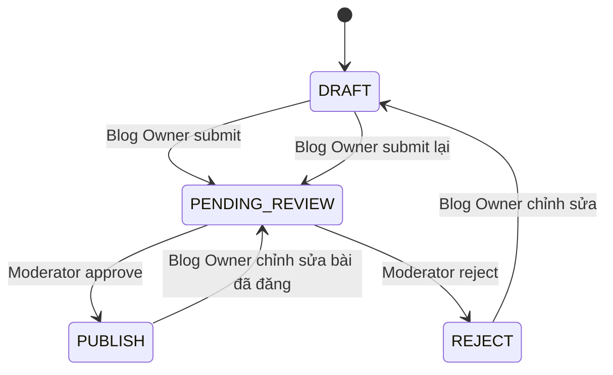
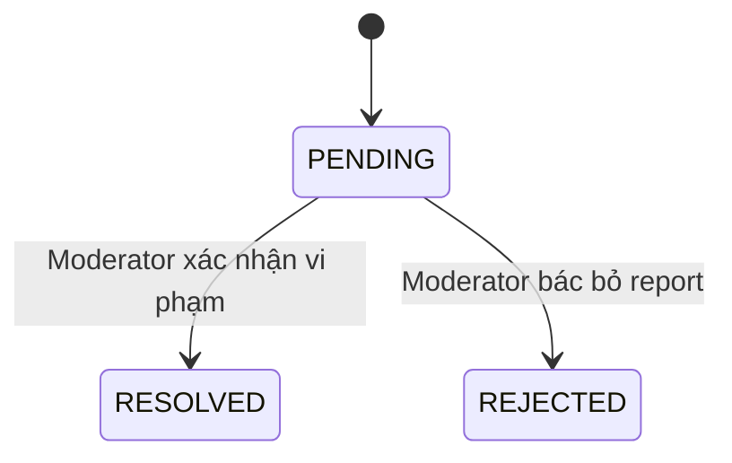

# MODERATOR_API_DOCUMENTATION

> Tài liệu API **Content Moderator** cho dự án Quản lý Blog (NestJS + Prisma). Tài liệu được chia thành ba nhóm chức năng rõ ràng: **1. Dashboard Moderator**, **2. Kiểm duyệt bài viết** và **3. Xử lý báo cáo**. Nội dung request, response, validation, HTTP status và luồng trạng thái được tổng hợp từ source hiện tại.

- **Phạm vi tài liệu:** 9 endpoint Moderator
- **Base URL:** `/api/v1`
- **Controller prefix:** `/moderator`
- **JWT / Role bắt buộc:** `CONTENT_MODERATOR`
- **Ngày rà soát:** 01/08/2026
- **Không thuộc phạm vi tài liệu này:** CRUD Category Group đa ngôn ngữ của Moderator
- **Lưu ý dữ liệu mẫu:** ID, username, URL, số liệu và timestamp chỉ mang tính minh họa. Tên field, vị trí payload, kiểu dữ liệu, HTTP status và quy tắc nghiệp vụ bám theo source hiện tại.

## Mục lục

- [Phạm vi tài liệu](#phạm-vi-tài-liệu)
- [Quy tắc chung frontend phải tuân theo](#quy-tắc-chung-frontend-phải-tuân-theo)
- [Vòng đời trạng thái](#vòng-đời-trạng-thái)
- [Danh mục API Moderator](#danh-mục-api-moderator)
- [1. Dashboard Moderator](#1-dashboard-moderator)
- [2. Kiểm duyệt bài viết](#2-kiểm-duyệt-bài-viết)
- [3. Xử lý báo cáo](#3-xử-lý-báo-cáo)
- [Bảng lỗi thường gặp](#bảng-lỗi-thường-gặp)
- [Luồng test API bằng Postman](#luồng-test-api-bằng-postman)
- [Trạng thái triển khai hiện tại](#trạng-thái-triển-khai-hiện-tại)

---

## Phạm vi tài liệu

### 1. Dashboard Moderator

Cung cấp số liệu tổng quan cho màn hình điều hành kiểm duyệt:

- số bài đang chờ duyệt;
- số report bài viết và bình luận đang chờ;
- số Category Group đang hoạt động;
- số bài và report đã xử lý trong ngày;
- thống kê report theo trạng thái;
- thống kê report theo nguyên nhân;
- biểu đồ report trong 7 ngày gần nhất theo lịch Việt Nam.

### 2. Kiểm duyệt bài viết

Cung cấp luồng làm việc với bài đã được Blog Owner gửi sang Moderator:

- lấy danh sách bài được phép kiểm duyệt;
- xem chi tiết bài;
- duyệt bài `PENDING_REVIEW` thành `PUBLISH`;
- từ chối bài `PENDING_REVIEW` thành `REJECT`;
- lưu Moderator xử lý, thời gian xử lý và lý do từ chối;
- chống hai Moderator xử lý cùng một bài tại cùng thời điểm.

### 3. Xử lý báo cáo

Cung cấp luồng xử lý report của bài viết hoặc bình luận:

- lấy danh sách report;
- xem chi tiết report cùng ngữ cảnh nội dung;
- xác nhận report đúng và soft-delete target;
- bác bỏ report mà không thay đổi target;
- xử lý đồng thời các report `PENDING` cùng target khi xác nhận vi phạm;
- chống hai Moderator xử lý cùng một report tại cùng thời điểm.

---

## Quy tắc chung frontend phải tuân theo

### Success envelope

Mọi giá trị controller/service trả về được `TransformInterceptor` bọc trong cấu trúc sau. Với Axios, payload nghiệp vụ nằm tại `response.data.data`.

```json
{
  "success": true,
  "statusCode": 200,
  "data": {
    "example": "payload nghiệp vụ"
  },
  "timestamp": "2026-08-01T13:00:00.000Z"
}
```

### Error envelope

`HttpExceptionFilter` chuẩn hóa lỗi. `message` có thể là chuỗi hoặc mảng chuỗi khi lỗi đến từ `class-validator`.

```json
{
  "success": false,
  "statusCode": 400,
  "message": ["property extraField should not exist"],
  "path": "/api/v1/moderator/posts/514/reject",
  "timestamp": "2026-08-01T13:00:00.000Z"
}
```

### JWT và role

Tất cả endpoint trong tài liệu yêu cầu access token của tài khoản có role chính xác:

```text
CONTENT_MODERATOR
```

Header:

```http
Authorization: Bearer <MODERATOR_ACCESS_TOKEN>
```

Các trường hợp phổ biến:

- thiếu token, token hết hạn hoặc token không hợp lệ: `401 Unauthorized`;
- token hợp lệ nhưng role không phải `CONTENT_MODERATOR`: `403 Forbidden`;
- `SUPER_ADMIN` không tự động kế thừa quyền của Moderator và vẫn có thể nhận `403` tại `/moderator/*`.

### Validation, trim và field thừa

- `ValidationPipe` bật `transform=true`, `whitelist=true`, `forbidNonWhitelisted=true`;
- field nằm ngoài DTO không bị bỏ qua mà làm request thất bại `400`;
- string trong body được trim;
- path ID dùng `ParseIntPipe`, vì vậy ID không phải số nguyên trả `400`;
- API trong tài liệu này không upload file;
- request có body dùng `Content-Type: application/json`.

### Pagination

Hai API danh sách nhận:

```text
?page=1&limit=10
```

Quy tắc:

- `page` mặc định là `1`;
- `limit` mặc định là `10`;
- `limit` thực tế tối đa là `50`;
- response danh sách trả `items` và `meta`.

Cấu trúc `meta`:

```json
{
  "totalItems": 25,
  "itemCount": 10,
  "itemsPerPage": 10,
  "totalPages": 3,
  "currentPage": 1
}
```

### Enum chính xác

| Enum               | Giá trị hợp lệ                                                                          |
| ------------------ | --------------------------------------------------------------------------------------- |
| `UserRole`         | `NORMAL` \| `BLOG_OWNER` \| `CONTENT_MODERATOR` \| `SUPER_ADMIN`                        |
| `PostStatus`       | `DRAFT` \| `PENDING_REVIEW` \| `PUBLISH` \| `REJECT`                                    |
| `ReportTargetType` | `POST` \| `COMMENT`                                                                     |
| `ReportStatus`     | `PENDING` \| `RESOLVED` \| `REJECTED`                                                   |
| `ReportReason`     | `SPAM` \| `HARASSMENT` \| `INAPPROPRIATE` \| `COPYRIGHT` \| `MISINFORMATION` \| `OTHER` |

---

## Vòng đời trạng thái

### Bài viết



Moderator chỉ được xem các trạng thái:

```text
PENDING_REVIEW
PUBLISH
REJECT
```

Moderator không được xem bài `DRAFT`. API chi tiết bài `DRAFT` trả `404` để không làm lộ bài chưa gửi kiểm duyệt.

### Report



- Chỉ report `PENDING` được xử lý.
- `RESOLVED` và `REJECTED` không thể xử lý lần hai.
- Khi resolve report, target bị soft-delete.
- Khi reject report, target giữ nguyên.

---

## Danh mục API Moderator

| Mã  | Nhóm chức năng      | Method | Endpoint                                      | Chức năng                          | HTTP thành công |
| --- | ------------------- | ------ | --------------------------------------------- | ---------------------------------- | --------------- |
| M01 | Dashboard           | GET    | `/api/v1/moderator/dashboard`                 | Dashboard Moderator                | 200             |
| M02 | Kiểm duyệt bài viết | GET    | `/api/v1/moderator/posts`                     | Danh sách bài được phép kiểm duyệt | 200             |
| M03 | Kiểm duyệt bài viết | GET    | `/api/v1/moderator/posts/:postId`             | Chi tiết bài                       | 200             |
| M04 | Kiểm duyệt bài viết | POST   | `/api/v1/moderator/posts/:postId/approve`     | Duyệt bài                          | 201             |
| M05 | Kiểm duyệt bài viết | POST   | `/api/v1/moderator/posts/:postId/reject`      | Từ chối bài                        | 201             |
| M06 | Xử lý báo cáo       | GET    | `/api/v1/moderator/reports`                   | Danh sách report                   | 200             |
| M07 | Xử lý báo cáo       | GET    | `/api/v1/moderator/reports/:reportId`         | Chi tiết report                    | 200             |
| M08 | Xử lý báo cáo       | POST   | `/api/v1/moderator/reports/:reportId/resolve` | Xác nhận report đúng               | 200             |
| M09 | Xử lý báo cáo       | POST   | `/api/v1/moderator/reports/:reportId/reject`  | Bác bỏ report                      | 200             |

> `M04` và `M05` dùng `@Post()` nhưng controller không đặt `@HttpCode(200)`, do đó HTTP thành công theo NestJS hiện tại là `201 Created`.

---

# 1. Dashboard Moderator

## M01 — GET /api/v1/moderator/dashboard

**Lấy thống kê tổng quan phục vụ màn hình Moderator**

| Xác thực / phân quyền                | HTTP thành công | Content-Type request |
| ------------------------------------ | --------------- | -------------------- |
| Bearer JWT; role `CONTENT_MODERATOR` | 200             | Không có body        |

### Frontend phải gửi

Không có body hoặc query bắt buộc.

### Request hoàn chỉnh

```http
GET /api/v1/moderator/dashboard
Authorization: Bearer <MODERATOR_ACCESS_TOKEN>
```

### JSON backend trả về khi thành công

```json
{
  "success": true,
  "statusCode": 200,
  "data": {
    "overview": {
      "pendingPosts": 6,
      "pendingReports": 17,
      "pendingPostReports": 3,
      "pendingCommentReports": 14,
      "activeCategoryGroups": 8,
      "processedToday": 5,
      "processedPostsToday": 2,
      "processedReportsToday": 3
    },
    "reportStatusCounts": {
      "pending": 17,
      "resolved": 20,
      "rejected": 5
    },
    "reportReasonCounts": {
      "spam": 10,
      "harassment": 8,
      "inappropriate": 7,
      "copyright": 2,
      "misinformation": 4,
      "other": 1
    },
    "last7Days": [
      {
        "date": "2026-07-26",
        "postReports": 1,
        "commentReports": 1,
        "totalReports": 2
      },
      {
        "date": "2026-07-27",
        "postReports": 0,
        "commentReports": 0,
        "totalReports": 0
      },
      {
        "date": "2026-07-28",
        "postReports": 0,
        "commentReports": 0,
        "totalReports": 0
      },
      {
        "date": "2026-07-29",
        "postReports": 2,
        "commentReports": 0,
        "totalReports": 2
      },
      {
        "date": "2026-07-30",
        "postReports": 0,
        "commentReports": 3,
        "totalReports": 3
      },
      {
        "date": "2026-07-31",
        "postReports": 1,
        "commentReports": 2,
        "totalReports": 3
      },
      {
        "date": "2026-08-01",
        "postReports": 1,
        "commentReports": 0,
        "totalReports": 1
      }
    ]
  },
  "timestamp": "2026-08-01T13:00:00.000Z"
}
```

### Ý nghĩa các field

| Field                            | Ý nghĩa                                                         |
| -------------------------------- | --------------------------------------------------------------- |
| `overview.pendingPosts`          | Bài `PENDING_REVIEW`, chưa soft-delete                          |
| `overview.pendingPostReports`    | Report `POST` đang `PENDING`                                    |
| `overview.pendingCommentReports` | Report `COMMENT` đang `PENDING`                                 |
| `overview.pendingReports`        | Tổng hai loại report đang chờ                                   |
| `overview.activeCategoryGroups`  | Category Group chưa soft-delete                                 |
| `overview.processedPostsToday`   | Bài được approve hoặc reject trong ngày và có `reviewedById`    |
| `overview.processedReportsToday` | Report được resolve hoặc reject trong ngày và có `reviewedById` |
| `overview.processedToday`        | Tổng bài và report đã xử lý trong ngày                          |
| `reportStatusCounts`             | Tổng report toàn hệ thống theo trạng thái                       |
| `reportReasonCounts`             | Tổng report toàn hệ thống theo lý do                            |
| `last7Days`                      | Report được tạo trong 7 ngày gần nhất                           |

### Điểm cần chú ý

- Ngày được tính theo múi giờ Việt Nam.
- `last7Days` luôn có đúng 7 phần tử.
- Ngày không có report vẫn được trả với số lượng bằng `0`.
- `pendingReports = pendingPostReports + pendingCommentReports`.
- `processedToday = processedPostsToday + processedReportsToday`.
- `totalReports = postReports + commentReports` cho từng ngày.

---

# 2. Kiểm duyệt bài viết

## M02 — GET /api/v1/moderator/posts

**Lấy danh sách bài Moderator được phép xem**

| Xác thực / phân quyền                | HTTP thành công | Content-Type request |
| ------------------------------------ | --------------- | -------------------- |
| Bearer JWT; role `CONTENT_MODERATOR` | 200             | Không có body        |

### Query frontend có thể gửi

| Field        | Kiểu    | Bắt buộc | Backend xử lý                                                                  |
| ------------ | ------- | -------- | ------------------------------------------------------------------------------ |
| `status`     | enum    | Không    | Mặc định `PENDING_REVIEW`; chỉ chấp nhận `PENDING_REVIEW`, `PUBLISH`, `REJECT` |
| `search`     | string  | Không    | Tìm trong tiêu đề, không phân biệt hoa thường                                  |
| `categoryId` | integer | Không    | Lọc bài có category ID này                                                     |
| `languageId` | integer | Không    | Lọc theo ngôn ngữ                                                              |
| `authorId`   | integer | Không    | Lọc theo Blog Owner                                                            |
| `tagId`      | integer | Không    | Lọc theo tag ID                                                                |
| `tagName`    | string  | Không    | Lọc theo tên tag đang active                                                   |
| `page`       | integer | Không    | Mặc định `1`                                                                   |
| `limit`      | integer | Không    | Mặc định `10`, tối đa thực tế `50`                                             |
| `lang`       | string  | Không    | DTO nhận nhưng service lõi hiện chưa áp dụng; frontend nên dùng `languageId`   |
| `sortBy`     | string  | Không    | DTO nhận nhưng thứ tự đang do Moderator service cố định                        |
| `sortOrder`  | string  | Không    | DTO nhận nhưng thứ tự đang do Moderator service cố định                        |
| `order`      | string  | Không    | DTO nhận nhưng thứ tự đang do Moderator service cố định                        |

Frontend không thể dùng các query đã bị loại khỏi DTO Moderator:

```text
parentPostId
bookmarkedByUserId
```

### Request mặc định

```http
GET /api/v1/moderator/posts?page=1&limit=10
Authorization: Bearer <MODERATOR_ACCESS_TOKEN>
```

Mặc định backend tự thêm:

```text
status=PENDING_REVIEW
```

### Request có bộ lọc

```http
GET /api/v1/moderator/posts?page=1&limit=10&status=PENDING_REVIEW&languageId=26&authorId=186&categoryId=73&tagName=NestJS&search=Guard
Authorization: Bearer <MODERATOR_ACCESS_TOKEN>
```

### JSON backend trả về khi thành công

```json
{
  "success": true,
  "statusCode": 200,
  "data": {
    "items": [
      {
        "id": 514,
        "title": "NestJS Guards và Interceptors",
        "thumbnailUrl": "https://res.cloudinary.com/demo/image/upload/posts/514/thumbnail/cover.jpg",
        "content": "<p>Nội dung bài viết đang chờ duyệt.</p>",
        "status": "PENDING_REVIEW",
        "viewCount": 0,
        "publishedAt": null,
        "parentPostId": null,
        "authorId": 186,
        "languageId": 26,
        "reviewedAt": null,
        "rejectionReason": null,
        "createdAt": "2026-08-01T11:00:00.000Z",
        "updatedAt": "2026-08-01T11:05:00.000Z",
        "author": {
          "id": 186,
          "username": "blog_owner",
          "bio": "Backend Developer",
          "avatarUrl": null
        },
        "language": {
          "id": 26,
          "code": "vi",
          "name": "Tiếng Việt",
          "flag": "🇻🇳",
          "isDefault": true,
          "isActive": true,
          "createdAt": "2026-07-20T02:00:00.000Z",
          "updatedAt": "2026-07-20T02:00:00.000Z",
          "deletedAt": null
        },
        "reviewedBy": null,
        "media": [
          {
            "id": 901,
            "postId": 514,
            "mediaType": "VIDEO",
            "mediaUrl": "https://res.cloudinary.com/demo/video/upload/posts/514/video.mp4",
            "publicId": "nestjs_blog/posts/514/video",
            "createdAt": "2026-08-01T11:02:00.000Z"
          }
        ],
        "categories": [
          {
            "id": 73,
            "name": "Backend",
            "categoryGroupId": 33,
            "languageId": 26,
            "createdAt": "2026-07-20T02:00:00.000Z",
            "updatedAt": "2026-07-20T02:00:00.000Z",
            "deletedAt": null,
            "language": {
              "id": 26,
              "code": "vi",
              "name": "Tiếng Việt",
              "flag": "🇻🇳",
              "isDefault": true,
              "isActive": true,
              "createdAt": "2026-07-20T02:00:00.000Z",
              "updatedAt": "2026-07-20T02:00:00.000Z",
              "deletedAt": null
            },
            "categoryGroup": {
              "id": 33,
              "code": "backend",
              "createdAt": "2026-07-20T02:00:00.000Z",
              "updatedAt": "2026-07-20T02:00:00.000Z",
              "deletedAt": null
            }
          }
        ],
        "tags": [
          {
            "id": 46,
            "name": "NestJS"
          }
        ]
      }
    ],
    "meta": {
      "totalItems": 1,
      "itemCount": 1,
      "itemsPerPage": 10,
      "totalPages": 1,
      "currentPage": 1
    }
  },
  "timestamp": "2026-08-01T13:00:00.000Z"
}
```

### Thứ tự dữ liệu

- `PENDING_REVIEW`: `updatedAt ASC`, bài chờ lâu nhất đứng trước.
- `PUBLISH` hoặc `REJECT`: `reviewedAt DESC`, bài xử lý gần nhất đứng trước.

### Điểm cần chú ý

- Chỉ lấy bài chưa soft-delete.
- `DRAFT` không phải trạng thái hợp lệ của Moderator.
- `reviewedById`, `deletedAt`, `postCategories` và `postTags` không xuất hiện trong response Moderator.
- `categories` và `tags` là dữ liệu đã được làm phẳng từ quan hệ Prisma.
- Mảng `media` chỉ chứa media chưa soft-delete và được sắp theo `createdAt ASC`.

### Request sai trạng thái

```http
GET /api/v1/moderator/posts?status=DRAFT
Authorization: Bearer <MODERATOR_ACCESS_TOKEN>
```

Response dự kiến:

```json
{
  "success": false,
  "statusCode": 400,
  "message": [
    "Moderator chỉ được lọc bài theo PENDING_REVIEW, PUBLISH hoặc REJECT."
  ],
  "path": "/api/v1/moderator/posts?status=DRAFT",
  "timestamp": "2026-08-01T13:00:00.000Z"
}
```

---

## M03 — GET /api/v1/moderator/posts/:postId

**Xem chi tiết một bài viết**

| Xác thực / phân quyền                | HTTP thành công | Content-Type request |
| ------------------------------------ | --------------- | -------------------- |
| Bearer JWT; role `CONTENT_MODERATOR` | 200             | Không có body        |

### Frontend phải gửi

| Vị trí | Field    | Kiểu    | Bắt buộc | Validation     |
| ------ | -------- | ------- | -------- | -------------- |
| Path   | `postId` | integer | Có       | `ParseIntPipe` |

### Request hoàn chỉnh

```http
GET /api/v1/moderator/posts/514
Authorization: Bearer <MODERATOR_ACCESS_TOKEN>
```

### JSON backend trả về khi thành công

Response trả cùng cấu trúc một `ModeratorPostEntity` như phần tử trong `M02`, nhưng không nằm trong `items/meta`.

```json
{
  "success": true,
  "statusCode": 200,
  "data": {
    "id": 514,
    "title": "NestJS Guards và Interceptors",
    "thumbnailUrl": "https://res.cloudinary.com/demo/image/upload/posts/514/thumbnail/cover.jpg",
    "content": "<p>Nội dung đầy đủ để Moderator kiểm tra.</p>",
    "status": "PENDING_REVIEW",
    "viewCount": 0,
    "publishedAt": null,
    "parentPostId": null,
    "authorId": 186,
    "languageId": 26,
    "reviewedAt": null,
    "rejectionReason": null,
    "createdAt": "2026-08-01T11:00:00.000Z",
    "updatedAt": "2026-08-01T11:05:00.000Z",
    "author": {
      "id": 186,
      "username": "blog_owner",
      "bio": "Backend Developer",
      "avatarUrl": null
    },
    "language": {
      "id": 26,
      "code": "vi",
      "name": "Tiếng Việt",
      "flag": "🇻🇳",
      "isDefault": true,
      "isActive": true,
      "createdAt": "2026-07-20T02:00:00.000Z",
      "updatedAt": "2026-07-20T02:00:00.000Z",
      "deletedAt": null
    },
    "reviewedBy": null,
    "media": [],
    "categories": [
      {
        "id": 73,
        "name": "Backend",
        "categoryGroupId": 33,
        "languageId": 26
      }
    ],
    "tags": [
      {
        "id": 46,
        "name": "NestJS"
      }
    ]
  },
  "timestamp": "2026-08-01T13:00:00.000Z"
}
```

### Điểm cần chú ý

- Bài không tồn tại hoặc đã soft-delete: `404`.
- Bài tồn tại nhưng đang `DRAFT`: `404`.
- Moderator được xem bài `PENDING_REVIEW`, `PUBLISH` và `REJECT`.
- API xem chi tiết không tăng `viewCount`.

---

## M04 — POST /api/v1/moderator/posts/:postId/approve

**Duyệt một bài đang chờ kiểm duyệt**

| Xác thực / phân quyền                | HTTP thành công | Content-Type request |
| ------------------------------------ | --------------- | -------------------- |
| Bearer JWT; role `CONTENT_MODERATOR` | 201             | Không có body        |

### Frontend phải gửi

| Vị trí | Field    | Kiểu    | Bắt buộc | Validation     |
| ------ | -------- | ------- | -------- | -------------- |
| Path   | `postId` | integer | Có       | `ParseIntPipe` |

Không gửi body.

### Request hoàn chỉnh

```http
POST /api/v1/moderator/posts/514/approve
Authorization: Bearer <MODERATOR_ACCESS_TOKEN>
```

### JSON backend trả về khi thành công

```json
{
  "success": true,
  "statusCode": 201,
  "data": {
    "id": 514,
    "title": "NestJS Guards và Interceptors",
    "thumbnailUrl": "https://res.cloudinary.com/demo/image/upload/posts/514/thumbnail/cover.jpg",
    "content": "<p>Nội dung đã được Moderator duyệt.</p>",
    "status": "PUBLISH",
    "viewCount": 0,
    "publishedAt": "2026-08-01T13:05:00.000Z",
    "parentPostId": null,
    "authorId": 186,
    "languageId": 26,
    "reviewedAt": "2026-08-01T13:05:00.000Z",
    "rejectionReason": null,
    "createdAt": "2026-08-01T11:00:00.000Z",
    "updatedAt": "2026-08-01T13:05:00.000Z",
    "author": {
      "id": 186,
      "username": "blog_owner",
      "bio": "Backend Developer",
      "avatarUrl": null
    },
    "reviewedBy": {
      "id": 190,
      "username": "content_moderator",
      "avatarUrl": null
    },
    "language": {
      "id": 26,
      "code": "vi",
      "name": "Tiếng Việt",
      "flag": "🇻🇳",
      "isDefault": true,
      "isActive": true,
      "createdAt": "2026-07-20T02:00:00.000Z",
      "updatedAt": "2026-07-20T02:00:00.000Z",
      "deletedAt": null
    },
    "media": [],
    "categories": [
      {
        "id": 73,
        "name": "Backend",
        "categoryGroupId": 33,
        "languageId": 26
      }
    ],
    "tags": [
      {
        "id": 46,
        "name": "NestJS"
      }
    ]
  },
  "timestamp": "2026-08-01T13:05:00.000Z"
}
```

### Backend cập nhật

```text
status          = PUBLISH
reviewedById    = moderator.id
reviewedAt      = thời điểm duyệt
rejectionReason = null
```

Quy tắc `publishedAt`:

- bài xuất bản lần đầu: đặt bằng thời điểm duyệt;
- bài từng được xuất bản rồi sửa và gửi duyệt lại: giữ nguyên `publishedAt` cũ.

### Trường hợp thất bại

- bài không tồn tại/đã soft-delete: `404`;
- bài không ở `PENDING_REVIEW`: `400`;
- hai Moderator xử lý đồng thời, Moderator xử lý sau: `409 Conflict`.

Ví dụ duyệt lại bài đã `PUBLISH`:

```json
{
  "success": false,
  "statusCode": 400,
  "message": "Chỉ có thể duyệt bài viết đang ở trạng thái PENDING_REVIEW. Trạng thái hiện tại: PUBLISH.",
  "path": "/api/v1/moderator/posts/514/approve",
  "timestamp": "2026-08-01T13:06:00.000Z"
}
```

---

## M05 — POST /api/v1/moderator/posts/:postId/reject

**Từ chối một bài đang chờ kiểm duyệt**

| Xác thực / phân quyền                | HTTP thành công | Content-Type request |
| ------------------------------------ | --------------- | -------------------- |
| Bearer JWT; role `CONTENT_MODERATOR` | 201             | `application/json`   |

### Frontend phải gửi

| Vị trí | Field             | Kiểu    | Bắt buộc | Validation                          |
| ------ | ----------------- | ------- | -------- | ----------------------------------- |
| Path   | `postId`          | integer | Có       | `ParseIntPipe`                      |
| Body   | `rejectionReason` | string  | Có       | Trim; không rỗng; tối đa 2000 ký tự |

Không gửi field khác trong body.

### Request hoàn chỉnh

```http
POST /api/v1/moderator/posts/515/reject
Authorization: Bearer <MODERATOR_ACCESS_TOKEN>
Content-Type: application/json

{
  "rejectionReason": "Nội dung chưa có nguồn tham khảo rõ ràng."
}
```

### JSON backend trả về khi thành công

```json
{
  "success": true,
  "statusCode": 201,
  "data": {
    "id": 515,
    "title": "Bài viết cần bổ sung nguồn",
    "thumbnailUrl": null,
    "content": "<p>Nội dung bài viết.</p>",
    "status": "REJECT",
    "viewCount": 0,
    "publishedAt": null,
    "parentPostId": null,
    "authorId": 186,
    "languageId": 26,
    "reviewedAt": "2026-08-01T13:10:00.000Z",
    "rejectionReason": "Nội dung chưa có nguồn tham khảo rõ ràng.",
    "createdAt": "2026-08-01T11:30:00.000Z",
    "updatedAt": "2026-08-01T13:10:00.000Z",
    "author": {
      "id": 186,
      "username": "blog_owner",
      "bio": "Backend Developer",
      "avatarUrl": null
    },
    "reviewedBy": {
      "id": 190,
      "username": "content_moderator",
      "avatarUrl": null
    },
    "language": {
      "id": 26,
      "code": "vi",
      "name": "Tiếng Việt",
      "flag": "🇻🇳",
      "isDefault": true,
      "isActive": true,
      "createdAt": "2026-07-20T02:00:00.000Z",
      "updatedAt": "2026-07-20T02:00:00.000Z",
      "deletedAt": null
    },
    "media": [],
    "categories": [
      {
        "id": 73,
        "name": "Backend",
        "categoryGroupId": 33,
        "languageId": 26
      }
    ],
    "tags": [
      {
        "id": 46,
        "name": "NestJS"
      }
    ]
  },
  "timestamp": "2026-08-01T13:10:00.000Z"
}
```

### Backend cập nhật

```text
status          = REJECT
reviewedById    = moderator.id
reviewedAt      = thời điểm từ chối
rejectionReason = nội dung frontend gửi
```

Backend không xóa `publishedAt`. Trường hợp bài đã từng xuất bản rồi được chỉnh sửa và gửi duyệt lại, thời điểm xuất bản cũ vẫn được giữ.

### Validation lỗi

Body rỗng:

```json
{}
```

Kết quả: `400 Bad Request`.

Body chỉ có khoảng trắng:

```json
{
  "rejectionReason": "     "
}
```

Sau khi trim, backend trả `400`.

Body có field thừa:

```json
{
  "rejectionReason": "Cần chỉnh sửa.",
  "status": "REJECT"
}
```

Kết quả: `400` vì frontend không được tự gửi `status`.

### Trường hợp thất bại

- bài không tồn tại/đã soft-delete: `404`;
- bài không ở `PENDING_REVIEW`: `400`;
- hai Moderator xử lý đồng thời: `409 Conflict`.

---

# 3. Xử lý báo cáo

## M06 — GET /api/v1/moderator/reports

**Lấy danh sách report**

| Xác thực / phân quyền                | HTTP thành công | Content-Type request |
| ------------------------------------ | --------------- | -------------------- |
| Bearer JWT; role `CONTENT_MODERATOR` | 200             | Không có body        |

### Query frontend có thể gửi

| Field        | Kiểu         | Bắt buộc | Giá trị / xử lý                                                               |
| ------------ | ------------ | -------- | ----------------------------------------------------------------------------- |
| `targetType` | enum         | Không    | `POST` hoặc `COMMENT`                                                         |
| `status`     | enum         | Không    | `PENDING`, `RESOLVED`, `REJECTED`; mặc định `PENDING`                         |
| `reason`     | enum         | Không    | `SPAM`, `HARASSMENT`, `INAPPROPRIATE`, `COPYRIGHT`, `MISINFORMATION`, `OTHER` |
| `reporterId` | integer >= 1 | Không    | Lọc theo người gửi report                                                     |
| `postId`     | integer >= 1 | Không    | Lọc report bài viết                                                           |
| `commentId`  | integer >= 1 | Không    | Lọc report bình luận                                                          |
| `page`       | integer >= 1 | Không    | Mặc định `1`                                                                  |
| `limit`      | integer >= 1 | Không    | Mặc định `10`, tối đa thực tế `50`                                            |

### Request mặc định

```http
GET /api/v1/moderator/reports?page=1&limit=10
Authorization: Bearer <MODERATOR_ACCESS_TOKEN>
```

Mặc định backend tự thêm:

```text
status=PENDING
```

### Request có bộ lọc

```http
GET /api/v1/moderator/reports?page=1&limit=10&targetType=POST&status=PENDING&reason=SPAM&reporterId=201&postId=497
Authorization: Bearer <MODERATOR_ACCESS_TOKEN>
```

### Thứ tự dữ liệu

- report `PENDING`: `createdAt ASC`, report gửi trước đứng trước;
- report `RESOLVED` hoặc `REJECTED`: `reviewedAt DESC`, report xử lý gần nhất đứng trước.

### JSON backend trả về — report bài viết

```json
{
  "success": true,
  "statusCode": 200,
  "data": {
    "items": [
      {
        "id": 701,
        "reporterId": 201,
        "targetType": "POST",
        "postId": 497,
        "commentId": null,
        "reason": "SPAM",
        "description": "Bài viết có nội dung quảng cáo lặp lại.",
        "status": "PENDING",
        "reviewedAt": null,
        "resolutionNote": null,
        "createdAt": "2026-08-01T08:00:00.000Z",
        "updatedAt": "2026-08-01T08:00:00.000Z",
        "reporter": {
          "id": 201,
          "username": "normal_user",
          "avatarUrl": null
        },
        "reviewedBy": null,
        "post": {
          "id": 497,
          "title": "Bài viết bị báo cáo",
          "thumbnailUrl": null,
          "content": "<p>Nội dung bài viết cần Moderator kiểm tra.</p>",
          "status": "PUBLISH",
          "authorId": 186,
          "publishedAt": "2026-07-31T08:00:00.000Z",
          "createdAt": "2026-07-30T08:00:00.000Z",
          "author": {
            "id": 186,
            "username": "blog_owner",
            "avatarUrl": null
          }
        },
        "comment": null
      }
    ],
    "meta": {
      "totalItems": 1,
      "itemCount": 1,
      "itemsPerPage": 10,
      "totalPages": 1,
      "currentPage": 1
    }
  },
  "timestamp": "2026-08-01T13:00:00.000Z"
}
```

### JSON một phần tử — report bình luận

```json
{
  "id": 702,
  "reporterId": 201,
  "targetType": "COMMENT",
  "postId": null,
  "commentId": 801,
  "reason": "HARASSMENT",
  "description": "Bình luận có nội dung xúc phạm.",
  "status": "PENDING",
  "reviewedAt": null,
  "resolutionNote": null,
  "createdAt": "2026-08-01T09:00:00.000Z",
  "updatedAt": "2026-08-01T09:00:00.000Z",
  "reporter": {
    "id": 201,
    "username": "normal_user",
    "avatarUrl": null
  },
  "reviewedBy": null,
  "post": null,
  "comment": {
    "id": 801,
    "postId": 497,
    "userId": 202,
    "parentId": 800,
    "content": "Nội dung bình luận bị báo cáo.",
    "createdAt": "2026-08-01T08:30:00.000Z",
    "user": {
      "id": 202,
      "username": "comment_user",
      "avatarUrl": null
    },
    "post": {
      "id": 497,
      "title": "Bài chứa bình luận",
      "thumbnailUrl": null,
      "content": "<p>Nội dung bài viết.</p>",
      "status": "PUBLISH",
      "authorId": 186,
      "publishedAt": "2026-07-31T08:00:00.000Z",
      "createdAt": "2026-07-30T08:00:00.000Z",
      "author": {
        "id": 186,
        "username": "blog_owner",
        "avatarUrl": null
      }
    },
    "parent": {
      "id": 800,
      "userId": 203,
      "content": "Bình luận cha để hiểu ngữ cảnh.",
      "createdAt": "2026-08-01T08:20:00.000Z",
      "user": {
        "id": 203,
        "username": "parent_comment_user",
        "avatarUrl": null
      }
    }
  }
}
```

### Điểm cần chú ý

- `reviewedById` bị ẩn; frontend nhận object `reviewedBy`.
- Với `targetType=POST`: `post` có dữ liệu, `comment=null`.
- Với `targetType=COMMENT`: `comment` có dữ liệu; `comment.post` chứa ngữ cảnh bài viết.
- `comment.parent` có dữ liệu khi comment bị report là một reply.
- Các object user chỉ trả `id`, `username`, `avatarUrl`.

---

## M07 — GET /api/v1/moderator/reports/:reportId

**Xem chi tiết một report**

| Xác thực / phân quyền                | HTTP thành công | Content-Type request |
| ------------------------------------ | --------------- | -------------------- |
| Bearer JWT; role `CONTENT_MODERATOR` | 200             | Không có body        |

### Frontend phải gửi

| Vị trí | Field      | Kiểu    | Bắt buộc | Validation     |
| ------ | ---------- | ------- | -------- | -------------- |
| Path   | `reportId` | integer | Có       | `ParseIntPipe` |

### Request hoàn chỉnh

```http
GET /api/v1/moderator/reports/701
Authorization: Bearer <MODERATOR_ACCESS_TOKEN>
```

### JSON backend trả về khi thành công

Response trả một `ModeratorReportEntity`, cùng cấu trúc phần tử trong `M06`, không nằm trong `items/meta`.

```json
{
  "success": true,
  "statusCode": 200,
  "data": {
    "id": 701,
    "reporterId": 201,
    "targetType": "POST",
    "postId": 497,
    "commentId": null,
    "reason": "SPAM",
    "description": "Bài viết có nội dung quảng cáo lặp lại.",
    "status": "PENDING",
    "reviewedAt": null,
    "resolutionNote": null,
    "createdAt": "2026-08-01T08:00:00.000Z",
    "updatedAt": "2026-08-01T08:00:00.000Z",
    "reporter": {
      "id": 201,
      "username": "normal_user",
      "avatarUrl": null
    },
    "reviewedBy": null,
    "post": {
      "id": 497,
      "title": "Bài viết bị báo cáo",
      "thumbnailUrl": null,
      "content": "<p>Nội dung đầy đủ để kiểm tra.</p>",
      "status": "PUBLISH",
      "authorId": 186,
      "publishedAt": "2026-07-31T08:00:00.000Z",
      "createdAt": "2026-07-30T08:00:00.000Z",
      "author": {
        "id": 186,
        "username": "blog_owner",
        "avatarUrl": null
      }
    },
    "comment": null
  },
  "timestamp": "2026-08-01T13:00:00.000Z"
}
```

### Điểm cần chú ý

- Có thể xem report `PENDING`, `RESOLVED` hoặc `REJECTED`.
- Report không tồn tại: `404`.
- ID không phải số nguyên: `400`.

---

## M08 — POST /api/v1/moderator/reports/:reportId/resolve

**Xác nhận report đúng và ẩn nội dung vi phạm**

| Xác thực / phân quyền                | HTTP thành công | Content-Type request |
| ------------------------------------ | --------------- | -------------------- |
| Bearer JWT; role `CONTENT_MODERATOR` | 200             | `application/json`   |

### Frontend phải gửi

| Vị trí | Field            | Kiểu    | Bắt buộc | Validation                          |
| ------ | ---------------- | ------- | -------- | ----------------------------------- |
| Path   | `reportId`       | integer | Có       | `ParseIntPipe`                      |
| Body   | `resolutionNote` | string  | Có       | Trim; không rỗng; tối đa 1000 ký tự |

### Request hoàn chỉnh

```http
POST /api/v1/moderator/reports/701/resolve
Authorization: Bearer <MODERATOR_ACCESS_TOKEN>
Content-Type: application/json

{
  "resolutionNote": "Nội dung vi phạm tiêu chuẩn cộng đồng và đã được ẩn."
}
```

### JSON backend trả về khi thành công

```json
{
  "success": true,
  "statusCode": 200,
  "data": {
    "id": 701,
    "reporterId": 201,
    "targetType": "POST",
    "postId": 497,
    "commentId": null,
    "reason": "SPAM",
    "description": "Bài viết có nội dung quảng cáo lặp lại.",
    "status": "RESOLVED",
    "reviewedAt": "2026-08-01T13:20:00.000Z",
    "resolutionNote": "Nội dung vi phạm tiêu chuẩn cộng đồng và đã được ẩn.",
    "createdAt": "2026-08-01T08:00:00.000Z",
    "updatedAt": "2026-08-01T13:20:00.000Z",
    "reporter": {
      "id": 201,
      "username": "normal_user",
      "avatarUrl": null
    },
    "reviewedBy": {
      "id": 190,
      "username": "content_moderator",
      "avatarUrl": null
    },
    "post": {
      "id": 497,
      "title": "Bài viết bị báo cáo",
      "thumbnailUrl": null,
      "content": "<p>Nội dung vi phạm.</p>",
      "status": "PUBLISH",
      "authorId": 186,
      "publishedAt": "2026-07-31T08:00:00.000Z",
      "createdAt": "2026-07-30T08:00:00.000Z",
      "author": {
        "id": 186,
        "username": "blog_owner",
        "avatarUrl": null
      }
    },
    "comment": null
  },
  "timestamp": "2026-08-01T13:20:00.000Z"
}
```

### Backend xử lý trong transaction

#### Khi report nhắm tới bài viết

```text
Report đang xử lý:
status         = RESOLVED
reviewedById   = moderator.id
reviewedAt     = thời điểm xử lý
resolutionNote = nội dung frontend gửi

Post:
deletedAt      = thời điểm xử lý

Các report PENDING khác cùng postId:
status         = RESOLVED
reviewedById   = moderator.id
reviewedAt     = cùng thời điểm
resolutionNote = cùng ghi chú
```

#### Khi report nhắm tới bình luận

```text
Comment:
deletedAt      = thời điểm xử lý

Các report PENDING khác cùng commentId:
status         = RESOLVED
reviewedById   = moderator.id
reviewedAt     = cùng thời điểm
resolutionNote = cùng ghi chú
```

### Quy tắc transaction

- Nếu không ẩn được target, toàn bộ thao tác bị rollback.
- Report đang xử lý không được giữ trạng thái `RESOLVED` nếu soft-delete target thất bại.
- Điều kiện `status=PENDING` trong `updateMany` chống hai Moderator xử lý đồng thời.

### Trường hợp thất bại

| Trường hợp                              | HTTP |
| --------------------------------------- | ---- |
| Report không tồn tại                    | 404  |
| Report không còn `PENDING`              | 400  |
| `resolutionNote` rỗng/quá 1000 ký tự    | 400  |
| Report `POST` không có `postId`         | 400  |
| Report `COMMENT` không có `commentId`   | 400  |
| Target đã bị xóa, ẩn hoặc không tồn tại | 409  |
| Moderator khác đã claim report          | 409  |

---

## M09 — POST /api/v1/moderator/reports/:reportId/reject

**Bác bỏ report và giữ nguyên nội dung bị báo cáo**

| Xác thực / phân quyền                | HTTP thành công | Content-Type request |
| ------------------------------------ | --------------- | -------------------- |
| Bearer JWT; role `CONTENT_MODERATOR` | 200             | `application/json`   |

### Frontend phải gửi

| Vị trí | Field            | Kiểu    | Bắt buộc | Validation                          |
| ------ | ---------------- | ------- | -------- | ----------------------------------- |
| Path   | `reportId`       | integer | Có       | `ParseIntPipe`                      |
| Body   | `resolutionNote` | string  | Có       | Trim; không rỗng; tối đa 1000 ký tự |

### Request hoàn chỉnh

```http
POST /api/v1/moderator/reports/702/reject
Authorization: Bearer <MODERATOR_ACCESS_TOKEN>
Content-Type: application/json

{
  "resolutionNote": "Không tìm thấy nội dung vi phạm trong ngữ cảnh hiện tại."
}
```

### JSON backend trả về khi thành công

```json
{
  "success": true,
  "statusCode": 200,
  "data": {
    "id": 702,
    "reporterId": 201,
    "targetType": "COMMENT",
    "postId": null,
    "commentId": 801,
    "reason": "HARASSMENT",
    "description": "Bình luận bị báo cáo.",
    "status": "REJECTED",
    "reviewedAt": "2026-08-01T13:25:00.000Z",
    "resolutionNote": "Không tìm thấy nội dung vi phạm trong ngữ cảnh hiện tại.",
    "createdAt": "2026-08-01T09:00:00.000Z",
    "updatedAt": "2026-08-01T13:25:00.000Z",
    "reporter": {
      "id": 201,
      "username": "normal_user",
      "avatarUrl": null
    },
    "reviewedBy": {
      "id": 190,
      "username": "content_moderator",
      "avatarUrl": null
    },
    "post": null,
    "comment": {
      "id": 801,
      "postId": 497,
      "userId": 202,
      "parentId": null,
      "content": "Nội dung bình luận.",
      "createdAt": "2026-08-01T08:30:00.000Z",
      "user": {
        "id": 202,
        "username": "comment_user",
        "avatarUrl": null
      },
      "post": {
        "id": 497,
        "title": "Bài chứa bình luận",
        "thumbnailUrl": null,
        "content": "<p>Nội dung bài viết.</p>",
        "status": "PUBLISH",
        "authorId": 186,
        "publishedAt": "2026-07-31T08:00:00.000Z",
        "createdAt": "2026-07-30T08:00:00.000Z",
        "author": {
          "id": 186,
          "username": "blog_owner",
          "avatarUrl": null
        }
      },
      "parent": null
    }
  },
  "timestamp": "2026-08-01T13:25:00.000Z"
}
```

### Backend cập nhật

```text
status          = REJECTED
reviewedById    = moderator.id
reviewedAt      = thời điểm xử lý
resolutionNote  = nội dung frontend gửi
```

Không soft-delete bài viết hoặc bình luận.

Không tự động reject các report `PENDING` khác cùng target; chỉ report được gọi trong URL bị thay đổi.

### Trường hợp thất bại

- report không tồn tại: `404`;
- report không còn `PENDING`: `400`;
- `resolutionNote` rỗng hoặc quá 1000 ký tự: `400`;
- hai Moderator xử lý đồng thời: `409 Conflict`.

---

## Bảng lỗi thường gặp

| HTTP | Trường hợp                                | Ví dụ                                                  |
| ---- | ----------------------------------------- | ------------------------------------------------------ |
| 400  | Path ID không phải số nguyên              | `/posts/abc`                                           |
| 400  | Enum query không hợp lệ                   | `status=DRAFT` ở danh sách Moderator                   |
| 400  | Body thiếu field bắt buộc                 | Reject post không có `rejectionReason`                 |
| 400  | Body có field thừa                        | Gửi thêm `status`                                      |
| 400  | Bài/report không đúng trạng thái để xử lý | Approve bài đã `PUBLISH`; resolve report đã `RESOLVED` |
| 401  | Thiếu hoặc sai access token               | Không gửi Authorization                                |
| 403  | Token không đúng role                     | Dùng token `BLOG_OWNER`, `NORMAL` hoặc `SUPER_ADMIN`   |
| 404  | Không tìm thấy bài/report                 | ID không tồn tại hoặc bài đã soft-delete               |
| 404  | Moderator cố xem bài `DRAFT`              | DRAFT được che như không tồn tại                       |
| 409  | Hai Moderator xử lý đồng thời             | Moderator thứ hai không claim được record              |
| 409  | Resolve report nhưng target đã bị ẩn/xóa  | `deletedAt` của target đã có giá trị                   |

### Mẫu lỗi 401

```json
{
  "success": false,
  "statusCode": 401,
  "message": "Unauthorized",
  "path": "/api/v1/moderator/dashboard",
  "timestamp": "2026-08-01T13:00:00.000Z"
}
```

### Mẫu lỗi 403

```json
{
  "success": false,
  "statusCode": 403,
  "message": "Forbidden resource",
  "path": "/api/v1/moderator/dashboard",
  "timestamp": "2026-08-01T13:00:00.000Z"
}
```

### Mẫu lỗi 409 xử lý đồng thời

```json
{
  "success": false,
  "statusCode": 409,
  "message": "Bài viết đã được Moderator khác xử lý. Vui lòng tải lại dữ liệu.",
  "path": "/api/v1/moderator/posts/514/approve",
  "timestamp": "2026-08-01T13:00:00.000Z"
}
```

---

## Luồng test API bằng Postman

### Biến môi trường Postman

```text
BASE_URL = http://localhost:8080/api/v1
MODERATOR_TOKEN = access token của CONTENT_MODERATOR
PENDING_POST_ID = ID bài PENDING_REVIEW
SECOND_PENDING_POST_ID = ID bài PENDING_REVIEW khác
PENDING_POST_REPORT_ID = ID report POST đang PENDING
PENDING_COMMENT_REPORT_ID = ID report COMMENT đang PENDING
```

Authorization dùng chung:

```http
Authorization: Bearer {{MODERATOR_TOKEN}}
```

### Luồng test 1 — Dashboard Moderator

#### Test 1.1 — Dashboard hợp lệ

```http
GET {{BASE_URL}}/moderator/dashboard
```

Kỳ vọng:

```text
200 OK
last7Days có 7 phần tử
pendingReports = pendingPostReports + pendingCommentReports
processedToday = processedPostsToday + processedReportsToday
totalReports mỗi ngày = postReports + commentReports
```

#### Test 1.2 — Không có token

```http
GET {{BASE_URL}}/moderator/dashboard
```

Không gửi Authorization.

Kỳ vọng:

```text
401 Unauthorized
```

#### Test 1.3 — Sai role

Dùng token `BLOG_OWNER` hoặc `NORMAL`.

Kỳ vọng:

```text
403 Forbidden
```

### Luồng test 2 — Kiểm duyệt bài viết

#### Test 2.1 — Danh sách mặc định

```http
GET {{BASE_URL}}/moderator/posts?page=1&limit=10
```

Kỳ vọng:

```text
200 OK
mọi item đều status=PENDING_REVIEW
sắp xếp updatedAt tăng dần
```

#### Test 2.2 — Lọc bài đã duyệt

```http
GET {{BASE_URL}}/moderator/posts?page=1&limit=10&status=PUBLISH
```

Kỳ vọng:

```text
200 OK
mọi item đều status=PUBLISH
sắp xếp reviewedAt giảm dần
```

#### Test 2.3 — Chặn trạng thái DRAFT

```http
GET {{BASE_URL}}/moderator/posts?status=DRAFT
```

Kỳ vọng:

```text
400 Bad Request
```

#### Test 2.4 — Xem chi tiết bài chờ duyệt

```http
GET {{BASE_URL}}/moderator/posts/{{PENDING_POST_ID}}
```

Kỳ vọng:

```text
200 OK
có author, language, categories, tags, media
status=PENDING_REVIEW
```

#### Test 2.5 — Duyệt bài

```http
POST {{BASE_URL}}/moderator/posts/{{PENDING_POST_ID}}/approve
```

Body: none.

Kỳ vọng:

```text
201 Created
status=PUBLISH
reviewedBy.id = moderator hiện tại
reviewedAt khác null
rejectionReason=null
publishedAt khác null hoặc giữ giá trị cũ
```

#### Test 2.6 — Duyệt lần hai

Gọi lại request Test 2.5.

Kỳ vọng:

```text
400 Bad Request
trạng thái vẫn PUBLISH
```

#### Test 2.7 — Từ chối bài khác

```http
POST {{BASE_URL}}/moderator/posts/{{SECOND_PENDING_POST_ID}}/reject
Content-Type: application/json

{
  "rejectionReason": "Nội dung cần bổ sung nguồn và chỉnh sửa cách trình bày."
}
```

Kỳ vọng:

```text
201 Created
status=REJECT
reviewedBy.id = moderator hiện tại
reviewedAt khác null
rejectionReason đúng nội dung đã trim
```

#### Test 2.8 — Reject body rỗng

```http
POST {{BASE_URL}}/moderator/posts/{{SECOND_PENDING_POST_ID}}/reject
Content-Type: application/json

{}
```

Kỳ vọng:

```text
400 Bad Request
```

### Luồng test 3 — Xử lý báo cáo

#### Test 3.1 — Danh sách report mặc định

```http
GET {{BASE_URL}}/moderator/reports?page=1&limit=10
```

Kỳ vọng:

```text
200 OK
mọi item đều status=PENDING
sắp xếp createdAt tăng dần
```

#### Test 3.2 — Xem chi tiết report POST

```http
GET {{BASE_URL}}/moderator/reports/{{PENDING_POST_REPORT_ID}}
```

Kỳ vọng:

```text
200 OK
targetType=POST
post khác null
comment=null
```

#### Test 3.3 — Resolve report POST

```http
POST {{BASE_URL}}/moderator/reports/{{PENDING_POST_REPORT_ID}}/resolve
Content-Type: application/json

{
  "resolutionNote": "Xác nhận nội dung vi phạm và đã ẩn bài viết."
}
```

Kỳ vọng:

```text
200 OK
report.status=RESOLVED
reviewedBy.id = moderator hiện tại
reviewedAt khác null
resolutionNote đúng nội dung đã gửi
GET public post tương ứng trả 404 hoặc không còn hiển thị
các report PENDING khác cùng postId chuyển RESOLVED
```

#### Test 3.4 — Resolve lần hai

Gọi lại request Test 3.3.

Kỳ vọng:

```text
400 Bad Request
```

#### Test 3.5 — Xem chi tiết report COMMENT

```http
GET {{BASE_URL}}/moderator/reports/{{PENDING_COMMENT_REPORT_ID}}
```

Kỳ vọng:

```text
200 OK
targetType=COMMENT
comment khác null
comment.post có dữ liệu
comment.parent có dữ liệu nếu đây là reply
```

#### Test 3.6 — Reject report COMMENT

```http
POST {{BASE_URL}}/moderator/reports/{{PENDING_COMMENT_REPORT_ID}}/reject
Content-Type: application/json

{
  "resolutionNote": "Không đủ căn cứ xác định bình luận vi phạm."
}
```

Kỳ vọng:

```text
200 OK
report.status=REJECTED
comment không bị soft-delete
các report khác cùng commentId không tự đổi trạng thái
```

#### Test 3.7 — Resolve/reject body rỗng

```json
{}
```

Kỳ vọng:

```text
400 Bad Request
```

---

## Trạng thái triển khai hiện tại

### Phần đã có trong source

```text
1. Dashboard Moderator
2. Kiểm duyệt bài viết: danh sách, chi tiết, approve và reject
3. Xử lý báo cáo: danh sách, chi tiết, resolve và reject
JWT guard và role CONTENT_MODERATOR
Pagination và validation DTO
Transaction chống xử lý đồng thời
Soft-delete target khi resolve report
Entity response riêng cho Moderator
```

### Unit test đang có trong source cho ba nhóm chức năng

| File                                     | Số test case trong source |
| ---------------------------------------- | ------------------------: |
| `moderator-dashboard.controller.spec.ts` |                         2 |
| `moderator-dashboard.service.spec.ts`    |                         4 |
| `moderator-posts.controller.spec.ts`     |                         5 |
| `moderator-posts.service.spec.ts`        |                        10 |
| `moderator-reports.controller.spec.ts`   |                         5 |
| `moderator-reports.service.spec.ts`      |                        10 |
| **Tổng**                                 |                    **36** |

Lệnh chạy kiểm tra:

```powershell
npm test -- src/moderator/controllers/moderator-dashboard.controller.spec.ts --runInBand
npm test -- src/moderator/services/moderator-dashboard.service.spec.ts --runInBand
npm test -- src/moderator/controllers/moderator-posts.controller.spec.ts --runInBand
npm test -- src/moderator/services/moderator-posts.service.spec.ts --runInBand
npm test -- src/moderator/controllers/moderator-reports.controller.spec.ts --runInBand
npm test -- src/moderator/services/moderator-reports.service.spec.ts --runInBand
npm run build
```

### Phần chưa nằm trong phạm vi tài liệu này

```text
CRUD Category Group đa ngôn ngữ
Moderator options/languages endpoint riêng
Thông báo cho Blog Owner sau approve/reject
Lịch sử kiểm duyệt nhiều lần dạng bảng audit riêng
Khôi phục target sau khi resolve report
```

---

## Tóm tắt endpoint dùng nhanh

```http
# 1. Dashboard Moderator
GET  /api/v1/moderator/dashboard

# 2. Kiểm duyệt bài viết
GET  /api/v1/moderator/posts
GET  /api/v1/moderator/posts/:postId
POST /api/v1/moderator/posts/:postId/approve
POST /api/v1/moderator/posts/:postId/reject

# 3. Xử lý báo cáo
GET  /api/v1/moderator/reports
GET  /api/v1/moderator/reports/:reportId
POST /api/v1/moderator/reports/:reportId/resolve
POST /api/v1/moderator/reports/:reportId/reject
```
