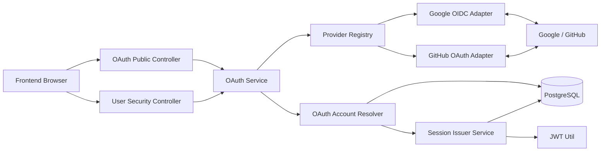
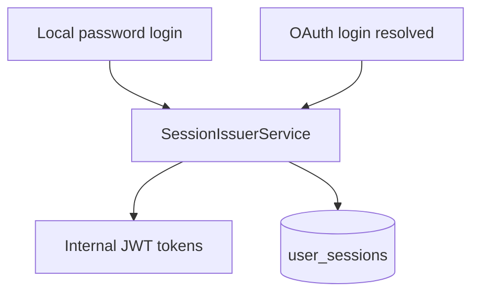
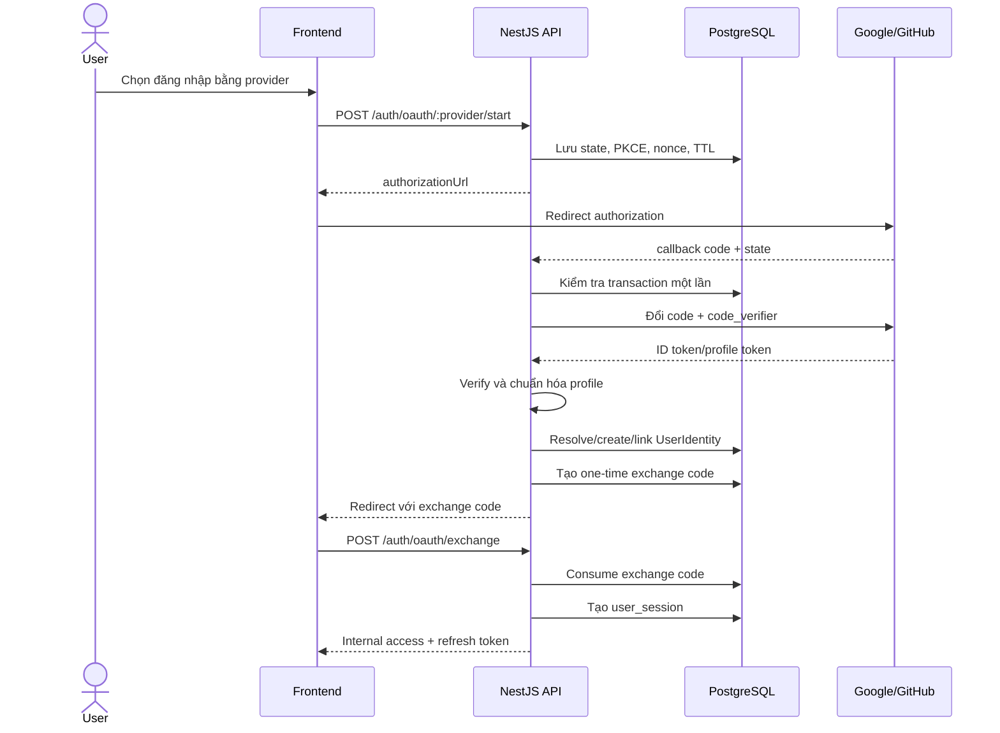

# TÍCH HỢP OAUTH 2.0 / OPENID CONNECT — DỰ ÁN QUẢN LÝ BLOG

> Tài liệu thiết kế kỹ thuật và lộ trình tích hợp đăng nhập bằng Google, GitHub và các nhà cung cấp danh tính khác vào backend NestJS của dự án Quản lý Blog. Tài liệu phân biệt rõ OAuth 2.0 dùng để ủy quyền và OpenID Connect dùng để xác thực danh tính.

## 1. Thông tin tài liệu

| Thuộc tính | Giá trị |
|---|---|
| Dự án | Quản lý Blog |
| Kiến trúc hiện tại | Modular Monolith |
| Backend | NestJS 11, TypeScript 5.7 |
| ORM / Database | Prisma 7 / PostgreSQL |
| Xác thực hiện tại | Local username/email + password, JWT access token, refresh token theo session |
| Provider ưu tiên | Google trước, GitHub sau |
| Chuẩn đề xuất | Authorization Code Flow + PKCE; OpenID Connect khi provider hỗ trợ |
| Base URL | `/api/v1` |
| Ngày lập kế hoạch | 30/07/2026 |
| Trạng thái | Thiết kế và roadmap; chưa phải chức năng đã tồn tại |

---

## 2. Mục tiêu

Tích hợp OAuth/OIDC nhằm:

1. Cho phép người dùng đăng nhập nhanh bằng Google hoặc GitHub.
2. Giảm phụ thuộc vào mật khẩu do ứng dụng tự quản lý.
3. Giữ nguyên hệ thống JWT, refresh token, session, role và guard đang có.
4. Cho phép một tài khoản liên kết nhiều phương thức đăng nhập.
5. Ngăn tạo tài khoản trùng, chiếm đoạt tài khoản và liên kết sai danh tính.
6. Không làm gián đoạn đăng ký/đăng nhập bằng mật khẩu hiện tại.
7. Tạo kiến trúc provider adapter để sau này có thể thêm Microsoft, Apple hoặc provider khác.
8. Có feature flag, audit log, metrics và khả năng rollback an toàn.

### 2.1. Ngoài phạm vi giai đoạn đầu

Giai đoạn đầu không bao gồm:

- Biến dự án thành OAuth Authorization Server.
- Cho ứng dụng bên thứ ba gọi Blog API bằng access token do dự án phát hành.
- Đồng bộ danh bạ, repository, Google Drive hoặc dữ liệu riêng của provider.
- Đăng nhập doanh nghiệp bằng SAML.
- Passkey/WebAuthn.
- Lưu access token dài hạn của Google/GitHub nếu chỉ dùng để đăng nhập.

---

## 3. Phân biệt OAuth 2.0 và OpenID Connect

### 3.1. OAuth 2.0

OAuth 2.0 là framework ủy quyền. Nó cho phép ứng dụng nhận quyền truy cập giới hạn vào tài nguyên của provider mà không cần biết mật khẩu người dùng.

Ví dụ:

- Cho ứng dụng đọc email đã xác minh từ GitHub.
- Cho ứng dụng truy cập lịch Google nếu người dùng đồng ý.

OAuth 2.0 tự nó không định nghĩa đầy đủ cách ứng dụng xác minh danh tính người dùng.

### 3.2. OpenID Connect

OpenID Connect, viết tắt OIDC, là lớp xác thực danh tính xây trên OAuth 2.0. OIDC bổ sung `id_token` và các claim chuẩn như:

```json
{
  "iss": "https://accounts.google.com",
  "sub": "provider-stable-subject",
  "aud": "oauth-client-id",
  "email": "user@example.com",
  "email_verified": true,
  "name": "Nguyễn Văn A",
  "picture": "https://..."
}
```

Đối với Google Sign-In, nên sử dụng OIDC với scope tối thiểu:

```text
openid email profile
```

Đối với GitHub, ứng dụng thực hiện OAuth 2.0 Authorization Code Flow, sau đó gọi API hồ sơ/email để lấy danh tính cần thiết.

### 3.3. Nguyên tắc quan trọng

Khóa định danh ổn định của tài khoản bên ngoài phải là:

```text
(provider, providerSubject)
```

Không dùng email làm khóa chính để nhận diện danh tính OAuth vì email có thể:

- Thay đổi.
- Bị ẩn.
- Chưa được xác minh.
- Trùng với email của tài khoản local hiện có.
- Có quy tắc khác nhau giữa các provider.

---

## 4. Hiện trạng xác thực của dự án

Source hiện tại có các đặc điểm:

1. Người dùng đăng ký bằng `username`, `email`, `password`.
2. `users.password_hash` đang là field bắt buộc.
3. Login chấp nhận username hoặc email cùng password.
4. Backend phát hành access token và refresh token riêng.
5. Refresh token được hash trước khi lưu vào `user_sessions`.
6. Mỗi phiên lưu `deviceInfo`, `ipAddress`, `expiresAt`, `revokedAt`.
7. `JwtAuthGuard` xác minh access token và đọc lại user từ database.
8. Tài khoản `LOCKED` hoặc soft-delete bị từ chối.
9. Role lấy từ database ở mỗi request được bảo vệ.
10. Source chưa có dependency, controller, strategy, provider adapter hoặc bảng dữ liệu OAuth.

### 4.1. Hạn chế cần giải quyết

| Hạn chế | Ảnh hưởng |
|---|---|
| `passwordHash` bắt buộc | Không thể tạo tài khoản chỉ đăng nhập bằng OAuth một cách sạch sẽ |
| Chưa có bảng provider identity | Không lưu được Google `sub` hoặc GitHub user ID |
| Login và cấp session nằm chung trong `AuthsService` | Dễ lặp logic khi thêm OAuth |
| Chưa có OAuth transaction | Không quản lý được `state`, PKCE, `nonce`, expiry và replay |
| Chưa có account-linking policy | Có nguy cơ tạo tài khoản trùng hoặc chiếm tài khoản theo email |
| Chưa có one-time callback exchange | Dễ mắc lỗi đưa JWT vào URL callback |
| Chưa có metrics/audit chuyên biệt | Khó điều tra lỗi hoặc lạm dụng OAuth |

---

## 5. Quyết định kiến trúc đề xuất

### 5.1. Provider chỉ xác minh danh tính

Google/GitHub không thay thế hệ thống token nội bộ.

Sau khi provider xác minh thành công:

```text
Provider identity
       ↓
Resolve/link local User
       ↓
Issue internal JWT access token
       ↓
Create internal refresh-token session
       ↓
Sử dụng JwtAuthGuard và RolesGuard hiện tại
```

Lợi ích:

- Không cần thay đổi cơ chế phân quyền.
- Không gửi provider token vào 83 endpoint hiện tại.
- Khi khóa user, toàn bộ phương thức đăng nhập đều bị vô hiệu hóa.
- Có thể logout-all bằng `user_sessions` như hiện tại.
- Có thể gỡ provider mà không ảnh hưởng domain nghiệp vụ.

### 5.2. Flow bắt buộc

Sử dụng:

- Authorization Code Flow.
- PKCE với `S256`.
- `state` một lần để chống CSRF và callback injection.
- `nonce` cho OIDC để chống replay ID token.
- Redirect URI khớp chính xác.
- HTTPS ở staging/production.
- Scope tối thiểu.

Không sử dụng:

- Implicit Flow.
- Password Grant.
- Token trong URL fragment.
- JWT ứng dụng trong query callback.
- Tự động tin email chưa được xác minh.
- Tự động liên kết tài khoản chỉ vì email trùng.

### 5.3. Provider rollout

| Thứ tự | Provider | Cách tích hợp | Scope tối thiểu |
|---:|---|---|---|
| 1 | Google | OpenID Connect Authorization Code + PKCE | `openid email profile` |
| 2 | GitHub | OAuth 2.0 Authorization Code + PKCE | `read:user`; thêm `user:email` nếu cần đọc email riêng tư |
| 3 | Microsoft | OIDC | `openid email profile` |
| 4 | Apple | OIDC | Theo yêu cầu Sign in with Apple |

Google được chọn làm provider đầu tiên vì OIDC cung cấp ID token và claim xác minh email chuẩn. GitHub được thêm sau khi pipeline OAuth dùng chung đã ổn định.

---

## 6. Kiến trúc mục tiêu



### 6.1. Ranh giới module

```text
libs/core/src/modules/oauth/
├── oauth.module.ts
├── oauth.service.ts
├── oauth-account-resolver.service.ts
├── oauth-transaction.service.ts
├── oauth-exchange-code.service.ts
├── oauth-audit.service.ts
├── config/
│   └── oauth.config.ts
├── dto/
│   ├── oauth-start.dto.ts
│   ├── oauth-exchange.dto.ts
│   └── unlink-oauth-identity.dto.ts
├── entities/
│   ├── oauth-identity.entity.ts
│   └── login-method.entity.ts
├── interfaces/
│   ├── oauth-provider.adapter.ts
│   ├── oauth-provider-profile.ts
│   └── oauth-authorization-result.ts
└── providers/
    ├── google-oauth.adapter.ts
    └── github-oauth.adapter.ts
```

Controller theo namespace:

```text
src/public/controllers/public-oauth.controller.ts
src/user/controllers/user-login-methods.controller.ts
src/admin/controllers/admin-oauth-audit.controller.ts   # giai đoạn sau
```

### 6.2. Tách dịch vụ cấp session

Logic cấp token hiện nằm trong `AuthsService.login()`. Cần tách thành dịch vụ dùng chung:

```text
SessionIssuerService.issue(user, requestContext)
```

Trách nhiệm:

1. Kiểm tra user ACTIVE và chưa bị xóa.
2. Phát hành internal access/refresh token.
3. Hash refresh token.
4. Tạo `user_sessions`.
5. Trả `UserEntity` và token.
6. Ghi security log cho login thành công.

Cả local login và OAuth exchange đều gọi cùng dịch vụ này.



---

## 7. Luồng đăng nhập OAuth

### 7.1. Bước 1 — Khởi tạo

Frontend gọi:

```http
POST /api/v1/auth/oauth/google/start
Content-Type: application/json

{
  "returnUrl": "http://localhost:4200/auth/oauth/callback"
}
```

Backend:

1. Kiểm tra provider có bật không.
2. Kiểm tra `returnUrl` nằm trong allowlist.
3. Sinh `state` ngẫu nhiên.
4. Sinh PKCE `code_verifier` và `code_challenge`.
5. Sinh `nonce` nếu là OIDC.
6. Lưu OAuth transaction có TTL.
7. Tạo authorization URL.
8. Trả URL cho frontend.

Response:

```json
{
  "success": true,
  "statusCode": 200,
  "data": {
    "authorizationUrl": "https://accounts.google.com/o/oauth2/v2/auth?...",
    "expiresAt": "2026-07-31T04:40:00.000Z"
  },
  "timestamp": "2026-07-31T04:30:00.000Z"
}
```

Frontend chuyển trình duyệt đến `authorizationUrl`.

### 7.2. Bước 2 — Provider callback

Provider redirect đến:

```http
GET /api/v1/auth/oauth/google/callback?code=...&state=...
```

Backend:

1. Tìm transaction theo hash của `state`.
2. Kiểm tra provider, mục đích, expiry và `usedAt`.
3. Đánh dấu transaction đang được xử lý bằng transaction/atomic update.
4. Đổi authorization code lấy provider token.
5. Xác minh ID token hoặc gọi provider profile API.
6. Xác minh `issuer`, `audience`, signature, expiry và `nonce` đối với OIDC.
7. Chuẩn hóa profile về một interface dùng chung.
8. Resolve local account.
9. Sinh application exchange code ngắn hạn, một lần.
10. Redirect về frontend.

Ví dụ redirect:

```text
http://localhost:4200/auth/oauth/callback?code=<ONE_TIME_EXCHANGE_CODE>
```

Không đưa các giá trị sau vào URL:

- Internal access token.
- Internal refresh token.
- Google/GitHub access token.
- ID token.
- Email hoặc thông tin hồ sơ nhạy cảm.
- Chi tiết lỗi nội bộ.

### 7.3. Bước 3 — Đổi application exchange code

Frontend gọi:

```http
POST /api/v1/auth/oauth/exchange
Content-Type: application/json

{
  "code": "<ONE_TIME_EXCHANGE_CODE>"
}
```

Backend:

1. Hash code và tìm bản ghi chưa dùng.
2. Kiểm tra TTL.
3. Atomic update `usedAt`.
4. Lấy user đã resolve.
5. Gọi `SessionIssuerService`.
6. Trả response giống local login.

```json
{
  "success": true,
  "statusCode": 200,
  "data": {
    "user": {
      "id": 15,
      "username": "nguyenvanf",
      "email": "nguyenvanf@example.com",
      "role": "NORMAL",
      "status": "ACTIVE",
      "bio": null,
      "avatarUrl": "https://..."
    },
    "tokens": {
      "accessToken": "<INTERNAL_ACCESS_TOKEN>",
      "refreshToken": "<INTERNAL_REFRESH_TOKEN>"
    }
  },
  "timestamp": "2026-07-31T04:30:00.000Z"
}
```

### 7.4. Sequence diagram



---

## 8. Quy tắc resolve tài khoản

### 8.1. Trường hợp đã liên kết

Nếu tồn tại:

```text
provider = GOOGLE
providerSubject = ID token sub
```

thì:

1. Lấy user liên kết.
2. Kiểm tra user tồn tại, ACTIVE, chưa xóa.
3. Cập nhật `lastLoginAt`.
4. Có thể cập nhật avatar/display name theo policy.
5. Tiếp tục cấp internal session.

### 8.2. Tài khoản OAuth mới

Nếu provider subject chưa tồn tại và email:

- Có mặt.
- Đã được provider xác minh.
- Chưa thuộc local user nào.

Backend có thể tạo user mới:

```text
role = NORMAL
status = ACTIVE
passwordHash = null
email = provider verified email
avatarUrl = provider picture
username = generated unique username
```

Quy tắc sinh username:

1. Lấy email prefix hoặc provider login.
2. Chuyển về ký tự `[A-Za-z0-9_]`.
3. Cắt tối đa 50 ký tự.
4. Nếu trùng, thêm suffix ngẫu nhiên.
5. Việc kiểm tra và tạo phải chịu được race condition.

Ví dụ:

```text
nguyen.van-a@example.com
→ nguyen_van_a
→ nguyen_van_a_7k2p nếu đã tồn tại
```

### 8.3. Email trùng tài khoản hiện có

Nếu email verified từ provider trùng với một local user nhưng chưa có identity tương ứng:

**Không tự động liên kết.**

Backend trả kết quả yêu cầu liên kết:

```text
OAUTH_ACCOUNT_LINK_REQUIRED
```

Frontend hướng dẫn người dùng:

1. Đăng nhập bằng phương thức hiện có.
2. Vào phần Bảo mật/Tài khoản liên kết.
3. Khởi tạo flow link provider khi đã có JWT.
4. Xác thực provider.
5. Hoàn tất liên kết.

Quy tắc này giảm nguy cơ account takeover do xử lý email không đồng nhất giữa provider.

### 8.4. Email thiếu hoặc chưa xác minh

- Google: yêu cầu claim `email_verified = true`.
- GitHub: đọc danh sách email và chỉ chấp nhận email `verified = true`, ưu tiên `primary = true`.
- Nếu không có email verified: không tự tạo user.

Các phương án:

1. Yêu cầu người dùng cung cấp email.
2. Gửi email xác minh bằng hệ thống của dự án.
3. Chỉ tạo user sau khi xác minh hoàn tất.

### 8.5. Tài khoản bị khóa hoặc xóa

Provider xác thực thành công không có nghĩa được đăng nhập vào Blog.

Nếu local user:

- `status = LOCKED`, từ chối.
- `deletedAt != null`, từ chối.
- Role bị thay đổi, internal JWT mới sử dụng role hiện tại từ database.

---

## 9. Liên kết và gỡ phương thức đăng nhập

### 9.1. Danh sách login methods

```http
GET /api/v1/user/security/login-methods
Authorization: Bearer <ACCESS_TOKEN>
```

Response đề xuất:

```json
{
  "hasPassword": true,
  "providers": [
    {
      "provider": "GOOGLE",
      "email": "nguyenvanf@gmail.com",
      "linkedAt": "2026-07-31T04:30:00.000Z",
      "lastLoginAt": "2026-07-31T05:10:00.000Z"
    }
  ]
}
```

Không trả:

- Provider access token.
- Provider refresh token.
- Full provider metadata không cần thiết.
- Provider subject nếu frontend không cần.

### 9.2. Khởi tạo link provider

```http
POST /api/v1/user/security/oauth/google/link/start
Authorization: Bearer <ACCESS_TOKEN>
Content-Type: application/json

{
  "returnUrl": "http://localhost:4200/settings/security"
}
```

OAuth transaction lưu:

```text
purpose = LINK
initiatedByUserId = current user
```

Callback chỉ được link identity vào đúng user đã khởi tạo transaction.

### 9.3. Gỡ provider

```http
DELETE /api/v1/user/security/oauth/google
Authorization: Bearer <ACCESS_TOKEN>
```

Điều kiện:

1. Yêu cầu recent authentication.
2. Identity thuộc đúng user.
3. Sau khi gỡ vẫn còn ít nhất một login method:
   - Password, hoặc
   - Một provider khác.
4. Ghi security log.
5. Có thể revoke toàn bộ internal sessions để giảm rủi ro.

Nếu đây là phương thức cuối cùng:

```text
OAUTH_LAST_LOGIN_METHOD
```

### 9.4. Đặt mật khẩu cho OAuth-only account

Bổ sung:

```http
POST /api/v1/user/security/password
Authorization: Bearer <ACCESS_TOKEN>
Content-Type: application/json

{
  "newPassword": "Secret123"
}
```

Có thể yêu cầu:

- Recent OAuth authentication.
- Email verification nội bộ.
- Password policy.
- Revoke các session cũ sau khi đặt password.

---

## 10. Thiết kế database đề xuất

### 10.1. Enum

```prisma
enum OAuthProvider {
  GOOGLE
  GITHUB
  MICROSOFT
  APPLE
}

enum OAuthTransactionPurpose {
  LOGIN
  LINK
}
```

Chỉ thêm enum/provider khi thực sự hỗ trợ; có thể bắt đầu với `GOOGLE`, `GITHUB`.

### 10.2. Điều chỉnh User

Phương án ít ảnh hưởng nhất:

```prisma
model User {
  id           Int        @id @default(autoincrement())
  username     String     @unique
  email        String     @unique
  passwordHash String?    @map("password_hash")

  // các field hiện tại...

  oauthIdentities OAuthIdentity[]
}
```

`passwordHash = null` nghĩa là user chưa có local password.

Các service local phải thay đổi:

- Login bằng password từ chối an toàn nếu `passwordHash = null`.
- Đổi mật khẩu phân biệt “đặt lần đầu” và “thay đổi”.
- Entity vẫn `@Exclude()` passwordHash.
- Admin không được thấy passwordHash dù null hay có dữ liệu.

### 10.3. OAuthIdentity

```prisma
model OAuthIdentity {
  id                Int           @id @default(autoincrement())
  userId            Int           @map("user_id")
  user              User          @relation(fields: [userId], references: [id], onDelete: Cascade)

  provider          OAuthProvider
  providerSubject   String        @map("provider_subject")
  providerEmail     String?       @map("provider_email")
  emailVerified     Boolean       @default(false) @map("email_verified")
  displayName       String?       @map("display_name")
  avatarUrl         String?       @map("avatar_url")

  linkedAt          DateTime      @default(now()) @map("linked_at")
  lastLoginAt       DateTime?     @map("last_login_at")
  updatedAt         DateTime      @updatedAt @map("updated_at")

  @@unique([provider, providerSubject])
  @@unique([userId, provider])
  @@index([userId])
  @@index([provider, providerEmail])
  @@map("oauth_identities")
}
```

Không lưu provider access token nếu chỉ dùng provider để đăng nhập.

Nếu một tính năng tương lai thật sự cần gọi provider API sau login, tạo bảng riêng:

```prisma
model OAuthProviderGrant {
  id                    Int      @id @default(autoincrement())
  identityId            Int      @unique @map("identity_id")
  accessTokenCiphertext String   @map("access_token_ciphertext")
  refreshTokenCiphertext String? @map("refresh_token_ciphertext")
  scopes                String[]
  expiresAt             DateTime?
  createdAt             DateTime @default(now()) @map("created_at")
  updatedAt             DateTime @updatedAt @map("updated_at")
}
```

Token phải được mã hóa bằng key chuyên dụng và có quy trình rotation. Không tái sử dụng JWT secret để mã hóa provider token.

### 10.4. OAuthTransaction

```prisma
model OAuthTransaction {
  id                    String                  @id @default(uuid())
  provider              OAuthProvider
  purpose               OAuthTransactionPurpose
  initiatedByUserId     Int?                    @map("initiated_by_user_id")

  stateHash             String                  @unique @map("state_hash")
  codeVerifierCiphertext String                 @map("code_verifier_ciphertext")
  nonceHash             String?                 @map("nonce_hash")
  returnUrl             String                  @map("return_url")

  expiresAt             DateTime                @map("expires_at")
  usedAt                DateTime?               @map("used_at")
  createdAt             DateTime                @default(now()) @map("created_at")

  @@index([expiresAt])
  @@index([initiatedByUserId, purpose])
  @@map("oauth_transactions")
}
```

Lưu ý:

- `state` chỉ lưu dạng hash.
- `code_verifier` cần dùng ở callback nên phải mã hóa, không chỉ hash.
- `nonce` có thể lưu dạng hash để so sánh với claim trả về.
- Transaction phải single-use.
- Cleanup xóa transaction hết hạn.

Nếu có Redis/queue trong tương lai, transaction ngắn hạn có thể chuyển sang Redis. Giai đoạn hiện tại PostgreSQL vẫn đủ.

### 10.5. OAuthExchangeCode

```prisma
model OAuthExchangeCode {
  id          String        @id @default(uuid())
  codeHash    String        @unique @map("code_hash")
  userId      Int           @map("user_id")
  provider    OAuthProvider

  expiresAt   DateTime      @map("expires_at")
  usedAt      DateTime?     @map("used_at")
  createdAt   DateTime      @default(now()) @map("created_at")

  @@index([userId])
  @@index([expiresAt])
  @@map("oauth_exchange_codes")
}
```

TTL đề xuất ngắn, ví dụ 30–90 giây, và chỉ được consume một lần.

### 10.6. Quan hệ dữ liệu

```mermaid
erDiagram
    USER ||--o{ USER_SESSION : has
    USER ||--o{ OAUTH_IDENTITY : links
    USER ||--o{ OAUTH_EXCHANGE_CODE : receives
    USER ||--o{ OAUTH_TRANSACTION : initiates

    USER {
      int id PK
      string username UK
      string email UK
      string password_hash nullable
      enum role
      enum status
    }

    OAUTH_IDENTITY {
      int id PK
      int user_id FK
      enum provider
      string provider_subject
      string provider_email
      boolean email_verified
      datetime linked_at
      datetime last_login_at
    }

    OAUTH_TRANSACTION {
      uuid id PK
      string state_hash UK
      enum provider
      enum purpose
      int initiated_by_user_id FK
      datetime expires_at
      datetime used_at
    }

    OAUTH_EXCHANGE_CODE {
      uuid id PK
      string code_hash UK
      int user_id FK
      enum provider
      datetime expires_at
      datetime used_at
    }
```

---

## 11. API đề xuất

### 11.1. Public/Auth

| Method | Endpoint | Mục đích |
|---|---|---|
| `GET` | `/api/v1/auth/oauth/providers` | Danh sách provider đang bật |
| `POST` | `/api/v1/auth/oauth/:provider/start` | Tạo authorization transaction và URL |
| `GET` | `/api/v1/auth/oauth/:provider/callback` | Provider callback |
| `POST` | `/api/v1/auth/oauth/exchange` | Đổi one-time code lấy internal session |

### 11.2. User Security

| Method | Endpoint | Mục đích |
|---|---|---|
| `GET` | `/api/v1/user/security/login-methods` | Xem password/provider đã liên kết |
| `POST` | `/api/v1/user/security/oauth/:provider/link/start` | Khởi tạo liên kết provider |
| `DELETE` | `/api/v1/user/security/oauth/:provider` | Gỡ provider |
| `POST` | `/api/v1/user/security/password` | Đặt password cho OAuth-only user |
| `POST` | `/api/v1/user/security/reauth` | Tạo recent-auth proof cho thao tác nhạy cảm |

### 11.3. Admin/Audit — giai đoạn sau

| Method | Endpoint | Mục đích |
|---|---|---|
| `GET` | `/api/v1/admin/oauth/metrics` | Xem thống kê login theo provider |
| `GET` | `/api/v1/admin/users/:id/login-methods` | Xem loại phương thức, không xem token |
| `POST` | `/api/v1/admin/users/:id/revoke-sessions` | Thu hồi internal sessions |
| `DELETE` | `/api/v1/admin/users/:id/oauth/:provider` | Chỉ dùng trong incident workflow có audit |

Admin không nên có quyền đọc provider token hoặc provider profile thô.

---

## 12. Provider adapter contract

Mỗi provider cần triển khai interface chung:

```ts
export interface OAuthProviderProfile {
  provider: 'GOOGLE' | 'GITHUB';
  subject: string;
  email: string | null;
  emailVerified: boolean;
  displayName: string | null;
  usernameHint: string | null;
  avatarUrl: string | null;
}

export interface OAuthProviderAdapter {
  getAuthorizationUrl(input: {
    state: string;
    codeChallenge: string;
    nonce?: string;
    redirectUri: string;
  }): Promise<string>;

  handleCallback(input: {
    code: string;
    codeVerifier: string;
    nonce?: string;
    redirectUri: string;
  }): Promise<OAuthProviderProfile>;
}
```

Business logic không được phụ thuộc vào response riêng của Google hoặc GitHub.

Provider adapter chịu trách nhiệm:

- Endpoint của provider.
- Scope.
- Token exchange.
- ID token validation.
- Profile mapping.
- Provider-specific error mapping.

OAuth account resolver chịu trách nhiệm:

- Tìm identity.
- Kiểm tra email verified.
- Tạo local user.
- Yêu cầu account linking.
- Chống identity collision.
- Kiểm tra account status.

---

## 13. Cấu hình môi trường

```dotenv
# Feature flags
OAUTH_GOOGLE_ENABLED=false
OAUTH_GITHUB_ENABLED=false
OAUTH_AUTO_CREATE_USER_ENABLED=true

# Shared OAuth security
OAUTH_TRANSACTION_TTL_SECONDS=600
OAUTH_EXCHANGE_CODE_TTL_SECONDS=60
OAUTH_DATA_ENCRYPTION_KEY=<32-byte-or-stronger-secret>
OAUTH_ALLOWED_RETURN_URLS=http://localhost:4200/auth/oauth/callback
FRONTEND_OAUTH_SUCCESS_URL=http://localhost:4200/auth/oauth/callback
FRONTEND_OAUTH_ERROR_URL=http://localhost:4200/auth/login

# Google OIDC
GOOGLE_OAUTH_CLIENT_ID=
GOOGLE_OAUTH_CLIENT_SECRET=
GOOGLE_OAUTH_CALLBACK_URL=http://localhost:8080/api/v1/auth/oauth/google/callback

# GitHub OAuth
GITHUB_OAUTH_CLIENT_ID=
GITHUB_OAUTH_CLIENT_SECRET=
GITHUB_OAUTH_CALLBACK_URL=http://localhost:8080/api/v1/auth/oauth/github/callback
```

### 13.1. Quy tắc cấu hình

- Không commit client secret.
- Mỗi môi trường dùng một OAuth client riêng.
- Redirect URI dev/staging/prod đăng ký tách biệt.
- Không dùng wildcard redirect URI.
- `returnUrl` phải đối chiếu allowlist, không nhận URL tùy ý.
- Encryption key tách khỏi JWT access/refresh secret.
- Secret được lưu trong secret manager ở production.
- Log startup chỉ ghi provider enabled/disabled, không ghi client secret.

---

## 14. Security requirements

### 14.1. Authorization Code + PKCE

Mọi provider flow phải sử dụng PKCE `S256`, kể cả backend là confidential client. PKCE giúp giảm rủi ro authorization code bị đánh cắp hoặc bị chèn.

### 14.2. State

`state` phải:

- Sinh từ CSPRNG.
- Đủ entropy.
- Gắn với một transaction.
- Lưu hash tại server.
- Có TTL.
- Single-use.
- Khớp provider và purpose.
- Không chứa userId, email hoặc secret ở dạng đọc được.

### 14.3. Nonce

OIDC flow phải:

- Sinh `nonce`.
- Gửi trong authorization request.
- Kiểm tra `nonce` trong ID token.
- Không dùng lại giữa các transaction.

### 14.4. ID token validation

Cần xác minh ít nhất:

- Signature qua provider JWKS.
- `iss`.
- `aud`.
- `exp`.
- `iat` với clock skew hợp lý.
- `nonce`.
- `email_verified` khi sử dụng email.
- `sub` không rỗng.

Không chỉ decode JWT rồi tin claim.

### 14.5. Redirect và open redirect

- Callback URI backend là cố định.
- Frontend `returnUrl` dùng allowlist.
- Không nối trực tiếp user input vào redirect.
- Không phản hồi chi tiết provider error vào query.
- Error redirect chỉ mang mã lỗi ngắn và correlation ID.

### 14.6. Token handling

- Không gửi provider access token tới frontend.
- Không ghi token vào log.
- Không lưu provider token nếu không cần.
- Không đưa internal JWT vào query string.
- Exchange code được hash, TTL ngắn, single-use.
- Refresh token nội bộ tiếp tục được hash như hệ thống hiện tại.

### 14.7. Account linking

- Không tự link theo email mặc định.
- Link yêu cầu user đã đăng nhập.
- Transaction link gắn với `initiatedByUserId`.
- Link một identity chỉ được thuộc một user.
- Gỡ provider yêu cầu recent authentication.
- Không cho gỡ login method cuối cùng.
- Link/unlink phải ghi security log.

### 14.8. Scope tối thiểu

Google:

```text
openid email profile
```

GitHub:

```text
read:user
user:email   # chỉ khi cần lấy email private/verified
```

Không xin repository, organization hoặc write scope nếu tính năng chỉ là đăng nhập.

### 14.9. Rate limiting

Áp dụng rate limit riêng cho:

- Start OAuth.
- Callback lỗi.
- Exchange code.
- Link provider.
- Unlink provider.
- Tạo user OAuth mới.

Rate limit theo tổ hợp:

- IP.
- Session/user.
- Provider.
- Device fingerprint nhẹ, nếu có.

Không khóa nhầm người dùng chỉ vì provider callback retry; cần phân biệt lỗi hợp lệ và hành vi abuse.

### 14.10. Audit

Ghi các action:

```text
OAUTH_LOGIN_STARTED
OAUTH_LOGIN_SUCCEEDED
OAUTH_LOGIN_FAILED
OAUTH_ACCOUNT_CREATED
OAUTH_LINK_STARTED
OAUTH_IDENTITY_LINKED
OAUTH_IDENTITY_UNLINKED
OAUTH_REPLAY_REJECTED
OAUTH_EMAIL_COLLISION
OAUTH_SESSION_ISSUED
```

Không ghi:

- Authorization code.
- Access/refresh token.
- ID token.
- PKCE verifier.
- State rõ.
- Full email nếu không cần; có thể mask.
- Provider profile thô.

---

## 15. Error catalog đề xuất

| Code | HTTP | Ý nghĩa |
|---|---:|---|
| `OAUTH_PROVIDER_NOT_SUPPORTED` | 400 | Provider không được hỗ trợ |
| `OAUTH_PROVIDER_DISABLED` | 503 | Provider đang tắt bằng feature flag |
| `OAUTH_RETURN_URL_NOT_ALLOWED` | 400 | Return URL không thuộc allowlist |
| `OAUTH_STATE_INVALID` | 401 | State sai hoặc không tồn tại |
| `OAUTH_STATE_EXPIRED` | 401 | Transaction hết hạn |
| `OAUTH_STATE_ALREADY_USED` | 409 | Callback bị replay |
| `OAUTH_PROVIDER_ACCESS_DENIED` | 400 | User từ chối consent |
| `OAUTH_CODE_EXCHANGE_FAILED` | 401 | Không đổi được authorization code |
| `OAUTH_ID_TOKEN_INVALID` | 401 | ID token không hợp lệ |
| `OAUTH_EMAIL_REQUIRED` | 422 | Provider không trả email |
| `OAUTH_EMAIL_NOT_VERIFIED` | 422 | Email chưa được xác minh |
| `OAUTH_ACCOUNT_LINK_REQUIRED` | 409 | Email trùng local account, phải link |
| `OAUTH_IDENTITY_ALREADY_LINKED` | 409 | Identity đã thuộc một user |
| `OAUTH_PROVIDER_ALREADY_LINKED` | 409 | User đã link provider này |
| `OAUTH_EXCHANGE_CODE_INVALID` | 401 | Application exchange code sai |
| `OAUTH_EXCHANGE_CODE_EXPIRED` | 401 | Exchange code hết hạn |
| `OAUTH_LAST_LOGIN_METHOD` | 409 | Không thể gỡ phương thức cuối |
| `OAUTH_REAUTH_REQUIRED` | 401 | Cần xác thực gần đây |
| `OAUTH_USER_LOCKED` | 403 | Local account bị khóa |

Error envelope vẫn theo chuẩn hiện tại của dự án.

---

## 16. Thay đổi source dự kiến

### 16.1. `libs/core`

| Thành phần | Công việc |
|---|---|
| `modules/auths` | Tách `SessionIssuerService`; hỗ trợ user không có password |
| `modules/oauth` | Tạo provider flow, transaction, resolver, exchange code |
| `modules/users` | Truy vấn user cùng OAuth identities; sinh username an toàn |
| `common/exceptions` | Thêm OAuth exceptions có error code ổn định |
| `common/guards` | Không thay đổi JWT guard; có thể thêm recent-auth guard |
| `config` | Thêm OAuth config validation |
| `modules/security-logs` | Chuẩn hóa OAuth audit action |
| `modules/cleanup` | Xóa transaction/exchange code hết hạn |

### 16.2. `src/public`

- Controller start OAuth.
- Provider callback.
- Exchange code.
- Provider availability.
- Public callback phải xử lý redirect response, không áp dụng success JSON envelope cho 302.

### 16.3. `src/user`

- Danh sách login methods.
- Link provider.
- Unlink provider.
- Đặt local password.
- Recent authentication cho thao tác nhạy cảm.

### 16.4. `src/admin`

Giai đoạn đầu chỉ cần:

- Revoke internal sessions.
- Xem provider type đã link ở mức tối thiểu.

Giai đoạn sau mới thêm:

- OAuth metrics.
- Incident unlink.
- Provider health dashboard.

### 16.5. Prisma

- `passwordHash` nullable.
- Thêm OAuth enum.
- Thêm `oauth_identities`.
- Thêm `oauth_transactions`.
- Thêm `oauth_exchange_codes`.
- Index, unique constraint và cleanup.

---

## 17. Dependency strategy

Có hai hướng triển khai.

### 17.1. Hướng đề xuất

Dùng provider adapter và thư viện hỗ trợ chuẩn:

- OIDC client cho Google.
- OAuth 2.0 client chuẩn cho GitHub.
- Node.js built-in `fetch` hoặc client được thư viện cung cấp.
- Logic provider bị cô lập trong adapter.

Ưu điểm:

- Kiểm soát rõ state, PKCE, nonce và validation.
- Dễ test bằng adapter mock.
- Không phụ thuộc business logic vào Passport strategy.
- Dễ thêm provider.

### 17.2. Hướng MVP nhanh bằng Passport

Có thể sử dụng:

```text
@nestjs/passport
passport
passport-google-oauth20
passport-github2
```

Tuy nhiên:

- Strategy chỉ nên làm nhiệm vụ provider handshake.
- Account linking và session issuance vẫn phải nằm trong core service.
- Phải tự kiểm tra state/PKCE/nonce và behavior thực tế của strategy.
- Không được giả định một package strategy tự động đáp ứng toàn bộ Security BCP.
- Cần theo dõi maintenance và security advisory của từng package.

### 17.3. Quyết định khuyến nghị

Với dự án này, nên xây `OAuthProviderAdapter` làm abstraction bắt buộc. Có thể dùng Passport hoặc thư viện OIDC ở bên trong adapter, nhưng controller/service không được phụ thuộc trực tiếp vào provider package.

---

## 18. Kế hoạch migration dữ liệu

### 18.1. Migration additive

Bước đầu:

1. Cho phép `users.password_hash` nullable.
2. Tạo OAuth enum và bảng mới.
3. Không thay đổi user hiện có.
4. Không tự tạo OAuth identity cho user cũ.
5. Local login tiếp tục hoạt động.

### 18.2. Backfill

Không cần backfill OAuth identity.

Có thể backfill field suy diễn:

```text
hasPassword = passwordHash != null
```

Không cần lưu `hasPassword` nếu có thể tính từ database.

### 18.3. Rollback migration

Rollback chức năng bằng feature flag, không nên rollback phá hủy bảng ngay.

Nếu cần dừng OAuth:

```dotenv
OAUTH_GOOGLE_ENABLED=false
OAUTH_GITHUB_ENABLED=false
```

Giữ dữ liệu identity để tái kích hoạt sau. Local login vẫn hoạt động.

### 18.4. Race condition

Các trường hợp phải dựa vào unique constraint:

- Hai callback đồng thời tạo cùng provider identity.
- Hai request cùng sinh username.
- Hai user cố link cùng identity.
- Callback bị provider retry.
- Exchange code bị consume hai lần.

Service bắt lỗi unique constraint và trả kết quả nghiệp vụ ổn định.

---

## 19. Kế hoạch kiểm thử

### 19.1. Unit test

- Sinh state có entropy và hash đúng.
- Sinh PKCE verifier/challenge `S256`.
- Validate return URL.
- Transaction expiry.
- Transaction single-use.
- Verify nonce.
- Mapping Google profile.
- Mapping GitHub profile.
- Email verified selection.
- Username normalization.
- Username collision retry.
- Existing identity login.
- New user creation.
- Email collision → link required.
- Locked/deleted user rejected.
- Last login method rule.
- Provider token không xuất hiện trong entity/response.

### 19.2. Integration test

- Start → callback → exchange thành công.
- Callback sai state.
- Callback hết hạn.
- Callback replay.
- Provider denied consent.
- Invalid issuer/audience.
- Identity unique constraint.
- OAuth-only user không login được bằng password.
- OAuth user đặt password rồi local login được.
- Link provider vào user đang đăng nhập.
- Không thể link identity của user khác.
- Unlink và giữ login method tối thiểu.
- Internal refresh/logout/logout-all hoạt động sau OAuth login.

### 19.3. E2E test

Dùng provider mock hoặc local OIDC test server trong CI:

```text
Frontend simulation
→ OAuth start
→ mock provider authorize
→ callback
→ exchange
→ call /user/profile with internal access token
```

Không phụ thuộc Google/GitHub thật trong CI mặc định.

### 19.4. Security test

- CSRF state bypass.
- Open redirect.
- Authorization code replay.
- Exchange code replay.
- Nonce mismatch.
- PKCE verifier mismatch.
- Email collision takeover.
- Token leakage trong log.
- Header injection.
- Return URL encoded bypass.
- Rate-limit bypass.
- Session fixation.
- Concurrent account creation.

---

## 20. Metrics và observability

### 20.1. Metrics

```text
oauth_start_total{provider,purpose}
oauth_callback_total{provider,result}
oauth_exchange_total{provider,result}
oauth_account_created_total{provider}
oauth_identity_linked_total{provider}
oauth_identity_unlinked_total{provider}
oauth_failure_total{provider,reason}
oauth_callback_duration_ms{provider}
oauth_exchange_duration_ms{provider}
oauth_transaction_expired_total{provider}
oauth_replay_rejected_total{provider}
```

### 20.2. Dashboard

Theo dõi:

- Tỷ lệ thành công theo provider.
- Tỷ lệ user từ chối consent.
- Tỷ lệ email collision.
- User mới/đã tồn tại.
- Callback P50/P95/P99.
- Số replay bị từ chối.
- Provider outage.
- Số tài khoản OAuth-only.
- Tỷ lệ người dùng link thêm password.
- Lỗi theo environment và release.

### 20.3. Alert

Cảnh báo khi:

- Callback failure tăng đột biến.
- Provider token endpoint timeout.
- Invalid state tăng bất thường.
- Provider signature/JWKS verification lỗi.
- Account collision tăng.
- OAuth login thành công nhưng session issuance lỗi.
- Cleanup transaction không chạy.

---

## 21. Lộ trình triển khai

## Giai đoạn 0 — Chốt chính sách

### Mục tiêu

Chốt quy tắc trước khi viết code.

### Công việc

- `OAUTH-001`: Chọn Google là provider đầu tiên.
- `OAUTH-002`: Chốt không tự link theo email.
- `OAUTH-003`: Chốt auto-create user chỉ khi email verified.
- `OAUTH-004`: Chốt token handoff bằng one-time exchange code.
- `OAUTH-005`: Chốt allowlist return URL.
- `OAUTH-006`: Chốt có/không lưu provider token; mặc định không lưu.
- `OAUTH-007`: Đăng ký OAuth client riêng cho dev, staging, production.
- `OAUTH-008`: Threat modeling và security review.

### Tiêu chí hoàn thành

- Có ADR cho quyết định OAuth/OIDC.
- Có callback URL chính thức theo môi trường.
- Có account-linking policy được frontend/backend thống nhất.
- Không còn điểm mơ hồ về email collision.

---

## Giai đoạn 1 — Refactor nền tảng auth

### Công việc

- `OAUTH-009`: Tách `SessionIssuerService`.
- `OAUTH-010`: Cho `passwordHash` nullable.
- `OAUTH-011`: Cập nhật local login cho OAuth-only account.
- `OAUTH-012`: Tạo OAuth exception/error code.
- `OAUTH-013`: Tạo config validation và feature flag.
- `OAUTH-014`: Tạo migration bảng OAuth.
- `OAUTH-015`: Tạo cleanup transaction/exchange code.
- `OAUTH-016`: Bổ sung test regression local auth.

### Tiêu chí hoàn thành

- Local register/login/refresh/logout không đổi API contract.
- OAuth-only user được biểu diễn đúng trong database.
- Session issuance dùng chung.
- Migration chạy được trên database trống và database có dữ liệu.

---

## Giai đoạn 2 — Google OIDC MVP

### Công việc

- `OAUTH-017`: Tạo OAuth module và provider registry.
- `OAUTH-018`: Tạo Google OIDC adapter.
- `OAUTH-019`: Implement state + PKCE + nonce.
- `OAUTH-020`: Implement start endpoint.
- `OAUTH-021`: Implement callback.
- `OAUTH-022`: Implement account resolver.
- `OAUTH-023`: Implement one-time exchange code.
- `OAUTH-024`: Implement exchange endpoint.
- `OAUTH-025`: Ghi audit và metrics.
- `OAUTH-026`: Unit/integration/e2e/security test.

### Tiêu chí hoàn thành

- User mới đăng nhập Google tạo tài khoản `NORMAL`.
- User đã link đăng nhập vào đúng local account.
- Email collision không tự link.
- Provider/internal token không rò rỉ qua URL/log.
- Replay callback và exchange code bị từ chối.
- User bị khóa không đăng nhập được.

---

## Giai đoạn 3 — Account linking và Security Settings

### Công việc

- `OAUTH-027`: Login methods endpoint.
- `OAUTH-028`: Link start flow.
- `OAUTH-029`: Link callback.
- `OAUTH-030`: Unlink provider.
- `OAUTH-031`: Recent authentication proof.
- `OAUTH-032`: Đặt local password cho OAuth-only account.
- `OAUTH-033`: Revoke sessions sau thao tác nhạy cảm.
- `OAUTH-034`: Frontend Security Settings UI.

### Tiêu chí hoàn thành

- User có thể link/unlink an toàn.
- Không thể chiếm identity của user khác.
- Không thể gỡ login method cuối cùng.
- Tất cả thao tác có audit trail.

---

## Giai đoạn 4 — GitHub OAuth

### Công việc

- `OAUTH-035`: Đăng ký GitHub OAuth App/GitHub App phù hợp.
- `OAUTH-036`: Tạo GitHub adapter.
- `OAUTH-037`: Lấy primary verified email.
- `OAUTH-038`: Xử lý user không public email.
- `OAUTH-039`: Test provider-specific error.
- `OAUTH-040`: Bổ sung metrics/health check GitHub.

### Tiêu chí hoàn thành

- Cùng API contract với Google.
- GitHub provider logic không rò sang account resolver.
- Scope chỉ đủ cho login.
- Không tạo tài khoản nếu không có email verified theo policy.

---

## Giai đoạn 5 — Hardening và rollout

### Công việc

- `OAUTH-041`: Rate limit.
- `OAUTH-042`: Secret manager và rotation runbook.
- `OAUTH-043`: Redaction log.
- `OAUTH-044`: Dashboard và alert.
- `OAUTH-045`: Chaos/provider outage test.
- `OAUTH-046`: Feature flag rollout.
- `OAUTH-047`: Penetration test tập trung callback/link.
- `OAUTH-048`: Cập nhật API docs, README, SECURITY và runbook.

### Rollout đề xuất

1. Development với provider test client.
2. Staging và test end-to-end.
3. Internal users/allowlist.
4. Bật Google cho một phần traffic bằng feature flag.
5. Theo dõi error rate và collision.
6. Mở toàn bộ Google.
7. Lặp lại với GitHub.

---

## Giai đoạn 6 — Hướng phát triển nâng cao

Các hạng mục sau chỉ thực hiện khi OAuth login ổn định:

- Microsoft OIDC.
- Sign in with Apple.
- MFA cho tài khoản local và OAuth.
- Passkey/WebAuthn.
- Device/session management UI.
- Step-up authentication cho Admin/Moderator.
- Enterprise SSO.
- Provider account recovery.
- Consent và privacy dashboard.
- Dùng OAuth provider cho chức năng tích hợp ngoài, với token vault riêng.

---

## 22. Ma trận ưu tiên

| Hạng mục | Ưu tiên | Phụ thuộc |
|---|---|---|
| SessionIssuer refactor | P0 | Không |
| Database OAuth identity | P0 | Migration sync |
| State + PKCE + nonce | P0 | OAuth transaction |
| Google OIDC login | P0 | Core OAuth module |
| One-time exchange code | P0 | Callback |
| No-auto-link policy | P0 | Account resolver |
| Security tests | P0 | Google MVP |
| Login methods UI/API | P1 | Google MVP |
| Link/unlink | P1 | Recent auth |
| GitHub OAuth | P1 | Provider adapter ổn định |
| Metrics/alert | P1 | Audit |
| Admin OAuth dashboard | P2 | Metrics |
| Microsoft/Apple | P2 | Multi-provider maturity |
| Store provider grant | P2/RESEARCH | Có use case API ngoài |
| Passkey/WebAuthn | RESEARCH | Security roadmap |

---

## 23. Rủi ro và biện pháp

| Rủi ro | Biện pháp |
|---|---|
| Account takeover do auto-link email | Không auto-link; yêu cầu login existing account |
| Duplicate user khi callback đồng thời | Unique constraint + transaction + retry |
| Authorization code bị đánh cắp | PKCE S256, TLS, code single-use |
| CSRF callback | State ngẫu nhiên, hash, TTL, single-use |
| ID token giả | Verify signature, issuer, audience, nonce, expiry |
| Open redirect | Return URL allowlist |
| Token lộ qua URL/log | One-time exchange code, redaction |
| Provider outage | Local login giữ nguyên, feature flag, retry có kiểm soát |
| User mất quyền truy cập provider | Cho đặt local password/link provider khác |
| Provider email thay đổi | Identity theo provider subject |
| GitHub không trả email | Yêu cầu verified email flow |
| Unlink làm user bị khóa ngoài | Không gỡ login method cuối |
| Secret bị rò | Secret manager, rotation, environment separation |
| Scope quá rộng | Scope review, least privilege |
| Rollout gây lỗi local auth | Regression suite và additive migration |

---

## 24. Definition of Done

OAuth provider chỉ được coi là hoàn thành khi:

- [ ] Authorization Code Flow hoạt động.
- [ ] PKCE `S256` được kiểm tra.
- [ ] State và nonce được kiểm tra, có TTL và single-use.
- [ ] Provider token không xuất hiện ở frontend, URL hoặc log.
- [ ] Internal JWT/session được phát hành qua service dùng chung.
- [ ] User ACTIVE/LOCKED/deleted được xử lý đúng.
- [ ] Email verified policy được áp dụng.
- [ ] Không auto-link theo email.
- [ ] Unique constraint ngăn identity trùng.
- [ ] Callback/exchange replay bị từ chối.
- [ ] Return URL có allowlist.
- [ ] Rate limit được áp dụng.
- [ ] Audit và metrics có dữ liệu.
- [ ] Unit, integration, e2e và security test đạt.
- [ ] Local auth regression test đạt.
- [ ] Migration và rollback đã thử trên staging.
- [ ] API documentation, README, SECURITY và runbook được cập nhật.
- [ ] Feature flag cho phép tắt provider tức thời.
- [ ] Không có secret thật trong repository.

---

## 25. Kết luận

Hướng tích hợp phù hợp với dự án là:

```text
Google/GitHub xác minh danh tính
          ↓
OAuthAccountResolver ánh xạ local User
          ↓
SessionIssuerService phát hành JWT nội bộ
          ↓
JwtAuthGuard + RolesGuard tiếp tục bảo vệ hệ thống
```

Ưu tiên triển khai:

1. Refactor session issuance và database.
2. Google OIDC bằng Authorization Code + PKCE.
3. One-time exchange code.
4. Account linking an toàn.
5. GitHub OAuth.
6. Hardening, metrics và rollout có feature flag.

Thiết kế này bổ sung social login mà không phá vỡ auth contract hiện tại, không làm provider token lan vào domain nghiệp vụ và vẫn giữ quyền kiểm soát tài khoản, role, session và thu hồi truy cập trong backend của dự án.

---

## 26. Nguồn chuẩn tham khảo

- OAuth 2.0 Security Best Current Practice — RFC 9700:  
  https://www.rfc-editor.org/rfc/rfc9700.html
- Proof Key for Code Exchange — RFC 7636:  
  https://www.rfc-editor.org/rfc/rfc7636.html
- OAuth 2.0 Authorization Framework — RFC 6749:  
  https://datatracker.ietf.org/doc/html/rfc6749
- OpenID Connect Core 1.0:  
  https://openid.net/specs/openid-connect-core-1_0.html
- Google OpenID Connect:  
  https://developers.google.com/identity/openid-connect/openid-connect
- Google OAuth 2.0 Web Server Applications:  
  https://developers.google.com/identity/protocols/oauth2/web-server
- GitHub Authorizing OAuth Apps:  
  https://docs.github.com/en/apps/oauth-apps/building-oauth-apps/authorizing-oauth-apps
- GitHub OAuth scopes:  
  https://docs.github.com/en/apps/oauth-apps/building-oauth-apps/scopes-for-oauth-apps
- NestJS Passport integration:  
  https://docs.nestjs.com/recipes/passport
- NestJS Authentication:  
  https://docs.nestjs.com/security/authentication
