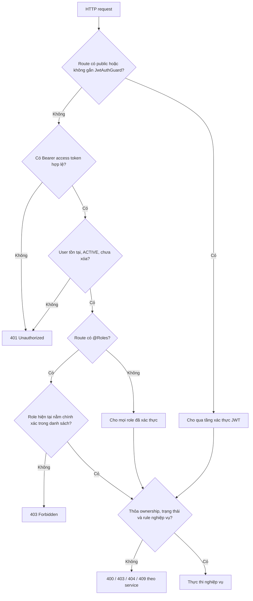

# MA TRẬN VAI TRÒ VÀ PHÂN QUYỀN

> Tài liệu mô tả quyền truy cập thực tế của backend Quản lý Blog dựa trên controller, `JwtAuthGuard`, `RolesGuard`, decorator `@Roles(...)` và các điều kiện nghiệp vụ trong service.

## 1. Thông tin tài liệu

| Thuộc tính | Giá trị |
|---|---|
| Dự án | Quản lý Blog |
| Backend | NestJS 11, TypeScript 5.7 |
| Cơ chế xác thực | JWT access token và refresh token theo session |
| Cơ chế phân quyền | RBAC khớp role chính xác kết hợp điều kiện tài nguyên/trạng thái |
| Base URL | `/api/v1` |
| Ngày rà soát source | 31/07/2026 |
| Tổng số role | 4 |
| Tổng số nhóm API | 5 |
| Tổng số endpoint | 83 |
| Nguồn đối chiếu | Controller, guard, decorator, service, DTO và Prisma schema |

Tài liệu phản ánh **quyền đang được source thực thi**. Tên namespace như `/admin`, `/user` hoặc `/moderator` không tự quyết định quyền; quyền cuối cùng phụ thuộc guard, decorator role và điều kiện trong service.

---

## 2. Mục tiêu

Tài liệu này được dùng để:

1. Đồng bộ quyền giữa backend, frontend và tài liệu API.
2. Xác định menu, màn hình và action mà từng role được phép sử dụng.
3. Viết test phân quyền và test truy cập trái phép.
4. Phát hiện route có quyền thực tế khác kỳ vọng nghiệp vụ.
5. Làm cơ sở khi mở rộng từ role cố định sang permission hoặc policy chi tiết.

---

## 3. Role hệ thống

| Role | Ý nghĩa | Trách nhiệm chính |
|---|---|---|
| `NORMAL` | Người dùng thông thường | Hồ sơ, follow, like, bookmark, comment, report và gửi yêu cầu trở thành Blog Owner |
| `BLOG_OWNER` | Tác giả/chủ blog | Toàn bộ khả năng người dùng được cho phép và quản lý bài viết của chính mình |
| `CONTENT_MODERATOR` | Kiểm duyệt viên nội dung | Duyệt bài, xử lý report, quản lý nhóm danh mục |
| `SUPER_ADMIN` | Quản trị viên cao nhất | Quản lý user, role, trạng thái tài khoản, ngôn ngữ và yêu cầu Blog Owner |

### 3.1. Trạng thái tài khoản

Role chỉ được xét sau khi tài khoản vượt qua kiểm tra của `JwtAuthGuard`:

- User phải tồn tại.
- `deletedAt` phải là `null`.
- `status` phải là `ACTIVE`.
- Access token phải đúng chữ ký và chưa hết hạn.

Tài khoản `LOCKED` hoặc đã soft-delete bị từ chối ở mọi route có `JwtAuthGuard`, bất kể role.

---

## 4. Mô hình quyết định quyền



### 4.1. `RolesGuard` khớp chính xác

Guard đang dùng:

```ts
return requiredRoles.includes(user.role as UserRole);
```

Vì vậy hệ thống **không có kế thừa role tự động**:

- `SUPER_ADMIN` không tự có quyền của `CONTENT_MODERATOR`.
- `SUPER_ADMIN` không tự có quyền của `BLOG_OWNER`.
- `CONTENT_MODERATOR` không tự có quyền của `NORMAL`.
- Muốn nhiều role truy cập, controller phải liệt kê đầy đủ trong `@Roles(...)`.

### 4.2. Bốn tầng kiểm soát

| Tầng | Thành phần | Kiểm tra |
|---|---|---|
| 1. Authentication | `JwtAuthGuard` | Token, user, trạng thái và soft delete |
| 2. Role | `RolesGuard` + `@Roles` | Role khớp chính xác |
| 3. Ownership | Service | Tài nguyên có thuộc user/owner hiện tại không |
| 4. Business state | Service + database | Trạng thái bài, request, report, target và ràng buộc đồng thời |

Do đó, có role đúng chưa chắc đã được phép thao tác một tài nguyên cụ thể.

---

## 5. Ký hiệu

| Ký hiệu | Ý nghĩa |
|---|---|
| ✅ | Được phép trực tiếp theo role/guard |
| — | Không được phép theo route hiện tại |
| `JWT` | Cần access token, không giới hạn role |
| `RT` | Không cần access token nhưng cần refresh token hợp lệ trong body |
| `SELF` | Chỉ dữ liệu của chính user từ JWT |
| `OWN` | Chỉ tài nguyên thuộc sở hữu của actor |
| `STATE` | Chỉ được thao tác khi tài nguyên ở trạng thái hợp lệ |

---

## 6. Ma trận năng lực tổng quát

| Năng lực | Guest | `NORMAL` | `BLOG_OWNER` | `CONTENT_MODERATOR` | `SUPER_ADMIN` | Ghi chú |
|---|:---:|:---:|:---:|:---:|:---:|---|
| Đọc nội dung public | ✅ | ✅ | ✅ | ✅ | ✅ | Không yêu cầu JWT |
| Đăng ký, đăng nhập, quên/reset mật khẩu | ✅ | ✅ | ✅ | ✅ | ✅ | Endpoint không kiểm tra role |
| Refresh token, logout một session | `RT` | `RT` | `RT` | `RT` | `RT` | Quyền dựa trên session/refresh token |
| Logout toàn bộ thiết bị | — | ✅ | ✅ | ✅ | ✅ | Route chỉ dùng `JwtAuthGuard` |
| Xem/sửa/xóa profile của chính mình | — | ✅ | ✅ | ✅ | ✅ | `SELF`; source cho phép mọi role có JWT |
| Follow, like, bookmark | — | ✅ | ✅ | ✅ | ✅ | Source cho phép mọi role có JWT |
| Comment và sửa/xóa comment của mình | — | ✅ | ✅ | — | — | Controller chỉ liệt kê NORMAL và BLOG_OWNER |
| Report bài/comment | — | ✅ | ✅ | — | — | Không report target của chính mình |
| Tạo/xem/hủy yêu cầu Blog Owner | — | ✅ | ✅* | — | — | BLOG_OWNER đi qua guard nhưng create bị service từ chối |
| Quản lý bài viết của chính mình | — | — | ✅ | — | — | `OWN` + `STATE` |
| Duyệt/từ chối bài | — | — | — | ✅ | — | SUPER_ADMIN không tự kế thừa quyền Moderator |
| Xử lý report | — | — | — | ✅ | — | Chỉ report PENDING mới xử lý được |
| Quản lý nhóm danh mục | — | — | — | ✅ | — | Namespace Moderator |
| Đọc dashboard Admin | — | — | — | — | ✅ | SUPER_ADMIN |
| Đọc ngôn ngữ Admin | — | — | — | — | ✅ | Tạo/sửa/xóa chỉ SUPER_ADMIN |
| Đọc và xử lý yêu cầu Blog Owner toàn hệ thống | — | — | — | - | ✅ | Source cho phép Moderator và Super Admin |
| Quản lý user, lock, role, tạo Moderator | — | — | — | — | ✅ | Có bảo vệ self-action và Super Admin |

`*` BLOG_OWNER được route cho phép truy cập nhóm request để xem lịch sử hoặc hủy request phù hợp, nhưng không thể tạo request mới vì đã có role BLOG_OWNER.

---

## 7. Phân bố endpoint theo quyền

| Quy tắc truy cập | Số endpoint |
|---|---:|
| Public thật sự, không JWT | 13 |
| Chỉ dùng refresh token, không access token | 2 |
| Mọi role đã xác thực | 17 |
| `NORMAL` hoặc `BLOG_OWNER` | 9 |
| Chỉ `BLOG_OWNER` | 12 |
| Chỉ `CONTENT_MODERATOR` | 14 |
| Chỉ `SUPER_ADMIN` | 11 |
| `SUPER_ADMIN` hoặc `CONTENT_MODERATOR` | 5 |
| **Tổng cộng** | **83** |

### 7.1. Phân bố theo module API

| Module | Endpoint | Quyền chủ đạo |
|---|---:|---|
| Public | 13 | Không JWT |
| User/Auth | 28 | Refresh token, JWT chung hoặc NORMAL/BLOG_OWNER |
| Blog Owner | 12 | BLOG_OWNER chính xác |
| Moderator | 14 | CONTENT_MODERATOR chính xác |
| Admin | 16 | SUPER_ADMIN; một số route chia sẻ CONTENT_MODERATOR |

---

## 8. Điều kiện quyền theo tài nguyên

### 8.1. Hồ sơ cá nhân

- User ID không nhận từ body hoặc query mà lấy từ JWT.
- Mọi role đang đăng nhập đều có thể xem, sửa, upload avatar hoặc xóa hồ sơ của chính mình.
- Không có endpoint để một user thường sửa hồ sơ người khác.

### 8.2. Follow

- Không được follow hoặc unfollow chính mình.
- Target khi follow phải ACTIVE và chưa soft-delete.
- Cặp `followerId/followingId` phải duy nhất.
- Danh sách follower/following lọc tài khoản đã khóa hoặc đã xóa.

### 8.3. Like và bookmark

- Chỉ áp dụng cho bài `PUBLISH`, chưa soft-delete.
- Dữ liệu tương tác luôn gắn user ID từ JWT.
- API hiện dùng upsert/deleteMany nên gọi lặp không tạo bản ghi trùng.

### 8.4. Comment

- Chỉ NORMAL hoặc BLOG_OWNER được tạo, sửa, xóa comment qua route User.
- Chỉ comment trên bài `PUBLISH`, chưa xóa.
- Chỉ chủ comment được sửa hoặc xóa comment.
- Reply phải tham chiếu comment cùng bài; hệ thống có giới hạn chống spam.

### 8.5. Report

- Chỉ NORMAL hoặc BLOG_OWNER được gửi report.
- Không được report bài viết hoặc comment của chính mình.
- Không được có nhiều report `PENDING` của cùng reporter cho cùng target.
- Target phải tồn tại; comment phải thuộc bài `PUBLISH`.

### 8.6. Yêu cầu Blog Owner

- Danh sách và chi tiết của User luôn bị ép theo user ID từ JWT.
- User không thể xem request của người khác, kể cả tự truyền `userId` trong query.
- Chỉ hủy được request của chính mình đang `PENDING`.
- User đã là BLOG_OWNER không thể tạo request mới.
- Khi request được APPROVED, role user đổi thành BLOG_OWNER và các session hiện có bị revoke.

### 8.7. Bài viết Blog Owner

- Mọi thao tác đọc riêng, sửa, xóa, upload media, submit và dịch đều kiểm tra `authorId === ownerId`.
- Bài `PENDING_REVIEW` không được sửa nội dung hoặc media.
- Chỉ bài `DRAFT` được submit.
- Sửa bài `REJECT` đưa bài về `DRAFT`; sửa bài `PUBLISH` đưa bài về `PENDING_REVIEW`.
- Bản dịch mới luôn là `DRAFT` và phải thuộc cùng owner.

### 8.8. Kiểm duyệt bài

- Moderator không được xem bài `DRAFT`.
- Chỉ `PENDING_REVIEW` mới được approve hoặc reject.
- Approve chuyển bài sang `PUBLISH`; reject chuyển sang `REJECT`.
- Transaction và update có điều kiện trạng thái chống hai Moderator xử lý đồng thời.

### 8.9. Xử lý report

- Chỉ report `PENDING` được resolve hoặc reject.
- Resolve report bài/comment có thể soft-delete target.
- Hệ thống xử lý các report PENDING cùng target để tránh hàng đợi lặp.
- Transaction và claim theo trạng thái chống xử lý đồng thời.

### 8.10. Quản trị user

SUPER_ADMIN có thêm các giới hạn:

- Không được khóa, đổi role hoặc xóa chính mình.
- Không được khóa hoặc mở khóa tài khoản SUPER_ADMIN.
- Không được đổi role hoặc xóa SUPER_ADMIN khác.
- Không được xóa SUPER_ADMIN cuối cùng.
- Khi khóa hoặc đổi role target, các session của target bị revoke.

---

## 9. Ma trận endpoint chi tiết

Các bảng dưới đây liệt kê toàn bộ 83 endpoint theo quyền thực tế trong controller và điều kiện quan trọng ở service.

### 9.1. Public API

| Method | Endpoint | Quy tắc truy cập | Điều kiện quyền chính |
|---|---|---|---|
| `GET` | `/api/v1/authors/top` | Public — không yêu cầu JWT | Chỉ dữ liệu công khai theo rule service; bài viết bị ép trạng thái PUBLISH. |
| `GET` | `/api/v1/authors/:id` | Public — không yêu cầu JWT | Chỉ dữ liệu công khai theo rule service; bài viết bị ép trạng thái PUBLISH. |
| `GET` | `/api/v1/categories` | Public — không yêu cầu JWT | Chỉ dữ liệu công khai theo rule service; bài viết bị ép trạng thái PUBLISH. |
| `GET` | `/api/v1/posts/:postId/comments` | Public — không yêu cầu JWT | Chỉ dữ liệu công khai theo rule service; bài viết bị ép trạng thái PUBLISH. |
| `GET` | `/api/v1/posts` | Public — không yêu cầu JWT | Chỉ dữ liệu công khai theo rule service; bài viết bị ép trạng thái PUBLISH. |
| `GET` | `/api/v1/posts/top` | Public — không yêu cầu JWT | Chỉ dữ liệu công khai theo rule service; bài viết bị ép trạng thái PUBLISH. |
| `GET` | `/api/v1/posts/:id` | Public — không yêu cầu JWT | Chỉ dữ liệu công khai theo rule service; bài viết bị ép trạng thái PUBLISH. |
| `GET` | `/api/v1/tags/top` | Public — không yêu cầu JWT | Chỉ dữ liệu công khai theo rule service; bài viết bị ép trạng thái PUBLISH. |
| `GET` | `/api/v1/tags` | Public — không yêu cầu JWT | Chỉ dữ liệu công khai theo rule service; bài viết bị ép trạng thái PUBLISH. |
| `POST` | `/api/v1/register` | Public — không yêu cầu JWT | DTO hợp lệ; username/email chưa tồn tại. |
| `POST` | `/api/v1/login` | Public — không yêu cầu JWT | Tài khoản tồn tại, chưa xóa, trạng thái ACTIVE và mật khẩu đúng. |
| `POST` | `/api/v1/forgot-password` | Public — không yêu cầu JWT | Không tiết lộ email có tồn tại hay không. |
| `POST` | `/api/v1/reset-password` | Public — không yêu cầu JWT | Reset token hợp lệ, chưa dùng, chưa hết hạn; thu hồi toàn bộ session. |

### 9.2. User và Auth API

| Method | Endpoint | Quy tắc truy cập | Điều kiện quyền chính |
|---|---|---|---|
| `POST` | `/api/v1/auth/refresh-token` | Không cần access token; bắt buộc `refreshToken` hợp lệ trong body | Session chưa revoke/hết hạn; User-Agent phải khớp phiên đăng nhập. |
| `POST` | `/api/v1/auth/logout` | Không cần access token; bắt buộc `refreshToken` hợp lệ trong body | Thu hồi đúng session tương ứng refresh token. |
| `POST` | `/api/v1/auth/logout-all` | Mọi role đang đăng nhập và còn `ACTIVE` | Thu hồi toàn bộ session của chính user từ JWT. |
| `POST` | `/api/v1/user/blog-owner-requests` | `NORMAL` hoặc `BLOG_OWNER` — khớp chính xác | NORMAL mới có ý nghĩa thực tế; BLOG_OWNER bị service từ chối; không được có request PENDING trùng. |
| `GET` | `/api/v1/user/blog-owner-requests` | `NORMAL` hoặc `BLOG_OWNER` — khớp chính xác | Service ép `userId` theo JWT; không xem được request của người khác. |
| `GET` | `/api/v1/user/blog-owner-requests/:id` | `NORMAL` hoặc `BLOG_OWNER` — khớp chính xác | Service ép `userId` theo JWT; không xem được request của người khác. |
| `DELETE` | `/api/v1/user/blog-owner-requests/:id` | `NORMAL` hoặc `BLOG_OWNER` — khớp chính xác | Chỉ request của chính user và đang PENDING. |
| `POST` | `/api/v1/user/posts/:postId/comments` | `NORMAL` hoặc `BLOG_OWNER` — khớp chính xác | Bài phải PUBLISH; giới hạn spam; reply phải thuộc cùng bài. |
| `PATCH` | `/api/v1/user/comments/:commentId` | `NORMAL` hoặc `BLOG_OWNER` — khớp chính xác | Chỉ chủ sở hữu comment được sửa/xóa; comment chưa soft-delete. |
| `DELETE` | `/api/v1/user/comments/:commentId` | `NORMAL` hoặc `BLOG_OWNER` — khớp chính xác | Chỉ chủ sở hữu comment được sửa/xóa; comment chưa soft-delete. |
| `GET` | `/api/v1/user/follow/followers` | Mọi role đang đăng nhập và còn `ACTIVE` | Danh sách chỉ gồm tài khoản ACTIVE, chưa soft-delete. |
| `GET` | `/api/v1/user/follow/following` | Mọi role đang đăng nhập và còn `ACTIVE` | Danh sách chỉ gồm tài khoản ACTIVE, chưa soft-delete. |
| `GET` | `/api/v1/user/follow/:id/followers` | Mọi role đang đăng nhập và còn `ACTIVE` | Danh sách chỉ gồm tài khoản ACTIVE, chưa soft-delete. |
| `GET` | `/api/v1/user/follow/:id/following` | Mọi role đang đăng nhập và còn `ACTIVE` | Danh sách chỉ gồm tài khoản ACTIVE, chưa soft-delete. |
| `POST` | `/api/v1/user/follow/:id` | Mọi role đang đăng nhập và còn `ACTIVE` | Không được follow/unfollow chính mình; target phải hợp lệ theo nghiệp vụ. |
| `DELETE` | `/api/v1/user/follow/:id` | Mọi role đang đăng nhập và còn `ACTIVE` | Không được follow/unfollow chính mình; target phải hợp lệ theo nghiệp vụ. |
| `GET` | `/api/v1/user/posts/bookmarks` | Mọi role đang đăng nhập và còn `ACTIVE` | Chỉ lấy tương tác của chính user; chỉ trả bài PUBLISH chưa xóa. |
| `GET` | `/api/v1/user/posts/likes` | Mọi role đang đăng nhập và còn `ACTIVE` | Chỉ lấy tương tác của chính user; chỉ trả bài PUBLISH chưa xóa. |
| `POST` | `/api/v1/user/posts/:id/bookmark` | Mọi role đang đăng nhập và còn `ACTIVE` | Bài phải PUBLISH và chưa xóa; thao tác gắn với user từ JWT. |
| `DELETE` | `/api/v1/user/posts/:id/bookmark` | Mọi role đang đăng nhập và còn `ACTIVE` | Bài phải PUBLISH và chưa xóa; thao tác gắn với user từ JWT. |
| `POST` | `/api/v1/user/posts/:id/like` | Mọi role đang đăng nhập và còn `ACTIVE` | Bài phải PUBLISH và chưa xóa; thao tác gắn với user từ JWT. |
| `DELETE` | `/api/v1/user/posts/:id/like` | Mọi role đang đăng nhập và còn `ACTIVE` | Bài phải PUBLISH và chưa xóa; thao tác gắn với user từ JWT. |
| `GET` | `/api/v1/user/profile` | Mọi role đang đăng nhập và còn `ACTIVE` | Chỉ tác động hồ sơ của user từ JWT; avatar phải là ảnh khi upload. |
| `PATCH` | `/api/v1/user/profile` | Mọi role đang đăng nhập và còn `ACTIVE` | Chỉ tác động hồ sơ của user từ JWT; avatar phải là ảnh khi upload. |
| `DELETE` | `/api/v1/user/profile` | Mọi role đang đăng nhập và còn `ACTIVE` | Chỉ tác động hồ sơ của user từ JWT; avatar phải là ảnh khi upload. |
| `POST` | `/api/v1/user/profile/avatar` | Mọi role đang đăng nhập và còn `ACTIVE` | Chỉ tác động hồ sơ của user từ JWT; avatar phải là ảnh khi upload. |
| `POST` | `/api/v1/user/posts/:postId/reports` | `NORMAL` hoặc `BLOG_OWNER` — khớp chính xác | Target phải còn tồn tại trên bài PUBLISH; không report nội dung của chính mình; không có report PENDING trùng. |
| `POST` | `/api/v1/user/comments/:commentId/reports` | `NORMAL` hoặc `BLOG_OWNER` — khớp chính xác | Bài phải PUBLISH; giới hạn spam; reply phải thuộc cùng bài. |

### 9.3. Blog Owner API

| Method | Endpoint | Quy tắc truy cập | Điều kiện quyền chính |
|---|---|---|---|
| `GET` | `/api/v1/blog-owner/dashboard` | `BLOG_OWNER` — khớp chính xác | Chỉ thống kê dữ liệu của chính Blog Owner. |
| `POST` | `/api/v1/blog-owner/posts/:postId/media` | `BLOG_OWNER` — khớp chính xác | Bài phải thuộc owner; bài PENDING_REVIEW không được sửa media. |
| `DELETE` | `/api/v1/blog-owner/posts/:postId/media/:mediaId` | `BLOG_OWNER` — khớp chính xác | Bài phải thuộc owner; bài PENDING_REVIEW không được sửa media. |
| `GET` | `/api/v1/blog-owner/options` | `BLOG_OWNER` — khớp chính xác | Đọc lựa chọn ngôn ngữ, danh mục, tag phục vụ soạn bài. |
| `GET` | `/api/v1/blog-owner/posts` | `BLOG_OWNER` — khớp chính xác | Danh sách bị giới hạn theo `authorId` từ JWT. |
| `GET` | `/api/v1/blog-owner/posts/:id` | `BLOG_OWNER` — khớp chính xác | Chỉ bài thuộc owner; PENDING_REVIEW không được chỉnh sửa. |
| `POST` | `/api/v1/blog-owner/posts` | `BLOG_OWNER` — khớp chính xác | Bài mới gắn `authorId` từ JWT và khởi tạo theo quy tắc service. |
| `PATCH` | `/api/v1/blog-owner/posts/:id` | `BLOG_OWNER` — khớp chính xác | Chỉ bài thuộc owner; PENDING_REVIEW không được chỉnh sửa. |
| `DELETE` | `/api/v1/blog-owner/posts/:id` | `BLOG_OWNER` — khớp chính xác | Chỉ bài thuộc owner; PENDING_REVIEW không được chỉnh sửa. |
| `POST` | `/api/v1/blog-owner/posts/:id/submit` | `BLOG_OWNER` — khớp chính xác | Bài phải thuộc owner và đang DRAFT. |
| `POST` | `/api/v1/blog-owner/posts/:id/translate-preview` | `BLOG_OWNER` — khớp chính xác | Bài nguồn phải thuộc owner; chỉ tạo bản xem trước, không lưu bài. |
| `POST` | `/api/v1/blog-owner/posts/:id/translations` | `BLOG_OWNER` — khớp chính xác | Bài nguồn phải thuộc owner; bản dịch mới là DRAFT; không trùng ngôn ngữ trong nhóm. |

### 9.4. Moderator API

| Method | Endpoint | Quy tắc truy cập | Điều kiện quyền chính |
|---|---|---|---|
| `GET` | `/api/v1/moderator/category-groups` | `CONTENT_MODERATOR` — khớp chính xác | Quản lý nhóm danh mục và bản dịch trong transaction. |
| `GET` | `/api/v1/moderator/category-groups/:groupId` | `CONTENT_MODERATOR` — khớp chính xác | Quản lý nhóm danh mục và bản dịch trong transaction. |
| `POST` | `/api/v1/moderator/category-groups` | `CONTENT_MODERATOR` — khớp chính xác | Quản lý nhóm danh mục và bản dịch trong transaction. |
| `PATCH` | `/api/v1/moderator/category-groups/:groupId` | `CONTENT_MODERATOR` — khớp chính xác | Quản lý nhóm danh mục và bản dịch trong transaction. |
| `DELETE` | `/api/v1/moderator/category-groups/:groupId` | `CONTENT_MODERATOR` — khớp chính xác | Không xóa khi nhóm đang được bài viết sử dụng; soft-delete group và translations. |
| `GET` | `/api/v1/moderator/dashboard` | `CONTENT_MODERATOR` — khớp chính xác | Áp dụng validation, trạng thái tài khoản và ràng buộc service tương ứng. |
| `GET` | `/api/v1/moderator/posts` | `CONTENT_MODERATOR` — khớp chính xác | Không xem DRAFT; chỉ PENDING_REVIEW, PUBLISH hoặc REJECT. |
| `GET` | `/api/v1/moderator/posts/:postId` | `CONTENT_MODERATOR` — khớp chính xác | Không xem DRAFT; chỉ PENDING_REVIEW, PUBLISH hoặc REJECT. |
| `POST` | `/api/v1/moderator/posts/:postId/approve` | `CONTENT_MODERATOR` — khớp chính xác | Chỉ xử lý bài PENDING_REVIEW; transaction chống hai moderator xử lý đồng thời. |
| `POST` | `/api/v1/moderator/posts/:postId/reject` | `CONTENT_MODERATOR` — khớp chính xác | Chỉ xử lý bài PENDING_REVIEW; transaction chống hai moderator xử lý đồng thời. |
| `GET` | `/api/v1/moderator/reports` | `CONTENT_MODERATOR` — khớp chính xác | Có thể xem report PENDING/RESOLVED/REJECTED theo bộ lọc. |
| `GET` | `/api/v1/moderator/reports/:reportId` | `CONTENT_MODERATOR` — khớp chính xác | Có thể xem report PENDING/RESOLVED/REJECTED theo bộ lọc. |
| `POST` | `/api/v1/moderator/reports/:reportId/resolve` | `CONTENT_MODERATOR` — khớp chính xác | Chỉ report PENDING; ẩn target và xử lý các report cùng target trong transaction. |
| `POST` | `/api/v1/moderator/reports/:reportId/reject` | `CONTENT_MODERATOR` — khớp chính xác | Chỉ report PENDING; transaction chống xử lý đồng thời. |

### 9.5. Admin API

| Method | Endpoint | Quy tắc truy cập | Điều kiện quyền chính |
|---|---|---|---|
| `GET` | `/api/v1/admin/dashboard` | `SUPER_ADMIN` — khớp chính xác | Source cho phép Super Admin. |
| `GET` | `/api/v1/admin/languages` | `SUPER_ADMIN` - khớp chính xác | Source cho phép Super Admin đọc. |
| `GET` | `/api/v1/admin/languages/:id` | `SUPER_ADMIN` — khớp chính xác | Source cho phép Super Admin đọc. |
| `POST` | `/api/v1/admin/languages` | `SUPER_ADMIN` — khớp chính xác | Chỉ Super Admin được tạo, sửa hoặc soft-delete ngôn ngữ. |
| `PATCH` | `/api/v1/admin/languages/:id` | `SUPER_ADMIN` — khớp chính xác | Chỉ Super Admin được tạo, sửa hoặc soft-delete ngôn ngữ. |
| `DELETE` | `/api/v1/admin/languages/:id` | `SUPER_ADMIN` — khớp chính xác | Chỉ Super Admin được tạo, sửa hoặc soft-delete ngôn ngữ. |
| `GET` | `/api/v1/admin/requests/blog-owner` | `SUPER_ADMIN` — khớp chính xác | Source cho phép Super Admin đọc toàn bộ request. |
| `PATCH` | `/api/v1/admin/requests/blog-owner/:id` | `SUPER_ADMIN` — khớp chính xác | Request phải PENDING; APPROVED đổi role thành BLOG_OWNER và revoke session. |
| `GET` | `/api/v1/admin/users` | `SUPER_ADMIN` — khớp chính xác | Chỉ Super Admin; dữ liệu target phải tồn tại. |
| `POST` | `/api/v1/admin/users/moderators` | `SUPER_ADMIN` — khớp chính xác | Tạo trực tiếp user role CONTENT_MODERATOR; username/email phải duy nhất. |
| `GET` | `/api/v1/admin/users/:id` | `SUPER_ADMIN` — khớp chính xác | Chỉ Super Admin; dữ liệu target phải tồn tại. |
| `PATCH` | `/api/v1/admin/users/:id` | `SUPER_ADMIN` — khớp chính xác | Chỉ Super Admin; dữ liệu target phải tồn tại. |
| `PATCH` | `/api/v1/admin/users/:id/lock` | `SUPER_ADMIN` — khớp chính xác | Không khóa chính mình hoặc Super Admin; revoke toàn bộ session target. |
| `PATCH` | `/api/v1/admin/users/:id/unlock` | `SUPER_ADMIN` — khớp chính xác | Không thao tác chính mình hoặc tài khoản Super Admin. |
| `PATCH` | `/api/v1/admin/users/:id/role` | `SUPER_ADMIN` — khớp chính xác | Không đổi role chính mình hoặc Super Admin khác; revoke session target. |
| `DELETE` | `/api/v1/admin/users/:id` | `SUPER_ADMIN` — khớp chính xác | Không xóa chính mình, Super Admin khác hoặc Super Admin cuối cùng. |

---

## 10. Sai lệch cần đặc biệt lưu ý


### 10.1. Super Admin không kế thừa quyền Moderator

Các route `/moderator/*` chỉ khai báo `CONTENT_MODERATOR`. SUPER_ADMIN sẽ nhận `403` nếu gọi trực tiếp dù tên role có vẻ cao hơn.

Nếu nghiệp vụ muốn Super Admin có toàn quyền, có hai lựa chọn:

1. Liệt kê `SUPER_ADMIN` trong từng `@Roles(...)` cần chia sẻ.
2. Thay `RolesGuard` bằng chính sách hierarchy rõ ràng và có test đầy đủ.

Không nên vừa dùng exact role ở một số nơi vừa ngầm kỳ vọng hierarchy ở nơi khác.

### 10.2. Route JWT chung cho phép cả Moderator và Admin dùng chức năng User

Các route chỉ dùng `JwtAuthGuard` mà không có `@Roles` cho phép cả bốn role, gồm:

- Profile cá nhân.
- Follow/unfollow.
- Like/bookmark.
- Xem danh sách bài đã like/bookmark.
- Logout toàn bộ thiết bị.

Đây là hành vi thực tế, dù module có tên `user`.

### 10.3. Comment và report loại trừ Moderator/Admin

Controller comment, report và yêu cầu Blog Owner liệt kê chính xác `NORMAL, BLOG_OWNER`. Moderator và Super Admin không thể dùng các route này bằng role hiện tại.

Cần xác nhận đây là chính sách sản phẩm hay chỉ là thiếu role trong decorator.

## 11. Hành vi lỗi phân quyền

| Trường hợp | HTTP dự kiến | Nguồn |
|---|---:|---|
| Thiếu access token ở route protected | `401` | `JwtAuthGuard` |
| Token sai hoặc hết hạn | `401` | JWT utility/guard |
| User không tồn tại hoặc đã xóa | `401` | `JwtAuthGuard` |
| User bị khóa | `401` | `JwtAuthGuard` |
| Role không nằm trong `@Roles` | `403` | `RolesGuard` |
| Không sở hữu tài nguyên | `403` hoặc `404` | Service; một số luồng cố ý ẩn tài nguyên |
| Trạng thái tài nguyên không hợp lệ | `400` | Service |
| Tài nguyên đã được actor khác xử lý | `409` hoặc `400` | Transaction/update có điều kiện |
| Tài nguyên không tồn tại | `404` | Domain exception |

Frontend không nên chỉ dựa vào `message`. Nên bổ sung mã lỗi ổn định trong tương lai.

---

## 12. Yêu cầu đối với frontend

1. Menu và route guard phía frontend phải dựa trên role hiện tại, nhưng backend vẫn là nguồn bảo vệ cuối cùng.
2. Không hiển thị menu Blog Owner cho SUPER_ADMIN nếu backend chưa cấp role đó.
3. Sau khi yêu cầu Blog Owner được duyệt hoặc Admin đổi role, frontend phải yêu cầu đăng nhập lại khi session bị revoke.
4. Với endpoint JWT chung, frontend có thể cho mọi role truy cập profile/follow/like/bookmark nếu sản phẩm chấp nhận chính sách hiện tại.
5. Không gửi `userId`, `authorId` hoặc `reviewedById` để cố chỉ định actor; backend phải lấy từ JWT.
6. Xử lý riêng `401`, `403`, `404` và `409` thay vì coi tất cả là lỗi chung.

---

## 13. Kiểm thử phân quyền tối thiểu

Mỗi endpoint protected cần có ít nhất các test sau:

- Không token → `401`.
- Token của tài khoản LOCKED → `401`.
- Token role không được phép → `403`.
- Token role đúng + tài nguyên hợp lệ → thành công.
- Token role đúng + tài nguyên người khác → bị từ chối.
- Token role đúng + trạng thái sai → `400`.
- Hai actor xử lý đồng thời bài/report/request → chỉ một actor thành công.

### 13.1. Test ma trận bắt buộc

| Nhóm | Test đặc biệt |
|---|---|
| Blog Owner | SUPER_ADMIN không truy cập được route owner nếu chỉ có role SUPER_ADMIN |
| Moderator | SUPER_ADMIN không truy cập được `/moderator/*` theo source hiện tại |
| User JWT chung | CONTENT_MODERATOR và SUPER_ADMIN truy cập được profile/follow/like/bookmark |
| User restricted | CONTENT_MODERATOR và SUPER_ADMIN bị chặn ở comment/report/request |
| Ownership | Hai BLOG_OWNER không sửa/xóa bài của nhau |
| Admin self-protection | Admin không lock/change-role/delete chính mình |

---
