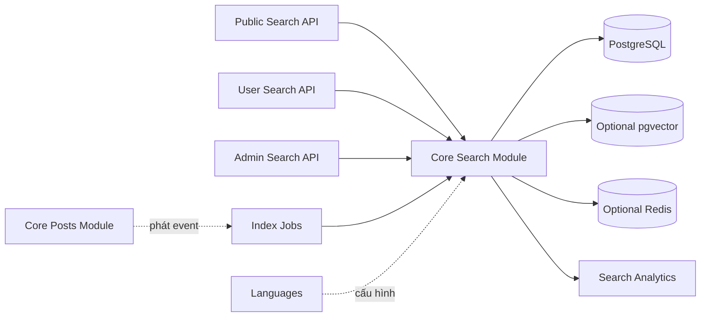
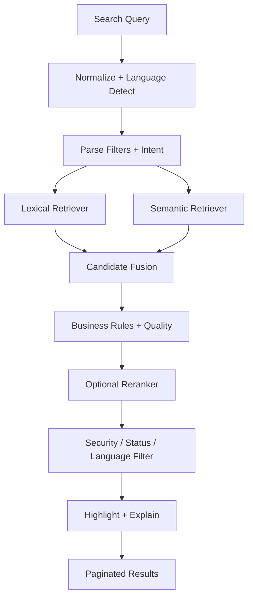

# SEARCH 2.0 ROADMAP — TF-IDF, BM25, SEMANTIC VÀ HYBRID SEARCH

> Lộ trình kỹ thuật cụ thể để nâng cấp chức năng tìm kiếm của dự án Quản lý Blog từ truy vấn `contains` trên tiêu đề lên hệ thống tìm kiếm đa ngôn ngữ có xếp hạng, đo lường, TF-IDF, BM25, semantic search và hybrid search.

---

## 1. Thông tin tài liệu

| Thuộc tính | Giá trị |
|---|---|
| Dự án | Quản lý Blog |
| Backend | NestJS 11, TypeScript, Prisma 7, PostgreSQL |
| Kiến trúc | Modular Monolith |
| Trạng thái hiện tại | Tìm bài theo `title contains`, không có relevance ranking |
| Phạm vi API hiện tại | Public, User, Blog Owner, Moderator, Admin |
| Ngôn ngữ | Đa ngôn ngữ qua `Language`, ưu tiên tiếng Việt và tiếng Anh |
| Người phụ trách backend đề xuất | --- |
| Tài liệu liên quan | `ARCHITECTURE.md`, `DATABASE_DOCUMENTATION.md`, `FUTURE_DEVELOPMENT_ROADMAP.md` |
| Trạng thái tài liệu | Kế hoạch phát triển, chưa phải mô tả tính năng đã hoàn thành |
| Ngày lập kế hoạch | 30/07/2026 |

---

## 2. Mục tiêu

Search 2.0 phải giải quyết đồng thời bốn mục tiêu:

1. **Đúng hơn:** kết quả phù hợp với ý định tìm kiếm, không chỉ chứa chuỗi trong tiêu đề.
2. **Nhanh hơn:** phản hồi ổn định khi số bài và lượt tìm kiếm tăng.
3. **Đo được:** có bộ dữ liệu đánh giá, metrics offline và online.
4. **Nâng cấp được:** chuyển từ TF-IDF sang BM25, semantic và hybrid mà không thay đổi API công khai.

### 2.1. Kết quả sản phẩm mong muốn

Người dùng có thể:

- Tìm theo tiêu đề, nội dung, tag, danh mục và tác giả.
- Tìm đúng khi từ khóa xuất hiện ở dạng viết khác, từ đồng nghĩa hoặc ngữ nghĩa gần.
- Lọc theo ngôn ngữ, danh mục, tag và tác giả.
- Sắp xếp theo độ liên quan, mới nhất hoặc phổ biến.
- Nhận gợi ý truy vấn.
- Xem đoạn nội dung khớp từ khóa.
- Nhận bài viết liên quan.
- Có trải nghiệm nhất quán giữa tiếng Việt và tiếng Anh.

### 2.2. Mục tiêu kỹ thuật ban đầu

| Chỉ số | Baseline cần đo | Mục tiêu Search 2.0 |
|---|---:|---:|
| `NDCG@10` | Tìm `contains` hiện tại | Tăng tối thiểu 15% ở TF-IDF |
| `MRR@10` | Tìm `contains` hiện tại | Tăng tối thiểu 10% |
| Zero-result rate | Chưa có số liệu | Dưới 10% |
| Search CTR | Chưa có số liệu | Trên 25% |
| P95 API search | Chưa benchmark | Dưới 300 ms với lexical |
| P95 hybrid | Chưa có | Dưới 500 ms ở giai đoạn đầu |
| Bài `PUBLISH` chưa index | Không có index | 0 sau thời gian đồng bộ cho phép |
| Job index lỗi | Không có | Dưới 1% |
| Search availability | Chưa đo | Tối thiểu 99,9% sau production hardening |

Các mục tiêu phải được hiệu chỉnh sau khi có dữ liệu thật. Không được tuyên bố thuật toán tốt hơn nếu chưa đo trên cùng bộ truy vấn.

---

## 3. Hiện trạng trong source

Core service hiện tạo điều kiện:

```ts
if (search) {
  where.title = {
    contains: search,
    mode: 'insensitive',
  };
}
```

Điều này có nghĩa:

- Chỉ tìm trên `Post.title`.
- Không tìm trên `content`.
- Không xét tag, category hoặc author.
- Không tính điểm liên quan.
- Không phân tích từ.
- Không loại stop word.
- Không có từ đồng nghĩa.
- Không có xử lý lỗi chính tả.
- Không có search analytics.
- Kết quả vẫn theo `orderBy` nghiệp vụ, mặc định là thời gian tạo giảm dần.

### 3.1. Những phần dữ liệu có thể tận dụng

Model hiện tại đã có:

- `Post.title`, `Post.content`.
- `Post.status`, `Post.publishedAt`, `Post.viewCount`.
- `Post.languageId`.
- `Post.author`.
- `PostTag`, `Tag`.
- `PostCategory`, `Category`, `CategoryGroup`.
- `PostLike`, `PostBookmark`, `Comment`.
- `PostDailyMetric`.
- `PostViewLog`.
- Quan hệ bài dịch bằng `parentPostId`.

Đây là nền tảng đủ để xây lexical search và business ranking mà chưa cần thêm search engine bên ngoài.

---

## 4. Nguyên tắc kiến trúc

### 4.1. Search là read model độc lập

Search không được nhúng trực tiếp vào `PostsService.findAll()`.

Tổ chức đề xuất:

```text
libs/core/src/modules/search/
├── search.module.ts
├── services/
│   ├── search.service.ts
│   ├── search-query.service.ts
│   ├── search-index.service.ts
│   ├── search-ranking.service.ts
│   ├── search-highlight.service.ts
│   ├── search-suggestion.service.ts
│   ├── related-posts.service.ts
│   └── search-evaluation.service.ts
├── lexical/
│   ├── text-normalizer.service.ts
│   ├── tokenizer.service.ts
│   ├── stopword.service.ts
│   ├── synonym.service.ts
│   ├── tf-idf.service.ts
│   └── bm25.service.ts
├── semantic/
│   ├── embedding-provider.interface.ts
│   ├── embedding-index.service.ts
│   ├── semantic-retriever.service.ts
│   └── semantic-reranker.service.ts
├── hybrid/
│   ├── reciprocal-rank-fusion.service.ts
│   └── hybrid-ranking.service.ts
├── jobs/
│   ├── search-index-worker.service.ts
│   ├── search-reindex.service.ts
│   └── search-index-reconciliation.service.ts
├── dto/
├── entities/
├── interfaces/
└── config/
```

API boundary:

```text
src/public/controllers/public-search.controller.ts
src/public/services/public-search.service.ts

src/user/controllers/user-search-history.controller.ts
src/user/services/user-search-history.service.ts

src/admin/controllers/admin-search.controller.ts
src/admin/services/admin-search.service.ts
```

### 4.2. Dependency direction



Domain Post không phụ thuộc ngược vào chi tiết TF-IDF, BM25 hoặc embedding. Post chỉ phát ra sự kiện thay đổi trạng thái/dữ liệu.

### 4.3. API ổn định, engine thay đổi được

Public contract không phụ thuộc vào thuật toán bên trong.

```text
SEARCH_ENGINE=CONTAINS
SEARCH_ENGINE=TFIDF
SEARCH_ENGINE=BM25
SEARCH_ENGINE=HYBRID
```

Có thể đổi engine bằng feature flag hoặc experiment assignment mà frontend không cần sửa.

---

## 5. Kiến trúc tổng thể Search 2.0



Trong từng giai đoạn:

| Giai đoạn | Lexical | Semantic | Fusion/Rerank |
|---|---|---|---|
| Baseline | `contains` | Không | Không |
| TF-IDF | Weighted TF-IDF | Không | Business score |
| BM25 | BM25/BM25F | Không | Business score |
| Semantic POC | BM25 | Dense embedding | RRF hoặc weighted fusion |
| Hybrid production | BM25 | Dense embedding | RRF + optional reranker |

---

# PHẦN I — NỀN TẢNG VÀ BASELINE

## 6. Giai đoạn 0 — Đo baseline và chốt contract

**Thời lượng đề xuất:** Tuần 1  
**Ưu tiên:** P0  
**Mục tiêu:** Không viết thuật toán mới trước khi biết baseline hiện tại tốt/xấu ở đâu.

### 6.1. Công việc

- `SEARCH-001`: Ghi lại API và hành vi search hiện tại.
- `SEARCH-002`: Tạo tập truy vấn đánh giá ban đầu.
- `SEARCH-003`: Gắn nhãn relevance thủ công.
- `SEARCH-004`: Benchmark latency `contains`.
- `SEARCH-005`: Đo zero-result rate nếu có log.
- `SEARCH-006`: Chốt response contract `/search/posts`.
- `SEARCH-007`: Chốt feature flag và fallback.
- `SEARCH-008`: Chốt privacy/retention cho search query log.

### 6.2. Bộ dữ liệu đánh giá ban đầu

Tối thiểu 150 truy vấn, mục tiêu 300–500 khi hệ thống có nhiều dữ liệu.

Phân nhóm:

| Nhóm | Ví dụ | Tỷ lệ đề xuất |
|---|---|---:|
| Exact title | `NestJS Prisma` | 15% |
| Keyword content | `transaction database` | 15% |
| Tag/category | `backend`, `AI` | 10% |
| Author | `backend_dev` | 5% |
| Tiếng Việt có dấu | `trí tuệ nhân tạo` | 10% |
| Tiếng Việt không dấu | `tri tue nhan tao` | 10% |
| English | `database indexing` | 10% |
| Synonym | `đăng nhập xã hội` ↔ `OAuth` | 10% |
| Typo | `Nestj`, `Prsima` | 5% |
| Long/natural query | `cách bảo mật refresh token` | 10% |

Mỗi query–post được gắn relevance:

```text
0 = Không liên quan
1 = Liên quan nhẹ
2 = Liên quan
3 = Rất liên quan / đúng ý định
```

### 6.3. Metrics offline

Tối thiểu:

- `NDCG@10`.
- `MRR@10`.
- `Recall@50`.
- `Precision@10`.
- Zero-result rate.
- Số query có kết quả đúng ở top 1/top 3.

### 6.4. API contract mục tiêu

```http
GET /api/v1/search/posts
```

Query:

| Field | Kiểu | Mặc định | Ghi chú |
|---|---|---:|---|
| `q` | string | Bắt buộc | 2–200 ký tự |
| `lang` | string | Theo middleware | Mã ngôn ngữ |
| `languageId` | integer | Không | Ưu tiên hơn `lang` |
| `categoryId` | integer | Không | Filter |
| `tagId` | integer | Không | Filter |
| `authorId` | integer | Không | Filter |
| `sort` | enum | `RELEVANCE` | `RELEVANCE`, `NEWEST`, `POPULAR` |
| `page` | integer | 1 | Giai đoạn đầu |
| `limit` | integer | 10 | Tối đa 50 |
| `engine` | string | Không public | Chỉ admin/debug nội bộ |

Response đề xuất:

```json
{
  "success": true,
  "statusCode": 200,
  "data": {
    "items": [
      {
        "id": 501,
        "title": "Hướng dẫn NestJS với Prisma",
        "thumbnailUrl": "https://...",
        "highlight": "...xây dựng REST API bằng NestJS và Prisma...",
        "matchedFields": ["title", "content", "tags"],
        "publishedAt": "2026-07-25T09:00:00.000Z",
        "author": {
          "id": 102,
          "username": "backend_dev"
        },
        "language": {
          "id": 1,
          "code": "vi"
        }
      }
    ],
    "meta": {
      "totalItems": 34,
      "itemCount": 10,
      "itemsPerPage": 10,
      "totalPages": 4,
      "currentPage": 1
    },
    "search": {
      "query": "nestjs prisma",
      "normalizedQuery": "nestjs prisma",
      "engine": "TFIDF",
      "tookMs": 42,
      "queryId": "01J..."
    }
  },
  "timestamp": "..."
}
```

Không nên public raw score như một contract lâu dài vì:

- Score khác thang giữa TF-IDF, BM25 và semantic.
- Frontend dễ phụ thuộc sai.
- Việc đổi engine sẽ khó.

Có thể trả `debugScore` chỉ trong môi trường development hoặc endpoint Admin có quyền.

### 6.5. Tiêu chí hoàn thành

- Có dataset đánh giá versioned.
- Có kết quả baseline lưu lại.
- Có API contract.
- Có feature flag:
  - `SEARCH_V2_ENABLED`.
  - `SEARCH_ENGINE`.
- Có fallback về search cũ.
- Có retention policy cho query log.

---

## 7. Giai đoạn 1 — Nền tảng text processing và indexing

**Thời lượng đề xuất:** Tuần 2–3  
**Ưu tiên:** P0/P1  
**Mục tiêu:** Xây pipeline dùng chung cho TF-IDF và BM25.

### 7.1. Text normalization

Pipeline:

1. Loại HTML an toàn.
2. Decode entity.
3. Unicode normalize.
4. Chuyển lowercase theo locale hợp lý.
5. Chuẩn hóa whitespace.
6. Tách punctuation.
7. Bảo toàn token kỹ thuật:
   - `C++`.
   - `C#`.
   - `.NET`.
   - `Node.js`.
   - `NestJS`.
   - `OAuth2`.
   - `PostgreSQL`.
8. Tùy chọn tạo bản không dấu cho tiếng Việt.
9. Không thay đổi dữ liệu gốc của bài viết.

Interface:

```ts
export interface NormalizedText {
  original: string;
  normalized: string;
  accentFolded?: string;
  tokens: string[];
  tokenCount: number;
}
```

### 7.2. Tokenizer theo ngôn ngữ

```ts
export interface SearchTokenizer {
  supports(languageCode: string): boolean;
  tokenize(text: string): Promise<string[]>;
}
```

Provider dự kiến:

```text
VietnameseTokenizer
EnglishTokenizer
FallbackTokenizer
```

Yêu cầu đối với tiếng Việt:

- Không chỉ `split(' ')`.
- Nhận diện từ nhiều âm tiết.
- Có test với từ kỹ thuật.
- Có khả năng tạo token không dấu phục vụ recall.
- Không nối sai quá nhiều cụm danh từ.

Yêu cầu đối với tiếng Anh:

- Tokenization ổn định.
- Có thể stemming/lemmatization sau khi benchmark.
- Không stem các token công nghệ một cách phá nghĩa.

### 7.3. Stop word và synonym

Thiết kế dữ liệu:

```prisma
model SearchStopword {
  id         Int      @id @default(autoincrement())
  languageId Int      @map("language_id")
  term       String
  isActive   Boolean  @default(true) @map("is_active")
  createdAt  DateTime @default(now()) @map("created_at")
  updatedAt  DateTime @updatedAt @map("updated_at")

  @@unique([languageId, term])
  @@index([languageId, isActive])
  @@map("search_stopwords")
}

model SearchSynonym {
  id            Int      @id @default(autoincrement())
  languageId    Int      @map("language_id")
  sourceTerm    String   @map("source_term")
  targetTerms   String[] @map("target_terms")
  expansionMode String   @default("QUERY") @map("expansion_mode")
  isActive      Boolean  @default(true) @map("is_active")
  createdAt     DateTime @default(now()) @map("created_at")
  updatedAt     DateTime @updatedAt @map("updated_at")

  @@unique([languageId, sourceTerm])
  @@index([languageId, isActive])
  @@map("search_synonyms")
}
```

Quy tắc:

- Synonym expansion mặc định ở query-time.
- Không mở rộng vô hạn.
- Có trọng số thấp hơn exact term.
- Có audit khi Admin chỉnh dictionary.
- Dictionary thay đổi phải làm tăng `searchConfigVersion`.

### 7.4. Search document

```prisma
model SearchDocument {
  postId             Int       @id @map("post_id")
  languageId         Int       @map("language_id")
  status             PostStatus
  titleText          String    @map("title_text") @db.Text
  contentText        String    @map("content_text") @db.Text
  tagText            String    @map("tag_text") @db.Text
  categoryText       String    @map("category_text") @db.Text
  authorText         String    @map("author_text") @db.Text
  normalizedDocument String    @map("normalized_document") @db.Text
  tokenCount         Int       @map("token_count")
  indexVersion       Int       @map("index_version")
  sourceUpdatedAt    DateTime  @map("source_updated_at")
  indexedAt          DateTime  @default(now()) @map("indexed_at")
  deletedAt          DateTime? @map("deleted_at")

  @@index([languageId, status])
  @@index([sourceUpdatedAt])
  @@index([indexVersion])
  @@map("search_documents")
}
```

Chỉ đưa vào index công khai khi:

```text
post.status = PUBLISH
post.deletedAt = null
language.isActive = true
author.deletedAt = null
author.status = ACTIVE
```

### 7.5. Trọng số field ban đầu

| Field | Weight ban đầu |
|---|---:|
| Title exact | 5.0 |
| Title normalized/no-accent | 4.0 |
| Tag | 3.5 |
| Category | 3.0 |
| Author username | 1.5 |
| Content heading nếu có | 1.5 |
| Content body | 1.0 |

Các trọng số được lưu trong config:

```json
{
  "version": 1,
  "title": 5.0,
  "titleFolded": 4.0,
  "tags": 3.5,
  "categories": 3.0,
  "author": 1.5,
  "content": 1.0
}
```

Không hard-code ở nhiều service.

### 7.6. Event indexing

Các sự kiện:

```text
POST_PUBLISHED
POST_PUBLISHED_UPDATED
POST_UNPUBLISHED
POST_REJECTED
POST_DELETED
POST_RESTORED
POST_TAGS_CHANGED
POST_CATEGORIES_CHANGED
POST_LANGUAGE_CHANGED
POST_TRANSLATION_CREATED
AUTHOR_UPDATED
AUTHOR_LOCKED
LANGUAGE_DEACTIVATED
SEARCH_CONFIG_CHANGED
```

### 7.7. Job table giai đoạn chưa có queue

```prisma
enum SearchIndexJobType {
  UPSERT_POST
  DELETE_POST
  REINDEX_LANGUAGE
  REINDEX_ALL
  REBUILD_STATISTICS
  BUILD_EMBEDDING
}

enum SearchIndexJobStatus {
  PENDING
  PROCESSING
  SUCCEEDED
  FAILED
  DEAD
}

model SearchIndexJob {
  id            BigInt               @id @default(autoincrement())
  jobType       SearchIndexJobType   @map("job_type")
  status        SearchIndexJobStatus @default(PENDING)
  postId        Int?                 @map("post_id")
  languageId    Int?                 @map("language_id")
  payload       Json?
  attemptCount  Int                  @default(0) @map("attempt_count")
  availableAt   DateTime             @default(now()) @map("available_at")
  lockedAt      DateTime?            @map("locked_at")
  lockedBy      String?              @map("locked_by")
  lastError     String?              @map("last_error") @db.Text
  createdAt     DateTime             @default(now()) @map("created_at")
  updatedAt     DateTime             @updatedAt @map("updated_at")
  completedAt   DateTime?            @map("completed_at")

  @@index([status, availableAt])
  @@index([postId, status])
  @@map("search_index_jobs")
}
```

Giai đoạn đầu có thể xử lý bằng `@nestjs/schedule`. Khi tải tăng, thay worker bằng queue mà không thay đổi search domain contract.

### 7.8. Reconciliation job

Chạy định kỳ để tìm:

- Bài `PUBLISH` chưa có `SearchDocument`.
- `sourceUpdatedAt < post.updatedAt`.
- Search document còn tồn tại nhưng post không còn public.
- Index version cũ.
- Embedding version cũ.

### 7.9. Tiêu chí hoàn thành

- Unit test normalizer/tokenizer.
- Index một bài tạo đúng document.
- Update post cập nhật index.
- Unpublish/delete loại khỏi public search.
- Reindex idempotent.
- Job retry có giới hạn và dead-letter state.
- Không làm request publish chậm đáng kể.
- Không có bài public bị thiếu index sau reconciliation.

---

# PHẦN II — TF-IDF

## 8. Giai đoạn 2 — Weighted TF-IDF MVP

**Thời lượng đề xuất:** Tuần 4–6  
**Ưu tiên:** P1  
**Mục tiêu:** Có relevance ranking thực sự, hỗ trợ đa trường và đa ngôn ngữ.

### 8.1. Công thức

Term frequency có thể dùng dạng log-normalized:

```text
TF(t,d) =
  0                           nếu count(t,d) = 0
  1 + ln(count(t,d))          nếu count(t,d) > 0
```

Inverse document frequency có smoothing:

```text
IDF(t) = ln((N + 1) / (df(t) + 1)) + 1
```

TF-IDF:

```text
TFIDF(t,d) = TF(t,d) × IDF(t)
```

Cosine similarity:

```text
cosine(q,d) =
  dot(vector(q), vector(d))
  --------------------------------
  norm(vector(q)) × norm(vector(d))
```

### 8.2. Weighted field score

Không nên nối text rồi coi mọi field như nhau.

```text
lexicalScore =
    5.0 × titleExactScore
  + 4.0 × titleNormalizedScore
  + 3.5 × tagScore
  + 3.0 × categoryScore
  + 1.5 × authorScore
  + 1.0 × contentScore
```

Sau đó normalize về khoảng ổn định trước khi kết hợp business score.

### 8.3. Schema postings

```prisma
model SearchTerm {
  id             BigInt   @id @default(autoincrement())
  languageId     Int      @map("language_id")
  term           String
  documentFreq   Int      @default(0) @map("document_freq")
  idf            Float    @default(0)
  statisticsVersion Int   @default(1) @map("statistics_version")
  updatedAt      DateTime @updatedAt @map("updated_at")

  @@unique([languageId, term])
  @@index([languageId, documentFreq])
  @@map("search_terms")
}

model PostSearchTerm {
  postId         Int    @map("post_id")
  termId         BigInt @map("term_id")
  titleTf        Float  @default(0) @map("title_tf")
  tagTf          Float  @default(0) @map("tag_tf")
  categoryTf     Float  @default(0) @map("category_tf")
  authorTf       Float  @default(0) @map("author_tf")
  contentTf      Float  @default(0) @map("content_tf")
  weightedTfIdf  Float  @default(0) @map("weighted_tf_idf")

  @@id([postId, termId])
  @@index([termId, weightedTfIdf])
  @@index([postId])
  @@map("post_search_terms")
}
```

### 8.4. Cập nhật document frequency

Vấn đề của TF-IDF là IDF phụ thuộc toàn corpus.

Không tính lại toàn bộ IDF trong request publish.

Chiến lược:

1. Index term frequency của bài.
2. Cập nhật document frequency delta.
3. Đánh dấu statistics version mới.
4. Job định kỳ tính lại IDF theo ngôn ngữ.
5. Có full rebuild khi tokenizer/stopword thay đổi.
6. Query sử dụng phiên bản thống kê nhất quán.

### 8.5. Candidate retrieval

Không load toàn bộ vector bài vào Node.js.

Query flow:

1. Normalize query.
2. Lấy các `SearchTerm` ứng với query token.
3. Truy vấn postings của các term.
4. Aggregate score theo `postId`.
5. Chọn top K candidate, ví dụ 200.
6. Join `Post` để lọc trạng thái và filters.
7. Tính business score.
8. Lấy top page.

Prisma có thể dùng `$queryRaw` có parameter binding cho aggregate query phức tạp. Không nối chuỗi SQL từ query của người dùng.

### 8.6. Business ranking

Lexical relevance phải là tín hiệu chính.

```text
finalScore =
    0.75 × lexicalNormalized
  + 0.10 × freshnessNormalized
  + 0.10 × popularityNormalized
  + 0.05 × authorQualityNormalized
```

Popularity không được dùng raw count trực tiếp. Có thể áp dụng:

```text
popularity =
    ln(1 + views)
  + 2.0 × ln(1 + likes)
  + 2.5 × ln(1 + bookmarks)
  + 1.5 × ln(1 + comments)
```

Freshness decay:

```text
freshness = exp(-ageInDays / halfLife)
```

`halfLife` phải là config và khác nhau theo sort mode nếu cần.

### 8.7. Nguyên tắc chống “business score lấn relevance”

- Nếu query exact match title, bài đó không được tụt vì bài khác có nhiều view.
- Business score được cap.
- Report/quality penalty không được làm lộ bài không public.
- `sort=NEWEST` và `sort=POPULAR` là mode riêng, không giả làm relevance.
- Có test regression cho exact query.

### 8.8. Highlight

Highlight không dùng regex chưa escape từ user.

Pipeline:

1. Lấy field khớp tốt nhất.
2. Chọn đoạn quanh token.
3. Escape HTML.
4. Chèn marker an toàn hoặc trả offset.
5. Giới hạn độ dài.

Response có thể trả:

```json
{
  "highlight": "...xây dựng <mark>REST API</mark> bằng NestJS...",
  "matchedFields": ["title", "content"]
}
```

Nếu frontend render HTML, phải sử dụng sanitizer. Phương án an toàn hơn là trả:

```json
{
  "text": "...xây dựng REST API bằng NestJS...",
  "matches": [
    { "start": 13, "end": 21 }
  ]
}
```

### 8.9. Suggestion MVP

Nguồn suggestion:

- Search query phổ biến đã qua privacy filter.
- Title bài `PUBLISH`.
- Tag.
- Category.
- Author username.

Không đưa query hiếm của một người vào suggestion công khai.

### 8.10. Admin API

```http
GET  /api/v1/admin/search/status
GET  /api/v1/admin/search/metrics
POST /api/v1/admin/search/reindex
POST /api/v1/admin/search/reindex/:postId
GET  /api/v1/admin/search/jobs
POST /api/v1/admin/search/jobs/:id/retry
GET  /api/v1/admin/search/config
PATCH /api/v1/admin/search/config
```

### 8.11. Search analytics

```prisma
model SearchQueryLog {
  id               String   @id @default(uuid())
  userId           Int?     @map("user_id")
  sessionKeyHash   String?  @map("session_key_hash")
  queryText        String?  @map("query_text") @db.Text
  normalizedQuery  String   @map("normalized_query") @db.Text
  queryHash        String   @map("query_hash")
  languageId       Int?     @map("language_id")
  engine           String
  resultCount      Int      @map("result_count")
  tookMs           Int      @map("took_ms")
  experimentKey    String?  @map("experiment_key")
  createdAt        DateTime @default(now()) @map("created_at")

  @@index([createdAt])
  @@index([queryHash, createdAt])
  @@index([engine, createdAt])
  @@map("search_query_logs")
}

model SearchResultClick {
  id          BigInt   @id @default(autoincrement())
  queryId     String   @map("query_id")
  userId      Int?     @map("user_id")
  postId      Int      @map("post_id")
  position    Int
  clickedAt   DateTime @default(now()) @map("clicked_at")
  dwellTimeMs Int?     @map("dwell_time_ms")

  @@index([queryId])
  @@index([postId, clickedAt])
  @@map("search_result_clicks")
}
```

Privacy:

- Có retention, ví dụ 30–90 ngày cho raw query.
- Có thể giữ aggregate lâu hơn.
- Không log token/credential.
- Mask hoặc bỏ query nhạy cảm.
- User có thể xóa search history cá nhân.
- Public trending chỉ dùng query đạt ngưỡng tối thiểu.

### 8.12. Gate chuyển giai đoạn

Chỉ đưa TF-IDF production nếu:

- `NDCG@10` tăng ít nhất 15% so với baseline.
- `MRR@10` không giảm.
- Exact-title slice không regression.
- Tiếng Việt không dấu có cải thiện.
- P95 dưới 300 ms ở dữ liệu benchmark.
- Index reconciliation đạt.
- Có fallback.
- Có dashboard lỗi/job.

---

## 9. Giai đoạn 3 — Production hardening cho TF-IDF

**Thời lượng đề xuất:** Tuần 7  
**Mục tiêu:** Biến MVP thành hệ thống vận hành được.

### 9.1. Công việc

- `SEARCH-030`: Query plan review.
- `SEARCH-031`: Index database.
- `SEARCH-032`: Cache IDF/dictionary.
- `SEARCH-033`: Cache query phổ biến.
- `SEARCH-034`: Timeout và circuit breaker nội bộ.
- `SEARCH-035`: Reconciliation.
- `SEARCH-036`: Job dead-letter.
- `SEARCH-037`: Rate limit.
- `SEARCH-038`: Dashboard.
- `SEARCH-039`: Rollback/fallback.
- `SEARCH-040`: Load test.

### 9.2. Cache

Cache candidates:

- Stopwords theo ngôn ngữ.
- Synonym dictionary.
- Search config.
- IDF của term phổ biến.
- Suggestion.
- Trending.
- Query result trang đầu với TTL ngắn.

Invalidation:

- Post publish/unpublish.
- Search config version.
- Dictionary version.
- Reindex complete.

Không cache response chứa search history cá nhân bằng public key.

### 9.3. Rollout

```text
Shadow mode
   ↓
Internal users
   ↓
5% traffic
   ↓
25% traffic
   ↓
50% traffic
   ↓
100% traffic
```

Shadow mode:

- User vẫn nhận kết quả baseline.
- Backend chạy TF-IDF trong giới hạn sampling.
- Lưu metrics so sánh.
- Không ảnh hưởng UX.

### 9.4. Fallback

Nếu TF-IDF lỗi:

1. Log error có correlation ID.
2. Tăng metric fallback.
3. Fallback PostgreSQL search/contains.
4. Không trả 500 nếu fallback còn hoạt động.
5. Alert khi fallback rate vượt ngưỡng.

---

# PHẦN III — BM25

## 10. Giai đoạn 4 — BM25/BM25F

**Thời lượng đề xuất:** Tuần 8–10  
**Ưu tiên:** P2, chỉ bắt đầu sau TF-IDF production  
**Mục tiêu:** Cải thiện ranking query thực tế, đặc biệt với bài dài.

### 10.1. Lý do chuyển sang BM25

TF-IDF có các hạn chế:

- Term frequency tăng gần tuyến tính nếu không tự điều chỉnh.
- Bài dài có thể có lợi thế không hợp lý.
- Cần thiết kế normalization riêng.
- Field-aware ranking phức tạp hơn.

BM25 thêm:

- Term-frequency saturation.
- Document-length normalization.
- Tham số điều chỉnh rõ.

### 10.2. Công thức BM25

```text
score(D,Q) =
  Σ IDF(qi) ×
  [ f(qi,D) × (k1 + 1) ]
  -----------------------------------------
  [ f(qi,D) + k1 × (1 - b + b × |D|/avgdl) ]
```

Tham số khởi điểm để benchmark, không phải giá trị cố định:

```text
k1 = 1.2
b  = 0.75
```

### 10.3. BM25F cho nhiều field

Dự án có nhiều field với độ quan trọng khác nhau. Có thể dùng BM25F-style:

```text
weightedFrequency(term, doc) =
    w_title    × normalizedTf(title)
  + w_tags     × normalizedTf(tags)
  + w_category × normalizedTf(categories)
  + w_author   × normalizedTf(author)
  + w_content  × normalizedTf(content)
```

Mỗi field có:

- Weight.
- Length normalization riêng.
- Average field length riêng.

### 10.4. Không nhầm `ts_rank` với BM25

PostgreSQL full-text search có `tsvector`, `tsquery`, `ts_rank` và `ts_rank_cd`, rất hữu ích làm lexical baseline/index. Tuy nhiên built-in ranking không nên được gọi là BM25 nếu hệ thống không thực sự triển khai công thức BM25.

Các phương án:

#### Phương án A — BM25 custom trong PostgreSQL

Phù hợp khi:

- Corpus nhỏ/trung bình.
- Muốn kiểm soát thuật toán.
- Chấp nhận SQL và bảng postings riêng.
- Team có khả năng benchmark/query tuning.

#### Phương án B — PostgreSQL FTS làm lexical production

Phù hợp khi:

- Muốn đơn giản vận hành.
- Chất lượng `ts_rank` đủ tốt.
- Không bắt buộc đúng BM25.
- Muốn dùng GIN index.

Tên engine phải phản ánh đúng:

```text
POSTGRES_FTS
```

không gắn nhãn `BM25`.

#### Phương án C — Search engine hỗ trợ BM25

Chỉ cân nhắc khi:

- Corpus/query traffic vượt khả năng PostgreSQL.
- Cần analyzer, typo, phrase, highlighting và distributed search nâng cao.
- Đã có người vận hành cluster.
- Benchmark chứng minh lợi ích.

Không đưa Elasticsearch/OpenSearch vào chỉ để “có BM25”.

### 10.5. Tuning

Grid nhỏ:

```text
k1 ∈ {0.8, 1.2, 1.6, 2.0}
b  ∈ {0.25, 0.5, 0.75, 1.0}
```

Field weights cũng cần tune trên validation set.

Không tune và báo cáo trên cùng một tập query duy nhất. Chia:

- Train/tuning.
- Validation.
- Holdout test.

### 10.6. Query behavior

Cần hỗ trợ:

- AND/OR hợp lý.
- Phrase boost.
- Exact title boost.
- Prefix cho suggestion, không lạm dụng ở main search.
- Query synonym.
- No-accent Vietnamese.
- Filter trước hoặc trong candidate retrieval.
- Không cho syntax search tùy ý gây query quá đắt.

### 10.7. Gate chuyển từ TF-IDF sang BM25

BM25 chỉ được chọn mặc định nếu:

- `NDCG@10` tăng tối thiểu 5% so với TF-IDF.
- `MRR@10` tăng hoặc không giảm đáng kể.
- Exact match không regression.
- Query dài và bài dài cải thiện.
- Latency không vượt SLO.
- Chi phí vận hành chấp nhận được.
- Có thể rollback về TF-IDF.

Nếu BM25 không thắng rõ, giữ TF-IDF và dùng BM25 cho experiment tiếp.

---

# PHẦN IV — SEMANTIC SEARCH

## 11. Giai đoạn 5 — Semantic Search POC

**Thời lượng đề xuất:** Tuần 11–13  
**Ưu tiên:** P3/Research  
**Mục tiêu:** Chứng minh semantic retrieval giải quyết query mà lexical search bỏ sót.

### 11.1. Use case phù hợp

Semantic search có giá trị với:

- Từ đồng nghĩa không có trong dictionary.
- Câu hỏi tự nhiên.
- Query và bài dùng cách diễn đạt khác.
- Khái niệm gần nghĩa.
- Query đa ngôn ngữ nếu model hỗ trợ tốt.

Ví dụ:

```text
Query: "làm sao giữ đăng nhập nhiều thiết bị an toàn"
Bài:   "Quản lý refresh token theo session"
```

Lexical có thể ít token trùng; semantic có thể tìm được.

### 11.2. Không dùng semantic thay lexical hoàn toàn

Semantic có thể yếu ở:

- Tên class/library chính xác.
- Mã lỗi.
- Từ khóa hiếm.
- Version.
- Exact phrase.
- Username/tag.
- Số hoặc identifier.

Do đó semantic nên bắt đầu ở dạng candidate source bổ sung, không thay BM25.

### 11.3. Embedding document

Không nhất thiết embedding toàn bộ bài dài trong một vector.

Thiết kế:

1. Vector mức bài:
   - Title.
   - Tag/category.
   - Summary hoặc phần đầu.
2. Vector theo chunk:
   - Chia content thành đoạn.
   - Bảo toàn heading.
   - Có overlap nhỏ.
3. Lưu model/version.
4. Khi model đổi, re-embed theo background job.

Schema đề xuất khi dùng pgvector:

```prisma
model PostEmbedding {
  id             BigInt   @id @default(autoincrement())
  postId         Int      @map("post_id")
  languageId     Int      @map("language_id")
  chunkIndex     Int      @map("chunk_index")
  chunkText      String   @map("chunk_text") @db.Text
  embeddingModel String   @map("embedding_model")
  embeddingVersion Int    @map("embedding_version")
  contentHash    String   @map("content_hash")
  tokenCount     Int      @map("token_count")
  createdAt      DateTime @default(now()) @map("created_at")
  updatedAt      DateTime @updatedAt @map("updated_at")

  // Cột vector thường được thêm bằng migration SQL và truy vấn raw SQL
  @@unique([postId, chunkIndex, embeddingVersion])
  @@index([postId])
  @@index([languageId, embeddingVersion])
  @@map("post_embeddings")
}
```

Prisma support cho kiểu extension cần kiểm tra theo cách migration hiện tại; có thể quản lý cột vector bằng SQL migration và `$queryRaw`.

### 11.4. Chọn embedding model

Tiêu chí, không chọn chỉ theo leaderboard:

- Hỗ trợ tiếng Việt và tiếng Anh.
- Search query/document retrieval.
- Kích thước vector.
- Latency.
- Chi phí.
- Khả năng chạy local hoặc external API.
- License.
- Data privacy.
- Versioning.
- Chất lượng trên corpus Blog thực tế.

Benchmark tối thiểu 2–3 model trên semantic query slice.

### 11.5. Embedding provider abstraction

```ts
export interface EmbeddingProvider {
  readonly modelId: string;
  readonly dimensions: number;

  embedQuery(text: string): Promise<number[]>;
  embedDocuments(texts: string[]): Promise<number[][]>;
}
```

Implementations có thể là:

```text
LocalEmbeddingProvider
ExternalEmbeddingApiProvider
```

Search domain không phụ thuộc trực tiếp vào một vendor.

### 11.6. Index vector

Giai đoạn POC:

- Exact nearest-neighbor nếu corpus nhỏ.
- Chỉ chuyển ANN index khi benchmark cần.
- Filter `languageId`, publish status và version.
- Không embedding bài draft/rejected vào public index trừ khi có index nội bộ tách biệt.

### 11.7. POC metrics

Tạo semantic slice:

- Query paraphrase.
- Synonym.
- Natural question.
- Vietnamese/English cross-expression.
- Query ít exact overlap.

Semantic retriever phải:

- Cải thiện Recall@50 trên semantic slice.
- Không được dùng làm default nếu overall NDCG giảm.
- Có latency/cost report.
- Có failure/fallback khi embedding provider lỗi.

### 11.8. Privacy

Nếu dùng external embedding API:

- Không gửi nội dung draft/private nếu chưa có policy.
- Không gửi dữ liệu user/query nhạy cảm không cần thiết.
- Có data processing review.
- Có timeout và retry.
- Không log request body đầy đủ.
- Có provider outage fallback.

---

# PHẦN V — HYBRID SEARCH

## 12. Giai đoạn 6 — Hybrid Retrieval

**Thời lượng đề xuất:** Tuần 14–15  
**Ưu tiên:** P3  
**Mục tiêu:** Kết hợp sức mạnh lexical và semantic.

### 12.1. Candidate generation

```text
BM25 top 100
       +
Semantic top 100
       ↓
Deduplicate by postId
       ↓
Fusion
       ↓
Business rules
       ↓
Optional rerank top 20–50
```

### 12.2. Reciprocal Rank Fusion

RRF tránh phải ép score của BM25 và cosine về cùng thang.

```text
RRF(d) = Σ 1 / (k + rank_i(d))
```

Trong đó:

- `rank_i(d)` là thứ hạng của document ở mỗi retriever.
- `k` là hằng số làm mượt cần benchmark.
- Document xuất hiện ở cả lexical và semantic được lợi.

RRF là lựa chọn mặc định đề xuất cho hybrid MVP.

### 12.3. Weighted fusion

Có thể thử:

```text
hybridScore =
    α × lexicalNormalized
  + β × semanticNormalized
  + γ × businessNormalized
```

Nhưng cần:

- Calibrate score.
- Kiểm tra distribution theo query.
- Version config.
- Không dùng min-max trên candidate quá nhỏ mà không đánh giá.

Weighted fusion chỉ nên dùng khi thắng RRF trên holdout set.

### 12.4. Business reranking

Sau fusion:

- Chỉ `PUBLISH`.
- `deletedAt = null`.
- Language phù hợp.
- Author ACTIVE.
- Report/quality penalty.
- Freshness/popularity có cap.
- Diversity theo author/tag.
- Không trả hai bản dịch của cùng một bài nếu UX chỉ cần một kết quả.

### 12.5. Cross-encoder reranking — tùy chọn

Luồng:

```text
Hybrid top 50
      ↓
Cross-encoder query-document scoring
      ↓
Top 10–20
```

Chỉ dùng khi:

- Hybrid retrieval đã ổn định.
- Có budget latency.
- Có model phù hợp tiếng Việt.
- Chứng minh tăng NDCG.
- Có fallback bỏ reranker khi timeout.

Không đưa cross-encoder vào request path trước khi có benchmark.

### 12.6. Explainability

Admin debug endpoint có thể trả:

```json
{
  "postId": 501,
  "lexicalRank": 2,
  "semanticRank": 5,
  "rrfScore": 0.0315,
  "businessSignals": {
    "freshness": 0.72,
    "popularity": 0.61
  },
  "matchedTerms": ["nestjs", "prisma"],
  "engineVersion": "hybrid-v2"
}
```

Public API không cần lộ toàn bộ scoring internals.

### 12.7. Gate production

Hybrid chỉ làm default nếu:

- Overall `NDCG@10` tăng tối thiểu 3–5% so với BM25.
- Semantic slice tăng rõ.
- Exact/identifier slice không regression.
- P95 đạt SLO.
- Chi phí embedding/query đáp ứng ngân sách.
- Fallback lexical hoạt động.
- Có monitor model/version.

---

# PHẦN VI — TÌM KIẾM LIÊN QUAN VÀ GỢI Ý

## 13. Related posts

TF-IDF document vectors có thể dùng sớm cho related posts.

```http
GET /api/v1/posts/:id/related?limit=6
```

TF-IDF phase:

```text
relatedScore =
    0.65 × contentCosine
  + 0.15 × sharedTag
  + 0.10 × sharedCategory
  + 0.10 × freshnessQuality
```

Semantic phase:

```text
relatedScore =
    0.50 × embeddingSimilarity
  + 0.25 × lexicalSimilarity
  + 0.15 × taxonomySimilarity
  + 0.10 × quality
```

Diversity:

- Tối đa N bài cùng author.
- Hạn chế duplicate translation family.
- Trộn tag/category.
- Không trả bài hiện tại.
- Chỉ public content.

Cache related posts theo `postId:indexVersion`.

---

## 14. Search suggestions

```http
GET /api/v1/search/suggestions?q=nes&lang=vi
```

Nguồn và thứ tự:

1. Exact prefix title.
2. Tag.
3. Category.
4. Popular safe query.
5. Author.

Không dùng semantic embedding cho prefix suggestion giai đoạn đầu vì không cần thiết và tốn chi phí.

---

## 15. Typo tolerance

Triển khai sau TF-IDF/BM25, không làm trước lexical baseline.

Giai đoạn:

1. Accent folding tiếng Việt.
2. Prefix cho suggestion.
3. Trigram/fuzzy candidate.
4. Spell correction dictionary.
5. Query rewrite có confidence threshold.

Không tự sửa query kỹ thuật hiếm nếu confidence thấp.

Response có thể trả:

```json
{
  "originalQuery": "prsima",
  "correctedQuery": "prisma",
  "didYouMean": true
}
```

---

# PHẦN VII — DATABASE VÀ MIGRATION

## 16. Thứ tự migration

### Migration A — Core search

- `search_documents`.
- `search_stopwords`.
- `search_synonyms`.
- `search_index_jobs`.
- `search_query_logs`.
- `search_result_clicks`.
- Search config/version.

### Migration B — TF-IDF

- `search_terms`.
- `post_search_terms`.
- Các index aggregate.

### Migration C — Ranking metrics nếu chưa có read model đủ

- `post_ranking_metrics`.
- Backfill từ Post/Like/Bookmark/Comment.

### Migration D — Semantic

- Cài vector extension nếu chọn pgvector.
- `post_embeddings`.
- Vector indexes sau benchmark.

### 16.1. Nguyên tắc

- Migration additive.
- Feature flag mặc định off.
- Backfill bằng job, không khóa request lâu.
- Có checkpoint/resume.
- Có verification count.
- Không drop search cũ trong giai đoạn rollout.
- Có rollback ở application level.

---

## 17. Index database đề xuất

Ví dụ:

```sql
CREATE INDEX CONCURRENTLY idx_search_documents_public_language
ON search_documents (language_id, indexed_at DESC)
WHERE status = 'PUBLISH' AND deleted_at IS NULL;
```

```sql
CREATE INDEX CONCURRENTLY idx_search_index_jobs_poll
ON search_index_jobs (available_at, id)
WHERE status = 'PENDING';
```

```sql
CREATE INDEX CONCURRENTLY idx_search_query_logs_time_engine
ON search_query_logs (created_at DESC, engine);
```

Index thực tế phải dựa trên `EXPLAIN (ANALYZE, BUFFERS)` và dữ liệu gần production.

---

# PHẦN VIII — TEST VÀ ĐÁNH GIÁ

## 18. Unit test

### Normalization

- Unicode composed/decomposed.
- Tiếng Việt có dấu/không dấu.
- HTML removal.
- Entity decode.
- Whitespace.
- Token kỹ thuật.
- Emoji.
- Punctuation.
- Empty document.

### TF-IDF

- TF zero/nonzero.
- IDF smoothing.
- Cosine identical vectors = 1.
- Orthogonal vectors = 0.
- Field weights.
- Query term không có trong corpus.
- Document length.
- Stable rounding/order.

### BM25

- TF saturation.
- Length normalization.
- `k1`, `b`.
- Field weights.
- Empty field.
- Exact title boost.
- Tie-breaking.

### Hybrid

- RRF merge.
- Duplicate post.
- Missing in one retriever.
- Stable order.
- Business score cap.
- Fallback when semantic fails.

---

## 19. Integration test

- Published post được index.
- Draft/reject không public.
- Update title/content reindex.
- Tag/category update reindex.
- User locked → bài không searchable.
- Language deactivated.
- Translation filter.
- Search filter category/tag/author.
- Pagination stable.
- Reindex idempotent.
- Concurrent index jobs.
- Dead job retry.
- Search log/click correlation.
- No-accent Vietnamese.
- Synonym expansion.
- Exact title ranking.

---

## 20. Relevance regression suite

Mỗi pull request thay search ranking phải chạy:

```text
npm run search:evaluate
```

Output:

```json
{
  "engine": "bm25-v3",
  "datasetVersion": "2026-08-01",
  "queries": 300,
  "ndcgAt10": 0.712,
  "mrrAt10": 0.764,
  "recallAt50": 0.891,
  "zeroResultRate": 0.073,
  "regressions": [
    {
      "queryId": "q-017",
      "deltaNdcg": -0.23
    }
  ]
}
```

CI gate:

- Không giảm overall quá ngưỡng.
- Không giảm slice quan trọng.
- Có review nếu thay weights/model.

---

## 21. Load test

Scenarios:

- Query phổ biến.
- Query hiếm.
- Query nhiều token.
- Filter category/language.
- Page 1 và deep page.
- Search đồng thời với reindex.
- Semantic provider chậm.
- Cache cold/warm.
- Post publish burst.

Metrics:

- RPS.
- P50/P95/P99.
- DB CPU.
- Query rows scanned.
- Cache hit.
- Job lag.
- Fallback rate.
- Embedding latency/cost.

---

# PHẦN IX — OBSERVABILITY VÀ VẬN HÀNH

## 22. Metrics

```text
search_requests_total{engine,language,result}
search_duration_ms{engine,language}
search_result_count{engine}
search_zero_result_total{engine,language}
search_fallback_total{from,to,reason}
search_index_jobs_total{type,status}
search_index_job_lag_seconds
search_documents_stale_total
search_click_total{engine,position}
search_ctr{engine}
search_embedding_requests_total{provider,result}
search_embedding_duration_ms{provider}
search_hybrid_candidate_count
search_reranker_timeout_total
```

---

## 23. Dashboard

### Product

- Search volume.
- Top query.
- Zero-result query.
- CTR theo vị trí.
- Search-to-like/bookmark.
- Query reformulation.
- Language breakdown.
- Search exit rate.

### Technical

- P50/P95/P99.
- DB query latency.
- Candidate count.
- Cache hit.
- Job lag.
- Failed/dead jobs.
- Index staleness.
- Embedding latency/cost.
- Fallback rate.

---

## 24. Alert

| Alert | Ngưỡng khởi điểm |
|---|---|
| Search error rate | > 2% trong 5 phút |
| P95 lexical | > 500 ms |
| P95 hybrid | > 800 ms |
| Fallback rate | > 5% |
| Index lag | > 5 phút với publish |
| Dead jobs | > 0 |
| Missing public documents | > 0 sau reconciliation |
| Embedding failure | > 5% |
| Zero-result spike | Tăng > 50% so với baseline |

Ngưỡng phải điều chỉnh sau production.

---

# PHẦN X — BẢO MẬT VÀ QUYỀN RIÊNG TƯ

## 25. Security

- Chỉ index dữ liệu được phép public.
- Không index password, email private, token hoặc security log.
- Parameterized SQL.
- Query length limit.
- Token count limit.
- Rate limit.
- Timeout.
- Không cho user truyền raw SQL/search syntax nguy hiểm.
- Escape highlight.
- Admin reindex yêu cầu `SUPER_ADMIN`.
- Audit config/dictionary changes.
- Bảo vệ debug score endpoint.
- Embedding provider secret trong secret manager.

---

## 26. Privacy

Search query có thể chứa dữ liệu nhạy cảm.

Cần:

- Query log retention.
- Tùy chọn không lưu raw query.
- Query hash cho aggregate.
- Session/user pseudonymization.
- Xóa history theo user.
- Không public trending query có tần suất thấp.
- Bộ lọc profanity/sensitive data.
- Không dùng query cá nhân để train/rerank nếu chưa có policy.

---

# PHẦN XI — API CHI TIẾT DỰ KIẾN

## 27. Public API

```http
GET /api/v1/search/posts
GET /api/v1/search/suggestions
GET /api/v1/search/trending
GET /api/v1/posts/:id/related
```

## 28. User API

```http
GET    /api/v1/user/search/history
DELETE /api/v1/user/search/history
POST   /api/v1/user/search/clicks
```

`POST /clicks` cần idempotency hoặc dedup hợp lý để frontend retry không tăng sai.

## 29. Admin API

```http
GET   /api/v1/admin/search/status
GET   /api/v1/admin/search/metrics
GET   /api/v1/admin/search/zero-results
GET   /api/v1/admin/search/jobs
POST  /api/v1/admin/search/jobs/:id/retry
POST  /api/v1/admin/search/reindex
POST  /api/v1/admin/search/reindex/:postId
GET   /api/v1/admin/search/config
PATCH /api/v1/admin/search/config
GET   /api/v1/admin/search/stopwords
POST  /api/v1/admin/search/stopwords
PATCH /api/v1/admin/search/stopwords/:id
GET   /api/v1/admin/search/synonyms
POST  /api/v1/admin/search/synonyms
PATCH /api/v1/admin/search/synonyms/:id
```

---

# PHẦN XII — LỘ TRÌNH THEO TUẦN

## 30. Kế hoạch tổng thể

> Ước lượng dưới đây giả định một backend developer chính, có frontend hỗ trợ tích hợp API và DevOps hỗ trợ môi trường/monitoring. Đây là kế hoạch tham chiếu, không phải cam kết thời gian.

| Tuần | Milestone | Kết quả |
|---:|---|---|
| 1 | Baseline & contract | Dataset, metrics baseline, API contract |
| 2 | Normalizer/tokenizer | Pipeline text đa ngôn ngữ |
| 3 | Search document/jobs | Indexing, reconciliation, admin status |
| 4 | TF-IDF core | Term statistics, field vectors |
| 5 | TF-IDF API | `/search/posts`, filters, highlight |
| 6 | TF-IDF evaluation | Tune weights, related posts |
| 7 | Hardening | Cache, load test, shadow rollout |
| 8 | BM25 implementation | BM25/BM25F engine |
| 9 | BM25 tuning | Parameter/field tuning |
| 10 | BM25 rollout | Experiment và default decision |
| 11 | Semantic POC | Embedding provider, vector schema |
| 12 | Semantic evaluation | Model benchmark, semantic slice |
| 13 | Vector retrieval | pgvector POC, filter, cost |
| 14 | Hybrid RRF | BM25 + semantic fusion |
| 15 | Hybrid evaluation | Rerank experiment, rollout decision |
| 16 | Production review | Security, SLO, documentation, handover |

### 30.1. Điểm dừng hợp lý

Dự án có thể dừng thành công ở bất kỳ mốc nào:

- Sau tuần 7: TF-IDF production.
- Sau tuần 10: BM25 lexical production.
- Sau tuần 15: Hybrid production nếu thật sự thắng.

Không bắt buộc semantic chỉ vì roadmap có semantic.

---

# PHẦN XIII — BACKLOG CỤ THỂ

## 31. Foundation

| ID | Công việc | Ưu tiên | Owner | DoD |
|---|---|---|---|---|
| SEARCH-001 | Audit search hiện tại | P0 | Hoàng | Có baseline source/SQL |
| SEARCH-002 | Tạo relevance dataset | P0 | Hoàng + Product | ≥150 query |
| SEARCH-003 | CLI evaluation | P0 | Hoàng | Xuất NDCG/MRR |
| SEARCH-004 | API contract | P0 | Hoàng + FE | DTO/response chốt |
| SEARCH-005 | Feature flags | P0 | Hoàng | Engine đổi runtime/config |
| SEARCH-006 | Search module skeleton | P0 | Hoàng | Module độc lập |
| SEARCH-007 | Normalizer | P0 | Hoàng | Unit tests |
| SEARCH-008 | Tokenizer abstraction | P0 | Hoàng | vi/en/fallback |
| SEARCH-009 | Stopword/synonym config | P1 | Hoàng | Admin-managed |
| SEARCH-010 | SearchDocument migration | P0 | Hoàng | Migration + index |
| SEARCH-011 | Index job migration | P0 | Hoàng | Retry/dead |
| SEARCH-012 | Index worker | P0 | Hoàng | Idempotent |
| SEARCH-013 | Reconciliation | P0 | Hoàng | Missing/stale detected |

## 32. TF-IDF

| ID | Công việc | Ưu tiên | Owner | DoD |
|---|---|---|---|---|
| SEARCH-014 | SearchTerm schema | P1 | Hoàng | Migration |
| SEARCH-015 | PostSearchTerm schema | P1 | Hoàng | Field TF |
| SEARCH-016 | TF service | P1 | Hoàng | Formula tests |
| SEARCH-017 | IDF statistics job | P1 | Hoàng | Versioned |
| SEARCH-018 | Cosine/query vector | P1 | Hoàng | Unit tests |
| SEARCH-019 | Candidate SQL | P1 | Hoàng | Parameterized |
| SEARCH-020 | Field weighting | P1 | Hoàng | Configurable |
| SEARCH-021 | Business rank | P1 | Hoàng | Capped |
| SEARCH-022 | Search endpoint | P1 | Hoàng | Filters/meta |
| SEARCH-023 | Safe highlight | P1 | Hoàng + FE | XSS-safe |
| SEARCH-024 | Search log | P1 | Hoàng | Retention |
| SEARCH-025 | Click tracking | P1 | Hoàng + FE | Position/queryId |
| SEARCH-026 | Suggestion | P1 | Hoàng | Safe threshold |
| SEARCH-027 | Related posts | P1 | Hoàng | Diversity |
| SEARCH-028 | Admin reindex | P1 | Hoàng | Audit |
| SEARCH-029 | TF-IDF experiment | P1 | Hoàng | Gate đạt |

## 33. Hardening

| ID | Công việc | Ưu tiên | Owner | DoD |
|---|---|---|---|---|
| SEARCH-030 | Query plan/index review | P0 | Hoàng/DB | EXPLAIN report |
| SEARCH-031 | Cache dictionary/config | P1 | Hoàng | Hit metrics |
| SEARCH-032 | Rate limit | P0 | Hoàng | Per IP/user |
| SEARCH-033 | Timeout/fallback | P0 | Hoàng | No unnecessary 500 |
| SEARCH-034 | Dashboard | P1 | Hoàng/DevOps | Key metrics |
| SEARCH-035 | Load test | P0 | Hoàng | P95 report |
| SEARCH-036 | Shadow mode | P1 | Hoàng | Compare baseline |
| SEARCH-037 | Gradual rollout | P0 | Hoàng/DevOps | Feature flag |
| SEARCH-038 | Runbook | P1 | Hoàng | Incident steps |

## 34. BM25

| ID | Công việc | Ưu tiên | Owner | DoD |
|---|---|---|---|---|
| SEARCH-039 | BM25 formula service | P2 | Hoàng | Tests |
| SEARCH-040 | Document length stats | P2 | Hoàng | Per language |
| SEARCH-041 | BM25F fields | P2 | Hoàng | Field normalization |
| SEARCH-042 | Parameter tuning CLI | P2 | Hoàng | Grid results |
| SEARCH-043 | Exact/phrase boost | P2 | Hoàng | Regression tests |
| SEARCH-044 | BM25 experiment | P2 | Hoàng | Holdout metrics |
| SEARCH-045 | BM25 rollout/fallback | P2 | Hoàng | Feature flag |

## 35. Semantic

| ID | Công việc | Ưu tiên | Owner | DoD |
|---|---|---|---|---|
| SEARCH-046 | Semantic use-case dataset | P3 | Hoàng/Product | Labeled slice |
| SEARCH-047 | Embedding provider interface | P3 | Hoàng | Vendor-neutral |
| SEARCH-048 | Model benchmark | P3 | Hoàng | ≥2 candidates |
| SEARCH-049 | Chunking pipeline | P3 | Hoàng | Versioned |
| SEARCH-050 | Vector migration | P3 | Hoàng/DB | pgvector POC |
| SEARCH-051 | Embedding worker | P3 | Hoàng | Batch/retry |
| SEARCH-052 | Semantic retriever | P3 | Hoàng | Filtered top K |
| SEARCH-053 | Cost/latency monitor | P3 | Hoàng/DevOps | Dashboard |
| SEARCH-054 | Semantic evaluation | P3 | Hoàng | Gate report |

## 36. Hybrid

| ID | Công việc | Ưu tiên | Owner | DoD |
|---|---|---|---|---|
| SEARCH-055 | RRF fusion | P3 | Hoàng | Stable deterministic |
| SEARCH-056 | Weighted fusion experiment | P3 | Hoàng | Compare RRF |
| SEARCH-057 | Diversity rules | P3 | Hoàng | Author/tag caps |
| SEARCH-058 | Optional reranker POC | Research | Hoàng | Budget report |
| SEARCH-059 | Hybrid evaluation | P3 | Hoàng | Holdout metrics |
| SEARCH-060 | Hybrid shadow rollout | P3 | Hoàng | Online metrics |
| SEARCH-061 | Hybrid production decision | P3 | Team | ADR |

---

# PHẦN XIV — QUYẾT ĐỊNH CÔNG NGHỆ

## 37. Khi nào chỉ dùng PostgreSQL

Tiếp tục PostgreSQL nếu:

- Corpus ở quy mô nhỏ/trung bình.
- P95 đạt SLO.
- Indexing ổn định.
- Chất lượng TF-IDF/BM25 đủ.
- Team chưa có năng lực vận hành search cluster.
- Semantic dùng pgvector vẫn đạt nhu cầu.

PostgreSQL cung cấp full-text search với `tsvector`, `tsquery` và ranking function; đây là baseline lexical production hợp lý để benchmark trước khi đưa thêm hệ thống ngoài.

## 38. Khi nào dùng pgvector

Cân nhắc pgvector nếu:

- Muốn semantic search trong cùng PostgreSQL.
- Corpus vector chưa quá lớn.
- Filter relational quan trọng.
- Team muốn giảm số hệ thống vận hành.
- Benchmark exact/ANN đạt latency.

pgvector có thể kết hợp với PostgreSQL full-text search; hybrid có thể fuse bằng Reciprocal Rank Fusion hoặc rerank bằng cross-encoder.

## 39. Khi nào cân nhắc Elasticsearch/OpenSearch

Chỉ khi có số liệu:

- PostgreSQL không đạt P95/RPS.
- Cần distributed inverted index.
- Cần analyzer/fuzzy/phrase/highlight phức tạp.
- Reindex không phù hợp với database chính.
- Có DevOps/on-call.
- Tổng chi phí có lợi.

## 40. Khi nào cân nhắc vector database riêng

Chỉ khi:

- Vector corpus/query scale vượt pgvector.
- Cần ANN distributed.
- Cần metadata filtering lớn.
- Có nhu cầu multi-tenant hoặc high availability riêng.
- Benchmark chứng minh.

---

# PHẦN XV — CỔNG QUYẾT ĐỊNH

## 41. Gate A — TF-IDF production

```text
NDCG@10 >= baseline × 1.15
MRR@10 không regression
P95 < 300 ms
Missing index = 0
Fallback hoạt động
```

Không đạt → cải thiện tokenizer/weights/index, chưa chuyển BM25.

## 42. Gate B — BM25 default

```text
NDCG@10 >= TF-IDF × 1.05
Long-query slice cải thiện
Long-document slice cải thiện
Exact match không regression
SLO đạt
```

Không đạt → giữ TF-IDF, BM25 chỉ experiment.

## 43. Gate C — Semantic tiếp tục

```text
Semantic Recall@50 tăng rõ trên semantic slice
Chi phí/query chấp nhận được
P95 retrieval đạt
Privacy được phê duyệt
```

Không đạt → dừng POC, không triển khai hybrid.

## 44. Gate D — Hybrid production

```text
Overall NDCG@10 tăng >= 3–5% so với BM25
Semantic slice tăng
Exact slice không regression
P95 < 500 ms hoặc SLO đã chốt
Fallback lexical hoạt động
```

Không đạt → giữ BM25 production.

---

# PHẦN XVI — RỦI RO

## 45. Rủi ro và biện pháp

| Rủi ro | Biện pháp |
|---|---|
| Tokenizer tiếng Việt kém | Dataset tiếng Việt riêng, adapter thay được |
| TF-IDF table tăng lớn | Measure postings, prune term quá phổ biến/hiếm, partition nếu cần |
| Reindex làm tải DB tăng | Batch, throttle, checkpoint |
| IDF không nhất quán | Statistics version |
| Business score lấn relevance | Cap và regression exact-match |
| BM25 custom SQL khó tối ưu | Benchmark Postgres FTS/search engine |
| Semantic tốn chi phí | POC, caching, batch embedding |
| Model đổi làm toàn index stale | Model/version + background re-embed |
| Provider embedding outage | Lexical fallback |
| Query log chứa dữ liệu nhạy cảm | Retention, hashing, redaction |
| Highlight gây XSS | Escape/offset response |
| Deep pagination chậm | Chuyển cursor/search-after khi cần |
| A/B assignment không ổn định | Hash user/session vào experiment |
| Metrics bị click bot | Rate limit/dedup |
| Duplicate translation results | Family dedup |
| Search engine mới phá API | Stable response contract |
| Đưa công nghệ ngoài quá sớm | Technology gates |

---

# PHẦN XVII — DEFINITION OF DONE

## 46. Search 2.0 lexical

- [ ] Search module độc lập.
- [ ] API `/search/posts`.
- [ ] Tiếng Việt và tiếng Anh.
- [ ] Indexing async/idempotent.
- [ ] Reconciliation.
- [ ] TF-IDF hoặc BM25 có dataset chứng minh.
- [ ] Filters.
- [ ] Safe highlight.
- [ ] Search log/click.
- [ ] Admin status/reindex.
- [ ] Feature flag/fallback.
- [ ] Load test.
- [ ] Security/privacy review.
- [ ] API docs và runbook.

## 47. Semantic/hybrid

- [ ] Embedding provider abstraction.
- [ ] Model/version.
- [ ] Background embedding.
- [ ] Vector filtering.
- [ ] Semantic benchmark.
- [ ] RRF fusion.
- [ ] Lexical fallback.
- [ ] Cost/latency dashboard.
- [ ] Privacy review.
- [ ] Holdout metrics đạt gate.
- [ ] Rollout từng phần.

---

## 48. Kết luận

Lộ trình đề xuất:

```text
Baseline contains
      ↓
Text normalization + indexing
      ↓
Weighted TF-IDF
      ↓
TF-IDF production hardening
      ↓
BM25/BM25F experiment
      ↓
BM25 lexical production nếu thắng
      ↓
Semantic search POC
      ↓
Hybrid BM25 + embedding bằng RRF
      ↓
Optional reranking khi có số liệu
```

Ba nguyên tắc quan trọng nhất:

1. **Đo trước khi thay:** mọi engine phải so với baseline trên cùng dataset.
2. **Lexical là nền tảng:** semantic bổ sung, không thay exact search một cách mù quáng.
3. **Không thêm hạ tầng trước nhu cầu:** PostgreSQL và pgvector là lựa chọn đầu để giảm độ phức tạp; search engine/vector database riêng chỉ được đưa vào sau benchmark.

Đối với Hoàng, thứ tự công việc gần nhất là:

1. Xây Search Module, normalizer và tokenizer.
2. Tạo search document, index job và reconciliation.
3. Hoàn thiện TF-IDF, API search và metrics.
4. Đưa TF-IDF qua shadow rollout.
5. Sau khi có dữ liệu thật mới triển khai BM25.
6. Semantic/hybrid chỉ bắt đầu khi BM25 đã có bộ đánh giá và production metrics ổn định.

---

## 49. Tài liệu tham khảo kỹ thuật

- PostgreSQL Full Text Search — Text Search Types:  
  https://www.postgresql.org/docs/current/datatype-textsearch.html
- PostgreSQL Full Text Search — Controlling Text Search và ranking:  
  https://www.postgresql.org/docs/current/textsearch-controls.html
- PostgreSQL Text Search Functions and Operators:  
  https://www.postgresql.org/docs/current/functions-textsearch.html
- Okapi at TREC-3 — Robertson và cộng sự:  
  https://www.microsoft.com/en-us/research/wp-content/uploads/2016/02/okapi_trec3.pdf
- The Probabilistic Relevance Framework: BM25 and Beyond:  
  https://www.staff.city.ac.uk/~sbrp622/papers/foundations_bm25_review.pdf
- pgvector — Vector similarity và hybrid search với PostgreSQL:  
  https://github.com/pgvector/pgvector
- Sentence Transformers — Semantic Search:  
  https://sbert.net/examples/sentence_transformer/applications/semantic-search/README.html
