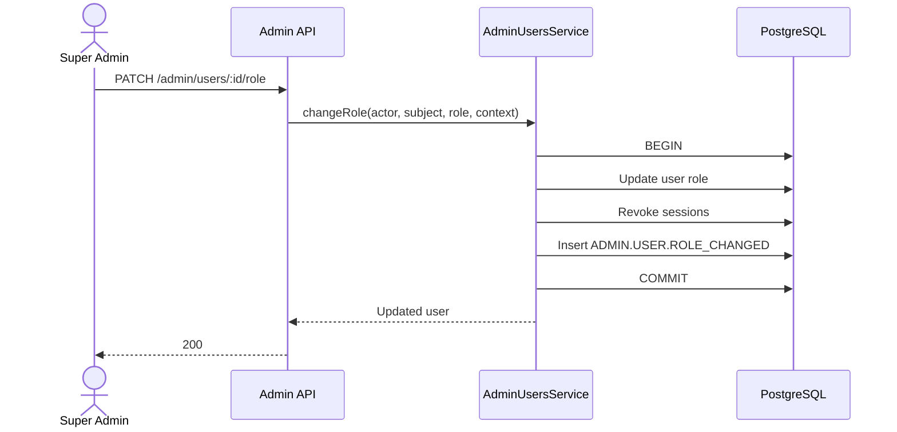
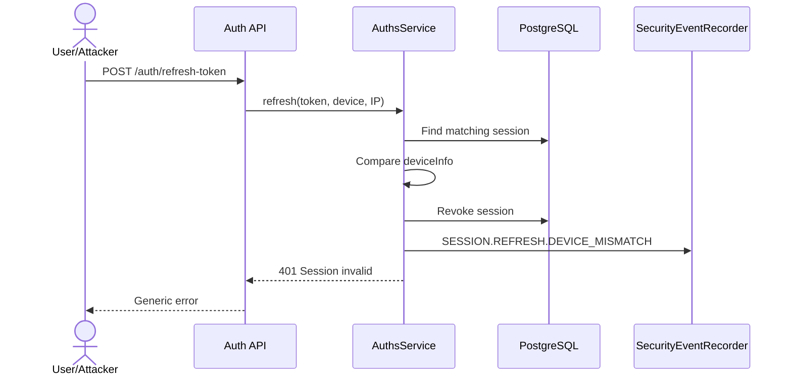
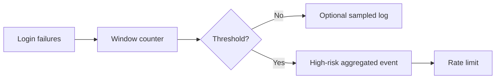

# SECURITY LOGS — MỞ RỘNG NGHIỆP VỤ VÀ LỘ TRÌNH TRIỂN KHAI

> Tài liệu thiết kế việc đưa bảng `SecurityLog` vào sử dụng thực tế trong dự án Quản lý Blog. Phạm vi gồm audit trail, phát hiện hành vi bất thường, lịch sử bảo mật của người dùng, API quản trị, retention, cảnh báo và lộ trình từ cấu trúc hiện có đến hệ thống Security Logging hoàn chỉnh.

---

## 1. Thông tin tài liệu

| Thuộc tính | Giá trị |
|---|---|
| Dự án | Quản lý Blog |
| Backend | NestJS 11, TypeScript |
| ORM / Database | Prisma 7 / PostgreSQL |
| Kiến trúc | Modular Monolith |
| Bảng hiện có | `security_logs` |
| Module hiện có | `libs/core/src/modules/security-logs` |
| Trạng thái hiện tại | Có model, migration, service và test; chưa được tích hợp vào luồng chạy |
| Role quản trị chính | `SUPER_ADMIN` |
| Ngày lập kế hoạch | 30/07/2026 |
| Trạng thái tài liệu | Thiết kế và roadmap; chưa phải tính năng đã hoàn thành |

---

## 2. Kết luận nhanh về hiện trạng

Trong source hiện tại, Security Logs đã có phần khung:

```text
database/schema.prisma
└── model SecurityLog

database/migrations/.../migration.sql
└── CREATE TABLE security_logs

libs/core/src/modules/security-logs/
├── security-logs.module.ts
├── security-logs.service.ts
├── security-logs.service.spec.ts
├── dto/
└── entities/
```

`SecurityLogsService` hiện hỗ trợ:

- `create()`.
- `findAll()` có phân trang.
- Lọc theo `userId`, `action`, `ipAddress`.
- `findOne()`.
- Không hỗ trợ sửa/xóa, phù hợp với ý tưởng audit trail.

Tuy nhiên, module này chưa tạo ra giá trị nghiệp vụ vì:

1. `SecurityLogsModule` chưa được import vào `AppModule`, `AdminApiModule`, `PublicApiModule`, `UserApiModule`, `ModeratorApiModule` hoặc `BlogownerApiModule`.
2. Không có controller đọc Security Logs.
3. Không có `AuthsService`, guard, Admin service, Moderator service hoặc Blog Owner service nào inject `SecurityLogsService`.
4. Không có call site gọi `securityLogsService.create()`.
5. Không có event subscriber, interceptor hoặc exception filter ghi security event.
6. Bảng `security_logs` vì vậy có thể tồn tại nhưng gần như luôn rỗng.

Nói chính xác: **code nền đã có, nhưng chưa được nối vào bất kỳ workflow runtime nào**.

---

## 3. Mục tiêu nghiệp vụ

Security Logs cần phục vụ năm mục tiêu khác nhau.

### 3.1. Audit thao tác nhạy cảm

Cho phép trả lời:

- Ai đã khóa tài khoản?
- Ai thay đổi role?
- Moderator nào đã duyệt hoặc từ chối bài?
- Ai đã xử lý report?
- Khi nào mật khẩu được đặt lại?
- Phiên nào bị thu hồi?
- Thao tác đến từ IP, thiết bị và request nào?

### 3.2. Phát hiện hành vi bất thường

Nhận diện:

- Đăng nhập thất bại lặp lại.
- Refresh token từ thiết bị khác.
- Nhiều token không hợp lệ từ cùng IP.
- Một tài khoản bị thử đăng nhập từ nhiều IP.
- Một Admin thực hiện hàng loạt thao tác nguy hiểm.
- Nhiều request `403` trên các route quản trị.
- Account takeover hoặc session replay có dấu hiệu.

### 3.3. Hỗ trợ điều tra sự cố

Khi có sự cố, cần dựng lại timeline:

```text
LOGIN_FAILED
    ↓
LOGIN_SUCCEEDED
    ↓
ROLE_CHANGED
    ↓
SESSIONS_REVOKED
    ↓
ADMIN_ACTION
```

### 3.4. Lịch sử bảo mật cho người dùng

Người dùng có thể xem phiên bản đã được lọc:

- Lần đăng nhập gần đây.
- Thiết bị/IP gần đúng.
- Đổi mật khẩu.
- Đăng xuất tất cả thiết bị.
- Tài khoản bị khóa/mở khóa.
- Liên kết OAuth trong tương lai.

### 3.5. Monitoring và cảnh báo

Dữ liệu Security Logs là nguồn cho:

- Dashboard.
- Alert.
- Daily security summary.
- Incident workflow.
- SIEM hoặc hệ thống log tập trung trong tương lai.

---

## 4. Phân biệt ba loại log

Không nên dùng một bảng cho mọi mục đích.

| Loại | Mục đích | Ví dụ | Nơi lưu |
|---|---|---|---|
| HTTP access log | Theo dõi request và hiệu năng | Method, URL, status, duration | stdout / log platform |
| Application log | Debug và vận hành | Mail lỗi, DB timeout, exception | stdout / log platform |
| Security/Audit log | Sự kiện bảo mật, thay đổi quyền và hành động nhạy cảm | Login fail, role change, password reset | `security_logs` + log platform |

`LoggerMiddleware` hiện tại là HTTP access log. Nó không thay thế `SecurityLog`.

Không nên ghi mọi request vào `security_logs`, vì:

- Bảng tăng rất nhanh.
- Khó tìm tín hiệu quan trọng.
- Làm tăng tải database.
- Trộn monitoring kỹ thuật với audit nghiệp vụ.
- Có nguy cơ lưu quá nhiều dữ liệu cá nhân.

---

## 5. Đánh giá schema hiện tại

Schema hiện có:

```prisma
model SecurityLog {
  id        Int     @id @default(autoincrement())
  userId    Int?    @map("user_id")
  user      User?   @relation(fields: [userId], references: [id], onDelete: SetNull)
  ipAddress String  @map("ip_address")
  action    String
  userAgent String? @map("user_agent") @db.Text

  createdAt DateTime @default(now()) @map("created_at")

  @@index([userId])
  @@index([action])
  @@index([createdAt])
  @@map("security_logs")
}
```

### 5.1. Điểm tốt

- Có timestamp.
- Có user liên quan.
- Có IP và user agent.
- Có index cơ bản.
- `onDelete: SetNull` giúp không xóa log khi user bị xóa.
- `action` dạng string dễ mở rộng.
- Không có update/delete service.

### 5.2. Hạn chế

| Hạn chế | Ảnh hưởng |
|---|---|
| `userId` không nói rõ là actor hay user bị tác động | Không phân biệt Admin thực hiện và user mục tiêu |
| `action` là chuỗi tự do | Dễ sai chính tả, khó thống kê và alert |
| Không có `outcome` | Không phân biệt thành công/thất bại/bị từ chối |
| Không có `severity` | Không ưu tiên được sự kiện |
| Không có `category` | Khó lọc auth/admin/moderation |
| Không có `requestId` | Không nối được với HTTP/application log |
| Không có `sessionId` | Khó điều tra session |
| Không có resource target | Không biết post/report/comment nào bị tác động |
| Không có before/after | Không audit được role/status thay đổi |
| Không có metadata JSON | Không mở rộng được chi tiết có kiểm soát |
| Không có reason code | Alert phải parse message |
| Không có risk score | Khó xây detection |
| Không có actor snapshot | Khi user bị xóa, quan hệ `SetNull` làm mất actor identity |
| IP bắt buộc | Một số system job không có IP |
| Không có source | Không phân biệt API, cron, worker, migration |
| Không có retention/archive design | Bảng sẽ tăng vô hạn |
| `Int` có thể nhỏ trong dài hạn | Log volume có thể cần `BigInt` |
| Không có integrity control | DB user có quyền có thể sửa trực tiếp |

---

## 6. Mô hình dữ liệu đề xuất

### 6.1. Nguyên tắc

Security Log nên trả lời đủ:

```text
Ai
đã làm gì
với tài nguyên nào
khi nào
từ đâu
kết quả ra sao
vì lý do gì
trong request/session nào
```

### 6.2. Enum đề xuất

```prisma
enum SecurityEventCategory {
  AUTHENTICATION
  SESSION
  ACCOUNT
  AUTHORIZATION
  ADMINISTRATION
  MODERATION
  CONTENT
  DATA_ACCESS
  SYSTEM
  OAUTH
}

enum SecurityEventSeverity {
  INFO
  LOW
  MEDIUM
  HIGH
  CRITICAL
}

enum SecurityEventOutcome {
  SUCCESS
  FAILURE
  DENIED
  ERROR
}

enum SecurityEventSource {
  API
  WORKER
  SCHEDULER
  SYSTEM
}
```

`eventType` không nhất thiết là Prisma enum vì số loại sự kiện sẽ tăng và Prisma enum yêu cầu migration mỗi lần thêm giá trị.

Dùng TypeScript constants làm vocabulary chuẩn:

```ts
export const SecurityEventTypes = {
  AUTH_LOGIN_SUCCEEDED: 'AUTH.LOGIN.SUCCEEDED',
  AUTH_LOGIN_FAILED: 'AUTH.LOGIN.FAILED',
  ADMIN_USER_LOCKED: 'ADMIN.USER.LOCKED',
} as const;
```

### 6.3. Model mục tiêu

```prisma
model SecurityLog {
  id                    BigInt                @id @default(autoincrement())

  actorUserId           Int?                  @map("actor_user_id")
  actorUser             User?                 @relation(
    "SecurityLogActor",
    fields: [actorUserId],
    references: [id],
    onDelete: SetNull
  )

  subjectUserId         Int?                  @map("subject_user_id")
  subjectUser           User?                 @relation(
    "SecurityLogSubject",
    fields: [subjectUserId],
    references: [id],
    onDelete: SetNull
  )

  actorUsernameSnapshot String?               @map("actor_username_snapshot")
  actorRoleSnapshot     UserRole?             @map("actor_role_snapshot")

  eventType             String                @map("event_type")
  category              SecurityEventCategory
  severity              SecurityEventSeverity
  outcome               SecurityEventOutcome
  source                 SecurityEventSource  @default(API)

  requestId             String?               @map("request_id")
  correlationId         String?               @map("correlation_id")
  sessionId             Int?                  @map("session_id")

  resourceType          String?               @map("resource_type")
  resourceId            String?               @map("resource_id")

  ipAddress             String?               @map("ip_address")
  userAgent             String?               @map("user_agent") @db.Text

  reasonCode            String?               @map("reason_code")
  message               String?               @db.Text
  metadata              Json?
  riskScore             Int?                  @map("risk_score")

  occurredAt            DateTime              @default(now()) @map("occurred_at")
  createdAt             DateTime              @default(now()) @map("created_at")

  @@index([actorUserId, occurredAt])
  @@index([subjectUserId, occurredAt])
  @@index([eventType, occurredAt])
  @@index([category, occurredAt])
  @@index([severity, occurredAt])
  @@index([outcome, occurredAt])
  @@index([ipAddress, occurredAt])
  @@index([requestId])
  @@index([sessionId])
  @@index([riskScore, occurredAt])
  @@map("security_logs")
}
```

### 6.4. Actor và subject

Ví dụ Admin khóa user:

```text
actorUserId   = ID Admin
subjectUserId = ID user bị khóa
eventType     = ADMIN.USER.LOCKED
```

Ví dụ login:

```text
actorUserId   = user đăng nhập thành công
subjectUserId = chính user đó
```

Ví dụ login thất bại với email không tồn tại:

```text
actorUserId   = null
subjectUserId = null
metadata.identifierHash = hash(identifier)
```

Không lưu identifier rõ nếu không cần.

### 6.5. Actor snapshot

Do foreign key sử dụng `SetNull`, nên lưu snapshot tối thiểu:

- Username tại thời điểm thao tác.
- Role tại thời điểm thao tác.

Không nhất thiết lưu email rõ trong log. Nếu cần correlation, dùng email hash hoặc masked email.

### 6.6. Metadata

Ví dụ role change:

```json
{
  "before": {
    "role": "NORMAL"
  },
  "after": {
    "role": "CONTENT_MODERATOR"
  },
  "sessionsRevoked": 3
}
```

Ví dụ login failed:

```json
{
  "identifierType": "EMAIL",
  "identifierHash": "sha256:...",
  "failureCountInWindow": 4
}
```

Metadata phải qua allowlist. Không đưa nguyên request body vào đây.

### 6.7. Risk score

Thang đề xuất:

| Điểm | Mức |
|---:|---|
| 0–19 | Bình thường |
| 20–39 | Thấp |
| 40–59 | Trung bình |
| 60–79 | Cao |
| 80–100 | Nghiêm trọng |

Risk score không thay thế severity:

- Severity là mức quan trọng của loại sự kiện.
- Risk score là mức đáng ngờ của instance cụ thể.

---

## 7. Chiến lược migration không làm mất dữ liệu

### Giai đoạn A — Additive columns

Giữ các cột hiện tại và thêm:

- `actor_user_id`.
- `subject_user_id`.
- `event_type`.
- `category`.
- `severity`.
- `outcome`.
- Các trường context.

Backfill:

```text
actor_user_id = user_id
subject_user_id = user_id
event_type = action
```

### Giai đoạn B — Chuyển code

Code mới ghi cả field mới. API đọc field mới.

### Giai đoạn C — Dọn schema

Sau khi xác minh:

- Có thể bỏ `user_id`.
- Có thể bỏ `action`.
- Hoặc giữ `action` làm alias nếu muốn tương thích.

Không đổi `Int → BigInt` trong cùng migration với nhiều thay đổi khác nếu bảng đã lớn. Với dự án hiện tại chưa có dữ liệu runtime, có thể chuyển sớm.

---

## 8. Vocabulary sự kiện chuẩn

### 8.1. Quy tắc đặt tên

```text
<CATEGORY>.<ENTITY_OR_FLOW>.<ACTION_OR_RESULT>
```

Ví dụ:

```text
AUTH.LOGIN.SUCCEEDED
AUTH.LOGIN.FAILED
SESSION.REFRESH.DEVICE_MISMATCH
ADMIN.USER.ROLE_CHANGED
MODERATION.POST.APPROVED
```

Không dùng message tiếng Việt làm event type.

Message chỉ dùng hiển thị; logic alert dựa vào `eventType`, `outcome`, `severity`, `reasonCode`.

---

## 9. Danh mục sự kiện cần ghi

## 9.1. Authentication

| Event type | Outcome | Severity | Khi ghi |
|---|---|---|---|
| `AUTH.REGISTER.SUCCEEDED` | SUCCESS | INFO | Tạo tài khoản thành công |
| `AUTH.REGISTER.FAILED` | FAILURE | LOW | Validation/conflict có ý nghĩa bảo mật |
| `AUTH.LOGIN.SUCCEEDED` | SUCCESS | INFO | Login đúng |
| `AUTH.LOGIN.FAILED` | FAILURE | MEDIUM | Sai identifier/password |
| `AUTH.LOGIN.LOCKED_ACCOUNT` | DENIED | HIGH | Login vào account `LOCKED` |
| `AUTH.PASSWORD_RESET.REQUESTED` | SUCCESS | LOW | Luôn ghi generic, không lộ email tồn tại |
| `AUTH.PASSWORD_RESET.SUCCEEDED` | SUCCESS | HIGH | Đổi mật khẩu thành công |
| `AUTH.PASSWORD_RESET.FAILED` | FAILURE | MEDIUM | Token sai/hết hạn |
| `AUTH.PASSWORD.SET` | SUCCESS | HIGH | OAuth-only account đặt mật khẩu tương lai |
| `AUTH.MFA.ENABLED` | SUCCESS | HIGH | Tương lai |
| `AUTH.MFA.DISABLED` | SUCCESS | CRITICAL | Tương lai |

### Không ghi

- Password.
- Password hash.
- Reset token.
- JWT.
- Refresh token.
- Full Authorization header.

---

## 9.2. Session

| Event type | Severity | Khi ghi |
|---|---|---|
| `SESSION.CREATED` | INFO | Login tạo session |
| `SESSION.REFRESH.SUCCEEDED` | INFO | Refresh thành công, có thể sampling |
| `SESSION.REFRESH.FAILED` | MEDIUM | Token không khớp session |
| `SESSION.REFRESH.DEVICE_MISMATCH` | HIGH | Device info thay đổi và session bị revoke |
| `SESSION.REVOKED` | MEDIUM | Logout hiện tại |
| `SESSION.ALL_REVOKED` | HIGH | Logout all/reset password/admin action |
| `SESSION.EXPIRED_TOKEN_USED` | MEDIUM | Cố dùng token hết hạn |
| `SESSION.INVALID_ACCESS_TOKEN` | MEDIUM | JWT sai chữ ký/format |
| `SESSION.REPLAY_SUSPECTED` | CRITICAL | Khi có detection phù hợp |

Không ghi mọi refresh thành công nếu traffic lớn; có thể chỉ cập nhật `lastUsedAt` ở session và ghi sự kiện bất thường.

---

## 9.3. Authorization

| Event type | Severity | Khi ghi |
|---|---|---|
| `AUTHZ.ACCESS.DENIED` | MEDIUM | Role không phù hợp |
| `AUTHZ.OWNERSHIP.DENIED` | MEDIUM | User thao tác tài nguyên không thuộc mình |
| `AUTHZ.ADMIN_ROUTE.DENIED` | HIGH | Truy cập route Admin trái phép |
| `AUTHZ.MODERATOR_ROUTE.DENIED` | MEDIUM | Truy cập route Moderator trái phép |
| `AUTHZ.SELF_ACTION.DENIED` | MEDIUM | Admin tự khóa/xóa/đổi role |
| `AUTHZ.LAST_ADMIN_PROTECTION` | HIGH | Cố thay đổi/xóa Super Admin cuối |

Không ghi mỗi request thiếu JWT từ bot vào database vô hạn. Cần rate limit, aggregate hoặc sampling.

---

## 9.4. Account/User

| Event type | Severity | Khi ghi |
|---|---|---|
| `ACCOUNT.PROFILE.UPDATED` | LOW | Thay bio/avatar |
| `ACCOUNT.AVATAR.UPDATED` | LOW | Upload avatar |
| `ACCOUNT.SELF_DELETED` | HIGH | User xóa profile |
| `ACCOUNT.EMAIL.CHANGED` | HIGH | Nếu có trong tương lai |
| `ACCOUNT.USERNAME.CHANGED` | MEDIUM | Nếu có trong tương lai |
| `ACCOUNT.RECOVERY.METHOD_CHANGED` | HIGH | Tương lai |
| `ACCOUNT.OAUTH.LINKED` | HIGH | Tương lai |
| `ACCOUNT.OAUTH.UNLINKED` | HIGH | Tương lai |

Không cần ghi like, bookmark, follow bình thường vào Security Logs. Đó là business activity, trừ khi detection phát hiện spam/automation.

---

## 9.5. Admin

| Event type | Severity | Resource |
|---|---|---|
| `ADMIN.USER.LOCKED` | HIGH | USER |
| `ADMIN.USER.UNLOCKED` | HIGH | USER |
| `ADMIN.USER.ROLE_CHANGED` | CRITICAL | USER |
| `ADMIN.USER.DELETED` | CRITICAL | USER |
| `ADMIN.MODERATOR.CREATED` | HIGH | USER |
| `ADMIN.BLOG_OWNER_REQUEST.APPROVED` | HIGH | BLOG_OWNER_REQUEST |
| `ADMIN.BLOG_OWNER_REQUEST.REJECTED` | MEDIUM | BLOG_OWNER_REQUEST |
| `ADMIN.LANGUAGE.CREATED` | MEDIUM | LANGUAGE |
| `ADMIN.LANGUAGE.UPDATED` | MEDIUM | LANGUAGE |
| `ADMIN.LANGUAGE.DELETED` | HIGH | LANGUAGE |
| `ADMIN.MAINTENANCE.ENABLED` | CRITICAL | SYSTEM |
| `ADMIN.MAINTENANCE.DISABLED` | HIGH | SYSTEM |

Các thao tác Admin phải ghi:

- Actor.
- Subject.
- Before/after.
- Reason.
- Số session bị revoke.
- Request ID.
- IP và user agent.

---

## 9.6. Moderator

| Event type | Severity |
|---|---|
| `MODERATION.POST.APPROVED` | HIGH |
| `MODERATION.POST.REJECTED` | HIGH |
| `MODERATION.REPORT.RESOLVED` | HIGH |
| `MODERATION.REPORT.REJECTED` | MEDIUM |
| `MODERATION.CATEGORY.CREATED` | MEDIUM |
| `MODERATION.CATEGORY.UPDATED` | MEDIUM |
| `MODERATION.CATEGORY.DELETED` | HIGH |
| `MODERATION.CONCURRENT_REVIEW.CONFLICT` | MEDIUM |

Đây vừa là audit nghiệp vụ vừa là security/audit trail vì ảnh hưởng nội dung công khai.

---

## 9.7. Blog Owner

| Event type | Severity |
|---|---|
| `CONTENT.POST.CREATED` | LOW |
| `CONTENT.POST.UPDATED` | LOW |
| `CONTENT.POST.SUBMITTED` | MEDIUM |
| `CONTENT.POST.DELETED` | MEDIUM |
| `CONTENT.POST.RESTORED` | MEDIUM |
| `CONTENT.MEDIA.UPLOADED` | LOW |
| `CONTENT.MEDIA.DELETED` | MEDIUM |
| `CONTENT.TRANSLATION.CREATED` | LOW |
| `CONTENT.PUBLISH_STATE.INVALID_TRANSITION` | MEDIUM |

Không nhất thiết giữ mọi autosave trong security log.

---

## 9.8. Report và abuse

| Event type | Severity |
|---|---|
| `ABUSE.REPORT.POST.CREATED` | LOW |
| `ABUSE.REPORT.COMMENT.CREATED` | LOW |
| `ABUSE.REPORT.DUPLICATE.DENIED` | LOW |
| `ABUSE.COMMENT.RATE_LIMITED` | MEDIUM |
| `ABUSE.COMMENT.DUPLICATE.DENIED` | LOW |
| `ABUSE.REQUEST.RATE_LIMITED` | MEDIUM |
| `ABUSE.SUSPICIOUS_ACTIVITY.DETECTED` | HIGH |

Report bình thường có thể nằm trong domain table `reports`; Security Log chỉ cần các event quan trọng hoặc bất thường để tránh trùng dữ liệu quá mức.

---

## 9.9. System/Operations

| Event type | Severity |
|---|---|
| `SYSTEM.STARTED` | INFO |
| `SYSTEM.MIGRATION.SUCCEEDED` | HIGH |
| `SYSTEM.MIGRATION.FAILED` | CRITICAL |
| `SYSTEM.CLEANUP.SUCCEEDED` | INFO |
| `SYSTEM.CLEANUP.FAILED` | HIGH |
| `SYSTEM.BACKUP.SUCCEEDED` | HIGH |
| `SYSTEM.BACKUP.FAILED` | CRITICAL |
| `SYSTEM.SECURITY_CONFIG.CHANGED` | CRITICAL |
| `SYSTEM.SEARCH.REINDEX.STARTED` | MEDIUM |
| `SYSTEM.SEARCH.REINDEX.FAILED` | HIGH |

System events có `actorUserId = null`, `source = WORKER/SCHEDULER/SYSTEM`.

---

## 10. Không ghi những gì

Danh sách cấm:

- Password.
- Password hash.
- Password pepper.
- JWT access token.
- Refresh token.
- Refresh token hash.
- Reset token.
- OAuth authorization code.
- OAuth access/refresh token.
- Cookie session.
- Authorization header.
- SMTP password.
- Cloudinary secret.
- Database URL.
- Full request/response body.
- Content comment/post nếu không cần.
- PII vượt quá mục đích audit.
- Stack trace trong bảng nghiệp vụ.

Nếu cần liên kết identifier:

```text
hash = HMAC-SHA256(normalizedIdentifier, dedicatedLogKey)
```

Không dùng hash không có key cho email phổ biến vì dễ dictionary attack.

---

## 11. Kiến trúc module đề xuất

```text
libs/core/src/modules/security-logs/
├── security-logs.module.ts
├── security-logs.service.ts
├── security-event-recorder.service.ts
├── security-risk.service.ts
├── security-alert.service.ts
├── security-log-retention.service.ts
├── constants/
│   ├── security-event-types.ts
│   └── security-reason-codes.ts
├── dto/
│   ├── record-security-event.dto.ts
│   ├── get-security-logs.dto.ts
│   └── get-security-summary.dto.ts
├── entities/
├── interfaces/
│   ├── security-event.interface.ts
│   └── request-security-context.interface.ts
└── subscribers/
    ├── auth-security.subscriber.ts
    ├── admin-security.subscriber.ts
    └── moderation-security.subscriber.ts
```

API:

```text
src/admin/controllers/admin-security-logs.controller.ts
src/admin/services/admin-security-logs.service.ts

src/user/controllers/user-security-activity.controller.ts
src/user/services/user-security-activity.service.ts
```

---

## 12. Service contract nội bộ

Không cho controller public nhận `CreateSecurityLogDto` trực tiếp.

API nội bộ:

```ts
export interface RecordSecurityEventInput {
  eventType: SecurityEventType;
  category: SecurityEventCategory;
  severity: SecurityEventSeverity;
  outcome: SecurityEventOutcome;

  actorUserId?: number;
  subjectUserId?: number;

  resourceType?: string;
  resourceId?: string | number;

  reasonCode?: string;
  message?: string;
  metadata?: Record<string, unknown>;

  requestContext?: SecurityRequestContext;
  sessionId?: number;
  riskScore?: number;
}

export class SecurityEventRecorder {
  record(input: RecordSecurityEventInput): Promise<void>;
  recordCritical(
    tx: Prisma.TransactionClient,
    input: RecordSecurityEventInput,
  ): Promise<void>;
}
```

### 12.1. `record()`

Dùng cho event quan sát:

- Login failed.
- Invalid token.
- Rate limit.
- Device mismatch.
- System warning.

Có thể best-effort hoặc qua queue/outbox.

### 12.2. `recordCritical()`

Dùng trong cùng database transaction với thao tác:

- Role change.
- Lock/unlock.
- Delete user.
- Approve/reject post.
- Password reset success.
- OAuth link/unlink.
- Maintenance/config change.

Nếu mutation thành công nhưng audit log thất bại thì transaction phải rollback đối với các hành động quan trọng.

---

## 13. Request context

Cần thêm request context chuẩn:

```ts
export interface SecurityRequestContext {
  requestId: string;
  correlationId?: string;
  ipAddress?: string;
  userAgent?: string;
  method?: string;
  route?: string;
}
```

### 13.1. Request ID middleware

Middleware:

1. Đọc `X-Request-Id` nếu hợp lệ hoặc sinh UUID mới.
2. Gắn vào request.
3. Trả lại response header.
4. Đưa vào HTTP log.
5. Đưa vào Security Log.

### 13.2. IP thực

Sau reverse proxy:

- Cấu hình `trust proxy` đúng.
- Không tin `X-Forwarded-For` nếu request có thể bỏ qua proxy.
- Chuẩn hóa IPv4/IPv6.
- Không dùng `contains` cho điều tra IP nếu có thể dùng exact match.

### 13.3. Truyền context

Ba phương án:

| Phương án | Ưu | Nhược |
|---|---|---|
| Truyền từ controller vào service | Rõ, dễ test | Thay nhiều signature |
| AsyncLocalStorage / CLS | Ít truyền tay | Cần quản lý context đúng |
| Event object có context | Tách rời | Cần event infrastructure |

Đề xuất:

- Giai đoạn đầu: decorator `@SecurityContext()` và truyền explicit ở action nhạy cảm.
- Giai đoạn sau: `AsyncLocalStorage` cho request ID/IP/user agent.
- Không để service domain phụ thuộc trực tiếp vào Express `Request`.

---

## 14. Cách tích hợp vào source hiện tại

## 14.1. AuthsService

Constructor:

```ts
constructor(
  private readonly prisma: PrismaService,
  private readonly usersService: UsersService,
  private readonly bcryptUtil: BcryptUtil,
  private readonly jwtUtil: JWTUtil,
  private readonly mailService: MailService,
  private readonly securityEvents: SecurityEventRecorder,
) {}
```

### Login thành công

Sau khi tạo `userSession`:

```ts
await this.securityEvents.record({
  eventType: SecurityEventTypes.AUTH_LOGIN_SUCCEEDED,
  category: SecurityEventCategory.AUTHENTICATION,
  severity: SecurityEventSeverity.INFO,
  outcome: SecurityEventOutcome.SUCCESS,
  actorUserId: user.id,
  subjectUserId: user.id,
  sessionId: session.id,
  requestContext,
});
```

### Login thất bại

Ghi generic:

```ts
await this.securityEvents.record({
  eventType: SecurityEventTypes.AUTH_LOGIN_FAILED,
  category: SecurityEventCategory.AUTHENTICATION,
  severity: SecurityEventSeverity.MEDIUM,
  outcome: SecurityEventOutcome.FAILURE,
  reasonCode: 'INVALID_CREDENTIALS',
  metadata: {
    identifierHash,
  },
  requestContext,
});
```

Không ghi “email tồn tại nhưng password sai”, vì có thể tạo kênh dò tài khoản trong hệ thống log hoặc dashboard.

### Device mismatch

Code hiện đã revoke session khi `deviceInfo` thay đổi. Đây là event ưu tiên cao:

```text
SESSION.REFRESH.DEVICE_MISMATCH
severity = HIGH
outcome = DENIED
```

Ghi:

- Session ID.
- User ID.
- Old device hash hoặc family đã lọc.
- New device hash hoặc family.
- IP cũ/mới nếu policy cho phép.
- Session đã bị revoke.

### Reset password

Nên đưa vào transaction:

1. Update password.
2. Mark token used.
3. Revoke sessions.
4. Create Security Log.

---

## 14.2. JwtAuthGuard

Không nên inject recorder rồi ghi đồng bộ mọi token fail trực tiếp trong guard mà không kiểm soát, vì attacker có thể tạo log flood.

Đề xuất:

- Guard throw exception có `reasonCode`.
- Global exception filter/interceptor nhận error security-relevant.
- Ghi event theo rate limit/sampling.
- Truy cập Admin route bị từ chối luôn ghi.
- Public route token fail không nên phát sinh nếu route không cần token.

Các reason code:

```text
ACCESS_TOKEN_MISSING
ACCESS_TOKEN_INVALID
ACCESS_TOKEN_EXPIRED
USER_NOT_FOUND
USER_DELETED
USER_LOCKED
```

---

## 14.3. RolesGuard

Khi denied, cần biết:

- Actor user.
- Required roles.
- Actual role.
- Route.
- Method.
- Request ID.

Event:

```text
AUTHZ.ACCESS.DENIED
```

Đối với `/admin/*`:

```text
AUTHZ.ADMIN_ROUTE.DENIED
severity = HIGH
```

Không lưu full query/body.

---

## 14.4. AdminUsersService

### lockUser

Transaction hiện có:

- Update user.
- Revoke sessions.

Thêm:

- Security log trong cùng transaction.

Metadata:

```json
{
  "before": {
    "status": "ACTIVE"
  },
  "after": {
    "status": "LOCKED"
  },
  "reason": "Vi phạm chính sách",
  "sessionsRevoked": 2
}
```

### changeRole

Event:

```text
ADMIN.USER.ROLE_CHANGED
severity = CRITICAL
```

Metadata:

```json
{
  "beforeRole": "NORMAL",
  "afterRole": "CONTENT_MODERATOR",
  "sessionsRevoked": 1
}
```

### removeUser

Event:

```text
ADMIN.USER.DELETED
```

Audit nên ghi trong transaction của soft delete nếu refactor được.

### createModerator

Event:

```text
ADMIN.MODERATOR.CREATED
```

Không ghi password.

---

## 14.5. AdminRequestsService

Khi duyệt Blog Owner Request:

```text
ADMIN.BLOG_OWNER_REQUEST.APPROVED
ADMIN.BLOG_OWNER_REQUEST.REJECTED
```

Metadata:

- Request ID.
- User ID.
- Trạng thái trước/sau.
- Rejection reason nếu có.
- Role trước/sau.
- Session revoke nếu thay role.

---

## 14.6. Moderator services

### Post approve/reject

Security Log trong cùng transaction với state transition:

```text
MODERATION.POST.APPROVED
MODERATION.POST.REJECTED
```

Metadata:

- `DRAFT/PENDING_REVIEW/PUBLISH/REJECT`.
- `reviewedAt`.
- Reason.
- Author ID.
- Concurrent conflict nếu có.

### Report resolve/reject

```text
MODERATION.REPORT.RESOLVED
MODERATION.REPORT.REJECTED
```

Metadata:

- Report target.
- Action đã áp dụng cho Post/Comment.
- Before/after state.
- Resolver ID.
- Resolution note.

### Category CRUD

Ghi những thay đổi tác động taxonomy public.

---

## 14.7. UserProfileService

Ghi:

- `ACCOUNT.PROFILE.UPDATED`.
- `ACCOUNT.AVATAR.UPDATED`.
- `ACCOUNT.SELF_DELETED`.

Không cần ghi full bio/avatar URL nếu không cần. Metadata chỉ nên ghi field names thay đổi:

```json
{
  "changedFields": ["bio", "avatarUrl"]
}
```

Self-delete cần log trước hoặc trong transaction để giữ actor snapshot.

---

## 14.8. Blog Owner services

Ghi event cho state transition, không ghi mọi thao tác thường xuyên.

Ưu tiên:

- Submit review.
- Delete/restore.
- Media delete.
- Translation.
- Invalid state transition.
- Attempt sửa bài không thuộc mình.

Không ghi content đầy đủ.

---

## 15. Đồng bộ hay bất đồng bộ

## 15.1. Phân loại

### Bắt buộc atomic

Các event sau phải cùng transaction:

- Role change.
- User lock/delete.
- Moderator approve/reject.
- Report resolution có tác động.
- Password reset success.
- Security configuration change.
- OAuth link/unlink tương lai.

### Best-effort / async

- Login failed.
- Invalid token.
- Rate limit.
- Access denied.
- Suspicious pattern.
- Login success nếu session đã có record riêng.

### Aggregate

- Hàng nghìn invalid token từ bot.
- Scan route.
- Repeated 404/401.
- Rate limit flood.

Có thể ghi:

```text
eventType = AUTHZ.ACCESS.DENIED.AGGREGATED
metadata.count = 500
window = 5 phút
```

thay vì 500 row.

---

## 15.2. Giai đoạn đầu

Dùng Prisma trực tiếp:

- Critical event: transaction.
- Best-effort event: `record().catch(logger.error)` có timeout và rate limit.

Không dùng fire-and-forget không theo dõi Promise một cách tùy tiện.

---

## 15.3. Giai đoạn trưởng thành

Dùng transactional outbox:

```prisma
model SecurityEventOutbox {
  id          BigInt   @id @default(autoincrement())
  eventId     String   @unique @map("event_id")
  eventType   String   @map("event_type")
  payload     Json
  occurredAt  DateTime @map("occurred_at")
  processedAt DateTime? @map("processed_at")
  attempts    Int      @default(0)
  lastError   String?  @map("last_error") @db.Text

  @@index([processedAt, occurredAt])
  @@map("security_event_outbox")
}
```

Domain transaction ghi outbox. Worker tạo `SecurityLog`, alert và external stream.

Lợi ích:

- Không mất audit event khi process crash sau mutation.
- Tách latency.
- Có retry/dead-letter.
- Có thể gửi SIEM.

---

## 16. API Admin

### 16.1. Danh sách

```http
GET /api/v1/admin/security-logs
Authorization: Bearer <SUPER_ADMIN_ACCESS_TOKEN>
```

Filters:

| Field | Ghi chú |
|---|---|
| `actorUserId` | Người thực hiện |
| `subjectUserId` | User bị tác động |
| `eventType` | Exact/prefix có kiểm soát |
| `category` | Enum |
| `severity` | Enum |
| `outcome` | Enum |
| `ipAddress` | Exact |
| `resourceType` | USER, POST, REPORT... |
| `resourceId` | String |
| `requestId` | Exact |
| `from`, `to` | Time range |
| `minRiskScore` | 0–100 |
| `page`, `limit` | Limit tối đa 100 |

Mặc định nên giới hạn thời gian, ví dụ 7 hoặc 30 ngày, để tránh full scan.

### 16.2. Chi tiết

```http
GET /api/v1/admin/security-logs/:id
```

Response có:

- Event fields.
- Actor/subject đã lọc.
- Metadata.
- Related request ID.
- Không có secret.

### 16.3. Summary

```http
GET /api/v1/admin/security-logs/summary?from=...&to=...
```

Trả:

- Event theo severity.
- Login fail.
- Access denied.
- Role changes.
- Locked accounts.
- Top IP bất thường.
- High-risk events.
- Trend theo ngày/giờ.

### 16.4. Export

Không nên export đồng bộ dataset lớn.

```http
POST /api/v1/admin/security-logs/exports
GET  /api/v1/admin/security-logs/exports/:id
```

Export:

- Chạy job.
- Có time range bắt buộc.
- Có audit event cho chính thao tác export.
- File có TTL.
- Có encryption/access control.
- Không export raw metadata mặc định.

### 16.5. Không cung cấp

```http
PATCH /admin/security-logs/:id
DELETE /admin/security-logs/:id
```

Security Log là append-only.

---

## 17. API User

```http
GET /api/v1/user/security/activity?page=1&limit=20
```

Chỉ trả event liên quan chính user và đã allowlist:

- Login success.
- Device mismatch.
- Password reset.
- Logout all.
- Account lock/unlock.
- OAuth link/unlink.
- Email/password/MFA change tương lai.

Response không trả:

- Internal risk algorithm.
- Admin IP/user agent.
- Metadata điều tra nội bộ.
- Event của user khác.
- Full IP nếu privacy policy yêu cầu mask.

Ví dụ:

```json
{
  "eventType": "AUTH.LOGIN.SUCCEEDED",
  "occurredAt": "2026-07-31T03:20:00.000Z",
  "device": "Chrome on Windows",
  "ipAddress": "203.0.113.xxx",
  "location": null
}
```

Không suy diễn location nếu chưa có dịch vụ và privacy policy.

---

## 18. Alerting rules đề xuất

## 18.1. Authentication alerts

| Rule | Điều kiện | Severity | Hành động |
|---|---|---|---|
| Brute force account | ≥5 login fail/user/10 phút | HIGH | Alert, rate limit |
| Password spray IP | ≥20 user khác nhau/IP/10 phút | HIGH | Block/throttle |
| Login after failures | Success sau ≥5 fail | HIGH | Alert user/Admin |
| Locked account attempts | ≥3 lần/10 phút | HIGH | Alert |
| Device mismatch | Bất kỳ refresh mismatch | HIGH | Revoke session, alert |
| Reset abuse | ≥5 request/email hash/IP | MEDIUM | Rate limit |
| Invalid token flood | ≥50/IP/5 phút | HIGH | Block/throttle |

### Lưu ý

Ngưỡng là điểm khởi đầu, cần tune theo dữ liệu thật.

---

## 18.2. Admin alerts

| Rule | Severity |
|---|---|
| Role changed to `SUPER_ADMIN` | CRITICAL |
| Nhiều role change trong thời gian ngắn | CRITICAL |
| Admin xóa/khóa nhiều user | HIGH |
| Nỗ lực thao tác Super Admin cuối | HIGH |
| Admin access từ IP/device mới | HIGH |
| Security log export | HIGH |
| Security config thay đổi | CRITICAL |

---

## 18.3. Moderation alerts

| Rule | Severity |
|---|---|
| Moderator duyệt hàng loạt bất thường | HIGH |
| Moderator xử lý report của cùng author quá nhiều | MEDIUM |
| Nhiều concurrent review conflict | MEDIUM |
| Bài publish rồi bị report tăng mạnh | HIGH |

Không tự động kết luận vi phạm chỉ từ một rule; alert cần review.

---

## 19. Security alert model

Không sửa Security Log để đánh dấu “đã xử lý”. Tạo bảng riêng:

```prisma
enum SecurityAlertStatus {
  OPEN
  INVESTIGATING
  RESOLVED
  FALSE_POSITIVE
}

model SecurityAlert {
  id             BigInt              @id @default(autoincrement())
  ruleCode       String              @map("rule_code")
  severity       SecurityEventSeverity
  status         SecurityAlertStatus @default(OPEN)
  title          String
  description    String?             @db.Text
  primaryLogId   BigInt?             @map("primary_log_id")
  relatedLogIds  BigInt[]            @map("related_log_ids")
  assignedToId   Int?                @map("assigned_to_id")
  resolutionNote String?             @map("resolution_note") @db.Text
  createdAt      DateTime            @default(now()) @map("created_at")
  updatedAt      DateTime            @updatedAt @map("updated_at")
  resolvedAt     DateTime?           @map("resolved_at")

  @@index([status, severity, createdAt])
  @@index([assignedToId, status])
  @@map("security_alerts")
}
```

Thao tác review alert cũng tạo Security Log.

---

## 20. Retention và archive

### 20.1. Chính sách đề xuất ban đầu

| Dữ liệu | Online | Archive | Ghi chú |
|---|---:|---:|---|
| CRITICAL/HIGH audit | 12 tháng | 24–36 tháng | Tùy nhu cầu |
| MEDIUM | 6–12 tháng | Tùy chọn | |
| LOW/INFO | 90–180 ngày | Aggregate | |
| Raw IP/User-Agent | 90 ngày | Mask/hash sau đó | |
| Aggregated metrics | 24 tháng | Có thể lâu hơn | Không chứa raw PII |

Đây là chính sách dự án đề xuất, không phải kết luận pháp lý. Cần điều chỉnh theo tổ chức, loại dữ liệu và quy định áp dụng.

### 20.2. Cleanup

Không hard delete tùy tiện trong API.

Scheduler/worker:

1. Chọn theo policy.
2. Export archive nếu cần.
3. Kiểm tra checksum/count.
4. Xóa batch nhỏ.
5. Ghi `SYSTEM.SECURITY_LOG.RETENTION_APPLIED`.
6. Có metrics và alert khi job fail.

### 20.3. Partition

Khi dữ liệu lớn, partition theo tháng trên `occurredAt`.

Lợi ích:

- Query time range nhanh.
- Drop/archive partition dễ.
- Vacuum/index quản lý tốt hơn.

Chỉ triển khai sau khi volume chứng minh cần.

---

## 21. Tính toàn vẹn và chống sửa log

### 21.1. Application layer

- Không có update/delete method.
- DTO nội bộ.
- Chỉ module recorder có quyền create.
- API Admin read-only.
- Audit mọi export/config change.

### 21.2. Database privilege

Production nên tách role:

- App runtime: INSERT/SELECT theo nhu cầu, không UPDATE/DELETE `security_logs`.
- Migration role: schema change.
- Read-only analyst: SELECT giới hạn.

Prisma thường dùng một `DATABASE_URL`; muốn privilege chặt hơn cần connection/role strategy riêng.

### 21.3. Advanced integrity chain

Tương lai có thể thêm:

```text
previousHash
eventHash
```

```text
eventHash = HMAC(
  canonical(event fields) + previousHash,
  auditIntegrityKey
)
```

Điều này giúp phát hiện sửa/xóa giữa chuỗi nhưng làm triển khai và partition phức tạp. Chỉ thực hiện khi có yêu cầu audit mạnh.

### 21.4. External append-only storage

Giai đoạn trưởng thành:

- Stream log ra object storage immutable.
- SIEM.
- WORM retention.
- Signed daily manifest.

Database không nên là bản duy nhất nếu audit là critical.

---

## 22. Hiệu năng và chống log flood

### 22.1. Không ghi đồng bộ mọi failure

Các event dễ bị attacker kích hoạt phải:

- Rate limit.
- Aggregate.
- Sampling.
- Async queue.
- Có quota theo IP/event.
- Có backpressure.

### 22.2. Index query

Index chính:

```text
(eventType, occurredAt)
(severity, occurredAt)
(actorUserId, occurredAt)
(subjectUserId, occurredAt)
(ipAddress, occurredAt)
(requestId)
```

Không tạo quá nhiều index ngay từ đầu vì mỗi INSERT sẽ tốn thêm chi phí.

### 22.3. Metadata size

Giới hạn metadata serialized, ví dụ 8–16 KB.

Từ chối hoặc truncate field không cần. Không cho arbitrary nested object từ request.

### 22.4. Failure policy

| Event | Khi log DB lỗi |
|---|---|
| Role change/delete user | Rollback mutation |
| Password reset success | Rollback hoặc outbox cùng transaction |
| Moderator publish decision | Rollback |
| Login failed | Không lộ lỗi logging cho client; fallback app log |
| Invalid token | Best-effort/aggregate |
| System alert | Retry/dead-letter |

---

## 23. Dashboard Admin đề xuất

### Tổng quan

- Security events 24h/7d/30d.
- HIGH/CRITICAL.
- Login success/fail.
- Account locked.
- Role changes.
- Access denied.
- Device mismatch.
- Open alerts.

### Biểu đồ

- Event theo giờ.
- Event theo category.
- Top suspicious IP.
- Top targeted accounts.
- Admin actions.
- Moderator actions.
- Failure/success ratio.

### Drill-down

Click event → request ID → application log → resource → actor/subject timeline.

---

## 24. Privacy và quyền truy cập

### 24.1. Quyền xem

| Người dùng | Quyền |
|---|---|
| Guest | Không |
| NORMAL | Chỉ security activity của chính mình, đã lọc |
| BLOG_OWNER | Như NORMAL |
| CONTENT_MODERATOR | Không xem auth/admin logs toàn hệ thống |
| SUPER_ADMIN | Xem toàn bộ theo policy |
| Worker/System | Chỉ ghi |

Không dùng role hierarchy không tồn tại để suy diễn quyền.

### 24.2. Masking

Admin list có thể mask:

- Email.
- IP.
- User agent.

Chỉ chi tiết/high privilege mới thấy raw theo policy.

### 24.3. Search logs

Không cho tìm arbitrary message bằng wildcard rộng nếu có dữ liệu nhạy cảm. Filter chủ yếu theo structured field.

---

## 25. Error handling

Security logging không được:

- Thay đổi error message public thành chi tiết nội bộ.
- Làm lộ user tồn tại.
- Gây recursive logging vô hạn.
- Ghi cùng một exception nhiều lần ở guard, filter và service.

Cần quy định một owner cho mỗi event.

Ví dụ:

| Event | Owner |
|---|---|
| Login success/fail | AuthsService |
| JWT invalid | Global auth exception observer |
| Role denied | Authorization observer |
| User role changed | AdminUsersService transaction |
| Post approved | ModeratorPostsService transaction |

---

## 26. Testing

## 26.1. Unit test

- Event type constants.
- Metadata allowlist/redaction.
- Risk score.
- IP normalization.
- User agent parsing nếu có.
- Snapshot.
- Record success.
- Record failure fallback.
- Critical record trong transaction.
- No secret serialization.
- DTO filters.
- Time range validation.

## 26.2. Integration test

- Login success tạo log.
- Login fail tạo generic log.
- Device mismatch revoke + log.
- Reset password update + revoke + log atomic.
- Role change + session revoke + log atomic.
- Lock/unlock + log.
- Moderator approve/reject + log.
- Admin list chỉ `SUPER_ADMIN`.
- User activity chỉ chính user.
- Log không update/delete.
- User hard delete giữ snapshot.
- Pagination/time filter.
- Metadata không có token/password.

## 26.3. Concurrency test

- Hai role changes cạnh tranh.
- Hai Moderator review cùng post.
- Outbox worker retry.
- Duplicate event id.
- Alert dedup.
- Log flood threshold.

## 26.4. Security test

- Log injection qua user agent/action/reason.
- XSS trong Admin log viewer.
- Query authorization bypass.
- Export data leakage.
- IP spoof qua forwarded headers.
- Metadata oversized payload.
- Secret leakage scanner.
- SQL injection ở filters.
- IDOR `/admin/security-logs/:id`.
- User xem log của người khác.

---

## 27. Metrics

```text
security_events_recorded_total{eventType,severity,outcome}
security_events_failed_total{eventType,reason}
security_event_record_duration_ms
security_event_queue_lag_seconds
security_alerts_created_total{rule,severity}
security_alerts_open
security_login_failures_total
security_access_denied_total
security_device_mismatch_total
security_log_retention_deleted_total
security_log_export_total
```

Alert hệ thống nếu:

- Critical audit insert fail.
- Queue/outbox lag.
- Retention fail.
- Event volume tăng đột biến.
- Không có event trong thời gian dài dù hệ thống có traffic, có thể integration bị hỏng.

---

## 28. Lộ trình triển khai

## Giai đoạn 0 — Chốt thiết kế

**Ưu tiên:** P0

- `SECLOG-001`: Xác nhận hiện trạng và ownership.
- `SECLOG-002`: Chốt event vocabulary.
- `SECLOG-003`: Chốt actor/subject model.
- `SECLOG-004`: Chốt retention/privacy.
- `SECLOG-005`: Chốt critical vs best-effort event.
- `SECLOG-006`: Threat modeling log injection/log flood.
- `SECLOG-007`: ADR cho Security Logging.

**DoD:**

- Có danh mục event version 1.
- Có bảng dữ liệu không được log.
- Có policy failure.
- Có quyền đọc.

---

## Giai đoạn 1 — Nâng schema và recorder

**Ưu tiên:** P0/P1

- `SECLOG-008`: Migration additive.
- `SECLOG-009`: Security event enums/constants.
- `SECLOG-010`: `SecurityEventRecorder`.
- `SECLOG-011`: Metadata sanitizer.
- `SECLOG-012`: Request ID middleware.
- `SECLOG-013`: Request context interface/decorator.
- `SECLOG-014`: Index cơ bản.
- `SECLOG-015`: Unit test recorder.

**DoD:**

- Ghi được structured event.
- Không log secret.
- Có request ID.
- Migration chạy trên DB trống và DB hiện có.

---

## Giai đoạn 2 — Authentication và session

**Ưu tiên:** P1

- `SECLOG-016`: Login success.
- `SECLOG-017`: Login failure.
- `SECLOG-018`: Locked account attempt.
- `SECLOG-019`: Session created/revoked.
- `SECLOG-020`: Device mismatch.
- `SECLOG-021`: Password reset success/fail.
- `SECLOG-022`: JWT/role denied observer.
- `SECLOG-023`: Rate limit/sampling.
- `SECLOG-024`: Auth integration tests.

**DoD:**

- Có timeline auth.
- Device mismatch tạo HIGH event.
- Không user enumeration.
- Không log flood cơ bản.

---

## Giai đoạn 3 — Admin và Moderator audit

**Ưu tiên:** P1

- `SECLOG-025`: Admin user lock/unlock.
- `SECLOG-026`: Role change.
- `SECLOG-027`: User delete.
- `SECLOG-028`: Moderator create.
- `SECLOG-029`: Blog Owner request review.
- `SECLOG-030`: Post moderation.
- `SECLOG-031`: Report moderation.
- `SECLOG-032`: Category/language changes.
- `SECLOG-033`: Atomic transaction tests.

**DoD:**

- Mọi thao tác nhạy cảm có actor/subject.
- Role/lock/moderation log atomic.
- Before/after chính xác.
- Session revoke count được ghi.

---

## Giai đoạn 4 — API và dashboard

**Ưu tiên:** P1/P2

- `SECLOG-034`: Admin list/detail.
- `SECLOG-035`: Summary.
- `SECLOG-036`: User security activity.
- `SECLOG-037`: Permission tests.
- `SECLOG-038`: Masking.
- `SECLOG-039`: Dashboard.
- `SECLOG-040`: Export job có audit.

**DoD:**

- Chỉ `SUPER_ADMIN` xem toàn hệ thống.
- User chỉ xem event của mình.
- UI không XSS.
- Query time range có index.

---

## Giai đoạn 5 — Detection và alert

**Ưu tiên:** P2

- `SECLOG-041`: Brute-force rules.
- `SECLOG-042`: Password spray.
- `SECLOG-043`: Admin anomaly.
- `SECLOG-044`: Alert model.
- `SECLOG-045`: Alert review workflow.
- `SECLOG-046`: Email/in-app alert.
- `SECLOG-047`: Metrics và monitoring.
- `SECLOG-048`: False-positive tuning.

**DoD:**

- Có alert dedup.
- Có open/investigating/resolved.
- Rule có tests.
- Không auto-ban chỉ dựa vào rule chưa kiểm chứng.

---

## Giai đoạn 6 — Outbox, archive và SIEM

**Ưu tiên:** P2/P3

- `SECLOG-049`: Transactional outbox.
- `SECLOG-050`: Worker retry/dead-letter.
- `SECLOG-051`: Retention worker.
- `SECLOG-052`: Archive.
- `SECLOG-053`: Monthly partition nếu cần.
- `SECLOG-054`: External log stream/SIEM.
- `SECLOG-055`: Integrity hash hoặc immutable storage.
- `SECLOG-056`: Disaster recovery test.

**DoD:**

- Critical event không bị mất.
- Archive/restore được test.
- Có retention report.
- External sink không làm chậm API.

---

## 29. Kế hoạch ưu tiên thực tế cho Hoàng

### Sprint gần nhất

1. Import `SecurityLogsModule` theo kiến trúc phù hợp.
2. Nâng schema actor/subject/event/outcome/severity.
3. Tạo `SecurityEventRecorder`.
4. Thêm Request ID.
5. Tích hợp:
   - Login success/fail.
   - Device mismatch.
   - Password reset.
   - Admin lock/unlock/change role/delete.
6. Tạo Admin read-only API.
7. Viết integration tests.

### Sprint sau

1. Moderator audit.
2. User security activity.
3. Rate limit/log aggregation.
4. Dashboard.
5. Retention.
6. Alert rules.

Không nên bắt đầu bằng AI detection, SIEM hoặc hash chain khi các event cơ bản còn chưa được ghi.

---

## 30. Ma trận ưu tiên

| Hạng mục | Ưu tiên | Lý do |
|---|---|---|
| Actor/subject schema | P0 | Schema hiện tại mơ hồ |
| Event vocabulary | P0 | Tránh action string tự do |
| Secret redaction | P0 | Ngăn rò dữ liệu |
| Admin role/lock audit | P0 | Hành động quyền cao |
| Password reset audit | P0 | Account takeover risk |
| Device mismatch audit | P0 | Source đã có detection |
| Request ID | P1 | Điều tra timeline |
| Admin read API | P1 | Khai thác dữ liệu |
| User activity | P1 | Minh bạch và phát hiện takeover |
| Detection rules | P2 | Cần dữ liệu trước |
| Outbox | P2 | Reliability khi volume tăng |
| Partition/SIEM | P3 | Chỉ khi có nhu cầu vận hành |

---

## 31. Definition of Done

Security Logs version 1 được coi là hoàn thành khi:

- [ ] Module được import và sử dụng runtime.
- [ ] Có actor và subject tách biệt.
- [ ] Event type theo vocabulary chuẩn.
- [ ] Có category, severity và outcome.
- [ ] Có request ID, IP, user agent.
- [ ] Không ghi secret/token/password.
- [ ] Login fail/success được ghi an toàn.
- [ ] Device mismatch được ghi.
- [ ] Password reset được ghi.
- [ ] Lock/unlock/role/delete được ghi atomic.
- [ ] Moderator approve/reject được ghi atomic.
- [ ] Chỉ Admin phù hợp xem log toàn hệ thống.
- [ ] User chỉ xem activity của mình.
- [ ] Không có update/delete API.
- [ ] Có retention.
- [ ] Có metrics cho insert fail.
- [ ] Có unit/integration/security tests.
- [ ] Có tài liệu event catalog.
- [ ] Có runbook điều tra sự cố.

---

## 32. Các anti-pattern cần tránh

### 32.1. Gọi `create()` từ frontend

Sai:

```http
POST /api/v1/security-logs
{
  "action": "LOGIN"
}
```

Client không được tự khai báo security event.

### 32.2. Ghi full request body

Sai:

```ts
metadata: request.body
```

Có thể chứa password, token, content hoặc PII.

### 32.3. Free-text action

Sai:

```text
LOGIN
Login Success
USER_LOGIN
login_success
```

Phải có vocabulary thống nhất.

### 32.4. Audit sau transaction nhưng không bảo đảm

Sai:

```ts
await changeRole();
await createSecurityLog();
```

Nếu bước hai lỗi, role đã đổi nhưng không có audit.

### 32.5. Ghi mọi 401 thành row

Dẫn đến log flood/DB DoS.

### 32.6. Cho Admin xóa log

Phá audit trail.

### 32.7. Dùng Security Logs thay application logs

Security Logs không lưu stack trace/debug payload.

---

## 33. Luồng mẫu

### 33.1. Admin đổi role



### 33.2. Device mismatch



### 33.3. Login failure aggregation



---

## 34. Tài liệu cần cập nhật sau triển khai

- `DATABASE_DOCUMENTATION.md`.
- `ARCHITECTURE.md`.
- `BUSINESS_WORKFLOWS.md`.
- `ROLE_AND_PERMISSION_MATRIX.md`.
- `SECURITY.md`.
- `ADMIN_API_DOCUMENTATION.md`.
- `USER_API_DOCUMENTATION.md`.
- `OPERATIONS_RUNBOOK.md`.
- `API_ERROR_CATALOG.md`.
- `README.md`.

Nên tạo thêm:

```text
SECURITY_EVENT_CATALOG.md
SECURITY_INCIDENT_RUNBOOK.md
```

---

## 35. Kết luận

`SecurityLog` hiện tại là một phần scaffold tốt nhưng mới dừng ở mức CRUD nội bộ chưa được gọi. Hướng phát triển đúng không phải chỉ thêm controller để xem bảng, mà phải biến nó thành **audit pipeline có cấu trúc**:

```text
Security-sensitive workflow
        ↓
Structured security event
        ↓
Atomic record hoặc outbox
        ↓
Security Logs
        ↓
Admin/User views
        ↓
Detection, alert, investigation
```

Thứ tự nên làm:

1. Sửa schema actor/subject và chuẩn hóa event.
2. Tích hợp auth/session và Admin actions.
3. Tạo API read-only.
4. Tích hợp Moderator/Blog Owner.
5. Thêm retention và metrics.
6. Sau khi có dữ liệu mới xây detection/alert.
7. Cuối cùng mới thêm outbox, archive và SIEM.

---

## 36. Nguồn tham khảo

- OWASP Logging Cheat Sheet:  
  https://cheatsheetseries.owasp.org/cheatsheets/Logging_Cheat_Sheet.html
- OWASP Application Logging Vocabulary Cheat Sheet:  
  https://cheatsheetseries.owasp.org/cheatsheets/Logging_Vocabulary_Cheat_Sheet.html
- OWASP REST Security Cheat Sheet — Audit Logs:  
  https://cheatsheetseries.owasp.org/cheatsheets/REST_Security_Cheat_Sheet.html
- OWASP Top 10 2025 — Security Logging and Alerting Failures:  
  https://owasp.org/Top10/2025/A09_2025-Security_Logging_and_Alerting_Failures/
- NIST SP 800-92 — Guide to Computer Security Log Management:  
  https://csrc.nist.gov/pubs/sp/800/92/final
- NIST SP 800-92 Rev. 1 Draft — Cybersecurity Log Management Planning Guide:  
  https://csrc.nist.gov/pubs/sp/800/92/r1/ipd
