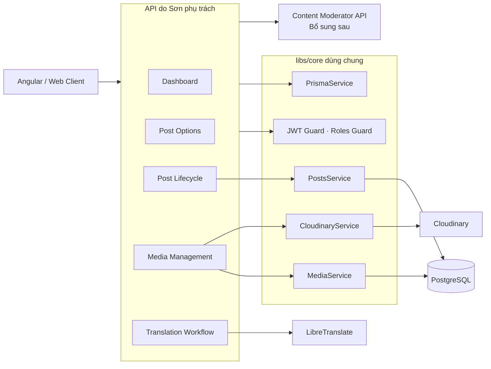

# PHÂN CHIA CÔNG VIỆC — SƠN

> Phạm vi đã hoàn thành trong phiên bản hiện tại: `src/blogowner` và các phần validation liên quan trong `libs/core`. Phần `src/moderator` sẽ được bổ sung vào tài liệu sau khi hoàn thiện và kiểm thử.

## 1. Thông tin tài liệu

| Thuộc tính          | Nội dung                                                                                   |
| ------------------- | ------------------------------------------------------------------------------------------ |
| Thành viên          | Sơn                                                                                        |
| Vai trò đề xuất     | Backend Developer — Blog Owner & Content Moderator APIs                                    |
| Phạm vi đã ghi nhận | Blog Owner API, quản lý bài viết/media, workflow kiểm duyệt phía tác giả, dịch đa ngôn ngữ |
| Phạm vi sẽ bổ sung  | Content Moderator API                                                                      |
| Công nghệ           | NestJS 11, TypeScript, Prisma 7, PostgreSQL, Cloudinary, LibreTranslate                    |
| Ngày rà soát        | 01/08/2026                                                                                 |
| Căn cứ đánh giá     | Source Blog Owner hiện tại, unit test, build và kiểm tra API đã xác nhận pass              |

---

## 2. Tổng quan phần việc

Đã xây dựng và hoàn thiện module **Blog Owner**, cung cấp **12 endpoint** cho tác giả quản lý toàn bộ vòng đời bài viết của chính mình: dashboard, danh sách lựa chọn, CRUD bài viết, gửi duyệt, quản lý media và tạo nội dung đa ngôn ngữ.

Phần việc không chỉ triển khai controller/service riêng trong `src/blogowner`, mà còn bổ sung validation ở `libs/core/src/modules/posts` để bảo đảm mọi luồng tạo/cập nhật bài dùng chung đều tuân thủ tính toàn vẹn của language, category và tag.

### 2.1. Vai trò của phần việc trong kiến trúc



---

## 3. Công việc đã thực hiện trong `src/blogowner`

## 3.1. Xây dựng module và bảo vệ phân quyền

Đã triển khai `BlogownerApiModule` với các controller/service chuyên biệt:

| Thành phần                             | Trách nhiệm                                             |
| -------------------------------------- | ------------------------------------------------------- |
| `BlogownerDashboardController/Service` | Thống kê bài viết và tương tác của owner                |
| `BlogownerOptionsController/Service`   | Cung cấp language/category/tag cho form                 |
| `BlogownerPostsController/Service`     | Quản lý bài, gửi duyệt và bản dịch                      |
| `BlogownerMediaController/Service`     | Thêm/xóa media của bài                                  |
| `BlogownerPostHelperService`           | Ownership, state transition, upload/rollback dùng chung |
| `TranslationService`                   | Adapter tích hợp LibreTranslate                         |

Toàn bộ controller Blog Owner áp dụng:

- `JwtAuthGuard` để bắt buộc access token.
- `RolesGuard` và `@Roles(UserRole.BLOG_OWNER)` để giới hạn đúng role.
- `@CurrentUser()` để lấy owner ID từ JWT, không tin `authorId` do client gửi.
- `ParseIntPipe` cho các path ID.
- `ClassSerializerInterceptor` cho response bài viết.

## 3.2. Dashboard Blog Owner

Đã xây dựng dashboard gồm:

- Tổng số bài chưa bị soft-delete.
- Số bài theo từng trạng thái `DRAFT`, `PENDING_REVIEW`, `PUBLISH`, `REJECT`.
- Tổng lượt xem, lượt thích và bình luận trên các bài của owner.
- Biểu đồ view/like trong 7 ngày gần nhất theo lịch Việt Nam.
- Luôn trả đủ 7 ngày, kể cả ngày không có dữ liệu.
- Top 5 bài đã xuất bản theo lượt xem.
- Top 5 bài đã xuất bản theo lượt thích.
- Gom các truy vấn dashboard vào Prisma transaction.

## 3.3. Options cho form tạo và chỉnh sửa bài

Đã triển khai endpoint lấy dữ liệu lựa chọn có kiểm soát:

- Chỉ trả language chưa xóa và `isActive=true`.
- Trả `isDefault`, `isActive` để frontend chọn ngôn ngữ mặc định và đồng bộ model.
- Đưa language mặc định lên đầu, sau đó sắp theo code.
- Chỉ trả category chưa xóa, thuộc language đang hoạt động và Category Group chưa xóa.
- Trả quan hệ `language` và `categoryGroup` để frontend lọc/nhóm category.
- Chỉ trả tag chưa bị soft-delete.

## 3.4. Quản lý bài viết theo ownership

Đã triển khai các luồng:

- Lấy danh sách bài của chính owner với search, filter và pagination.
- Cố định `authorId` theo JWT.
- Xem chi tiết bài ở mọi trạng thái.
- Trả lý do từ chối và thời gian review cho Blog Owner.
- Trả toàn bộ phiên bản ngôn ngữ trong cùng nhóm bài.
- Tạo bài với JSON hoặc multipart.
- Cập nhật nội dung, category, tag, thumbnail và media.
- Soft-delete bài.
- Chặn truy cập/sửa/xóa bài của owner khác.

Helper `findOwnedPost()` phân biệt rõ:

- bài không tồn tại/đã xóa: `404`;
- bài tồn tại nhưng không thuộc owner: `403`.

## 3.5. Xây dựng workflow trạng thái kiểm duyệt

Đã chuẩn hóa state transition phía Blog Owner:

| Thao tác               | Trước            | Sau                                           |
| ---------------------- | ---------------- | --------------------------------------------- |
| Tạo nháp               | —                | `DRAFT`                                       |
| Tạo và gửi duyệt ngay  | —                | Tạo `DRAFT`, upload xong mới `PENDING_REVIEW` |
| Sửa bài nháp           | `DRAFT`          | `DRAFT`                                       |
| Sửa bài bị từ chối     | `REJECT`         | `DRAFT`                                       |
| Sửa bài đã xuất bản    | `PUBLISH`        | `PENDING_REVIEW`                              |
| Sửa bài đang chờ duyệt | `PENDING_REVIEW` | Bị chặn                                       |
| Submit                 | `DRAFT`          | `PENDING_REVIEW`                              |

Các bảo vệ đã bổ sung:

- Blog Owner không thể gửi `status` hoặc `parentPostId` khi tạo bài.
- Blog Owner không thể sửa `status`, `parentPostId` hoặc `languageId` trực tiếp.
- Chặn `PATCH {}` để không làm `REJECT -> DRAFT` hoặc `PUBLISH -> PENDING_REVIEW` khi không có thay đổi thật.
- Bài `REJECT` phải được chỉnh sửa trước khi submit lại.
- Bài `PUBLISH` chỉ quay lại kiểm duyệt khi có chỉnh sửa thật.
- Review metadata (`reviewedById`, `reviewedAt`, `rejectionReason`) được reset đúng thời điểm.

## 3.6. Quản lý thumbnail và media an toàn

Đã triển khai:

- Upload thumbnail ảnh vào thư mục riêng theo post ID.
- Upload media ảnh/video và tự nhận diện `MediaType` theo MIME.
- Giới hạn file 10 MB ở controller.
- Soft-delete media trong database.
- Cleanup file Cloudinary theo đúng resource type ảnh/video.
- Kiểm tra media phải thuộc đúng bài trước khi xóa.

Các failure path đã được xử lý:

- Upload nhiều media: nếu file sau thất bại, rollback toàn bộ media đã upload trước đó theo thứ tự ngược.
- Nếu một lần rollback thất bại, tiếp tục cleanup các media còn lại và giữ nguyên lỗi upload ban đầu.
- Khi cập nhật thumbnail mới, chỉ xóa thumbnail cũ sau khi database update thành công.
- Nếu upload thumbnail mới thành công nhưng database không lưu được URL, xóa thumbnail mới và giữ lỗi database ban đầu.
- Với bài `PUBLISH`, rời trạng thái public trước khi thay đổi media.
- Với bài `REJECT`, chỉ chuyển về `DRAFT` sau khi thay đổi media thành công.
- Xóa media: database soft-delete trước, Cloudinary cleanup sau; lỗi Cloudinary không rollback database.

## 3.7. Xây dựng quy trình bài viết đa ngôn ngữ

Đã triển khai hai bước tách biệt:

1. **Translate preview**: dịch tự động title/content, chỉ trả preview, không ghi database.
2. **Save translation**: nhận nội dung đã được owner kiểm tra/chỉnh sửa và lưu thành Post `DRAFT`.

Quy tắc nhóm bản dịch:

- Mọi bản dịch trỏ về bài gốc bằng `parentPostId`.
- Có thể bắt đầu từ bài gốc hoặc một bản dịch; backend luôn tìm root post.
- Mỗi nhóm chỉ có một phiên bản active cho mỗi language.
- Nếu bản dịch active đã tồn tại, trả `409`.
- Nếu bản dịch đã soft-delete, restore record cũ thay vì tạo record mới.
- Khi restore: cập nhật title/content/thumbnail/category/tag, xóa `deletedAt`, reset `publishedAt` và review metadata.
- Category được ánh xạ theo `CategoryGroup` và language đích.
- Chỉ sao chép tag chưa bị soft-delete.
- Bản dịch mới luôn `DRAFT` và phải submit riêng.

## 3.8. Tích hợp LibreTranslate

Đã thay luồng dịch tự động bằng LibreTranslate self-host:

- Cấu hình URL qua `TRANSLATE_API_URL`.
- Dịch `title` và `content` trong một request batch.
- Gửi `format=html` để bảo toàn cấu trúc nội dung HTML.
- Trim và lowercase language code.
- Chuẩn hóa alias Chinese:
  - `zh-CN`, `zh-Hans` → `zh`;
  - `zh-TW`, `zh-Hant` → `zt`.
- Chặn source và target giống nhau sau chuẩn hóa.
- Phân loại lỗi rõ ràng:
  - chưa cấu hình: `503`;
  - không kết nối được: `502`;
  - request/cặp ngôn ngữ không được hỗ trợ: `400`;
  - lỗi dịch vụ ngoài: `502`;
  - JSON/response không hợp lệ: `502`.
- Không ghi database nếu preview dịch thất bại.

## 3.9. Đảm bảo tính toàn vẹn tại `libs/core/src/modules/posts`

Đã bổ sung/củng cố validation dùng chung cho Post:

- Validate language tồn tại, chưa xóa và đang active khi tạo bài.
- Validate language mới nếu update có đổi language ở luồng core.
- Category phải:
  - tồn tại;
  - chưa bị xóa;
  - đúng language của bài;
  - thuộc language đang active;
  - thuộc Category Group chưa bị xóa.
- Validate toàn bộ `tagIds`, không cho dùng tag đã soft-delete.
- Khi dùng `tagNames`, phát hiện tag cùng tên đã soft-delete để tránh lỗi unique và tránh hồi sinh ngầm.
- Chỉ tạo tên tag hoàn toàn mới.
- Query lại tag active sau khi tạo để lấy ID chính xác.
- Giới hạn tổng tag tối đa 5.

---

## 4. Danh sách API Blog Owner đã triển khai

| Mã  | Method | Endpoint                                          | Chức năng                      |
| --- | ------ | ------------------------------------------------- | ------------------------------ |
| B01 | GET    | `/api/v1/blog-owner/dashboard`                    | Dashboard của owner            |
| B02 | GET    | `/api/v1/blog-owner/options`                      | Language/category/tag cho form |
| B03 | GET    | `/api/v1/blog-owner/posts`                        | Danh sách bài của owner        |
| B04 | GET    | `/api/v1/blog-owner/posts/:id`                    | Chi tiết bài và nhóm dịch      |
| B05 | POST   | `/api/v1/blog-owner/posts`                        | Tạo bài                        |
| B06 | PATCH  | `/api/v1/blog-owner/posts/:id`                    | Chỉnh sửa bài                  |
| B07 | DELETE | `/api/v1/blog-owner/posts/:id`                    | Soft-delete bài                |
| B08 | POST   | `/api/v1/blog-owner/posts/:id/submit`             | Gửi Moderator duyệt            |
| B09 | POST   | `/api/v1/blog-owner/posts/:id/translate-preview`  | Preview dịch tự động           |
| B10 | POST   | `/api/v1/blog-owner/posts/:id/translations`       | Tạo/restore bản dịch           |
| B11 | POST   | `/api/v1/blog-owner/posts/:postId/media`          | Upload media                   |
| B12 | DELETE | `/api/v1/blog-owner/posts/:postId/media/:mediaId` | Xóa media                      |

Chi tiết request/response được mô tả trong `BLOGOWNER_API_DOCUMENTATION.md`.

---

## 5. Kiểm thử và chất lượng

Đã xây dựng hoặc bổ sung unit test cho:

| File test                                           | Phạm vi                                                                 |
| --------------------------------------------------- | ----------------------------------------------------------------------- |
| `blogowner-api.module.spec.ts`                      | Module khởi tạo đúng dependency                                         |
| `blogowner-dashboard.service.spec.ts`               | Thống kê, top post và dữ liệu 7 ngày                                    |
| `blogowner-options.service.spec.ts`                 | Language/category/tag active và thứ tự default language                 |
| `blogowner-post-helper.service.spec.ts`             | Ownership, state helper, rollback upload nhiều media                    |
| `blogowner-posts.service.spec.ts`                   | Create/update/submit/translation/thumbnail rollback và state transition |
| `blogowner-media.service.spec.ts`                   | Upload/xóa media theo từng trạng thái                                   |
| `translation.service.spec.ts`                       | LibreTranslate success, normalize code và toàn bộ failure path          |
| `libs/core/src/modules/posts/posts.service.spec.ts` | Validation language/category/tag dùng chung                             |

Các nhóm kiểm tra đã được xác nhận pass:

```powershell
npm test -- src/blogowner --runInBand
npm test -- libs/core/src/modules/posts/posts.service.spec.ts --runInBand
npm run build
```

Ngoài unit test, luồng dịch preview bằng LibreTranslate self-host và các luồng chính Blog Owner đã được kiểm tra qua Postman.

---

## 6. Các quyết định kỹ thuật nổi bật

### 6.1. Tạo DRAFT trước khi gửi duyệt

Ngay cả khi owner chọn gửi duyệt trong request create, backend vẫn tạo `DRAFT`, hoàn tất file rồi mới chuyển `PENDING_REVIEW`. Quyết định này ngăn Moderator nhìn thấy bài chưa upload xong.

### 6.2. Tách preview dịch và lưu bản dịch

Không tự động ghi kết quả máy dịch vào database. Owner phải xem/chỉnh sửa preview trước khi lưu, giúp giảm nội dung dịch sai được đưa thẳng vào workflow kiểm duyệt.

### 6.3. State transition phụ thuộc thay đổi thật

Request update rỗng không được coi là chỉnh sửa. Điều này bảo vệ tính chính xác của trạng thái `REJECT` và `PUBLISH`.

### 6.4. Ưu tiên nhất quán database và trạng thái public

- Bài `PUBLISH` rời trạng thái public trước khi media bị thay đổi.
- Thumbnail/media có cleanup hoặc rollback khi thao tác sau thất bại.
- Lỗi cleanup không ghi đè lỗi nghiệp vụ/database ban đầu.

### 6.5. Dùng Category Group làm cầu nối đa ngôn ngữ

Bản dịch không sao chép category ID của bài nguồn. Backend tìm category tương ứng trong cùng Category Group và đúng language đích, bảo đảm semantic category nhất quán giữa các phiên bản.

---

## 7. Kết quả bàn giao Blog Owner

| Hạng mục                  | Trạng thái                       |
| ------------------------- | -------------------------------- |
| Controller và phân quyền  | Hoàn thành                       |
| Dashboard                 | Hoàn thành                       |
| Post options              | Hoàn thành                       |
| CRUD bài viết             | Hoàn thành                       |
| Workflow gửi duyệt        | Hoàn thành                       |
| Media/thumbnail           | Hoàn thành                       |
| Bản dịch đa ngôn ngữ      | Hoàn thành                       |
| LibreTranslate            | Hoàn thành                       |
| Validation core liên quan | Hoàn thành                       |
| Unit test và build        | Pass                             |
| API documentation         | `BLOGOWNER_API_DOCUMENTATION.md` |

**Kết luận:** phần backend **Blog Owner đã hoàn thành** theo phạm vi hiện tại.

---

## 8. Phần Moderator
