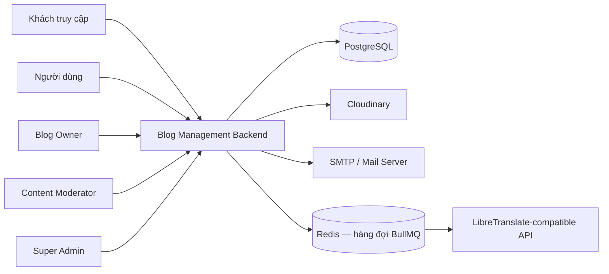
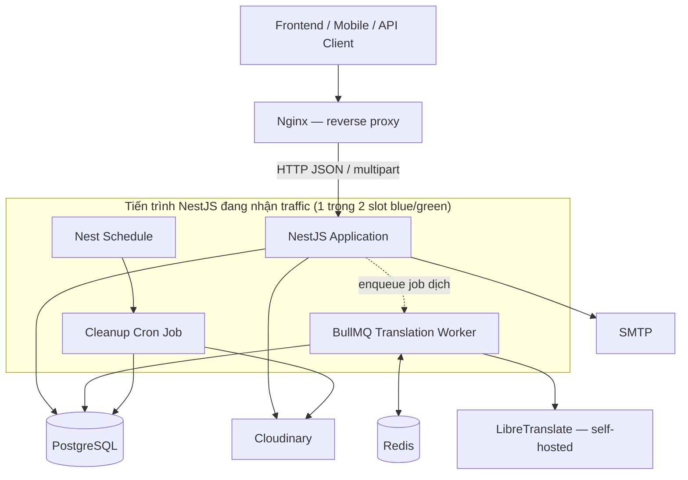
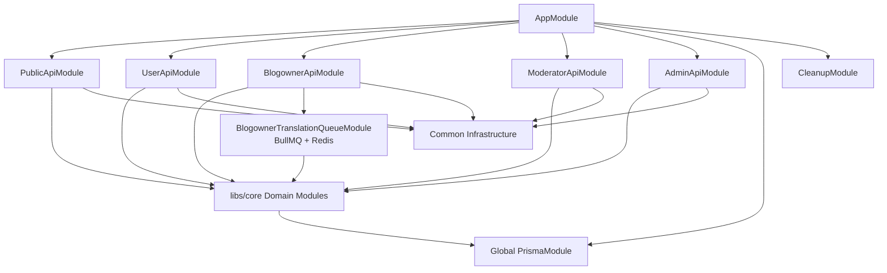
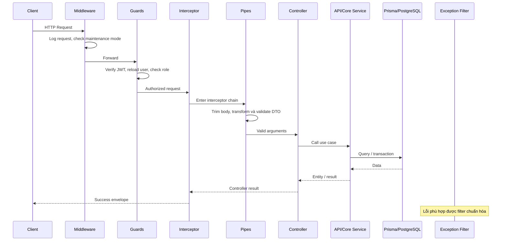
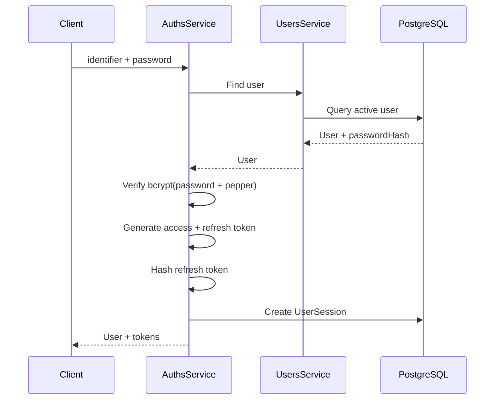
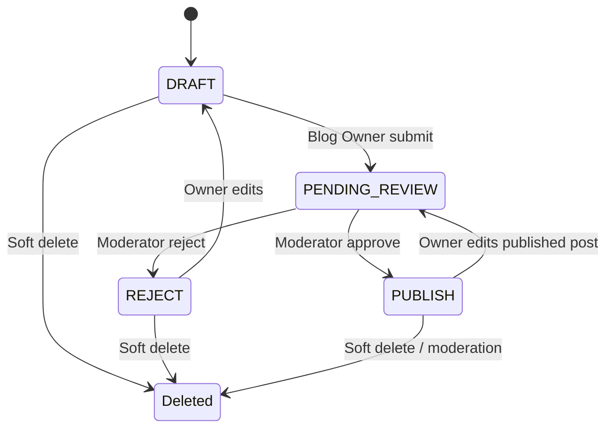
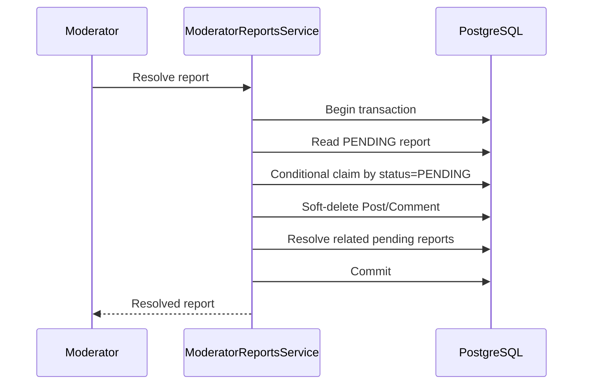
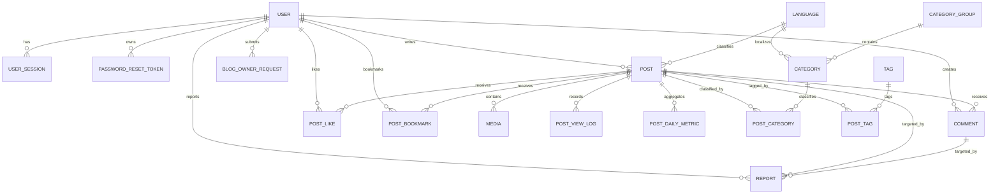
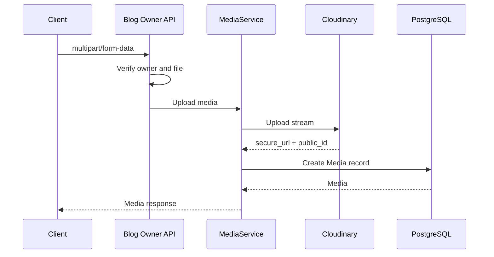
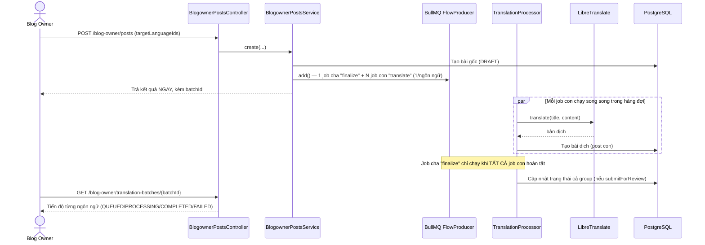

# KIẾN TRÚC HỆ THỐNG QUẢN LÝ BLOG

> Tài liệu kiến trúc kỹ thuật của backend NestJS, mô tả cấu trúc module, luồng xử lý request, mô hình dữ liệu, xác thực–phân quyền, tích hợp ngoài, tính nhất quán và hướng mở rộng hệ thống.

## 1. Thông tin tài liệu

| Thuộc tính | Giá trị |
|---|---|
| Dự án | Quản lý Blog |
| Kiến trúc | Modular Monolith |
| Backend | NestJS 11, TypeScript 5.7 |
| ORM | Prisma 7 |
| Cơ sở dữ liệu | PostgreSQL |
| Base URL mặc định | `/api/v1` |
| Cổng mặc định | `8080` |
| Ngày rà soát source | 19/09/2026 |
| Phạm vi | `src`, `libs/core`, Prisma schema, migration, seed và cấu hình runtime |
| Số nhóm API | 5 |
| Tổng số endpoint hiện tại | 92 |
| Số model Prisma | 20 |
| Số enum nghiệp vụ | 8 |
| Số file unit test/spec | 68 |


---

## 2. Mục tiêu kiến trúc

Kiến trúc của dự án được tổ chức để đáp ứng các mục tiêu sau:

1. Tách API theo nhóm người dùng và vai trò nghiệp vụ.
2. Tái sử dụng logic lõi giữa Public, User, Blog Owner, Moderator và Admin.
3. Duy trì một tiến trình triển khai duy nhất trong giai đoạn hiện tại.
4. Bảo vệ dữ liệu bằng JWT, role guard, validation và constraint tại database.
5. Hỗ trợ vòng đời bài viết có kiểm duyệt.
6. Hỗ trợ nội dung đa ngôn ngữ và các bản dịch liên kết.


### 2.1. Lý do chọn Modular Monolith

Hệ thống hiện chưa cần độ phức tạp vận hành của microservice. Modular Monolith phù hợp vì:

- Các domain còn liên quan chặt chẽ và dùng chung một database.
- Transaction giữa bài viết, danh mục, tag, report và user cần thực hiện thuận tiện.
- Đội phát triển có thể build, test và deploy một ứng dụng duy nhất.
- NestJS module tạo được ranh giới code đủ rõ để tách service sau này khi thật sự cần.

Đổi lại, đội phát triển phải duy trì kỷ luật dependency. Nếu các module API truy cập chéo trực tiếp hoặc business logic bị dồn vào controller, monolith sẽ nhanh chóng trở thành một khối khó bảo trì.

---

## 3. Bối cảnh hệ thống



### 3.1. Actor chính

| Actor | Chức năng chính |
|---|---|
| Khách truy cập | Đăng ký, đăng nhập, đọc bài, xem tác giả, tag, danh mục và bình luận |
| `NORMAL` | Quản lý hồ sơ, follow, like, bookmark, comment, report và xin quyền Blog Owner |
| `BLOG_OWNER` | Tạo, sửa, dịch, gửi duyệt và quản lý media cho bài viết của mình |
| `CONTENT_MODERATOR` | Duyệt bài, xử lý report và quản lý nhóm danh mục |
| `SUPER_ADMIN` | Quản lý user, role, trạng thái, ngôn ngữ và yêu cầu Blog Owner |

### 3.2. Hệ thống ngoài

| Hệ thống | Mục đích | Giao tiếp |
|---|---|---|
| PostgreSQL | Dữ liệu nghiệp vụ chính | Prisma Client qua `@prisma/adapter-pg` |
| Cloudinary | Lưu avatar, thumbnail, ảnh và video | Cloudinary SDK, upload stream |
| SMTP | Gửi email đặt lại mật khẩu | Nodemailer qua Nest Mailer |
| Redis | Backing store cho hàng đợi dịch bài viết nền | `ioredis`, qua `@nestjs/bullmq` |
| Translation API | Dịch tiêu đề và nội dung, gọi từ worker BullMQ (không còn gọi trực tiếp trong request) | HTTP `POST /translate` |

---

## 4. Kiến trúc triển khai hiện tại

> Cập nhật 19/09/2026: khác với mô tả trước đây (một tiến trình Node.js đơn lẻ), hệ thống hiện **đang chạy thật trên production** (`blogy.id.vn`), triển khai theo mô hình **blue-green** — luôn có tối đa 2 tiến trình API tồn tại song song trong lúc deploy, và có một hàng đợi nền (Redis + BullMQ) chạy ngay trong tiến trình API. Chi tiết vận hành đầy đủ (CI/CD, runbook, sự cố thật đã gặp) nằm ở `DEPLOYMENT.md` ở thư mục gốc backend — mục này chỉ tóm tắt phần liên quan tới kiến trúc.



### 4.1. Đơn vị triển khai

- Một package backend, đóng gói thành Docker image, build và lưu trên GitHub Container Registry (GHCR) theo từng commit.
- **2 tiến trình NestJS chạy song song theo mô hình blue-green** (`api-blue`, `api-green`) — tại một thời điểm chỉ một slot thực sự nhận traffic qua Nginx; slot còn lại rảnh hoặc đang được deploy phiên bản mới. Trong khoảng "grace period" ngắn ngay sau khi chuyển traffic, cả 2 slot cùng tồn tại.
- Một PostgreSQL database dùng chung cho cả 2 slot.
- **Có message broker**: Redis, dùng làm backing store cho hàng đợi BullMQ xử lý việc dịch bài viết chạy nền — khác với mô tả cũ ("không có message broker").
- Worker xử lý hàng đợi (`@Processor` của `@nestjs/bullmq`) chạy **ngay trong cùng tiến trình NestJS**, không phải một container/service tách riêng — nghĩa là mỗi slot blue/green đều tự mang theo một worker riêng.
- Background task định kỳ (dọn dữ liệu soft-delete) vẫn dùng `@nestjs/schedule` chạy cùng tiến trình như trước.
- Toàn bộ hạ tầng (Nginx, Postgres, Redis, LibreTranslate, frontend Angular) chạy trên **một VPS duy nhất** qua Docker Compose.

### 4.2. Hệ quả vận hành

- Deploy không gây downtime cho người dùng — phiên bản mới được kiểm tra kỹ trước khi Nginx chuyển traffic sang, phiên bản cũ vẫn giữ sống một khoảng ngắn để phòng cần quay lại ngay.
- Transaction nội bộ (trong cùng một request, cùng một slot) vẫn thuận tiện như trước; nhưng vì có 2 slot cùng đọc/ghi chung một database trong lúc deploy, **mọi thay đổi schema phải tuân theo nguyên tắc expand → migrate → contract** (xem `DEPLOYMENT.md`) để tránh slot cũ bị lỗi vì không hiểu schema mới.
- Cron job (`CleanupService`) chạy cùng tiến trình API — vì có 2 slot cùng tồn tại trong grace period, về lý thuyết cả 2 có thể cùng kích hoạt job trong cùng khung giờ; job hiện tại là idempotent (chạy lại không gây hại) nên chưa cần cơ chế khóa phân tán, nhưng đây là điểm cần lưu ý nếu sau này thêm cron job không idempotent.
- **Đã có hàng đợi** (BullMQ + Redis) — tác vụ nặng (dịch bài viết, có thể chạy 10-20 phút với bài dài) được tách hẳn khỏi request lifecycle, có cơ chế retry tự động (3 lần, backoff tăng dần) khi thất bại tạm thời.
- Vì worker sống chung tiến trình với API, khi một slot bị dừng lúc deploy, ứng dụng chủ động chờ job dịch đang xử lý dở hoàn tất trước khi thoát hẳn (tối đa 15 phút) thay vì ngắt đột ngột.

---

## 5. Cấu trúc source

```text
backend/
├── database/
│   ├── migrations/
│   ├── schema.prisma
│   └── seed.ts
├── docker/                      # nginx.conf, nginx-blogy/, libretranslate/
├── scripts/                     # deploy-blue-green.sh, rollback.sh, backup/restore...
├── libs/
│   └── core/
│       └── src/
│           ├── common/
│           │   ├── decorators/
│           │   ├── exceptions/
│           │   ├── filters/
│           │   ├── guards/
│           │   ├── interceptors/
│           │   ├── interfaces/
│           │   ├── middlewares/
│           │   ├── pipes/
│           │   └── utils/
│           ├── config/
│           ├── core/prisma/
│           └── modules/         # + health/, translation/ (mới)
├── src/
│   ├── public/
│   ├── user/
│   ├── blogowner/
│   │   └── queues/               # BullMQ: processor, queue service, status service (mới)
│   ├── moderator/
│   ├── admin/
│   ├── app.module.ts
│   └── main.ts
├── compose.shared.yml            # prod: layer sống lâu dài (nginx, postgres, redis...)
├── compose.slot.yml              # prod: template 1 slot API blue-green
├── package.json
├── prisma.config.ts
└── tsconfig.json
```

### 5.1. Quy ước vai trò của từng vùng

| Vùng | Trách nhiệm |
|---|---|
| `src/*` | API theo actor: controller, DTO, response entity và orchestration service |
| `libs/core/common` | Cross-cutting concerns dùng chung toàn hệ thống |
| `libs/core/modules` | Domain service và entity/DTO dùng lại giữa nhiều API module |
| `libs/core/core/prisma` | Kết nối database và Prisma Client |
| `libs/core/config` | Nạp cấu hình theo namespace |
| `database` | Schema, migration và seed |

---

## 6. Kiến trúc module



### 6.1. API modules

| Module | Prefix chính | Endpoint | Core dependency chính |
|---|---|---:|---|
| `PublicApiModule` | `/register`, `/login`, `/posts`, `/authors`, `/categories`, `/tags` | 16 | Users, Auths, Posts, Categories, Tags, Languages |
| `UserApiModule` | `/auth`, `/user` | 28 | Users, Auths, Comments, Reports, Cloudinary, Blog Owner Requests |
| `BlogownerApiModule` | `/blog-owner` | 14 | Auths, Posts, Media, Cloudinary, Translation, BullMQ Queue (Redis) |
| `ModeratorApiModule` | `/moderator` | 18 | Auths, Posts, Reports, Translation, Prisma |
| `AdminApiModule` | `/admin` | 16 | Users, Auths, Blog Owner Requests, Languages, Prisma |

### 6.2. Core domain modules

| Module | Trách nhiệm |
|---|---|
| `AuthsModule` | Register, login, refresh, logout, reset password và session |
| `UsersModule` | CRUD user, hash mật khẩu và soft delete |
| `PostsModule` | CRUD bài viết, lọc, phân trang và tăng view count |
| `CommentsModule` | Tạo, sửa, xóa comment và reply |
| `CategoriesModule` | Category và Category Group |
| `TagsModule` | Tag và soft-delete/restore |
| `LanguagesModule` | Ngôn ngữ, mã ngôn ngữ và trạng thái active/default |
| `ReportsModule` | CRUD report dùng chung |
| `BlogOwnerRequestsModule` | Yêu cầu nâng cấp vai trò |
| `MediaModule` | Upload/xóa media và đồng bộ metadata |
| `CloudinaryModule` | Adapter Cloudinary |
| `MailModule` | Gửi email đặt lại mật khẩu |
| `CleanupModule` | Xóa cứng dữ liệu soft-delete quá 30 ngày |
| `SecurityLogsModule` | Service lưu security log; hiện chưa được tích hợp rộng vào request flow |
| `HealthModule` | Endpoint `health/live`, `health/ready` phục vụ health-check của Docker và Nginx trong deploy blue-green |
| `TranslationModule` | `LibreTranslateService` — gọi API LibreTranslate tự host; được worker BullMQ và Moderator (dịch thử tên danh mục) dùng chung |

### 6.3. Dependency rule đề xuất

Các dependency nên đi theo một chiều:

```text
Controller
    ↓
API Service theo actor
    ↓
Core Domain Service
    ↓
Prisma / External Adapter
```

Quy tắc:

- Controller không truy cập Prisma trực tiếp.
- Controller không chứa business rule phức tạp.
- API service có thể orchestration nhiều core service.
- Core service không import controller hoặc service thuộc `src/*`.
- External integration cần được bọc trong provider/service riêng.
- Entity response chịu trách nhiệm loại bỏ dữ liệu nội bộ khỏi JSON.

Source hiện tuân thủ phần lớn mô hình này, nhưng một số API service vẫn truy cập `PrismaService` trực tiếp để thực hiện truy vấn đặc thù hoặc transaction nghiệp vụ.

---

## 7. Luồng xử lý HTTP



Interceptor bao quanh phần thực thi controller. Nếu lỗi phát sinh, exception filter phù hợp chuẩn hóa response thay vì tạo success envelope.

### 7.1. Thứ tự xử lý chính

1. `LoggerMiddleware` ghi method, URL, status, user-agent, IP và duration.
2. `MaintenanceMiddleware` trả `503` nếu bật bảo trì.
3. `JwtAuthGuard` xác thực access token và kiểm tra trạng thái user trong database.
4. `RolesGuard` kiểm tra role khớp chính xác với `@Roles(...)`.
5. `TransformInterceptor` mở interceptor chain và chờ kết quả xử lý.
6. `TrimPipe` trim đệ quy mọi string trong request body.
7. `ValidationPipe` transform DTO, whitelist field và từ chối field thừa.
8. Controller gọi service.
9. `TransformInterceptor` bọc kết quả thành success envelope.
10. `HttpExceptionFilter` hoặc `PrismaClientExceptionFilter` chuẩn hóa các nhóm lỗi mà filter bắt được.

### 7.2. Success envelope

```json
{
  "success": true,
  "statusCode": 200,
  "data": {},
  "timestamp": "2026-07-30T08:50:00.000Z"
}
```

### 7.3. Error envelope

```json
{
  "success": false,
  "statusCode": 400,
  "message": [
    "property extraField should not exist"
  ],
  "path": "/api/v1/register",
  "timestamp": "2026-07-30T08:50:00.000Z"
}
```

`PrismaClientExceptionFilter` hiện trả cấu trúc gần giống nhưng chưa có `path`, vì vậy error envelope chưa hoàn toàn đồng nhất giữa mọi loại lỗi.

---

## 8. Kiến trúc xác thực và phân quyền

### 8.1. Access token và refresh token

- Access token dùng trong `Authorization: Bearer <token>`.
- Refresh token được gửi trong JSON body của refresh/logout.
- Hai loại token sử dụng secret riêng.
- Access token mặc định sống 15 phút.
- Refresh token mặc định sống 7 ngày.
- Refresh token được hash bằng bcrypt trước khi lưu vào `user_sessions`.
- Mỗi lần login tạo một session theo thiết bị/IP.



### 8.2. Refresh flow

1. Xác minh chữ ký và hạn của refresh token.
2. Lấy user hiện tại và kiểm tra tài khoản có bị khóa không.
3. Lấy các session active của user.
4. So sánh refresh token với từng `refreshTokenHash`.
5. Kiểm tra thay đổi `deviceInfo`.
6. Nếu hợp lệ, cấp access token mới.

Thiết kế này bảo vệ refresh token ở trạng thái lưu trữ, nhưng chi phí tra cứu tăng theo số session active vì phải bcrypt-compare tuần tự.

### 8.3. JWT guard

`JwtAuthGuard` không chỉ xác minh chữ ký token mà còn query user ở mỗi request để:

- Xác nhận user chưa bị xóa mềm.
- Xác nhận user chưa bị khóa.
- Lấy role mới nhất từ database.

Ưu điểm là thay đổi trạng thái tài khoản có hiệu lực ngay. Nhược điểm là mọi request protected đều thêm một database query.

### 8.4. Role guard

`RolesGuard` hiện kiểm tra bằng:

```text
requiredRoles.includes(user.role)
```

Hệ thống không áp dụng kế thừa role. `SUPER_ADMIN` không tự động có quyền của `CONTENT_MODERATOR` hoặc `BLOG_OWNER` nếu route không khai báo role đó.

### 8.5. Password reset

- Token reset là chuỗi ngẫu nhiên 32 byte.
- Database lưu bcrypt hash thay vì token thô.
- Token sống 15 phút và chỉ dùng một lần.
- Sau khi đổi mật khẩu, toàn bộ session của user bị revoke.
- Forgot-password trả message giống nhau dù email tồn tại hay không để chống user enumeration.

---

## 9. Phân tách API theo vai trò

### 9.1. Public boundary

Public API chỉ cho phép đọc nội dung đã xuất bản và thực hiện các use case xác thực công khai.

Quy tắc quan trọng:

- Public post service ghi đè `status` thành `PUBLISH`.
- Nội dung soft-delete bị loại khỏi query.
- Có thể chọn ngôn ngữ qua `languageId`, query `lang` hoặc `Accept-Language`.
- Lượt xem **không** còn ghi tự động khi gọi chi tiết bài viết — client gọi riêng `POST /posts/:id/view` sau khi xác nhận người đọc thật sự xem bài, chạy trong transaction (không phải fire-and-forget), xem mục 13.1.

### 9.2. User boundary

User API xử lý dữ liệu thuộc người dùng đang đăng nhập:

- Hồ sơ cá nhân.
- Follow/unfollow.
- Like/bookmark.
- Comment và report.
- Yêu cầu Blog Owner.

Một số controller chỉ dùng `JwtAuthGuard`, nghĩa là mọi role hợp lệ đều truy cập được. Một số controller giới hạn chính xác `NORMAL` và `BLOG_OWNER`.

### 9.3. Blog Owner boundary

Mọi route Blog Owner dùng:

```text
JwtAuthGuard + RolesGuard + BLOG_OWNER
```

Service luôn kiểm tra quyền sở hữu bài viết trước khi sửa, xóa, upload media hoặc gửi duyệt.

### 9.4. Moderator boundary

Moderator API dùng role `CONTENT_MODERATOR` để:

- Claim và xử lý bài chờ duyệt.
- Xử lý report bằng transaction.
- Quản lý Category Group.

### 9.5. Admin boundary

Các thao tác quản lý user chỉ dành cho `SUPER_ADMIN`.

- Đọc dashboard Admin.
- Đọc danh sách/chi tiết language.
- Xem và xử lý yêu cầu Blog Owner.

---

## 10. Kiến trúc domain

### 10.1. Identity và account

Model chính:

- `User`
- `UserSession`
- `PasswordResetToken`
- `BlogOwnerRequest`

Trách nhiệm:

- Danh tính và profile.
- Role và trạng thái khóa.
- Session theo thiết bị.
- Reset password.
- Quy trình nâng cấp quyền.

### 10.2. Content publishing

Model chính:

- `Post`
- `Media`
- `Language`
- `CategoryGroup`
- `Category`
- `Tag`
- `PostCategory`
- `PostTag`

Vòng đời bài viết:



Quy tắc chính:

- Blog Owner không được tạo thẳng `PUBLISH`.
- Khi tạo bài và upload file, backend tạo `DRAFT` trước rồi mới chuyển `PENDING_REVIEW`.
- Bài đang `PENDING_REVIEW` không được Owner sửa.
- Sửa bài `REJECT` đưa bài về `DRAFT`.
- Sửa bài `PUBLISH` đưa bài về `PENDING_REVIEW` và xóa metadata duyệt cũ.

### 10.3. Multilingual content

Mỗi bài có một `languageId`.

Các bản dịch liên kết bằng:

```text
Post.parentPostId
```

Database có unique constraint:

```text
(parentPostId, languageId)
```

Constraint này ngăn tạo nhiều bản dịch cùng ngôn ngữ trong một nhóm bài.

Category đa ngôn ngữ được nhóm bằng `CategoryGroup`; mỗi group chỉ có một category cho mỗi language.

### 10.4. Community interaction

Model chính:

- `Comment`
- `PostLike`
- `PostBookmark`
- `UserFollow`
- `PostViewLog`
- `PostDailyMetric`

Các bảng like, bookmark và follow dùng composite primary key để ngăn dữ liệu trùng:

```text
PostLike:      (postId, userId)
PostBookmark:  (postId, userId)
UserFollow:    (followerId, followingId)
```

Comment hỗ trợ quan hệ self-reference qua `parentId`. Service chuẩn hóa reply nhiều cấp về comment gốc để response public giữ cấu trúc hai cấp.

### 10.5. Moderation và report

Model `Report` hỗ trợ hai target:

- `POST`
- `COMMENT`

Khi Moderator resolve report:

1. Claim report đang `PENDING` bằng conditional update.
2. Soft-delete target.
3. Resolve toàn bộ report pending còn lại cùng target.
4. Lưu moderator, thời gian và resolution note.
5. Thực hiện toàn bộ trong Prisma transaction.



Conditional update giúp phát hiện hai Moderator xử lý cùng một report tại cùng thời điểm.

---

## 11. Kiến trúc dữ liệu

### 11.1. Nhóm model

| Nhóm | Model |
|---|---|
| Identity | `User`, `UserSession`, `PasswordResetToken`, `SecurityLog` |
| Content | `Post`, `Media`, `Language` |
| Taxonomy | `CategoryGroup`, `Category`, `Tag`, `PostCategory`, `PostTag` |
| Interaction | `Comment`, `PostLike`, `PostBookmark`, `UserFollow`, `PostViewLog`, `PostDailyMetric` |
| Workflow | `BlogOwnerRequest`, `Report` |

### 11.2. ERD rút gọn



### 11.3. Soft delete

Các model có `deletedAt`:

- User
- Language
- CategoryGroup
- Category
- Post
- Media
- Comment
- Tag

Query nghiệp vụ phải luôn xác định rõ có lấy bản ghi soft-delete hay không.

### 11.4. Cleanup

`CleanupService` chạy mỗi ngày lúc 00:00:

1. Xác định dữ liệu soft-delete quá 30 ngày.
2. Xóa file media trên Cloudinary.
3. Xóa cứng record Media.
4. Xóa cứng record User, Language, Category, Post, Comment và Tag.

`CategoryGroup` có `deletedAt` nhưng chưa nằm trong danh sách cleanup hiện tại.

### 11.5. Cascade và restrict

- Session, token, post, comment và interaction thường cascade khi user/post bị xóa cứng.
- Language và CategoryGroup dùng `Restrict` ở các quan hệ quan trọng để tránh xóa dữ liệu đang được tham chiếu.
- Report dùng `SetNull` cho post/comment/reviewer ở một số quan hệ để giữ lịch sử report.

### 11.6. Index chính

Schema đã có index cho các truy vấn phổ biến:

- User theo role/status.
- Session theo user và expiration.
- Post theo author, language, status, created/published date.
- Comment theo post, user, parent và created date.
- Report theo target, status và reviewer.
- View log theo post, viewer và thời gian.
---

## 12. Tính nhất quán và transaction

### 12.1. Trường hợp đang dùng transaction

- Admin khóa user và revoke toàn bộ session.
- Admin đổi role và revoke session cũ.
- Moderator resolve/reject report.
- Moderator xử lý trạng thái bài viết ở các luồng cạnh tranh.
- Một số thao tác cập nhật quan hệ nhiều bảng trong core service.

### 12.2. Optimistic claim bằng conditional update

Một số workflow dùng:

```text
UPDATE ... WHERE id = ? AND status = PENDING
```

Sau đó kiểm tra `count === 1`. Đây là cách đơn giản để chống hai người xử lý cùng một bản ghi mà không cần lock ứng dụng.

### 12.3. External side effect

Cloudinary và SMTP không nằm trong transaction database.

Nguyên tắc hiện tại:

- Ưu tiên cập nhật trạng thái database trước ở luồng xóa media.
- Nếu cleanup Cloudinary lỗi, database vẫn giữ media là đã xóa.
- Khi upload thumbnail mới nhưng DB update lỗi, service cố gắng xóa file mới để tránh file rác.
- Email reset thất bại được log và use case vẫn trả message chung.

Đây là mô hình **best-effort compensation**, chưa phải distributed transaction.

### 12.4. Các rủi ro còn lại

- Tác vụ external có thể hoàn thành một phần.
- Không có outbox/inbox pattern.
- Riêng tác vụ dịch bài viết đã có queue (BullMQ) với retry tự động — nhưng các tác vụ external khác (Cloudinary, SMTP) vẫn theo mô hình best-effort compensation ở trên, chưa được đưa vào queue.
- Ghi lượt xem đã chuyển từ fire-and-forget sang endpoint riêng chạy trong transaction (xem mục 13.1) — rủi ro mất dữ liệu do process dừng giữa chừng đã giảm đáng kể so với thiết kế cũ, nhưng vẫn phụ thuộc frontend có gọi đúng endpoint hay không (không tự động ở tầng đọc bài).

---

## 13. Kiến trúc xếp hạng và lượt xem hiện tại

### 13.1. Lượt xem

Thiết kế lại 2026-09-10 (cùng đợt thêm hàng đợi dịch nền) — tách hẳn khỏi luồng đọc chi tiết bài, chuyển thành endpoint riêng `POST /posts/:id/view` do frontend chủ động gọi khi xác nhận người đọc thật sự đã xem bài (qua thời gian đọc hợp lệ), tránh tính view giả từ bot/prefetch:

- `postId` trong request là **đúng phiên bản ngôn ngữ đang đọc**, không tự quy về bài gốc — `viewCount` của đúng bản ghi đó được tăng.
- `viewerKey` dựa trên `userId` (đã đăng nhập) hoặc `visitorId` do frontend tự sinh (khách) — không còn dùng IP, tránh nhiều người dùng chung mạng/NAT bị tính gộp làm một.
- Deduplicate theo `(postId, viewerKey)` trong cửa sổ **10 phút** (trước là 5 phút).
- Tăng `viewCount`, tạo `PostViewLog` và cập nhật `PostDailyMetric` trong **cùng một transaction mức Serializable**, có tự động thử lại khi xung đột — không còn là fire-and-forget.
- Khi trả bài viết cho client (`GET /posts/:id`, danh sách...), `viewCount` hiển thị luôn là **tổng của cả nhóm ngôn ngữ** (bài gốc + mọi bản dịch), tính bằng một aggregate query riêng — để người đọc chuyển ngôn ngữ không thấy view "biến mất" dù dữ liệu tăng view vẫn ghi theo từng bản ghi riêng lẻ ở trên. Đây là bug thật đã gặp và sửa trong quá trình refactor (xem `DEPLOYMENT.md`).

### 13.2. Top post

Top post dùng raw SQL với công thức kết hợp:

- View count.
- Like count.
- Comment count.
- Bookmark count.
- Time decay.

Trọng số hiện tại:

```text
0.05 × views
+ 2 × likes
+ 5 × comments
+ 3 × bookmarks
```

Sau đó chia cho hàm suy giảm theo tuổi bài viết.

### 13.3. Top tag

Tag score là trung bình hot score của các bài `PUBLISH` thuộc tag.

### 13.4. Hạn chế kiến trúc

- Raw SQL chứa nhiều correlated subquery.
- Điểm ranking được tính lại trong request.
- Chưa có bảng aggregate/cached score.
- Chưa có search relevance; search chủ yếu dùng `contains`.

---

## 14. Kiến trúc tích hợp ngoài

### 14.1. Cloudinary



Media lưu cả `mediaUrl` và `publicId`. `publicId` dùng để xóa file thật.

### 14.2. SMTP

- Mail module hỗ trợ Gmail service hoặc SMTP host/port.
- Link reset được tạo từ `FRONTEND_URL`.
- Email dùng HTML inline.
- Không có mail queue; request forgot-password chờ gửi mail hoàn thành.

### 14.3. Translation service

`LibreTranslateService` (`libs/core/src/modules/translation`) gọi `TRANSLATE_API_URL` theo API contract của LibreTranslate:

- Gửi title và content trong một request (`q` dạng mảng), `format: html` giữ nguyên thẻ HTML.
- Lỗi kết nối trả `502`; thiếu cấu hình (`TRANSLATE_API_URL` rỗng) trả `503`.
- Có 2 nơi gọi tới service này:
  - **Moderator "dịch thử tên danh mục"** (`POST /moderator/category-groups/translate-preview`) — vẫn gọi **đồng bộ, trực tiếp trong request** vì chỉ dịch một chuỗi ngắn (tên danh mục), không cần đưa vào hàng đợi.
  - **Blog Owner dịch bài viết** — xem mục 14.4, đã chuyển hẳn sang chạy nền qua hàng đợi, không còn gọi đồng bộ trong request tạo/sửa bài.

### 14.4. Hàng đợi dịch bài viết nền (BullMQ + Redis)

Thiết kế lại 2026-09-10, sau khi xác nhận thật trên production rằng dịch một bài viết dài ra nhiều ngôn ngữ trong cùng một request `POST/PATCH /blog-owner/posts` có thể chạy hợp lệ 10-20 phút trên hạ tầng CPU-only — chặn cả request đó tới khi dịch xong từng gây lỗi 502 thật cho người dùng (chi tiết sự cố ở `DEPLOYMENT.md`).



Các điểm kiến trúc đáng chú ý:

- Dùng **BullMQ Flow** (`FlowProducer`), không phải queue đơn giản — job "finalize" là cha, mỗi ngôn ngữ đích là một job con; BullMQ đảm bảo cha chỉ chạy sau khi toàn bộ con hoàn tất (dù thành công hay thất bại).
- Mỗi job có `attempts: 3` kèm backoff kiểu exponential (3s, 6s, 12s...) — lỗi tạm thời (mất kết nối LibreTranslate) tự thử lại thay vì thất bại ngay.
- `removeOnComplete`/`removeOnFail` giới hạn số lượng job giữ lại trong Redis — tránh Redis phình dữ liệu không kiểm soát theo thời gian.
- Worker (`@Processor`) chạy **ngay trong tiến trình API** (`api-blue`/`api-green`), không phải container riêng — xem hệ quả vận hành ở mục 4.
- `GET /blog-owner/translation-batches/:batchId` cho phép frontend chủ động hỏi lại tiến độ thay vì chờ WebSocket/SSE (hệ thống hiện chưa có kênh đẩy dữ liệu thời gian thực).
- Redis giới hạn RAM cứng ở tầng ứng dụng (`--maxmemory 200mb --maxmemory-policy noeviction`) — đầy bộ nhớ thì từ chối ghi job mới (lỗi bắt được) thay vì bị hệ điều hành buộc dừng đột ngột và mất toàn bộ job đang xếp hàng.

### 14.5. PostgreSQL và Prisma

`PrismaService`:

- Kế thừa `PrismaClient`.
- Dùng `pg.Pool` và `PrismaPg` adapter.
- Kết nối khi module init, disconnect khi module destroy.
- Có tùy chọn log query.

Cấu hình có `DB_POOL_SIZE`, nhưng source hiện chưa truyền giá trị này vào `pg.Pool`, nên pool dùng mặc định của package `pg`.

---

## 15. Kiến trúc validation và dữ liệu đầu vào

### 15.1. DTO validation

`ValidationPipe` bật:

```text
transform = true
whitelist = true
forbidNonWhitelisted = true
```

Hệ quả:

- Primitive có thể được transform theo DTO/pipe.
- Field ngoài DTO làm request thất bại thay vì bị bỏ qua.
- DTO là hợp đồng đầu vào chính giữa frontend và backend.

### 15.2. Trim

`TrimPipe` chỉ xử lý body, không trim query hoặc path parameter.

### 15.3. Pagination

Decorator `Pagination`:

- `page` mặc định 1.
- `limit` mặc định 10.
- `limit` tối đa 50.
- Chuyển thành `skip`, `take`, `page` cho Prisma.

### 15.4. Profanity validation

Custom decorator:

- Chuẩn hóa Unicode NFKC.
- Chuyển lowercase theo locale Việt Nam.
- Tìm từ cấm theo word boundary Unicode.
- Tránh false-positive như `dm` trong `admin`.

Danh sách từ cấm hiện được hard-code trong source và cần chuyển sang cấu hình/database nếu muốn quản trị động.

---

## 16. Kiến trúc lỗi

### 16.1. Lỗi nghiệp vụ

Core cung cấp custom exception cho các trường hợp như:

- User không tồn tại.
- Email/username trùng.
- Sai thông tin đăng nhập.
- Token/session không hợp lệ.
- Tài khoản bị khóa.
- Không phải chủ sở hữu bài viết.
- Không được tự thao tác trên chính mình.

### 16.2. Lỗi Prisma

Filter hiện ánh xạ:

| Prisma code | HTTP |
|---|---:|
| `P2002` | `409 Conflict` |
| `P2025` | `404 Not Found` |
| Khác | `500 Internal Server Error` |

### 16.3. Giới hạn hiện tại

- Chưa có global filter bắt mọi lỗi không phải `HttpException` hoặc Prisma known error.
- Chưa có error code ổn định cho frontend.
- Message tiếng Việt đang đóng vai trò hợp đồng không chính thức.
- Một số filter trả envelope hơi khác nhau.

Kiến trúc mục tiêu nên bổ sung:

```json
{
  "success": false,
  "statusCode": 409,
  "code": "USER_EMAIL_ALREADY_EXISTS",
  "message": "Email đã tồn tại.",
  "path": "/api/v1/register",
  "requestId": "...",
  "timestamp": "..."
}
```

---

## 17. Logging và observability

### 17.1. Hiện trạng

`LoggerMiddleware` ghi:

- HTTP method.
- URL.
- Status code.
- Content length.
- User-Agent.
- IP.
- Duration.

Các service quan trọng dùng NestJS `Logger` cho mail và cleanup.

## 18. Cấu hình runtime

Cấu hình được nạp bằng `ConfigModule` và chia namespace:

| Namespace | Biến chính |
|---|---|
| `app` | `NODE_ENV`, `APP_PORT`, `API_PREFIX`, `FRONTEND_URL`, `MAINTENANCE_MODE`, `PASSWORD_PEPPER` |
| `database` | `DATABASE_URL`, `DB_LOG_QUERIES`, `DB_POOL_SIZE` |
| `jwt` | Access/refresh secret và expiration |
| `cloudinary` | Cloud name, API key, API secret và folder |
| `mail` | SMTP host, port, secure, user, password và from |
| Translation | `TRANSLATE_API_URL` được đọc trực tiếp từ `ConfigService` |
| Redis/BullMQ | `REDIS_HOST`, `REDIS_PORT`, `REDIS_USERNAME`, `REDIS_PASSWORD` — đọc trực tiếp từ `ConfigService` trong `BullModule.forRootAsync` |

---

