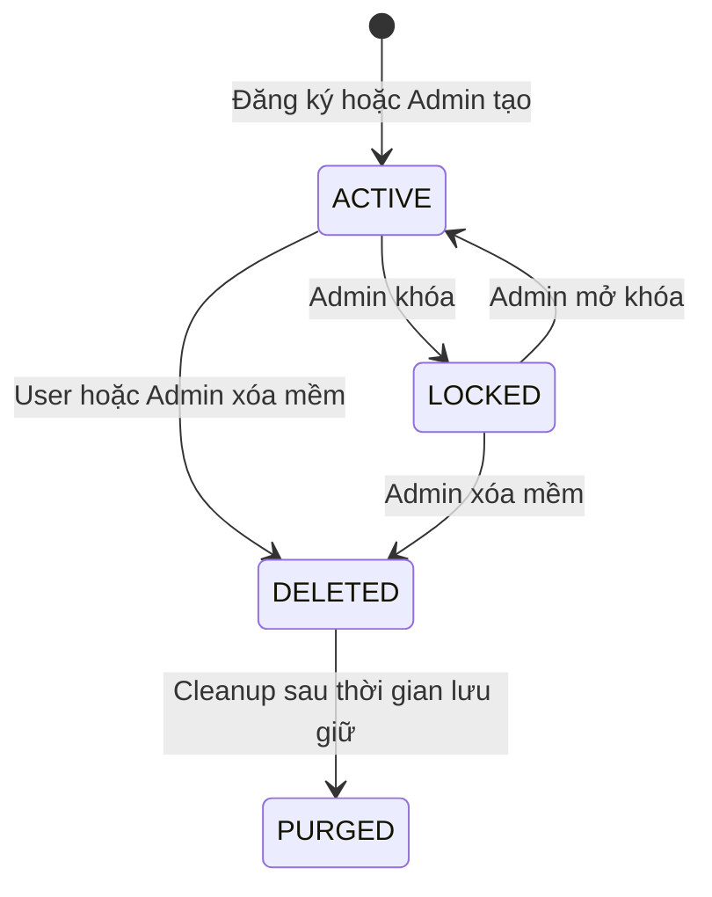
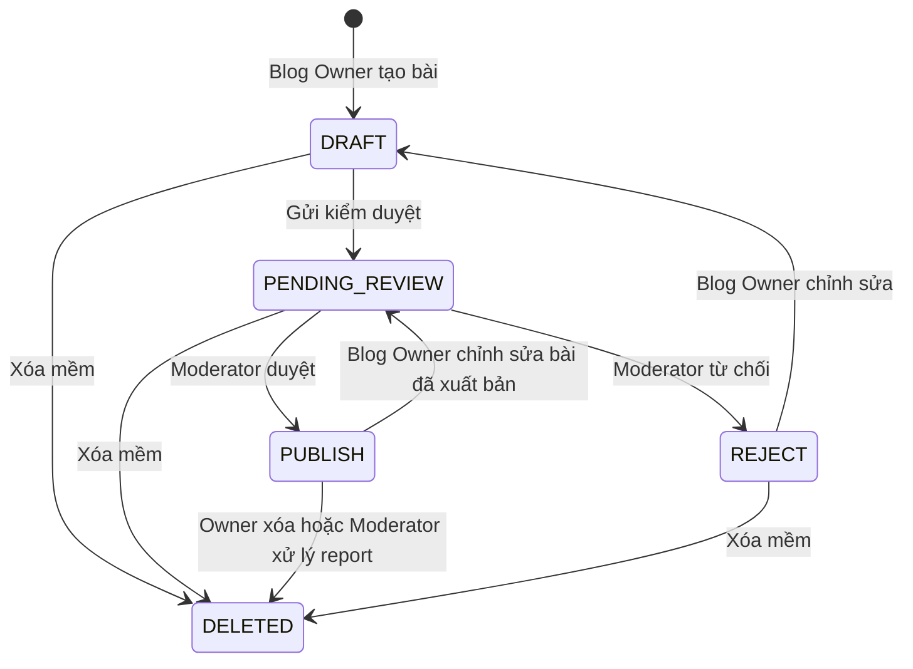
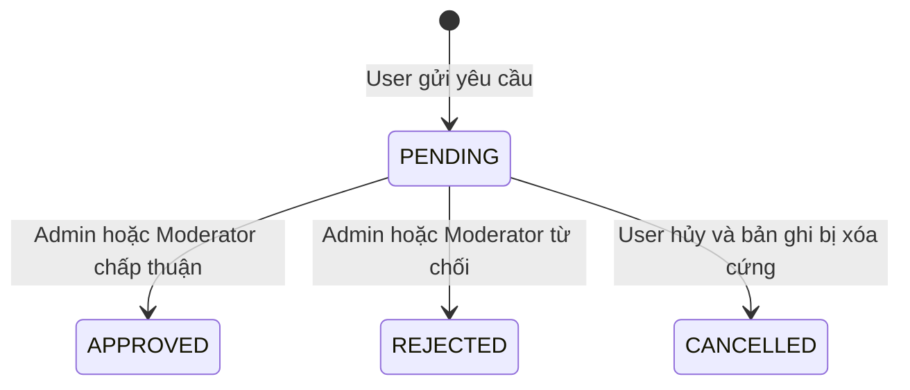
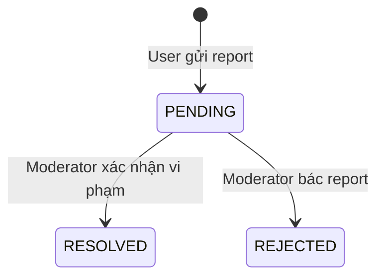
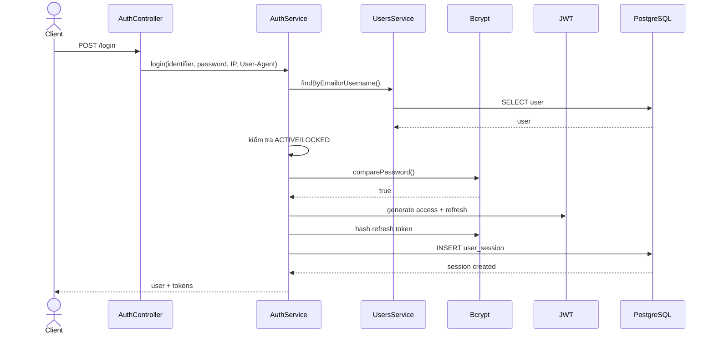
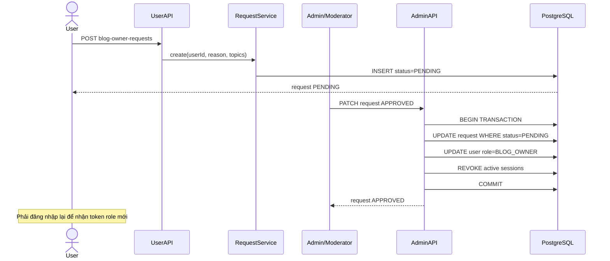
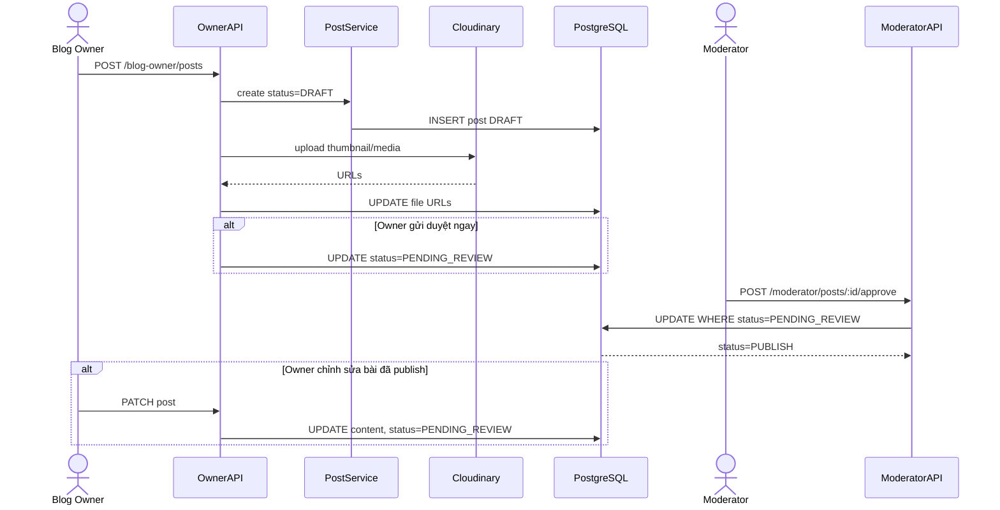
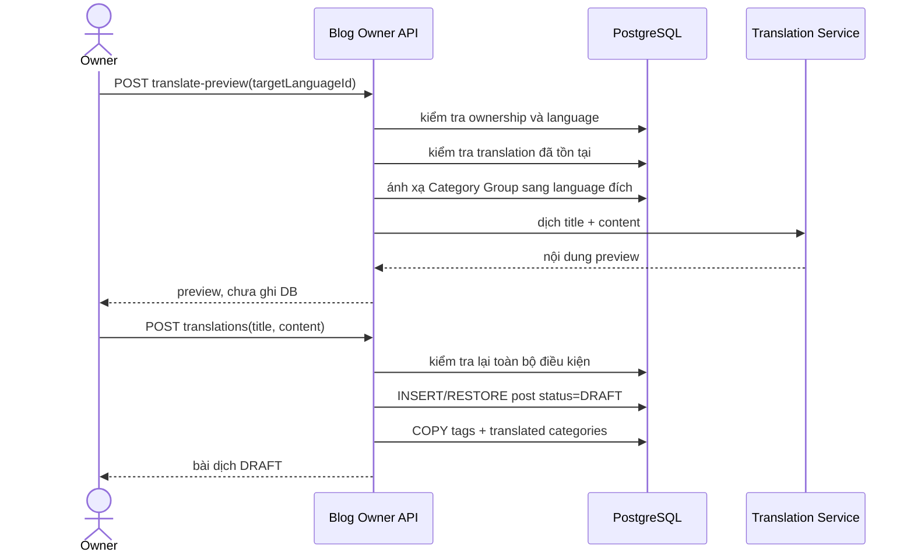
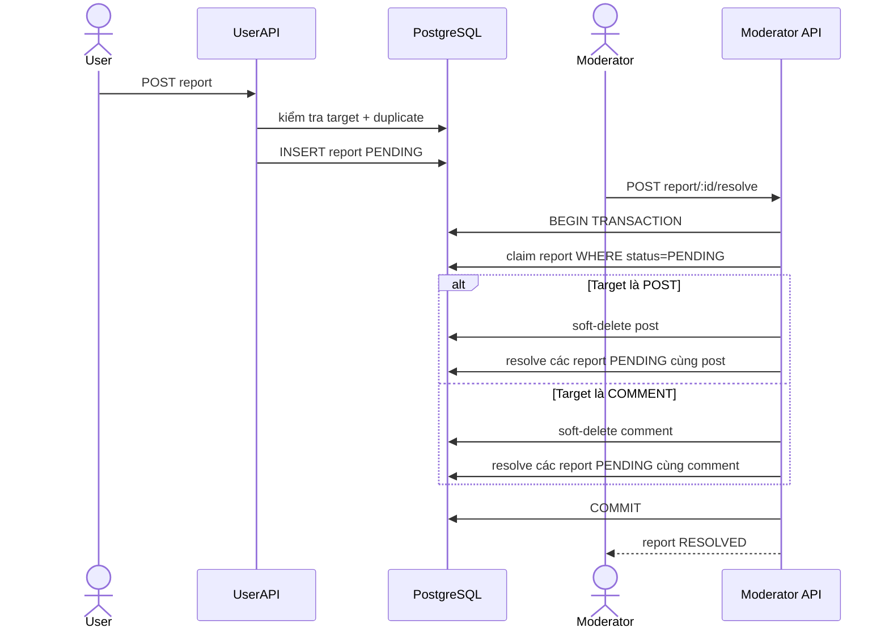

# LUỒNG NGHIỆP VỤ HỆ THỐNG QUẢN LÝ BLOG

> Tài liệu mô tả các quy trình nghiệp vụ xuyên suốt của backend Quản lý Blog, từ đăng ký tài khoản, tương tác nội dung, xin quyền Blog Owner, xuất bản bài viết, kiểm duyệt, báo cáo vi phạm đến quản trị hệ thống.

## 1. Thông tin tài liệu

| Thuộc tính | Giá trị |
|---|---|
| Dự án | Quản lý Blog |
| Kiến trúc | Modular Monolith |
| Backend | NestJS 11, TypeScript 5.7 |
| ORM | Prisma 7 |
| Cơ sở dữ liệu | PostgreSQL |
| Base URL mặc định | `/api/v1` |
| Ngày rà soát source | 30/07/2026 |
| Phạm vi | Public, User, Blog Owner, Moderator, Admin và tác vụ nền |
| Tổng số nhóm API | 5 |
| Tổng số endpoint trong source | 83 |
| Mục tiêu sử dụng | Phân tích nghiệp vụ, phát triển frontend, kiểm thử, nghiệm thu và bảo trì |

---

## 2. Mục tiêu của tài liệu

Tài liệu này trả lời các câu hỏi sau:

1. Ai là người khởi tạo từng quy trình?
2. Điều kiện nào phải thỏa mãn trước khi quy trình bắt đầu?
3. Backend kiểm tra và thay đổi dữ liệu theo thứ tự nào?
4. Trạng thái nghiệp vụ thay đổi ra sao?
5. Những trường hợp nào làm quy trình thất bại?
6. Những thao tác nào cần transaction hoặc cơ chế chống xử lý đồng thời?
7. Frontend cần làm gì sau khi nhận kết quả?

Tài liệu không thay thế tài liệu API chi tiết. Tài liệu API mô tả request và response của từng endpoint; tài liệu workflow mô tả cách nhiều endpoint và module phối hợp để hoàn thành một mục tiêu nghiệp vụ.

---

## 3. Actor và phạm vi trách nhiệm

| Actor | Role hệ thống | Trách nhiệm chính |
|---|---|---|
| Khách truy cập | Không có JWT | Đăng ký, đăng nhập, đọc bài, xem tác giả, danh mục, tag và bình luận |
| Người dùng | `NORMAL` | Quản lý hồ sơ, follow, like, bookmark, comment, report và xin quyền Blog Owner |
| Chủ blog | `BLOG_OWNER` | Soạn bài, quản lý media, dịch bài, gửi kiểm duyệt và theo dõi nội dung của mình |
| Kiểm duyệt viên | `CONTENT_MODERATOR` | Duyệt bài, xử lý report và quản lý nhóm danh mục đa ngôn ngữ |
| Quản trị viên | `SUPER_ADMIN` | Quản lý user, role, trạng thái tài khoản, ngôn ngữ và yêu cầu Blog Owner |
| Hệ thống | Scheduler / service | Ghi view, gửi email, dọn dữ liệu và thu hồi session khi cần |

### 3.1. Lưu ý về phân quyền hiện tại

`RolesGuard` kiểm tra role theo kiểu khớp chính xác. Role cao hơn không tự động kế thừa quyền của role thấp hơn.

Ví dụ:

- Route chỉ khai báo `BLOG_OWNER` không tự động cho `SUPER_ADMIN` truy cập.
- Route chỉ khai báo `CONTENT_MODERATOR` không tự động cho `SUPER_ADMIN` truy cập.
- Muốn cho nhiều role truy cập, controller phải liệt kê trực tiếp tất cả role bằng `@Roles(...)`.

---

## 4. Quy tắc chung áp dụng cho mọi workflow

### 4.1. Tiền xử lý request

Mọi request đi qua các thành phần sau:

1. `LoggerMiddleware` ghi nhận request.
2. `MaintenanceMiddleware` có thể chặn hệ thống trong chế độ bảo trì.
3.  `JwtAuthGuard` xác thực access token nếu route không public.
4. `RolesGuard` kiểm tra role nếu route khai báo `@Roles`.
5. `TrimPipe` cắt khoảng trắng đệ quy trong body.
6. `ValidationPipe` chuyển kiểu và kiểm tra DTO.
7. Controller gọi service theo actor.
8. API service điều phối domain service trong `libs/core`.
9. Prisma đọc hoặc ghi PostgreSQL.
10. `TransformInterceptor` chuẩn hóa response thành công.
11. Exception filter chuẩn hóa response lỗi.

### 4.2. Validation

Cấu hình validation hiện tại:

```text
transform = true
whitelist = true
forbidNonWhitelisted = true
```

Hệ quả:

- Field ngoài DTO làm request thất bại `400`.
- Body string được trim trước khi validate.
- Query và path không được `TrimPipe` xử lý như body.
- `page` mặc định là `1`.
- `limit` mặc định là `10` và được giới hạn tối đa `50` ở các route sử dụng pagination decorator.

### 4.3. Success envelope

```json
{
  "success": true,
  "statusCode": 200,
  "data": {},
  "timestamp": "2026-07-30T08:50:00.000Z"
}
```

### 4.4. Error envelope

```json
{
  "success": false,
  "statusCode": 400,
  "message": "Mô tả lỗi nghiệp vụ",
  "path": "/api/v1/example",
  "timestamp": "2026-07-30T08:50:00.000Z"
}
```

`message` có thể là chuỗi hoặc mảng chuỗi khi lỗi đến từ `class-validator`.

### 4.5. Quy tắc soft delete

Các tài nguyên chính như user, post, comment, language, category, tag và media có thể sử dụng `deletedAt`.

Quy tắc nghiệp vụ chung:

- Bản ghi có `deletedAt != null` không xuất hiện trong luồng sử dụng bình thường.
- Xóa mềm giúp giữ lịch sử và cho phép cleanup sau này.
- Scheduler chạy mỗi ngày lúc nửa đêm để xóa vĩnh viễn dữ liệu đã soft-delete quá 30 ngày.

---

## 5. Các máy trạng thái nghiệp vụ

### 5.1. Trạng thái tài khoản



### 5.2. Trạng thái bài viết



Quy tắc quan trọng:

- Blog Owner không được tự chuyển bài thành `PUBLISH`.
- Bài `PENDING_REVIEW` không được chỉnh sửa.
- Bài `REJECT` phải được chỉnh sửa để quay về `DRAFT` trước khi gửi lại.
- Chỉnh sửa bài `PUBLISH` làm bài chuyển về `PENDING_REVIEW`.
- Moderator chỉ duyệt hoặc từ chối bài đang `PENDING_REVIEW`.

### 5.3. Trạng thái yêu cầu Blog Owner



Khi `APPROVED`:

- Role user chuyển từ `NORMAL` sang `BLOG_OWNER`.
- Toàn bộ session đang hoạt động bị revoke.
- User phải đăng nhập lại để nhận access token chứa role mới.

### 5.4. Trạng thái report



Khi report được `RESOLVED`:

- Target là post: bài bị soft-delete.
- Target là comment: comment bị soft-delete.
- Các report `PENDING` khác cùng target cũng được chuyển thành `RESOLVED`.

---

## 6. Danh mục workflow

| Mã | Workflow | Actor chính | Kết quả |
|---|---|---|---|
| WF-01 | Đăng ký tài khoản | Khách | Tạo user `NORMAL`, `ACTIVE` |
| WF-02 | Đăng nhập và tạo session | Khách/User | Nhận access token và refresh token |
| WF-03 | Làm mới token và đăng xuất | User | Cấp access token mới hoặc revoke session |
| WF-04 | Quên và đặt lại mật khẩu | User | Đổi password, revoke toàn bộ session |
| WF-05 | Khám phá và đọc nội dung công khai | Khách/User | Nhận bài `PUBLISH`, ghi nhận lượt xem |
| WF-06 | Quản lý hồ sơ và avatar | User | Cập nhật hoặc xóa mềm tài khoản |
| WF-07 | Follow và unfollow | User | Tạo hoặc xóa quan hệ theo dõi |
| WF-08 | Like và bookmark | User | Ghi hoặc bỏ tương tác với bài public |
| WF-09 | Comment và reply | User | Tạo, sửa hoặc xóa mềm bình luận |
| WF-10 | Gửi report | User | Tạo report `PENDING` |
| WF-11 | Gửi và quản lý yêu cầu Blog Owner | User | Tạo, xem hoặc hủy request |
| WF-12 | Duyệt yêu cầu Blog Owner | Admin/Moderator | Đổi trạng thái request và có thể đổi role |
| WF-13 | Soạn và quản lý bài viết | Blog Owner | Tạo, sửa, xóa và gửi kiểm duyệt |
| WF-14 | Quản lý media và bản dịch | Blog Owner | Upload media, tạo preview hoặc bản dịch `DRAFT` |
| WF-15 | Kiểm duyệt bài viết | Moderator | `PENDING_REVIEW` → `PUBLISH` hoặc `REJECT` |
| WF-16 | Xử lý report | Moderator | Ẩn target hoặc bác report |
| WF-17 | Quản lý danh mục đa ngôn ngữ | Moderator | CRUD Category Group và translations |
| WF-18 | Quản trị người dùng | Admin | Tạo Moderator, khóa, mở khóa, đổi role, xóa user |
| WF-19 | Quản lý ngôn ngữ | Admin | CRUD Language và chọn ngôn ngữ mặc định |
| WF-20 | Cleanup dữ liệu | Hệ thống | Xóa vĩnh viễn dữ liệu quá hạn |

---

## 7. Chi tiết các workflow

## WF-01 — Đăng ký tài khoản

### Actor

Khách truy cập.

### Endpoint

```http
POST /api/v1/register
```

### Tiền điều kiện

- Chưa cần access token.
- `username` chưa tồn tại.
- `email` chưa tồn tại.
- Password đáp ứng validation DTO.

### Luồng chính

1. Khách gửi `username`, `email` và `password`.
2. Backend trim các chuỗi trong body.
3. ValidationPipe từ chối field thừa hoặc dữ liệu sai định dạng.
4. `AuthsService.register()` chuyển dữ liệu cho `UsersService.create()`.
5. Backend kiểm tra trùng username và email.
6. Password được băm trước khi lưu.
7. User được tạo với:
   - role `NORMAL`;
   - status `ACTIVE`;
   - `deletedAt = null`.
8. Response trả user nhưng không trả `passwordHash`.

### Nhánh lỗi

| Trường hợp | Kết quả |
|---|---|
| Email đã tồn tại | Từ chối request |
| Username đã tồn tại | Từ chối request |
| Email sai định dạng | `400` |
| Password quá ngắn | `400` |
| Gửi thêm role/status | `400` do field ngoài DTO |

### Dữ liệu thay đổi

- Tạo một bản ghi `users`.
- Không tự động tạo session.
- User phải gọi login sau khi đăng ký.

---

## WF-02 — Đăng nhập và tạo session

### Actor

Khách hoặc user đã có tài khoản.

### Endpoint

```http
POST /api/v1/login
```

### Tiền điều kiện

- Tài khoản tồn tại và chưa bị xóa.
- Tài khoản không ở trạng thái `LOCKED`.
- Password chính xác.

### Luồng chính

1. Client gửi `identifier` là username hoặc email cùng password.
2. Backend tìm user theo username/email.
3. Backend kiểm tra trạng thái tài khoản trước khi so sánh password.
4. Password được so sánh với `passwordHash` bằng bcrypt.
5. `JWTUtil` tạo access token và refresh token.
6. Refresh token được băm trước khi lưu.
7. Backend tạo `user_sessions` gồm:
   - `userId`;
   - `refreshTokenHash`;
   - `deviceInfo` từ `User-Agent`;
   - địa chỉ IP;
   - thời điểm hết hạn sau 7 ngày;
   - `revokedAt = null`.
8. Response trả user và hai token.

### Nhánh lỗi

- Không tìm thấy user: trả lỗi credential chung.
- Password sai: trả cùng loại lỗi credential để hạn chế dò tài khoản.
- Tài khoản bị khóa: từ chối trước khi kiểm tra password và có thể trả `lockReason`.

### Dữ liệu thay đổi

- Tạo một session mới cho mỗi lần login thành công.
- Cho phép nhiều thiết bị có các session riêng.

### Sequence diagram



---

## WF-03 — Làm mới token và đăng xuất

### 3.1. Làm mới access token

```http
POST /api/v1/auth/refresh-token
```

Luồng xử lý:

1. Client gửi refresh token trong body, không dùng Authorization header.
2. Backend xác minh chữ ký và hạn của refresh token.
3. Backend lấy `userId` từ payload.
4. Backend kiểm tra user còn tồn tại và không bị khóa.
5. Backend lấy các session chưa revoke và chưa hết hạn.
6. Refresh token được so sánh lần lượt với `refreshTokenHash` của các session.
7. Nếu `User-Agent` thay đổi so với session đã lưu:
   - session bị revoke;
   - request bị từ chối bằng lỗi session không hợp lệ.
8. Nếu session hợp lệ, backend tạo access token mới.
9. Refresh token cũ vẫn được giữ; source hiện chưa thực hiện refresh-token rotation.

### 3.2. Đăng xuất thiết bị hiện tại

```http
POST /api/v1/auth/logout
```

1. Client gửi refresh token.
2. Backend xác minh token và tìm session có hash tương ứng.
3. Session được gán `revokedAt`.
4. Các session khác của user không bị ảnh hưởng.

### 3.3. Đăng xuất tất cả thiết bị

```http
POST /api/v1/auth/logout-all
Authorization: Bearer <ACCESS_TOKEN>
```

1. `JwtAuthGuard` xác thực user.
2. Backend cập nhật tất cả session chưa revoke của user.
3. Mọi session được gán `revokedAt`.

### Điểm cần cải thiện

- Thực hiện refresh-token rotation.
- Ghi security log khi phát hiện thay đổi thiết bị.
- Xem xét lookup session bằng token identifier thay vì so sánh tuần tự toàn bộ hash.

---

## WF-04 — Quên và đặt lại mật khẩu

### 4.1. Yêu cầu reset

```http
POST /api/v1/forgot-password
```

1. User gửi email.
2. Backend tìm user theo email.
3. Nếu không tìm thấy, backend vẫn trả thông báo chung để chống user enumeration.
4. Nếu tìm thấy:
   - tạo token ngẫu nhiên 32 byte;
   - băm token;
   - lưu `password_reset_tokens` với hạn 15 phút;
   - gửi token/link qua email.
5. Response luôn dùng thông báo trung tính.

### 4.2. Đặt mật khẩu mới

```http
POST /api/v1/reset-password
```

1. Client gửi reset token và password mới.
2. Backend lấy các token chưa dùng và chưa hết hạn.
3. Token thô được so sánh với từng token hash.
4. Nếu tìm thấy token hợp lệ:
   - password mới được băm;
   - cập nhật user;
   - token được đánh dấu `usedAt`;
   - revoke toàn bộ session của user.
5. User phải login lại.

### Nhánh lỗi

- Token sai, đã dùng hoặc hết hạn: từ chối.
- Mail server lỗi: request gửi reset có thể thất bại dù token đã được tạo.

### Đề xuất cải thiện

- Gộp cập nhật password, đánh dấu token và revoke session vào một transaction.
- Chỉ giữ một số lượng token reset giới hạn cho mỗi user.
- Xóa hoặc vô hiệu hóa các token reset cũ khi tạo token mới.

---

## WF-05 — Khám phá và đọc nội dung công khai

### Actor

Khách hoặc mọi role.

### Endpoint chính

```http
GET /api/v1/posts
GET /api/v1/posts/top
GET /api/v1/posts/:id
GET /api/v1/authors/top
GET /api/v1/authors/:id
GET /api/v1/categories
GET /api/v1/tags
GET /api/v1/tags/top
GET /api/v1/posts/:postId/comments
```

### Luồng danh sách bài viết

1. Client gửi bộ lọc và phân trang.
2. Public service luôn ghi đè `status = PUBLISH`.
3. Ngôn ngữ được xác định theo thứ tự:
   - `languageId` trong query;
   - `lang`;
   - `Accept-Language`.
4. Backend lọc bài chưa xóa.
5. Backend tải author, language, categories, tags, media và like count.
6. Response trả `items` và `meta`.

### Luồng đọc chi tiết bài

1. Backend lấy bài theo ID.
2. Nếu bài không phải `PUBLISH`, trả như không tồn tại.
3. Nếu client yêu cầu ngôn ngữ khác:
   - xác định bài gốc bằng `parentPostId ?? id`;
   - tìm bản dịch `PUBLISH` cùng nhóm;
   - nếu có thì trả bản dịch;
   - nếu không có thì giữ bài đang xem.
4. Backend trả bài cho client.
5. Tác vụ ghi view chạy theo kiểu fire-and-forget.
6. Backend chống trùng view theo `postId + viewerKey` trong 5 phút.
7. Nếu chưa có log gần đây:
   - tăng `viewCount`;
   - tạo `post_view_logs`.

### Luồng bài nổi bật

`GET /posts/top` tính điểm từ:

- view count;
- like count;
- comment count;
- bookmark count;
- độ giảm theo tuổi bài viết.

Bài mới có thể cạnh tranh với bài cũ nhờ hệ số decay theo thời gian.

### Hạn chế hiện tại

- Search danh sách bài chủ yếu dùng `contains` trên title.
- Chưa có TF-IDF/BM25.
- Điểm top sử dụng raw SQL với subquery đếm tương tác theo từng bài; cần đo hiệu năng khi dữ liệu tăng.

---

## WF-06 — Quản lý hồ sơ và avatar

### Endpoint

```http
GET    /api/v1/user/profile
PATCH  /api/v1/user/profile
POST   /api/v1/user/profile/avatar
DELETE /api/v1/user/profile
```

### Xem hồ sơ

1. Guard xác thực user.
2. Service tìm user theo ID từ JWT.
3. Response trả thông tin hồ sơ và dữ liệu follow cần thiết.

### Cập nhật thông tin

1. Client gửi các field được DTO cho phép.
2. Backend từ chối field thừa.
3. `UsersService` cập nhật username, bio hoặc dữ liệu cho phép.
4. Entity loại bỏ dữ liệu nhạy cảm.

### Cập nhật avatar

1. Client gửi multipart file.
2. Backend kiểm tra MIME bắt đầu bằng `image/`.
3. Nếu user có avatar cũ, backend cố xóa file cũ trên Cloudinary.
4. File mới được upload vào folder theo user ID.
5. URL mới được lưu vào user.
6. Response trả hồ sơ mới.

### Xóa tài khoản

1. Backend xác minh user tồn tại.
2. Avatar cũ được xóa khỏi Cloudinary nếu có.
3. User được xóa mềm qua `UsersService.remove()`.
4. Các API có guard sẽ từ chối tài khoản có `deletedAt != null`.

### Rủi ro cần lưu ý

- Nếu xóa avatar cũ thành công nhưng upload avatar mới thất bại, user có thể mất avatar cũ.
- Nên upload mới trước, cập nhật DB trong bước tiếp theo, rồi mới xóa file cũ.

---

## WF-07 — Follow và unfollow

### Endpoint

```http
GET    /api/v1/user/follow/followers
GET    /api/v1/user/follow/following
GET    /api/v1/user/follow/:id/followers
GET    /api/v1/user/follow/:id/following
POST   /api/v1/user/follow/:id
DELETE /api/v1/user/follow/:id
```

### Follow

1. User gửi ID người muốn follow.
2. Backend từ chối self-follow.
3. Backend kiểm tra target:
   - tồn tại;
   - chưa bị xóa;
   - đang `ACTIVE`.
4. Backend kiểm tra unique `(followerId, followingId)`.
5. Nếu chưa tồn tại, tạo `user_follows`.

### Unfollow

1. Backend từ chối self-unfollow.
2. Backend kiểm tra quan hệ follow đang tồn tại.
3. Quan hệ được xóa cứng.

### Danh sách follower/following

- Chỉ trả user chưa xóa và đang `ACTIVE`.
- Sắp xếp quan hệ mới nhất trước.
- Hỗ trợ phân trang.

---

## WF-08 — Like và bookmark bài viết

### Endpoint

```http
GET    /api/v1/user/posts/bookmarks
GET    /api/v1/user/posts/likes
POST   /api/v1/user/posts/:id/bookmark
DELETE /api/v1/user/posts/:id/bookmark
POST   /api/v1/user/posts/:id/like
DELETE /api/v1/user/posts/:id/like
```

### Tiền điều kiện

Bài viết phải:

- tồn tại;
- chưa bị xóa;
- có trạng thái `PUBLISH`.

### Like và bookmark

1. Service xác minh bài public hợp lệ.
2. Prisma `upsert` theo khóa ghép:
   - like: `(postId, userId)`;
   - bookmark: `(postId, userId)`.
3. Gọi lặp lại không tạo bản ghi trùng.

### Unlike và unbookmark

1. Service xác minh bài vẫn tồn tại và đang public.
2. `deleteMany` xóa tương tác nếu có.
3. Hành vi bỏ tương tác có tính idempotent ở tầng xóa.

### Danh sách đã tương tác

- Chỉ trả bài `PUBLISH`, chưa xóa.
- Sắp xếp theo thời điểm like/bookmark mới nhất.
- Trả đầy đủ dữ liệu bài dùng cho UI danh sách.

---

## WF-09 — Comment và reply

### Endpoint

```http
POST   /api/v1/user/posts/:postId/comments
PATCH  /api/v1/user/comments/:commentId
DELETE /api/v1/user/comments/:commentId
GET    /api/v1/posts/:postId/comments
```

### Tạo comment gốc

1. User phải có role `NORMAL` hoặc `BLOG_OWNER`.
2. Bài phải `PUBLISH` và chưa xóa.
3. Nội dung phải vượt qua validation và kiểm tra từ cấm.
4. `parentId` để trống hoặc `null`.
5. Backend tạo comment với `userId` từ JWT và `postId` từ path.

### Tạo reply

1. Client gửi `parentId`.
2. Backend xác minh comment cha:
   - tồn tại;
   - chưa xóa;
   - thuộc cùng bài.
3. Nếu client reply vào một reply, backend đưa parent về comment gốc để giữ cấu trúc tối đa hai cấp.
4. Tạo reply với `parentId` là comment gốc.

### Chống spam

Source áp dụng các quy tắc:

- Tối đa 5 comment trong 1 phút.
- Không cho gửi nội dung trùng trên cùng bài trong 1 phút.
- Nội dung phải sạch theo bộ từ cấm.

### Sửa comment

1. Comment phải thuộc user đang đăng nhập.
2. Nội dung mới được trim và validate.
3. Nếu nội dung mới giống nội dung hiện tại, backend từ chối.
4. `updatedAt` được cập nhật.

### Xóa comment

1. Comment phải thuộc user.
2. Backend gán `deletedAt`.
3. Response entity không hiển thị `deletedAt`.

### Hiển thị public

- Chỉ phân trang comment gốc.
- Reply được lồng trong từng comment gốc.
- Comment gốc mới nhất trước.
- Reply trong một thread cũ nhất trước.

---

## WF-10 — Gửi report bài viết hoặc bình luận

### Endpoint

```http
POST /api/v1/user/posts/:postId/reports
POST /api/v1/user/comments/:commentId/reports
```

### Actor

`NORMAL` hoặc `BLOG_OWNER`.

### Report bài viết

1. Backend kiểm tra bài đang `PUBLISH` và chưa xóa.
2. Không cho tác giả report bài của chính mình.
3. Không cho cùng reporter có nhiều report `PENDING` trên cùng bài.
4. Backend tạo report:
   - `targetType = POST`;
   - `postId` có giá trị;
   - `commentId = null`;
   - `status = PENDING`.

### Report comment

1. Comment phải chưa xóa.
2. Bài chứa comment phải đang `PUBLISH` và chưa xóa.
3. Không cho người viết report comment của chính mình.
4. Không cho report `PENDING` trùng target bởi cùng user.
5. Backend tạo report `COMMENT`.

### Kết quả

Report đi vào hàng chờ của Moderator. Việc tạo report không tự động ẩn nội dung.

---

## WF-11 — Gửi và quản lý yêu cầu Blog Owner

### Endpoint

```http
POST   /api/v1/user/blog-owner-requests
GET    /api/v1/user/blog-owner-requests
GET    /api/v1/user/blog-owner-requests/:id
DELETE /api/v1/user/blog-owner-requests/:id
```

### Tạo yêu cầu

1. User gửi lý do và chủ đề mong muốn viết.
2. Backend xác minh user tồn tại.
3. Nếu user đã là `BLOG_OWNER`, từ chối.
4. Nếu user đang có request `PENDING`, từ chối.
5. Tạo request với `status = PENDING`.

### Xem danh sách và chi tiết

- Service luôn ghi đè `userId` bằng ID từ JWT.
- User không thể xem request của người khác dù gửi `userId` trong query.
- Chi tiết request không thuộc user được trả như không tồn tại.

### Hủy yêu cầu

1. Request phải thuộc user.
2. Chỉ request `PENDING` được hủy.
3. Bản ghi bị xóa cứng.
4. Request đã `APPROVED` hoặc `REJECTED` không được hủy.

---

## WF-12 — Duyệt yêu cầu Blog Owner

### Endpoint

```http
GET   /api/v1/admin/requests/blog-owner
PATCH /api/v1/admin/requests/blog-owner/:id
```

### Actor hiện tại trong source

- `SUPER_ADMIN`.
- `CONTENT_MODERATOR` cũng được controller cho phép.

### Luồng phê duyệt

1. Reviewer lấy danh sách request, có thể lọc trạng thái và phân trang.
2. Reviewer chọn request `PENDING`.
3. Gửi `status = APPROVED`.
4. Backend mở Prisma transaction.
5. `updateMany` chỉ cập nhật khi trạng thái DB vẫn là `PENDING`.
6. User được đổi role thành `BLOG_OWNER`.
7. Toàn bộ session của user bị revoke.
8. Request ghi `reviewedById`, `reviewedAt` và `rejectionReason = null`.
9. Transaction commit.

### Luồng từ chối

1. Reviewer gửi `status = REJECTED` và lý do.
2. Backend claim request bằng điều kiện `PENDING`.
3. Request được cập nhật nhưng role user không đổi.

### Chống xử lý đồng thời

Hai reviewer không thể cùng xử lý thành công một request vì update có điều kiện trạng thái. Người xử lý sau nhận lỗi request đã được xử lý.

### Sequence diagram



---

## WF-13 — Soạn và quản lý bài viết

### Endpoint

```http
GET    /api/v1/blog-owner/posts
GET    /api/v1/blog-owner/posts/:id
POST   /api/v1/blog-owner/posts
PATCH  /api/v1/blog-owner/posts/:id
DELETE /api/v1/blog-owner/posts/:id
POST   /api/v1/blog-owner/posts/:id/submit
```

### Actor

Chỉ `BLOG_OWNER`.

### Xem bài của mình

- Service luôn lọc `authorId` theo JWT.
- Owner được xem cả `DRAFT`, `PENDING_REVIEW`, `PUBLISH`, `REJECT`.
- Chi tiết bài trả rejection reason, media và danh sách các phiên bản ngôn ngữ cùng nhóm.
- Owner không thể xem hoặc sửa bài của owner khác qua API này.

### Tạo bài

1. Owner gửi title, content, language, category, tag và file tùy chọn.
2. `submitForReview` là business flag, không phải cột database.
3. Backend luôn tạo bài `DRAFT` trước.
4. Backend upload thumbnail.
5. Backend upload media.
6. Nếu `submitForReview = true`, chỉ sau khi upload hoàn tất mới chuyển bài sang `PENDING_REVIEW`.
7. Cách làm này tránh Moderator thấy một bài đang chờ duyệt nhưng file chưa hoàn tất.

### Chỉnh sửa bài

| Trạng thái hiện tại | Cho sửa? | Trạng thái sau sửa |
|---|---:|---|
| `DRAFT` | Có | `DRAFT` |
| `REJECT` | Có | `DRAFT` |
| `PUBLISH` | Có | `PENDING_REVIEW` |
| `PENDING_REVIEW` | Không | Không đổi |

Quy tắc bổ sung:

- Request không có field thay đổi và không có file sẽ bị từ chối.
- Khi sửa bài `REJECT` hoặc `PUBLISH`, review metadata được reset.
- Thumbnail mới được upload trước; nếu cập nhật DB thất bại, backend cố cleanup file mới.
- Thumbnail cũ chỉ được xóa sau khi DB đã trỏ sang thumbnail mới.

### Gửi kiểm duyệt

1. Owner gọi `/submit`.
2. Bài phải là `DRAFT`.
3. Backend chuyển bài sang `PENDING_REVIEW` và reset dữ liệu review cũ.
4. Bài `REJECT` phải được sửa trước khi gửi lại.

### Xóa bài

- Bài phải thuộc Owner.
- Backend xóa mềm thông qua `PostsService.remove()`.
- Media vật lý có thể được cleanup sau theo cơ chế riêng.

### Sequence diagram vòng đời bài viết



---

## WF-14 — Quản lý media và bản dịch

### 14.1. Upload và xóa media

```http
POST   /api/v1/blog-owner/posts/:postId/media
DELETE /api/v1/blog-owner/posts/:postId/media/:mediaId
```

Quy tắc:

1. Bài phải thuộc Blog Owner.
2. File được upload lên Cloudinary.
3. Backend tạo hoặc cập nhật bản ghi `media` chứa URL và `publicId`.
4. Xóa media sử dụng soft delete ở DB và xóa file theo logic service.
5. Nếu thay đổi media của bài đã `PUBLISH`, bài có thể cần quay lại quy trình kiểm duyệt theo chính sách service.

### 14.2. Xem trước bản dịch tự động

```http
POST /api/v1/blog-owner/posts/:id/translate-preview
```

Luồng:

1. Bài nguồn phải thuộc Owner.
2. Ngôn ngữ đích phải tồn tại, chưa xóa và `isActive = true`.
3. Nhóm bài chưa được có phiên bản ngôn ngữ đích.
4. Bài nguồn phải có category.
5. Mỗi Category Group của bài nguồn phải có category tương ứng ở ngôn ngữ đích.
6. Chỉ sau khi toàn bộ validation thành công, backend mới gọi translation service.
7. API trả title và content đã dịch để preview.
8. Không tạo hoặc cập nhật post.

### 14.3. Lưu bản dịch

```http
POST /api/v1/blog-owner/posts/:id/translations
```

1. Owner gửi title/content đã xác nhận và `targetLanguageId`.
2. Backend xác định `rootPostId = parentPostId ?? sourcePost.id`.
3. Mỗi ngôn ngữ chỉ có một phiên bản trong cùng nhóm dịch.
4. Category được ánh xạ qua `CategoryGroup`, không dịch tên category tại thời điểm tạo bài.
5. Tag được sao chép từ bài nguồn.
6. Thumbnail mặc định kế thừa từ bài nguồn nếu client không gửi URL khác.
7. Bài dịch luôn được tạo ở trạng thái `DRAFT`.
8. Nếu bản dịch cũ cùng ngôn ngữ đã soft-delete, backend khôi phục và tái sử dụng record đó.

### Sequence diagram bản dịch



---

## WF-15 — Kiểm duyệt bài viết

### Endpoint

```http
GET  /api/v1/moderator/posts
GET  /api/v1/moderator/posts/:postId
POST /api/v1/moderator/posts/:postId/approve
POST /api/v1/moderator/posts/:postId/reject
```

### Actor

Chỉ `CONTENT_MODERATOR` theo controller hiện tại.

### Hàng chờ kiểm duyệt

- Mặc định chỉ hiển thị `PENDING_REVIEW`.
- Bài gửi trước được hiển thị trước theo `updatedAt ASC`.
- Moderator có thể lọc thêm `PUBLISH` và `REJECT`.
- Bài `DRAFT` không xuất hiện và được trả như không tồn tại.

### Duyệt bài

1. Moderator mở bài `PENDING_REVIEW`.
2. Backend bắt đầu transaction.
3. Backend kiểm tra bài tồn tại và chưa xóa.
4. Backend kiểm tra trạng thái chính xác là `PENDING_REVIEW`.
5. `updateMany` claim bài bằng điều kiện trạng thái.
6. Cập nhật:
   - `status = PUBLISH`;
   - `reviewedById = moderatorId`;
   - `reviewedAt = now`;
   - `rejectionReason = null`;
   - `publishedAt = publishedAt cũ ?? reviewedAt`.
7. Transaction đọc lại bài đầy đủ và commit.

### Từ chối bài

1. Bài phải `PENDING_REVIEW`.
2. Moderator gửi `rejectionReason`.
3. Backend cập nhật:
   - `status = REJECT`;
   - reviewer và thời gian review;
   - lý do từ chối.
4. `publishedAt` cũ không bị xóa nếu bài từng được xuất bản.

### Chống race condition

Hai Moderator cùng xử lý một bài:

- Người thứ nhất cập nhật thành công.
- Người thứ hai không còn khớp `status = PENDING_REVIEW`.
- Backend trả `409 Conflict` yêu cầu tải lại dữ liệu.

---

## WF-16 — Xử lý report

### Endpoint

```http
GET  /api/v1/moderator/reports
GET  /api/v1/moderator/reports/:reportId
POST /api/v1/moderator/reports/:reportId/resolve
POST /api/v1/moderator/reports/:reportId/reject
```

### Hàng chờ

- Mặc định hiển thị report `PENDING` cũ nhất trước.
- Report đã xử lý hiển thị theo `reviewedAt` mới nhất.
- Chi tiết report chứa reporter, target, author và ngữ cảnh comment cha nếu target là reply.

### Xác nhận report đúng

1. Moderator chọn report `PENDING`.
2. Backend bắt đầu transaction.
3. Backend claim report bằng `updateMany WHERE status = PENDING`.
4. Report được chuyển `RESOLVED` và ghi reviewer/note.
5. Nếu target là post:
   - soft-delete post;
   - chuyển tất cả report `PENDING` khác cùng post thành `RESOLVED`.
6. Nếu target là comment:
   - soft-delete comment;
   - chuyển tất cả report `PENDING` khác cùng comment thành `RESOLVED`.
7. Transaction commit.

### Bác report

1. Report phải `PENDING`.
2. Backend claim report bằng điều kiện trạng thái.
3. Chỉ report đang xét chuyển `REJECTED`.
4. Post/comment không thay đổi.
5. Các report khác cùng target vẫn còn `PENDING`.

### Sequence diagram xử lý report



---

## WF-17 — Quản lý danh mục đa ngôn ngữ

### Endpoint

```http
GET    /api/v1/moderator/category-groups
GET    /api/v1/moderator/category-groups/:groupId
POST   /api/v1/moderator/category-groups
PATCH  /api/v1/moderator/category-groups/:groupId
DELETE /api/v1/moderator/category-groups/:groupId
```

### Mô hình nghiệp vụ

`CategoryGroup` đại diện cho một khái niệm chung, ví dụ `PROGRAMMING`.

Mỗi ngôn ngữ có một `Category` riêng trong cùng group:

```text
CategoryGroup: PROGRAMMING
├── Tiếng Việt: Lập trình
├── English: Programming
└── 日本語: プログラミング
```

### Tạo group

1. Moderator gửi code và danh sách translations.
2. Backend kiểm tra code chưa được dùng.
3. Các language phải đang active.
4. Tên category không được xung đột theo quy tắc validator.
5. Transaction tạo group và toàn bộ category translations.

### Cập nhật group

- Có thể đổi code.
- Translations hoạt động theo kiểu upsert.
- Translation đã tồn tại được cập nhật.
- Translation chưa tồn tại được tạo.
- Translation đã soft-delete được khôi phục.
- Translation không có trong request được giữ nguyên.

### Xóa group

1. Group phải tồn tại và chưa xóa.
2. Backend đếm liên kết `post_categories` đang sử dụng category thuộc group.
3. Nếu đang được bài viết sử dụng, từ chối xóa.
4. Nếu không được sử dụng:
   - soft-delete toàn bộ category translations;
   - soft-delete Category Group trong cùng transaction.

---

## WF-18 — Quản trị người dùng

### Endpoint

```http
GET    /api/v1/admin/users
POST   /api/v1/admin/users/moderators
GET    /api/v1/admin/users/:id
PATCH  /api/v1/admin/users/:id
PATCH  /api/v1/admin/users/:id/lock
PATCH  /api/v1/admin/users/:id/unlock
PATCH  /api/v1/admin/users/:id/role
DELETE /api/v1/admin/users/:id
```

### Actor

Chỉ `SUPER_ADMIN`.

### Tạo Moderator

1. Admin gửi username, email, password và thông tin tùy chọn.
2. Backend kiểm tra trùng email/username.
3. Password được băm.
4. User được tạo với:
   - role `CONTENT_MODERATOR`;
   - status `ACTIVE`.

### Khóa user

1. Admin không được tự khóa chính mình.
2. Không được khóa tài khoản `SUPER_ADMIN`.
3. Transaction cập nhật:
   - status `LOCKED`;
   - `lockedAt`;
   - `lockedById`;
   - `lockReason`.
4. Toàn bộ session đang hoạt động bị revoke.
5. Access token cũ cũng bị guard từ chối ở request tiếp theo vì guard đọc trạng thái mới nhất từ DB.

### Mở khóa user

- Không được tự thao tác nếu target là chính admin.
- Không được thao tác trên Super Admin.
- Xóa toàn bộ thông tin khóa và đặt status `ACTIVE`.
- Session cũ vẫn đã bị revoke; user cần login lại.

### Đổi role

1. Không được tự đổi role.
2. Không được đổi role của Super Admin khác.
3. Bảo vệ Super Admin cuối cùng khỏi bị hạ quyền.
4. Cập nhật role và revoke toàn bộ session trong transaction.
5. User phải login lại để nhận token có role mới.

### Xóa user

- Không được tự xóa.
- Không được xóa Super Admin khác.
- Không được xóa Super Admin cuối cùng.
- User thường được xóa mềm qua core service.

---

## WF-19 — Quản lý ngôn ngữ

### Endpoint

```http
GET    /api/v1/admin/languages
GET    /api/v1/admin/languages/:id
POST   /api/v1/admin/languages
PATCH  /api/v1/admin/languages/:id
DELETE /api/v1/admin/languages/:id
```

### Quyền hiện tại

- Đọc danh sách và chi tiết: `SUPER_ADMIN` hoặc `CONTENT_MODERATOR`.
- Tạo, sửa, xóa: chỉ `SUPER_ADMIN`.

### Tạo ngôn ngữ

1. Admin gửi code, name, flag và các cờ hoạt động.
2. Core language service kiểm tra tính duy nhất.
3. Nếu đặt `isDefault = true`, service cần đảm bảo tính nhất quán ngôn ngữ mặc định.

### Cập nhật ngôn ngữ mặc định

1. Nếu ngôn ngữ được cập nhật thành default:
   - backend đặt `isDefault = false` cho các ngôn ngữ khác;
   - cập nhật ngôn ngữ hiện tại.
2. Source hiện thực hiện hai bước riêng, chưa gói trong transaction.

### Xóa ngôn ngữ

- Sử dụng soft delete.
- Cần kiểm tra tác động đến post, category và translation trước production.

### Đề xuất cải thiện

- Gói thao tác đổi default vào transaction.
- Thêm unique partial constraint để chỉ có một ngôn ngữ default chưa xóa.
- Không cho vô hiệu hóa hoặc xóa ngôn ngữ đang được dùng nếu chưa có chính sách chuyển đổi.

---

## WF-20 — Cleanup dữ liệu

### Actor

Hệ thống qua `@nestjs/schedule`.

### Lịch chạy

```text
Mỗi ngày lúc 00:00 theo timezone của process
```

### Luồng xử lý

1. Tính ngưỡng `now - 30 ngày`.
2. Tìm media có `deletedAt <= threshold`.
3. Với mỗi media có `publicId`:
   - gọi Cloudinary xóa file;
   - nếu lỗi thì ghi log và tiếp tục.
4. Xóa vĩnh viễn các bản ghi media đủ điều kiện.
5. Lần lượt xóa vĩnh viễn dữ liệu soft-delete quá hạn ở:
   - User;
   - Language;
   - Category;
   - Post;
   - Comment;
   - Tag.
6. Ghi log số lượng bản ghi đã xóa.

### Rủi ro hiện tại

- Thứ tự xóa có thể xung đột với foreign key `RESTRICT`.
- Khi chạy nhiều instance, mỗi instance có thể cùng chạy cron.
- File Cloudinary có thể xóa thành công nhưng DB delete thất bại hoặc ngược lại.
- Chưa có retry bền vững hay dead-letter queue.
- Chưa có cleanup rõ ràng cho session, reset token và view log.

### Đề xuất cải thiện

- Xây dựng thứ tự cleanup theo dependency graph.
- Dùng distributed lock khi scale nhiều instance.
- Ghi trạng thái cleanup và retry.
- Tách cleanup nặng sang queue worker.

---

## 8. Workflow hỗ trợ dashboard và option

Các API dashboard không tạo trạng thái mới nhưng tổng hợp dữ liệu để actor ra quyết định.

### 8.1. Blog Owner dashboard

```http
GET /api/v1/blog-owner/dashboard
```

Dùng để tổng hợp số bài theo trạng thái, lượt xem và tương tác của các bài thuộc Owner.

### 8.2. Blog Owner options

```http
GET /api/v1/blog-owner/options
```

Dùng để tải các language, category và tag hợp lệ cho form tạo/sửa bài.

### 8.3. Moderator dashboard

```http
GET /api/v1/moderator/dashboard
```

Dùng để theo dõi số bài chờ duyệt, report chờ xử lý và thống kê kiểm duyệt.

### 8.4. Admin dashboard

```http
GET /api/v1/admin/dashboard
```

Source hiện cho `SUPER_ADMIN` và `CONTENT_MODERATOR` truy cập. Dashboard tổng hợp trạng thái người dùng, bài viết và các yêu cầu vận hành.

---

## 9. Tính nhất quán và xử lý đồng thời

### 9.1. Các workflow đã sử dụng transaction

| Workflow | Lý do dùng transaction |
|---|---|
| Duyệt yêu cầu Blog Owner | Cập nhật request, đổi role và revoke session phải nguyên tử |
| Duyệt/từ chối bài | Claim trạng thái và ghi review metadata |
| Resolve/reject report | Claim report, ẩn target và cập nhật report liên quan |
| Khóa user | Cập nhật trạng thái và revoke session |
| Đổi role | Đổi role và revoke session |
| Tạo/cập nhật/xóa Category Group | Đồng bộ group và category translations |

### 9.2. Cơ chế claim bằng trạng thái

Các service quan trọng sử dụng dạng:

```text
UPDATE ...
WHERE id = ? AND status = EXPECTED_STATUS
```

Sau đó kiểm tra `count === 1`.

Cách này tránh hai Moderator hoặc Admin xử lý cùng một tài nguyên tại cùng thời điểm.

### 9.3. Các workflow còn nên bổ sung transaction

- Reset password.
- Đổi ngôn ngữ mặc định.
- Một số thao tác upload file kết hợp cập nhật DB.
- Tạo post cùng category/tag/media nếu yêu cầu tính nguyên tử hoàn toàn.

---

## 10. Ma trận lỗi nghiệp vụ phổ biến

| HTTP | Tình huống | Cách frontend xử lý |
|---:|---|---|
| `400` | DTO sai, field thừa, trạng thái không cho phép, không có dữ liệu cập nhật | Hiển thị lỗi cạnh field hoặc thông báo nghiệp vụ |
| `401` | Thiếu/sai/hết hạn access token, account bị khóa/xóa | Thử refresh một lần hoặc đưa về login |
| `403` | Role không phù hợp, thao tác bị cấm | Ẩn chức năng và hiển thị thông báo quyền |
| `404` | Tài nguyên không tồn tại, bị xóa hoặc không thuộc user | Điều hướng khỏi trang chi tiết |
| `409` | Hai moderator xử lý đồng thời, bản dịch đã tồn tại | Tải lại dữ liệu hiện tại |
| `429` | Vượt giới hạn spam/rate limit nếu được cấu hình | Khóa nút tạm thời và thông báo thời gian chờ |
| `500` | Lỗi không dự kiến | Hiển thị thông báo chung, lưu correlation ID nếu có |

### 10.1. Quy tắc refresh token phía frontend

1. Chỉ refresh khi access token hết hạn hoặc nhận `401` phù hợp.
2. Không lặp refresh vô hạn.
3. Nếu refresh thất bại, xóa token local và đưa user về login.
4. Sau khi role thay đổi, request refresh có thể thất bại vì session đã bị revoke; user phải login lại.

---

## 11. Quy tắc kiểm thử theo workflow

Mỗi workflow cần tối thiểu các nhóm test sau:

### 11.1. Happy path

- Actor đúng role.
- Dữ liệu hợp lệ.
- Trạng thái chuyển đúng.
- Response không lộ dữ liệu nhạy cảm.

### 11.2. Validation và ownership

- Field thừa.
- Thiếu field bắt buộc.
- ID không tồn tại.
- Tài nguyên thuộc user khác.
- Tài nguyên đã soft-delete.

### 11.3. State transition

Ví dụ với post:

- `DRAFT → PENDING_REVIEW`: thành công.
- `PENDING_REVIEW → PUBLISH`: thành công với Moderator.
- `PUBLISH → PUBLISH` bằng approve: thất bại.
- Sửa `PENDING_REVIEW`: thất bại.
- `REJECT → submit` khi chưa sửa: thất bại.

### 11.4. Race condition

- Hai reviewer approve cùng bài.
- Hai reviewer xử lý cùng request.
- Hai Moderator resolve cùng report.
- Tạo duplicate follow/like/bookmark/report.

### 11.5. Tích hợp ngoài

- Cloudinary thành công/thất bại.
- SMTP thành công/thất bại.
- Translation API timeout, lỗi HTTP hoặc response sai định dạng.

---

## 12. Tài liệu liên quan

| Tài liệu | Nội dung |
|---|---|
| `README.md` | Giới thiệu và cách chạy nhanh |
| `PROJECT_OVERVIEW.md` | Tổng quan sản phẩm và module |
| `ARCHITECTURE.md` | Kiến trúc kỹ thuật |
| `DATABASE_DOCUMENTATION.md` | Model, relation, constraint và index |
| `PUBLIC_API_DOCUMENTATION.md` | API Public |
| `USER_API_DOCUMENTATION.md` | API User |
| `ADMIN_API_DOCUMENTATION.md` | API Admin |
| `HOANG_WORK_ASSIGNMENT.md` | Phạm vi và kế hoạch công việc của Hoàng |
| `SEARCH_AND_RECOMMENDATION_DESIGN.md` | Thiết kế TF-IDF và recommendation trong tương lai |

Hai tài liệu API nên bổ sung để hoàn thiện bộ tài liệu:

```text
BLOG_OWNER_API_DOCUMENTATION.md
MODERATOR_API_DOCUMENTATION.md
```

---

## 16. Kết luận

Nghiệp vụ cốt lõi của hệ thống được xây quanh ba chuỗi giá trị chính:

1. **Người dùng khám phá và tương tác với nội dung.**
2. **Blog Owner tạo nội dung và đưa qua quy trình kiểm duyệt.**
3. **Moderator/Admin duy trì chất lượng nội dung, quyền truy cập và an toàn hệ thống.**

Các workflow quan trọng đã có những biện pháp tốt như kiểm tra ownership từ JWT, soft delete, transaction và conditional update chống race condition. Giai đoạn tiếp theo nên tập trung vào đồng bộ migration, audit log, notification, queue nền, bảo mật session và xây dựng workflow search/recommendation có khả năng đo lường.
