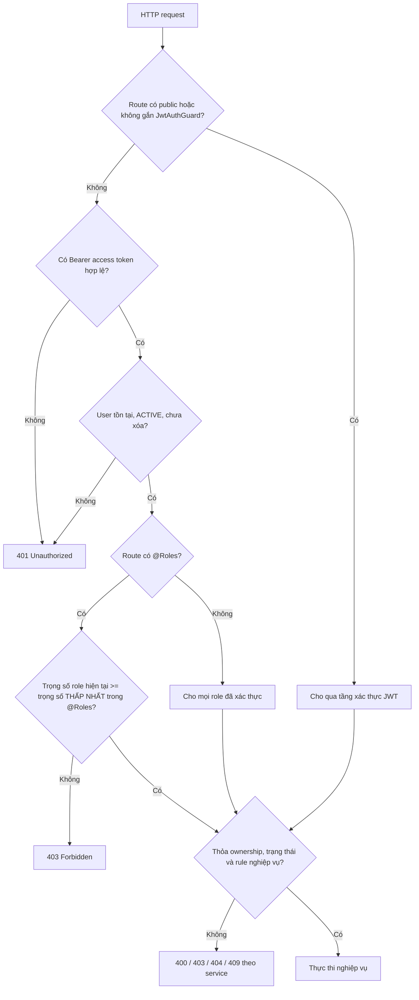

# MA TRẬN VAI TRÒ VÀ PHÂN QUYỀN

> Tài liệu mô tả quyền truy cập thực tế của backend Quản lý Blog dựa trên controller, `JwtAuthGuard`, `RolesGuard`, decorator `@Roles(...)` và các điều kiện nghiệp vụ trong service.

## 1. Thông tin tài liệu

| Thuộc tính | Giá trị |
|---|---|
| Dự án | Quản lý Blog |
| Backend | NestJS 11, TypeScript 5.7 |
| Cơ chế xác thực | JWT access token và refresh token theo session |
| Cơ chế phân quyền | RBAC theo **trọng số vai trò (role hierarchy)** kết hợp điều kiện tài nguyên/trạng thái |
| Base URL | `/api/v1` |
| Ngày rà soát source | 19/09/2026 |
| Tổng số role | 4 |
| Tổng số nhóm API | 5 |
| Tổng số endpoint (không tính health check) | 92 |
| Endpoint health check (không JWT, tách riêng) | 2 (`/health/live`, `/health/ready`) |
| Nguồn đối chiếu | Controller, guard, decorator, service, DTO và Prisma schema |

Tài liệu phản ánh **quyền đang được source thực thi**. Tên namespace như `/admin`, `/user` hoặc `/moderator` không tự quyết định quyền; quyền cuối cùng phụ thuộc guard, decorator role và điều kiện trong service.

---

## 2. Mục tiêu

Tài liệu này được dùng để:

1. Đồng bộ quyền giữa backend, frontend và tài liệu API.
2. Xác định menu, màn hình và action mà từng role được phép sử dụng.
3. Viết test phân quyền và test truy cập trái phép.
4. Phát hiện route có quyền thực tế khác kỳ vọng nghiệp vụ.
5. Làm cơ sở khi mở rộng từ role cố định sang permission hoặc policy chi tiết.

---

## 3. Role hệ thống

| Role | Trọng số (`RoleHierarchy`) | Ý nghĩa | Trách nhiệm chính |
|---|:---:|---|---|
| `NORMAL` | 1 | Người dùng thông thường | Hồ sơ, follow, like, bookmark, comment, report và gửi yêu cầu trở thành Blog Owner |
| `BLOG_OWNER` | 2 | Tác giả/chủ blog | Toàn bộ khả năng người dùng được cho phép và quản lý bài viết của chính mình |
| `CONTENT_MODERATOR` | 3 | Kiểm duyệt viên nội dung | Duyệt bài, xử lý report, quản lý nhóm danh mục |
| `SUPER_ADMIN` | 4 | Quản trị viên cao nhất | Quản lý user, role, trạng thái tài khoản, ngôn ngữ và yêu cầu Blog Owner |

Cột "Trọng số" lấy đúng từ `RoleHierarchy` trong `libs/core/src/common/decorators/roles.decorator.ts` — con số này là gốc của toàn bộ mô hình phân quyền ở mục 4.

### 3.1. Trạng thái tài khoản

Role chỉ được xét sau khi tài khoản vượt qua kiểm tra của `JwtAuthGuard`:

- User phải tồn tại.
- `deletedAt` phải là `null`.
- `status` phải là `ACTIVE`.
- Access token phải đúng chữ ký và chưa hết hạn.

Tài khoản `LOCKED` hoặc đã soft-delete bị từ chối ở mọi route có `JwtAuthGuard`, bất kể role.

---

## 4. Mô hình quyết định quyền



### 4.1. `RolesGuard` dùng trọng số vai trò (role hierarchy) — không phải khớp chính xác

Guard đang dùng (`libs/core/src/common/guards/roles.guard.ts`):

```ts
export const RoleHierarchy: Record<UserRole, number> = {
  [UserRole.NORMAL]: 1,
  [UserRole.BLOG_OWNER]: 2,
  [UserRole.CONTENT_MODERATOR]: 3,
  [UserRole.SUPER_ADMIN]: 4,
};

const userWeight = RoleHierarchy[userRole] ?? 0;

return requiredRoles.some((requiredRole) => {
  const requiredWeight = RoleHierarchy[requiredRole] ?? 0;
  return userWeight >= requiredWeight;
});
```

Vì `.some()` chỉ cần **một** điều kiện đúng là qua, hệ thống thực chất chỉ quan tâm role có **trọng số thấp nhất** trong danh sách `@Roles(...)` của route. Kết quả là có **kế thừa quyền một chiều từ vai trò cao xuống vai trò thấp**:

- `SUPER_ADMIN` (4) tự động vượt qua mọi route yêu cầu `CONTENT_MODERATOR` (3) hoặc thấp hơn.
- `CONTENT_MODERATOR` (3) tự động vượt qua mọi route yêu cầu `BLOG_OWNER` (2) hoặc thấp hơn.
- `BLOG_OWNER` (2) tự động vượt qua mọi route yêu cầu `NORMAL` (1).
- `NORMAL` **không** vượt qua được route yêu cầu `BLOG_OWNER` trở lên.

File `roles.guard.spec.ts` xác nhận đây là hành vi **được thiết kế chủ đích**, không phải lỗi — hai test case ghi rõ: *"should allow moderator to access blog owner API"* và *"should allow admin to access moderator API"*.

> **Hệ quả cần đặc biệt lưu ý**: một số route khai `@Roles(UserRole.NORMAL, UserRole.BLOG_OWNER)` (dùng cho comment, report, yêu cầu Blog Owner). Trọng số thấp nhất trong danh sách này là `NORMAL` = 1 — tức là **mọi role đã đăng nhập (kể cả `CONTENT_MODERATOR`, `SUPER_ADMIN`) đều vượt qua được guard**, vì ai cũng có trọng số ≥ 1. Việc liệt kê thêm `BLOG_OWNER` không thu hẹp quyền, nó chỉ dư thừa. Chi tiết và hệ quả nghiệp vụ ở mục 10.

### 4.2. Bốn tầng kiểm soát

| Tầng | Thành phần | Kiểm tra |
|---|---|---|
| 1. Authentication | `JwtAuthGuard` | Token, user, trạng thái và soft delete |
| 2. Role | `RolesGuard` + `@Roles` | Trọng số role hiện tại ≥ trọng số thấp nhất được yêu cầu |
| 3. Ownership | Service | Tài nguyên có thuộc user/owner hiện tại không |
| 4. Business state | Service + database | Trạng thái bài, request, report, target và ràng buộc đồng thời |

Do đó, qua được tầng 2 (role) **không đồng nghĩa** thao tác được một tài nguyên cụ thể — tầng 3 và 4 vẫn có thể chặn, kể cả với role cao hơn yêu cầu tối thiểu (xem mục 10.4).

---

## 5. Ký hiệu

| Ký hiệu | Ý nghĩa |
|---|---|
| ✅ | Được phép trực tiếp theo role/guard |
| ⚠️ | Qua được guard nhưng bị chặn/không có dữ liệu ở tầng ownership hoặc service |
| — | Không được phép theo route hiện tại |
| `JWT` | Cần access token, không giới hạn role |
| `RT` | Không cần access token nhưng cần refresh token hợp lệ trong body |
| `SELF` | Chỉ dữ liệu của chính user từ JWT |
| `OWN` | Chỉ tài nguyên thuộc sở hữu của actor |
| `STATE` | Chỉ được thao tác khi tài nguyên ở trạng thái hợp lệ |

---

## 6. Ma trận năng lực tổng quát

| Năng lực | Guest | `NORMAL` | `BLOG_OWNER` | `CONTENT_MODERATOR` | `SUPER_ADMIN` | Ghi chú |
|---|:---:|:---:|:---:|:---:|:---:|---|
| Đọc nội dung public | ✅ | ✅ | ✅ | ✅ | ✅ | Không yêu cầu JWT |
| Đăng ký, đăng nhập, quên/reset mật khẩu | ✅ | ✅ | ✅ | ✅ | ✅ | Endpoint không kiểm tra role |
| Refresh token, logout một session | `RT` | `RT` | `RT` | `RT` | `RT` | Quyền dựa trên session/refresh token |
| Logout toàn bộ thiết bị | — | ✅ | ✅ | ✅ | ✅ | Route chỉ dùng `JwtAuthGuard` |
| Xem/sửa/xóa profile của chính mình | — | ✅ | ✅ | ✅ | ✅ | `SELF`; source cho phép mọi role có JWT |
| Follow, like, bookmark | — | ✅ | ✅ | ✅ | ✅ | Source cho phép mọi role có JWT |
| Comment và sửa/xóa comment của mình | — | ✅ | ✅ | ✅ | ✅ | Route khai `@Roles(NORMAL, BLOG_OWNER)` nhưng hierarchy khiến mọi role đều qua guard (mục 10.2) |
| Report bài/comment | — | ✅ | ✅ | ✅ | ✅ | Tương tự trên; không report target của chính mình |
| Tạo/xem/hủy yêu cầu Blog Owner | — | ✅ | ✅* | ⚠️ | ⚠️ | BLOG_OWNER bị service từ chối khi tạo; Moderator/Super Admin qua được guard và **service không chặn riêng hai role này** (mục 10.2, 10.5) |
| Quản lý bài viết của chính mình | — | — | ✅ | ⚠️ | ⚠️ | Moderator/Super Admin qua guard (`@Roles(BLOG_OWNER)` → trọng số ≥ 2) nhưng danh sách/thao tác luôn lọc theo `authorId = JWT`, nên với tài khoản chưa từng là Blog Owner thực chất không thấy/sửa được gì (mục 10.4) |
| Duyệt/từ chối bài | — | — | — | ✅ | ✅ | Super Admin kế thừa quyền Moderator qua hierarchy (mục 10.1) |
| Xử lý report | — | — | — | ✅ | ✅ | Tương tự trên |
| Quản lý nhóm danh mục | — | — | — | ✅ | ✅ | Tương tự trên |
| Đọc dashboard Admin | — | — | — | — | ✅ | Route `@Roles(SUPER_ADMIN)`, trọng số cao nhất nên không role nào khác qua được |
| Đọc ngôn ngữ Admin | — | — | — | — | ✅ | Tạo/sửa/xóa chỉ SUPER_ADMIN |
| Đọc và xử lý yêu cầu Blog Owner toàn hệ thống | — | — | — | ✅ | ✅ | Route khai `@Roles(SUPER_ADMIN, CONTENT_MODERATOR)`; trọng số thấp nhất là CONTENT_MODERATOR nên cả hai role đều qua |
| Quản lý user, lock, role, tạo Moderator | — | — | — | — | ✅ | Có bảo vệ self-action và Super Admin |

`*` BLOG_OWNER được route cho phép truy cập nhóm request để xem lịch sử hoặc hủy request phù hợp, nhưng không thể tạo request mới vì đã có role BLOG_OWNER.

---

## 7. Phân bố endpoint theo quyền

Bảng dưới tính theo **trọng số tối thiểu thực sự cần** để qua `RolesGuard` (không phải danh sách role liệt kê trong code, vì hierarchy khiến vài route trông "giới hạn" nhưng thực chất mở cho nhiều role hơn — xem mục 4.1 và 10).

| Quy tắc truy cập thực tế | Số endpoint |
|---|---:|
| Public thật sự, không JWT | 16 |
| Chỉ dùng refresh token, không access token | 2 |
| Mọi role đã xác thực (không `@Roles`, hoặc `@Roles` có NORMAL trong danh sách) | 26 |
| Từ `BLOG_OWNER` trở lên (BLOG_OWNER, CONTENT_MODERATOR, SUPER_ADMIN) | 14 |
| Từ `CONTENT_MODERATOR` trở lên (CONTENT_MODERATOR, SUPER_ADMIN) | 20 |
| Chỉ `SUPER_ADMIN` | 14 |
| **Tổng cộng** | **92** |

Ngoài 92 endpoint nghiệp vụ trên, còn 2 endpoint health check (`GET /health/live`, `GET /health/ready`) không qua `JwtAuthGuard`/`RolesGuard`, phục vụ load balancer và Docker healthcheck — không tính vào bảng phân quyền vì không có khái niệm "role" ở đây.

### 7.1. Phân bố theo module API

| Module | Endpoint | Quyền chủ đạo |
|---|---:|---|
| Public | 16 | Không JWT |
| Health (infra) | 2 | Không JWT, tách riêng khỏi tổng 92 |
| User/Auth | 28 | Refresh token, JWT chung, hoặc `@Roles(NORMAL, BLOG_OWNER)` — thực chất mở cho mọi role (mục 10.2) |
| Blog Owner | 14 | Từ `BLOG_OWNER` trở lên |
| Moderator | 18 | Từ `CONTENT_MODERATOR` trở lên |
| Admin | 16 | 14 chỉ `SUPER_ADMIN`; 2 route `/admin/requests/blog-owner/*` chia sẻ với `CONTENT_MODERATOR` |

---

## 8. Điều kiện quyền theo tài nguyên

### 8.1. Hồ sơ cá nhân

- User ID không nhận từ body hoặc query mà lấy từ JWT.
- Mọi role đang đăng nhập đều có thể xem, sửa, upload avatar hoặc xóa hồ sơ của chính mình.
- Không có endpoint để một user thường sửa hồ sơ người khác.

### 8.2. Follow

- Không được follow hoặc unfollow chính mình.
- Target khi follow phải ACTIVE và chưa soft-delete.
- Cặp `followerId/followingId` phải duy nhất.
- Danh sách follower/following lọc tài khoản đã khóa hoặc đã xóa.

### 8.3. Like và bookmark

- Chỉ áp dụng cho bài `PUBLISH`, chưa soft-delete.
- Dữ liệu tương tác luôn gắn user ID từ JWT.
- API hiện dùng upsert/deleteMany nên gọi lặp không tạo bản ghi trùng.

### 8.4. Comment

- Controller khai `@Roles(NORMAL, BLOG_OWNER)`, nhưng do `RolesGuard` dùng hierarchy (mục 4.1), **mọi role đã đăng nhập** — kể cả CONTENT_MODERATOR và SUPER_ADMIN — đều tạo/sửa/xóa được comment qua route này; service không có kiểm tra role bổ sung.
- Chỉ comment trên bài `PUBLISH`, chưa xóa.
- Chỉ chủ comment được sửa hoặc xóa comment.
- Reply phải tham chiếu comment cùng bài; hệ thống có giới hạn chống spam.

### 8.5. Report

- Tương tự Comment (mục 8.4): guard thực chất mở cho mọi role đã đăng nhập, không riêng NORMAL/BLOG_OWNER.
- Không được report bài viết hoặc comment của chính mình.
- Không được có nhiều report `PENDING` của cùng reporter cho cùng target.
- Target phải tồn tại; comment phải thuộc bài `PUBLISH`.

### 8.6. Yêu cầu Blog Owner

- Danh sách và chi tiết của User luôn bị ép theo user ID từ JWT.
- User không thể xem request của người khác, kể cả tự truyền `userId` trong query.
- Chỉ hủy được request của chính mình đang `PENDING`.
- `UserBlogOwnerRequestsService.create()` chỉ kiểm tra `user.role === BLOG_OWNER` để từ chối — **không loại trừ CONTENT_MODERATOR hoặc SUPER_ADMIN**. Do guard cũng cho hai role này qua (mục 4.1), về mặt kỹ thuật một Moderator hoặc Super Admin hiện có thể tự tạo một yêu cầu Blog Owner đang `PENDING` cho chính mình. Đây là điểm cần rà soát thêm về mặt sản phẩm (mục 10.2).
- Khi request được APPROVED, role user đổi thành BLOG_OWNER và các session hiện có bị revoke.

### 8.7. Bài viết Blog Owner

- Mọi thao tác đọc riêng, sửa, xóa, upload media, submit và dịch đều kiểm tra `authorId === ownerId`.
- Guard chỉ yêu cầu trọng số ≥ `BLOG_OWNER` (2), nên CONTENT_MODERATOR/SUPER_ADMIN cũng qua được guard, nhưng vì họ không sở hữu bài viết nào với vai trò tác giả, danh sách trả về rỗng và các thao tác ghi bị chặn ở điều kiện `authorId === ownerId`.
- Bài `PENDING_REVIEW` không được sửa nội dung hoặc media.
- Chỉ bài `DRAFT` được submit.
- Sửa bài `REJECT` đưa bài về `DRAFT`; sửa bài `PUBLISH` đưa bài về `PENDING_REVIEW`.
- Bản dịch mới luôn là `DRAFT` và phải thuộc cùng owner (tạo qua hàng đợi dịch nền, xem `BUSINESS_WORKFLOWS.md` WF-13/WF-14).

### 8.8. Kiểm duyệt bài

- Moderator không được xem bài `DRAFT`.
- Chỉ `PENDING_REVIEW` mới được approve hoặc reject.
- Approve chuyển bài sang `PUBLISH`; reject chuyển sang `REJECT`.
- Transaction và update có điều kiện trạng thái chống hai Moderator (hoặc Super Admin, do kế thừa quyền) xử lý đồng thời.

### 8.9. Xử lý report

- Chỉ report `PENDING` được resolve hoặc reject.
- Resolve report bài/comment có thể soft-delete target.
- Hệ thống xử lý các report PENDING cùng target để tránh hàng đợi lặp.
- Transaction và claim theo trạng thái chống xử lý đồng thời.

### 8.10. Quản trị user

SUPER_ADMIN có thêm các giới hạn:

- Không được khóa, đổi role hoặc xóa chính mình.
- Không được khóa hoặc mở khóa tài khoản SUPER_ADMIN.
- Không được đổi role hoặc xóa SUPER_ADMIN khác.
- Không được xóa SUPER_ADMIN cuối cùng.
- Khi khóa hoặc đổi role target, các session của target bị revoke.

---

## 9. Ma trận endpoint chi tiết

Các bảng dưới đây liệt kê toàn bộ 92 endpoint nghiệp vụ theo quyền thực tế trong controller (đã quy đổi theo hierarchy ở mục 4.1) và điều kiện quan trọng ở service. 2 endpoint health check được liệt kê riêng ở cuối mục 9.1.

### 9.1. Public API

| Method | Endpoint | Quy tắc truy cập | Điều kiện quyền chính |
|---|---|---|---|
| `GET` | `/api/v1/authors/top` | Public — không yêu cầu JWT | Chỉ dữ liệu công khai theo rule service; bài viết bị ép trạng thái PUBLISH. |
| `GET` | `/api/v1/authors/:id` | Public — không yêu cầu JWT | Chỉ dữ liệu công khai theo rule service; bài viết bị ép trạng thái PUBLISH. |
| `GET` | `/api/v1/categories` | Public — không yêu cầu JWT | Chỉ dữ liệu công khai theo rule service; bài viết bị ép trạng thái PUBLISH. |
| `GET` | `/api/v1/posts/:postId/comments` | Public — không yêu cầu JWT | Chỉ dữ liệu công khai theo rule service; bài viết bị ép trạng thái PUBLISH. |
| `GET` | `/api/v1/posts/:postId/comments/:commentId/replies` | Public — không yêu cầu JWT | Chỉ trả reply của comment thuộc bài PUBLISH, chưa xóa. |
| `GET` | `/api/v1/posts` | Public — không yêu cầu JWT | Chỉ dữ liệu công khai theo rule service; bài viết bị ép trạng thái PUBLISH. |
| `GET` | `/api/v1/posts/top` | Public — không yêu cầu JWT | Chỉ dữ liệu công khai theo rule service; bài viết bị ép trạng thái PUBLISH. |
| `POST` | `/api/v1/posts/:id/view` | Public (`@Public()`) — không yêu cầu JWT | Ghi nhận lượt xem theo `viewerKey` (userId nếu có Bearer token hợp lệ, ngược lại `visitorId`); dedup 10 phút. Chi tiết ở `BUSINESS_WORKFLOWS.md` WF-05. |
| `GET` | `/api/v1/posts/:id` | Public — không yêu cầu JWT | Chỉ dữ liệu công khai theo rule service; bài viết bị ép trạng thái PUBLISH. |
| `GET` | `/api/v1/tags/top` | Public — không yêu cầu JWT | Chỉ dữ liệu công khai theo rule service; bài viết bị ép trạng thái PUBLISH. |
| `GET` | `/api/v1/tags` | Public — không yêu cầu JWT | Chỉ dữ liệu công khai theo rule service; bài viết bị ép trạng thái PUBLISH. |
| `GET` | `/api/v1/languages` | Public — không yêu cầu JWT | Danh sách ngôn ngữ đang active, dùng cho dropdown chọn ngôn ngữ ở frontend. |
| `POST` | `/api/v1/register` | Public — không yêu cầu JWT | DTO hợp lệ; username/email chưa tồn tại. |
| `POST` | `/api/v1/login` | Public — không yêu cầu JWT | Tài khoản tồn tại, chưa xóa, trạng thái ACTIVE và mật khẩu đúng. |
| `POST` | `/api/v1/forgot-password` | Public — không yêu cầu JWT | Không tiết lộ email có tồn tại hay không. |
| `POST` | `/api/v1/reset-password` | Public — không yêu cầu JWT | Reset token hợp lệ, chưa dùng, chưa hết hạn; thu hồi toàn bộ session. |

**Health check (infra, không tính vào 92 endpoint ở trên):**

| Method | Endpoint | Quy tắc truy cập | Ghi chú |
|---|---|---|---|
| `GET` | `/api/v1/health/live` | Không JWT, không guard | Luôn trả `200` nếu process còn sống, kể cả khi đang maintenance. |
| `GET` | `/api/v1/health/ready` | Không JWT, không guard | Trả `503` khi không kết nối được database hoặc khi `MAINTENANCE_MODE` bật (đi qua `MaintenanceMiddleware`). |

### 9.2. User và Auth API

| Method | Endpoint | Quy tắc truy cập | Điều kiện quyền chính |
|---|---|---|---|
| `POST` | `/api/v1/auth/refresh-token` | Không cần access token; bắt buộc `refreshToken` hợp lệ trong body | Session chưa revoke/hết hạn; User-Agent phải khớp phiên đăng nhập. |
| `POST` | `/api/v1/auth/logout` | Không cần access token; bắt buộc `refreshToken` hợp lệ trong body | Thu hồi đúng session tương ứng refresh token. |
| `POST` | `/api/v1/auth/logout-all` | Mọi role đang đăng nhập và còn `ACTIVE` | Thu hồi toàn bộ session của chính user từ JWT. |
| `POST` | `/api/v1/user/blog-owner-requests` | `@Roles(NORMAL, BLOG_OWNER)` → thực chất mọi role đã đăng nhập đều qua guard (mục 4.1, 8.6) | NORMAL mới có ý nghĩa thực tế; BLOG_OWNER bị service từ chối; CONTENT_MODERATOR/SUPER_ADMIN không bị service chặn riêng (mục 8.6). |
| `GET` | `/api/v1/user/blog-owner-requests` | `@Roles(NORMAL, BLOG_OWNER)` → thực chất mọi role đã đăng nhập | Service ép `userId` theo JWT; không xem được request của người khác. |
| `GET` | `/api/v1/user/blog-owner-requests/:id` | `@Roles(NORMAL, BLOG_OWNER)` → thực chất mọi role đã đăng nhập | Service ép `userId` theo JWT; không xem được request của người khác. |
| `DELETE` | `/api/v1/user/blog-owner-requests/:id` | `@Roles(NORMAL, BLOG_OWNER)` → thực chất mọi role đã đăng nhập | Chỉ hủy được request của chính user và đang PENDING. |
| `POST` | `/api/v1/user/posts/:postId/comments` | `@Roles(NORMAL, BLOG_OWNER)` → thực chất mọi role đã đăng nhập (mục 8.4) | Bài phải PUBLISH; giới hạn spam; reply phải thuộc cùng bài. |
| `PATCH` | `/api/v1/user/comments/:commentId` | `@Roles(NORMAL, BLOG_OWNER)` → thực chất mọi role đã đăng nhập | Chỉ chủ sở hữu comment được sửa/xóa; comment chưa soft-delete. |
| `DELETE` | `/api/v1/user/comments/:commentId` | `@Roles(NORMAL, BLOG_OWNER)` → thực chất mọi role đã đăng nhập | Chỉ chủ sở hữu comment được sửa/xóa; comment chưa soft-delete. |
| `GET` | `/api/v1/user/follow/followers` | Mọi role đang đăng nhập và còn `ACTIVE` | Danh sách chỉ gồm tài khoản ACTIVE, chưa soft-delete. |
| `GET` | `/api/v1/user/follow/following` | Mọi role đang đăng nhập và còn `ACTIVE` | Danh sách chỉ gồm tài khoản ACTIVE, chưa soft-delete. |
| `GET` | `/api/v1/user/follow/:id/followers` | Mọi role đang đăng nhập và còn `ACTIVE` | Danh sách chỉ gồm tài khoản ACTIVE, chưa soft-delete. |
| `GET` | `/api/v1/user/follow/:id/following` | Mọi role đang đăng nhập và còn `ACTIVE` | Danh sách chỉ gồm tài khoản ACTIVE, chưa soft-delete. |
| `POST` | `/api/v1/user/follow/:id` | Mọi role đang đăng nhập và còn `ACTIVE` | Không được follow/unfollow chính mình; target phải hợp lệ theo nghiệp vụ. |
| `DELETE` | `/api/v1/user/follow/:id` | Mọi role đang đăng nhập và còn `ACTIVE` | Không được follow/unfollow chính mình; target phải hợp lệ theo nghiệp vụ. |
| `GET` | `/api/v1/user/posts/bookmarks` | Mọi role đang đăng nhập và còn `ACTIVE` | Chỉ lấy tương tác của chính user; chỉ trả bài PUBLISH chưa xóa. |
| `GET` | `/api/v1/user/posts/likes` | Mọi role đang đăng nhập và còn `ACTIVE` | Chỉ lấy tương tác của chính user; chỉ trả bài PUBLISH chưa xóa. |
| `POST` | `/api/v1/user/posts/:id/bookmark` | Mọi role đang đăng nhập và còn `ACTIVE` | Bài phải PUBLISH và chưa xóa; thao tác gắn với user từ JWT. |
| `DELETE` | `/api/v1/user/posts/:id/bookmark` | Mọi role đang đăng nhập và còn `ACTIVE` | Bài phải PUBLISH và chưa xóa; thao tác gắn với user từ JWT. |
| `POST` | `/api/v1/user/posts/:id/like` | Mọi role đang đăng nhập và còn `ACTIVE` | Bài phải PUBLISH và chưa xóa; thao tác gắn với user từ JWT. |
| `DELETE` | `/api/v1/user/posts/:id/like` | Mọi role đang đăng nhập và còn `ACTIVE` | Bài phải PUBLISH và chưa xóa; thao tác gắn với user từ JWT. |
| `GET` | `/api/v1/user/profile` | Mọi role đang đăng nhập và còn `ACTIVE` | Chỉ tác động hồ sơ của user từ JWT; avatar phải là ảnh khi upload. |
| `PATCH` | `/api/v1/user/profile` | Mọi role đang đăng nhập và còn `ACTIVE` | Chỉ tác động hồ sơ của user từ JWT; avatar phải là ảnh khi upload. |
| `DELETE` | `/api/v1/user/profile` | Mọi role đang đăng nhập và còn `ACTIVE` | Chỉ tác động hồ sơ của user từ JWT; avatar phải là ảnh khi upload. |
| `POST` | `/api/v1/user/profile/avatar` | Mọi role đang đăng nhập và còn `ACTIVE` | Chỉ tác động hồ sơ của user từ JWT; avatar phải là ảnh khi upload. |
| `POST` | `/api/v1/user/posts/:postId/reports` | `@Roles(NORMAL, BLOG_OWNER)` → thực chất mọi role đã đăng nhập (mục 8.5) | Target phải còn tồn tại trên bài PUBLISH; không report nội dung của chính mình; không có report PENDING trùng. |
| `POST` | `/api/v1/user/comments/:commentId/reports` | `@Roles(NORMAL, BLOG_OWNER)` → thực chất mọi role đã đăng nhập | Bài phải PUBLISH; giới hạn spam; reply phải thuộc cùng bài. |

### 9.3. Blog Owner API

| Method | Endpoint | Quy tắc truy cập | Điều kiện quyền chính |
|---|---|---|---|
| `GET` | `/api/v1/blog-owner/dashboard/summary` | Từ `BLOG_OWNER` trở lên | Tổng số bài theo trạng thái, tổng view/like/comment của chính Blog Owner. |
| `GET` | `/api/v1/blog-owner/dashboard/activity` | Từ `BLOG_OWNER` trở lên | Biến động interaction theo ngày (`?days=`). |
| `GET` | `/api/v1/blog-owner/dashboard/featured` | Từ `BLOG_OWNER` trở lên | Bài viết nổi bật (`?sort=&limit=`); root và translation cạnh tranh độc lập. |
| `POST` | `/api/v1/blog-owner/posts/:postId/media` | Từ `BLOG_OWNER` trở lên | Bài phải thuộc owner; bài PENDING_REVIEW không được sửa media. |
| `DELETE` | `/api/v1/blog-owner/posts/:postId/media/:mediaId` | Từ `BLOG_OWNER` trở lên | Bài phải thuộc owner; bài PENDING_REVIEW không được sửa media. |
| `GET` | `/api/v1/blog-owner/options` | Từ `BLOG_OWNER` trở lên | Đọc lựa chọn ngôn ngữ, danh mục, tag phục vụ soạn bài. |
| `GET` | `/api/v1/blog-owner/posts` | Từ `BLOG_OWNER` trở lên | Danh sách bị giới hạn theo `authorId` từ JWT. |
| `GET` | `/api/v1/blog-owner/posts/:id` | Từ `BLOG_OWNER` trở lên | Chỉ bài thuộc owner; PENDING_REVIEW không được chỉnh sửa. |
| `POST` | `/api/v1/blog-owner/posts` | Từ `BLOG_OWNER` trở lên | Bài mới gắn `authorId` từ JWT và khởi tạo theo quy tắc service. |
| `PATCH` | `/api/v1/blog-owner/posts/:id` | Từ `BLOG_OWNER` trở lên | Chỉ bài thuộc owner; PENDING_REVIEW không được chỉnh sửa. |
| `DELETE` | `/api/v1/blog-owner/posts/:id` | Từ `BLOG_OWNER` trở lên | Chỉ bài thuộc owner; PENDING_REVIEW không được chỉnh sửa. |
| `POST` | `/api/v1/blog-owner/posts/:id/submit` | Từ `BLOG_OWNER` trở lên | Bài phải thuộc owner và đang DRAFT. |
| `POST` | `/api/v1/blog-owner/posts/:id/translate-preview` | Từ `BLOG_OWNER` trở lên | Bài nguồn phải thuộc owner; chỉ tạo bản xem trước qua LibreTranslate, không lưu bài, không tạo job hàng đợi. |
| `GET` | `/api/v1/blog-owner/translation-batches/:batchId` | Từ `BLOG_OWNER` trở lên | Theo dõi tiến độ batch dịch nền (BullMQ) sau khi tạo/sửa bài kèm `translationLanguageIds`; chi tiết `BUSINESS_WORKFLOWS.md` WF-14.4. |

> Route `POST /api/v1/blog-owner/posts/:id/translations` được tài liệu cũ mô tả đã **không còn tồn tại trong source hiện tại** — bản dịch giờ được tạo tự động qua hàng đợi nền khi tạo/sửa bài (xem `POST /translation-batches/:batchId` ở trên).

### 9.4. Moderator API

| Method | Endpoint | Quy tắc truy cập | Điều kiện quyền chính |
|---|---|---|---|
| `GET` | `/api/v1/moderator/category-groups` | Từ `CONTENT_MODERATOR` trở lên | Danh sách CategoryGroup và các bản dịch. |
| `GET` | `/api/v1/moderator/category-groups/:groupId` | Từ `CONTENT_MODERATOR` trở lên | Chi tiết một CategoryGroup. |
| `POST` | `/api/v1/moderator/category-groups/translate-preview` | Từ `CONTENT_MODERATOR` trở lên | Dịch tên category sang ngôn ngữ đích để xem trước; không ghi database. |
| `POST` | `/api/v1/moderator/category-groups` | Từ `CONTENT_MODERATOR` trở lên | Tạo CategoryGroup cùng nhiều bản dịch trong transaction. |
| `PATCH` | `/api/v1/moderator/category-groups/:groupId` | Từ `CONTENT_MODERATOR` trở lên | Cập nhật code hoặc upsert các bản dịch. |
| `DELETE` | `/api/v1/moderator/category-groups/:groupId/translations/:languageId` | Từ `CONTENT_MODERATOR` trở lên | Xóa mềm một bản dịch khỏi CategoryGroup. |
| `DELETE` | `/api/v1/moderator/category-groups/:groupId` | Từ `CONTENT_MODERATOR` trở lên | Không xóa khi nhóm đang được bài viết sử dụng; soft-delete group và translations. |
| `GET` | `/api/v1/moderator/dashboard/overview` | Từ `CONTENT_MODERATOR` trở lên | Số liệu tổng quan cho các card trên dashboard. |
| `GET` | `/api/v1/moderator/dashboard/report-stats` | Từ `CONTENT_MODERATOR` trở lên | Thống kê report theo trạng thái và lý do. |
| `GET` | `/api/v1/moderator/dashboard/report-trend` | Từ `CONTENT_MODERATOR` trở lên | Xu hướng report trong 7 ngày gần nhất. |
| `GET` | `/api/v1/moderator/posts` | Từ `CONTENT_MODERATOR` trở lên | Không xem DRAFT; chỉ PENDING_REVIEW, PUBLISH hoặc REJECT. |
| `GET` | `/api/v1/moderator/posts/:postId` | Từ `CONTENT_MODERATOR` trở lên | Không xem DRAFT; chỉ PENDING_REVIEW, PUBLISH hoặc REJECT. |
| `POST` | `/api/v1/moderator/posts/:postId/approve` | Từ `CONTENT_MODERATOR` trở lên | Chỉ xử lý bài PENDING_REVIEW; transaction chống xử lý đồng thời. |
| `POST` | `/api/v1/moderator/posts/:postId/reject` | Từ `CONTENT_MODERATOR` trở lên | Chỉ xử lý bài PENDING_REVIEW; transaction chống xử lý đồng thời. |
| `GET` | `/api/v1/moderator/reports` | Từ `CONTENT_MODERATOR` trở lên | Có thể xem report PENDING/RESOLVED/REJECTED theo bộ lọc. |
| `GET` | `/api/v1/moderator/reports/:reportId` | Từ `CONTENT_MODERATOR` trở lên | Có thể xem report PENDING/RESOLVED/REJECTED theo bộ lọc. |
| `POST` | `/api/v1/moderator/reports/:reportId/resolve` | Từ `CONTENT_MODERATOR` trở lên | Chỉ report PENDING; ẩn target và xử lý các report cùng target trong transaction. |
| `POST` | `/api/v1/moderator/reports/:reportId/reject` | Từ `CONTENT_MODERATOR` trở lên | Chỉ report PENDING; transaction chống xử lý đồng thời. |

### 9.5. Admin API

| Method | Endpoint | Quy tắc truy cập | Điều kiện quyền chính |
|---|---|---|---|
| `GET` | `/api/v1/admin/dashboard` | Chỉ `SUPER_ADMIN` | Source cho phép Super Admin. |
| `GET` | `/api/v1/admin/languages` | Chỉ `SUPER_ADMIN` | Source cho phép Super Admin đọc. |
| `GET` | `/api/v1/admin/languages/:id` | Chỉ `SUPER_ADMIN` | Source cho phép Super Admin đọc. |
| `POST` | `/api/v1/admin/languages` | Chỉ `SUPER_ADMIN` | Chỉ Super Admin được tạo, sửa hoặc soft-delete ngôn ngữ. |
| `PATCH` | `/api/v1/admin/languages/:id` | Chỉ `SUPER_ADMIN` | Chỉ Super Admin được tạo, sửa hoặc soft-delete ngôn ngữ. |
| `DELETE` | `/api/v1/admin/languages/:id` | Chỉ `SUPER_ADMIN` | Chỉ Super Admin được tạo, sửa hoặc soft-delete ngôn ngữ. |
| `GET` | `/api/v1/admin/requests/blog-owner` | Từ `CONTENT_MODERATOR` trở lên (`@Roles(SUPER_ADMIN, CONTENT_MODERATOR)`, trọng số thấp nhất là CONTENT_MODERATOR) | Đọc toàn bộ request Blog Owner trong hệ thống. |
| `PATCH` | `/api/v1/admin/requests/blog-owner/:id` | Từ `CONTENT_MODERATOR` trở lên | Request phải PENDING; APPROVED đổi role thành BLOG_OWNER và revoke session. |
| `GET` | `/api/v1/admin/users` | Chỉ `SUPER_ADMIN` | Chỉ Super Admin; dữ liệu target phải tồn tại. |
| `POST` | `/api/v1/admin/users/moderators` | Chỉ `SUPER_ADMIN` | Tạo trực tiếp user role CONTENT_MODERATOR; username/email phải duy nhất. |
| `GET` | `/api/v1/admin/users/:id` | Chỉ `SUPER_ADMIN` | Chỉ Super Admin; dữ liệu target phải tồn tại. |
| `PATCH` | `/api/v1/admin/users/:id` | Chỉ `SUPER_ADMIN` | Chỉ Super Admin; dữ liệu target phải tồn tại. |
| `PATCH` | `/api/v1/admin/users/:id/lock` | Chỉ `SUPER_ADMIN` | Không khóa chính mình hoặc Super Admin; revoke toàn bộ session target. |
| `PATCH` | `/api/v1/admin/users/:id/unlock` | Chỉ `SUPER_ADMIN` | Không thao tác chính mình hoặc tài khoản Super Admin. |
| `PATCH` | `/api/v1/admin/users/:id/role` | Chỉ `SUPER_ADMIN` | Không đổi role chính mình hoặc Super Admin khác; revoke session target. |
| `DELETE` | `/api/v1/admin/users/:id` | Chỉ `SUPER_ADMIN` | Không xóa chính mình, Super Admin khác hoặc Super Admin cuối cùng. |

---

## 10. Sai lệch cần đặc biệt lưu ý

### 10.1. Super Admin **có** kế thừa quyền Moderator và Blog Owner (khác hoàn toàn so với hiểu nhầm phổ biến)

`RolesGuard` so sánh theo trọng số (mục 4.1), không khớp chính xác role. Vì vậy:

- `SUPER_ADMIN` (4) qua được mọi route `/moderator/*` (yêu cầu tối thiểu CONTENT_MODERATOR = 3) và mọi route `/blog-owner/*` (yêu cầu tối thiểu BLOG_OWNER = 2).
- `CONTENT_MODERATOR` (3) qua được mọi route `/blog-owner/*`.

Đây là hành vi **có chủ đích**, được xác nhận bằng test `roles.guard.spec.ts`. Tuy nhiên "qua được guard" không có nghĩa là thao tác được dữ liệu thật — xem mục 10.4.

Nếu nghiệp vụ muốn giới hạn lại thành exact-match (một role chỉ dùng đúng API của mình), cần sửa `RolesGuard` để so sánh bằng thay vì so sánh trọng số `>=`, và cập nhật lại toàn bộ test liên quan.

### 10.2. Route khai nhiều role (`@Roles(NORMAL, BLOG_OWNER)`) thực chất mở cho **mọi** role đã đăng nhập

Áp dụng cho comment, report và yêu cầu Blog Owner (9 route ở mục 9.2). Vì `NORMAL` có trọng số thấp nhất (1) trong danh sách, `.some()` luôn đúng với bất kỳ role nào đã đăng nhập — CONTENT_MODERATOR và SUPER_ADMIN cũng vượt qua được guard này dù namespace là `/user/*`.

Hệ quả nghiệp vụ cụ thể đã kiểm chứng trong service:

- Moderator/Super Admin hiện **có thể tạo comment và report** qua các route này — không có kiểm tra role bổ sung trong `CommentsService`/`ReportsService`.
- Moderator/Super Admin hiện **có thể tự tạo một yêu cầu Blog Owner `PENDING`** cho chính mình — `UserBlogOwnerRequestsService.create()` chỉ chặn khi `user.role === BLOG_OWNER`, không chặn hai role còn lại (mục 8.6).

Cần xác nhận đây là chính sách sản phẩm chủ đích hay chỉ là hệ quả không lường trước của việc đổi `RolesGuard` sang mô hình hierarchy.

### 10.3. Route JWT chung (không `@Roles`) cũng mở cho mọi role

Các route chỉ dùng `JwtAuthGuard` mà không có `@Roles` cho phép cả bốn role, gồm:

- Profile cá nhân.
- Follow/unfollow.
- Like/bookmark.
- Xem danh sách bài đã like/bookmark.
- Logout toàn bộ thiết bị.

Đây là hành vi thực tế, dù module có tên `user`.

### 10.4. Qua được guard không đồng nghĩa thao tác được tài nguyên thật

Vì `RolesGuard` chỉ chặn ở tầng role, các route `/blog-owner/*` (yêu cầu tối thiểu BLOG_OWNER) thực tế cũng cho CONTENT_MODERATOR và SUPER_ADMIN đi qua (mục 10.1). Nhưng service luôn lọc/ràng buộc theo `authorId === user.id` — một Moderator hoặc Super Admin chưa từng là Blog Owner sẽ:

- `GET /blog-owner/posts` → trả danh sách rỗng (không có bài nào có `authorId` là họ).
- `PATCH`/`DELETE`/`POST .../submit`/`POST .../translate-preview` trên một `id` cụ thể → bị từ chối vì không khớp `authorId`.

Nói cách khác, tầng ownership (mục 4.2, tầng 3) vẫn là hàng rào chức năng thật sự cho các tài nguyên `OWN`, bất kể guard có cho qua hay không.

---

## 11. Hành vi lỗi phân quyền

| Trường hợp | HTTP dự kiến | Nguồn |
|---|---:|---|
| Thiếu access token ở route protected | `401` | `JwtAuthGuard` |
| Token sai hoặc hết hạn | `401` | JWT utility/guard |
| User không tồn tại hoặc đã xóa | `401` | `JwtAuthGuard` |
| User bị khóa | `401` | `JwtAuthGuard` |
| Trọng số role không đạt yêu cầu tối thiểu của `@Roles` | `403` | `RolesGuard` |
| Không sở hữu tài nguyên | `403` hoặc `404` | Service; một số luồng cố ý ẩn tài nguyên |
| Trạng thái tài nguyên không hợp lệ | `400` | Service |
| Tài nguyên đã được actor khác xử lý | `409` hoặc `400` | Transaction/update có điều kiện |
| Tài nguyên không tồn tại | `404` | Domain exception |

Frontend không nên chỉ dựa vào `message`. Nên bổ sung mã lỗi ổn định trong tương lai.

---

## 12. Yêu cầu đối với frontend

1. Menu và route guard phía frontend phải dựa trên role hiện tại, nhưng backend vẫn là nguồn bảo vệ cuối cùng.
2. Không hiển thị menu Blog Owner cho SUPER_ADMIN/CONTENT_MODERATOR — dù guard backend cho qua (mục 10.1), họ không sở hữu bài viết nào nên trải nghiệm sẽ trống rỗng.
3. Sau khi yêu cầu Blog Owner được duyệt hoặc Admin đổi role, frontend phải yêu cầu đăng nhập lại khi session bị revoke.
4. Với endpoint JWT chung hoặc `@Roles(NORMAL, BLOG_OWNER)`, frontend nên hiểu rằng backend thực chất cho mọi role đã đăng nhập truy cập (mục 10.2, 10.3) — không nên tự ý ẩn/hiện các action này chỉ dựa vào giả định "chỉ NORMAL/BLOG_OWNER mới gọi được".
5. Không gửi `userId`, `authorId` hoặc `reviewedById` để cố chỉ định actor; backend phải lấy từ JWT.
6. Xử lý riêng `401`, `403`, `404` và `409` thay vì coi tất cả là lỗi chung.

---

## 13. Kiểm thử phân quyền tối thiểu

Mỗi endpoint protected cần có ít nhất các test sau:

- Không token → `401`.
- Token của tài khoản LOCKED → `401`.
- Token role có trọng số thấp hơn yêu cầu tối thiểu → `403`.
- Token role đạt trọng số tối thiểu + tài nguyên hợp lệ → thành công.
- Token role đạt trọng số tối thiểu + tài nguyên người khác (`OWN`) → bị từ chối ở tầng service.
- Token role đúng + trạng thái sai → `400`.
- Hai actor xử lý đồng thời bài/report/request → chỉ một actor thành công.

### 13.1. Test ma trận bắt buộc

| Nhóm | Test đặc biệt |
|---|---|
| Blog Owner | SUPER_ADMIN/CONTENT_MODERATOR **qua được guard** `/blog-owner/*` (trọng số ≥ 2) nhưng nhận danh sách rỗng / `403`-`404` ở tầng ownership vì không có bài nào thuộc họ (mục 10.1, 10.4) |
| Moderator | SUPER_ADMIN **qua được** `/moderator/*` do kế thừa trọng số (mục 10.1); BLOG_OWNER/NORMAL vẫn bị `403` |
| Admin — requests | CONTENT_MODERATOR **qua được** `/admin/requests/blog-owner/*` (route khai chung với SUPER_ADMIN, trọng số thấp nhất là CONTENT_MODERATOR); BLOG_OWNER/NORMAL bị `403` |
| User JWT chung | CONTENT_MODERATOR và SUPER_ADMIN truy cập được profile/follow/like/bookmark |
| User "NORMAL, BLOG_OWNER" | CONTENT_MODERATOR và SUPER_ADMIN **cũng** tạo/sửa/xóa được comment, report, yêu cầu Blog Owner qua route `/user/*` — không bị chặn như tài liệu cũ mô tả (mục 10.2) |
| Ownership | Hai BLOG_OWNER không sửa/xóa bài của nhau |
| Admin self-protection | Admin không lock/change-role/delete chính mình |

---
