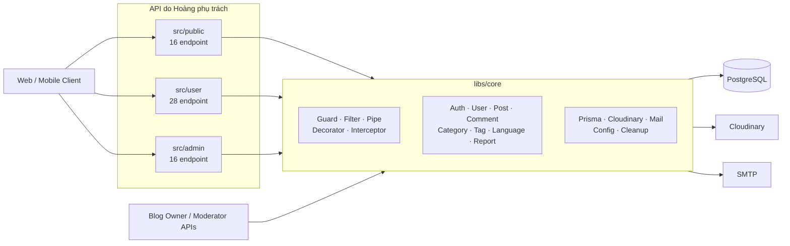

# PHÂN CHIA CÔNG VIỆC — HOÀNG

> Phạm vi phụ trách: `libs/core`, `src/admin`, `src/user`, `src/public` của backend, và toàn bộ hạ tầng triển khai (CI/CD, blue-green, script vận hành VPS) dự án **Quản lý Blog**.

## 1. Thông tin tài liệu

| Thuộc tính | Nội dung |
|---|---|
| Thành viên | Hoàng |
| Vai trò đề xuất | Backend Developer — Core Platform, Public/User/Admin APIs |
| Phạm vi chính | Nền tảng dùng chung, xác thực, người dùng, API công khai, quản trị hệ thống và hạ tầng triển khai (CI/CD, blue-green, VPS) |
| Công nghệ | NestJS 11, TypeScript, Prisma 7, PostgreSQL |
| Ngày rà soát | 19/09/2026 |
| Căn cứ đánh giá | Source hiện tại và phạm vi thư mục được xác nhận Hoàng phụ trách |


---

## 2. Tổng quan phần việc

Phụ trách lớp nền tảng và ba nhóm API phục vụ phần lớn hoạt động của hệ thống. Phần mã này không chỉ cung cấp **60 endpoint Public/User/Admin**, mà còn tạo ra các domain service dùng chung cho Blog Owner và Moderator.

### 2.1. Vai trò của phần việc trong kiến trúc




---

## 3. Công việc đã thực hiện trong `libs/core`

## 3.1. Xây dựng nền tảng HTTP dùng chung

Đã xây dựng các thành phần cắt ngang được áp dụng trên toàn bộ backend:

| Thành phần | Công việc đã thực hiện | Giá trị mang lại |
|---|---|---|
| `JwtAuthGuard` | Đọc Bearer access token, xác minh JWT, đọc lại user từ database, chặn tài khoản bị khóa hoặc xóa | Không chỉ tin vào dữ liệu cũ trong token; trạng thái tài khoản được áp dụng ngay |
| `RolesGuard` | Đọc metadata từ `@Roles()` và so khớp theo **trọng số vai trò** (`RoleHierarchy`), không phải khớp chính xác — vai trò cao hơn tự kế thừa quyền của vai trò thấp hơn | Phân quyền rõ theo controller/route, cho phép Moderator/Super Admin xử lý sự vụ mà không cần cấp thêm role thủ công; chi tiết và các hệ quả cần lưu ý ở `ROLE_AND_PERMISSION_MATRIX.md` |
| Decorator | Tạo `@CurrentUser`, `@Public`, `@Roles`, `@Pagination`, `@LangCode` | Giảm mã lặp trong controller |
| Validation từ cấm | Chuẩn hóa Unicode và kiểm tra từ cấm theo ranh giới từ | Hạn chế false positive như chặn `admin` vì chứa `dm` |
| `TrimPipe` | Trim đệ quy string trong request body | Chuẩn hóa đầu vào trước validation/nghiệp vụ |
| `TransformInterceptor` | Chuẩn hóa success response | Frontend luôn nhận envelope thống nhất |
| Exception filters | Chuẩn hóa lỗi HTTP và ánh xạ lỗi Prisma phổ biến | Giảm phụ thuộc của frontend vào lỗi mặc định của framework/database |
| Middleware | Ghi log request và hỗ trợ maintenance mode | Hỗ trợ theo dõi vận hành và tạm dừng hệ thống |
| Custom exceptions | Tách lỗi auth, user, post, comment, category, language, tag và system | Message nghiệp vụ rõ hơn, service dễ đọc hơn |
| `ThrottlerModule`/`ThrottlerGuard` | Bật rate limiting toàn cục ở `app.module.ts` (`@nestjs/throttler`), route nào cần miễn trừ dùng `@Throttle()` | Chống spam/tấn công brute-force ở tầng framework, không phải tự viết tay |
| `HealthController` | Endpoint `health/live`, `health/ready` cho readiness/liveness probe | Cho phép Nginx và các script deploy kiểm tra API còn sống trước khi nhận traffic |

## 3.2. Xây dựng lớp cấu hình và hạ tầng

Đã triển khai:

- Cấu hình ứng dụng, database, JWT, Cloudinary và mail theo namespace của `ConfigModule`.
- `PrismaService` sử dụng `@prisma/adapter-pg`, quản lý kết nối theo lifecycle của NestJS.
- `BcryptUtil` cho mật khẩu và token hash, kết hợp `PASSWORD_PEPPER` cho mật khẩu.
- `JWTUtil` tạo và xác minh access/refresh token bằng hai secret riêng.
- `CloudinaryService` upload/xóa ảnh và video qua stream.
- `MailService` gửi email đặt lại mật khẩu.
- `CleanupService` chạy theo lịch để xóa vĩnh viễn dữ liệu soft-delete quá thời hạn.
- Utility xử lý ngày theo múi giờ Việt Nam, được dùng trong dashboard Admin.

## 3.3. Xây dựng các domain module dùng chung

`libs/core` hiện chứa 15 nhóm module nghiệp vụ/hạ tầng do Hoàng phụ trách (không tính module `translation` — tích hợp LibreTranslate do Sơn xây dựng, dù cũng nằm trong `libs/core`):

| Module | Nội dung Hoàng đã triển khai |
|---|---|
| `auths` | Đăng ký, đăng nhập, refresh token, logout, logout-all, quên và đặt lại mật khẩu |
| `users` | Tạo, tìm kiếm, cập nhật, phân trang, soft-delete và restore user |
| `posts` | CRUD lõi, category/tag, filter, phân trang, view count, soft-delete/restore |
| `comments` | Comment/reply hai cấp, ownership, phân trang, soft-delete comment và reply |
| `categories` | Category và Category Group, kiểm tra trùng lặp, soft-delete/restore |
| `tags` | CRUD tag, tìm kiếm, phân trang, soft-delete/restore |
| `languages` | CRUD ngôn ngữ, ánh xạ mã ngôn ngữ sang ID |
| `reports` | Tạo, lọc, xem, cập nhật và xóa report |
| `blog-owner-requests` | Tạo, lọc, xem, cập nhật và xóa yêu cầu nâng cấp role |
| `media` | Upload media, nhận diện ảnh/video, lưu URL/public ID, soft-delete và cleanup file |
| `cloudinary` | Adapter upload/delete cho storage ngoài |
| `mail` | Email khôi phục mật khẩu |
| `security-logs` | Cấu trúc service, DTO và entity cho nhật ký bảo mật |
| `cleanup` | Cron dọn dữ liệu soft-delete quá 30 ngày |
| `health` | Endpoint kiểm tra sống/sẵn sàng phục vụ deploy blue-green |

## 3.4. Xử lý xác thực và phiên đăng nhập

Các công việc nổi bật:

- Kiểm tra tài khoản bị khóa trước khi so sánh mật khẩu.
- Tạo access token và refresh token riêng biệt.
- Chỉ lưu **hash của refresh token** trong `user_sessions`.
- Ghi nhận IP, thiết bị và thời gian hết hạn của phiên đăng nhập.
- So sánh `User-Agent` khi refresh để phát hiện thay đổi thiết bị bất thường.
- Thu hồi một session khi logout và toàn bộ session khi logout-all.
- Trả cùng một thông báo cho email tồn tại/không tồn tại ở forgot-password để chống dò tài khoản.
- Lưu reset token dưới dạng hash, có hạn dùng và đánh dấu đã sử dụng.
- Thu hồi toàn bộ session sau khi đổi mật khẩu.

## 3.5. Đảm bảo tính toàn vẹn dữ liệu
Áp dụng nhiều kỹ thuật bảo vệ dữ liệu:

- Dùng Prisma transaction khi xóa user và các dữ liệu liên quan.
- Soft-delete thay vì xóa ngay đối với các thực thể chính.
- Kiểm tra category phải cùng ngôn ngữ với bài viết.
- Giới hạn tối đa 5 tag cho một bài.
- Không cho comment của bài này làm parent của comment ở bài khác.
- Quy reply vào comment gốc để giới hạn cây bình luận còn hai cấp.
- Dùng entity serializer để ẩn `passwordHash`, token hash và field nội bộ.
- Chuẩn hóa pagination và giới hạn `limit` tối đa 50 ở các route dùng `@Pagination`.

---

## 4. Công việc đã thực hiện trong `src/public`

Triển khai **16 endpoint Public**, phục vụ người dùng chưa đăng nhập và nội dung công khai.

## 4.1. Xác thực công khai

- Đăng ký tài khoản.
- Đăng nhập bằng username hoặc email.
- Gửi yêu cầu quên mật khẩu.
- Đặt lại mật khẩu bằng token.
- Ghi nhận IP và `User-Agent` khi đăng nhập.

## 4.2. Hiển thị bài viết công khai

- Danh sách bài đã xuất bản với filter theo search, category, ngôn ngữ, tác giả, tag và pagination.
- Luôn ép trạng thái về `PUBLISH`, tránh client lợi dụng query để đọc draft/rejected post.
- Xem chi tiết bài và tự tìm bản dịch cùng nhóm bài khi có `lang`/`Accept-Language`.
- Trả author, language, category, tag, media và like count theo public entity.
- `viewCount` trả về cho client luôn là **tổng của cả nhóm ngôn ngữ** (bài gốc + mọi bản dịch), không phải riêng bản đang đọc — để người đọc chuyển ngôn ngữ không thấy view "biến mất" (đã sửa 2026-09-10 sau khi phát hiện bug thật khi refactor tính năng dịch nền, xem `DEPLOYMENT.md` mục 10b và 8).

### Ghi nhận lượt xem — endpoint riêng (`POST /posts/:id/view`)

Thiết kế lại 2026-09-10 cùng lúc với tính năng dịch nền (BullMQ) — trước đó lượt xem được ghi ngay trong `GET /posts/:id`, giờ tách thành một endpoint riêng do frontend chủ động gọi sau khi xác nhận người đọc thật sự đã xem bài (qua khoảng thời gian đọc hợp lệ), tránh tính view giả từ bot/prefetch:

- `postId` trong request là **đúng phiên bản ngôn ngữ đang đọc** (không tự quy về bài gốc) — `viewCount` của đúng bản ghi đó được tăng lên.
- Định danh người xem (`viewerKey`) dựa trên `userId` (nếu đã đăng nhập) hoặc `visitorId` do frontend tự sinh (khách chưa đăng nhập) — không còn dùng IP như thiết kế cũ, tránh nhiều người dùng chung mạng/NAT bị tính gộp làm một.
- Chống tính trùng: cùng một viewer, cùng một bản ghi, trong vòng **10 phút** (trước là 5 phút) chỉ tính một lượt xem.
- Ghi đồng thời vào bảng thống kê theo ngày (`PostDailyMetric`) trong cùng transaction với việc tăng `viewCount`, đảm bảo hai số liệu luôn khớp nhau.
- Dùng transaction mức `Serializable` kèm cơ chế tự thử lại khi có xung đột — chống trường hợp nhiều tab/request cùng lúc từ một người vẫn bị tính trùng.

## 4.3. Xếp hạng nội dung

Triển khai truy vấn xếp hạng bài viết nổi bật (`GET /posts/top`), tính điểm theo công thức:

```
điểm = (0.05 × lượt xem + 2 × lượt thích + 5 × bình luận + 3 × bookmark)
       ÷ (số giờ kể từ khi đăng + 2) ^ 1.3
```

- Mẫu số tăng theo thời gian khiến điểm giảm dần — bài mới vẫn có cơ hội cạnh tranh, nhưng bài cũ có tương tác thật sự tốt không bị loại ngay.
- Chỉ xét các bài đăng trong **90 ngày gần nhất** làm ứng viên xếp hạng, tránh phải quét toàn bộ lịch sử hàng trăm nghìn bài mỗi lần tính.
- Kết quả được cache **2 phút trong bộ nhớ** theo từng ngôn ngữ — nhiều request liên tiếp không phải tính lại truy vấn nặng.
- Tag nổi bật (`GET /tags/top`) xếp hạng theo số lượt dùng.

## 4.4. Tác giả, danh mục, tag và bình luận

- Lấy top Blog Owner theo follower.
- Xem thông tin tác giả và danh sách bài đã xuất bản của tác giả.
- Lấy danh mục theo ngôn ngữ.
- Lấy danh sách/tag nổi bật.
- Lấy comment gốc có phân trang và lồng reply theo thứ tự thời gian.
- Lọc user bị xóa/khóa và nội dung chưa xuất bản khỏi dữ liệu công khai.

---

## 5. Công việc đã thực hiện trong `src/user`
Triển khai **28 endpoint User**, bao phủ vòng đời tài khoản và tương tác cộng đồng.

## 5.1. Quản lý phiên đăng nhập

- Refresh access token.
- Logout thiết bị hiện tại.
- Logout toàn bộ thiết bị.
- Bảo vệ `logout-all` bằng access token.

## 5.2. Hồ sơ người dùng

- Xem hồ sơ cá nhân.
- Cập nhật bio và avatar.
- Kiểm tra MIME ảnh và giới hạn upload avatar 5 MB ở controller.
- Upload file lên thư mục riêng của user trên Cloudinary.
- Xóa avatar cũ để hạn chế file mồ côi.
- Soft-delete tài khoản, thu hồi session và ẩn bài/comment của user.

## 5.3. Follow

- Follow/unfollow user.
- Không cho tự follow.
- Không cho follow user bị khóa hoặc xóa.
- Lấy follower/following của bản thân hoặc user khác.
- Lọc user không còn hoạt động khỏi danh sách.
- Phân trang và chỉ trả field public cần thiết.

## 5.4. Like và bookmark

- Like/unlike bài viết.
- Bookmark/unbookmark bài viết.
- Chỉ thao tác với bài `PUBLISH` chưa xóa.
- Dùng unique key/upsert để tránh bản ghi like hoặc bookmark trùng.
- Lấy danh sách bài đã like/bookmark có phân trang và dữ liệu hiển thị đầy đủ.

## 5.5. Comment và chống spam

- Tạo comment hoặc reply.
- Sửa/xóa comment của chính mình.
- Giới hạn tối đa 5 comment trong một phút.
- Chặn gửi nội dung trùng trên cùng bài trong một phút.
- Chặn update khi nội dung sau trim không thay đổi.
- Tái sử dụng `CommentsService` để kiểm tra bài public, ownership và cây reply.

## 5.6. Yêu cầu trở thành Blog Owner

- Tạo yêu cầu nâng cấp role.
- Không cho user đã là Blog Owner tạo yêu cầu mới.
- Ép filter `userId` theo JWT, không tin `userId` do client gửi.
- Xem danh sách/chi tiết request của chính user.
- Chỉ cho hủy request đang `PENDING` và thuộc chính user.

## 5.7. Báo cáo vi phạm

- Báo cáo bài viết hoặc bình luận công khai.
- Không cho tác giả report nội dung của chính mình.
- Không cho cùng user tạo nhiều report `PENDING` cho cùng target.
- Kiểm tra bài/comment và bài cha phải còn công khai.
- Chuẩn hóa target type trước khi gọi `ReportsService`.

---

## 6. Công việc đã thực hiện trong `src/admin`

Triển khai **16 endpoint Admin**, phục vụ thống kê, cấu hình hệ thống và quản trị tài khoản.

## 6.1. Dashboard quản trị

- Tổng số user.
- Tổng số Blog Owner.
- Tổng số ngôn ngữ đang hoạt động.
- Số yêu cầu Blog Owner đang chờ.
- Biểu đồ tăng trưởng user trong 7 ngày theo múi giờ Việt Nam.
- Phân bổ bài viết đã xuất bản theo ngôn ngữ và tỷ lệ phần trăm.
- Gom các truy vấn dashboard trong Prisma transaction để giảm số vòng xử lý riêng lẻ.

## 6.2. Quản lý ngôn ngữ

- Tạo, xem danh sách, xem chi tiết, cập nhật và soft-delete ngôn ngữ.
- Tái sử dụng `LanguagesService` từ core.
- Khi đặt ngôn ngữ mới làm mặc định, tự gỡ trạng thái mặc định của ngôn ngữ khác.

## 6.3. Duyệt yêu cầu Blog Owner

- Lọc và phân trang danh sách request.
- Duyệt hoặc từ chối request.
- Chỉ xử lý request còn `PENDING`.
- Dùng conditional update để chống hai quản trị viên cùng xử lý một request.
- Khi duyệt: đổi role user thành `BLOG_OWNER` và thu hồi toàn bộ session trong cùng transaction.
- Ghi reviewer, thời gian xét duyệt và lý do từ chối.

## 6.4. Quản lý user

- Danh sách user có search, role, status và pagination.
- Xem chi tiết user cùng bài viết, category, tag, like count và comment count.
- Tạo tài khoản Content Moderator.
- Khóa user và thu hồi session trong transaction.
- Mở khóa user.
- Đổi role và thu hồi session cũ.
- Soft-delete user.
- Không cho admin tự khóa, tự đổi role hoặc tự xóa.
- Không cho tác động tới Super Admin khác và bảo vệ Super Admin cuối cùng.

---

## 7. Công việc đã thực hiện ở hạ tầng triển khai (CI/CD, Blue-Green, VPS)

Ngoài phần code API, Hoàng là người trực tiếp xây dựng và vận hành toàn bộ pipeline triển khai — xác nhận qua `git log`: 16/18 commit chạm vào `backend/scripts/`, `.github/workflows/deploy-backend.yml`, `compose.shared.yml`, `compose.slot.yml` là của Hoàng.

### 7.1. Pipeline CI/CD (`.github/workflows/deploy-backend.yml`)

Chạy 3 job tuần tự khi push vào `develop` có chạm `backend/**`, job sau chỉ chạy nếu job trước pass — không có bản lỗi nào lên production:

1. **`ci`**: `npm ci` → `prisma generate` → `npm run lint` → `npm test` → `npm run build` → `prisma validate`.
2. **`build-push`**: build 2 Docker image (production + migration) bằng multi-stage Dockerfile, push lên GHCR với tag là **commit SHA** (không dùng `:latest`, tránh mơ hồ image nào đang chạy).
3. **`deploy`**: SSH vào VPS, đóng gói và gửi `compose.shared.yml`/`compose.slot.yml`/`docker/`/`scripts/` sang server, chạy `deploy-blue-green.sh <sha> <commit_epoch>` dưới `flock` (chống 2 lần deploy chạy song song), rồi smoke-test trực tiếp domain thật (`blogy.id.vn/api/v1/health/live`, `/health/ready`, `/posts?limit=1`) như một lớp kiểm tra độc lập ngoài VPS.

### 7.2. Script triển khai Blue-Green (`backend/scripts/`)

| Script | Vai trò |
|---|---|
| `deploy-blue-green.sh` | Điều phối chính: build slot mới (blue hoặc green, xen kẽ với slot đang chạy), chạy migration, healthcheck slot mới trước khi chuyển traffic, ghi nhận release |
| `lib/blue-green-common.sh` | Hàm dùng chung: đọc/ghi file release (`color sha commit_epoch`), `is_older_commit()` để so sánh commit theo thời gian |
| `switch-slot.sh` | Đổi symlink Nginx upstream sang slot mới sau khi slot đó healthy |
| `rollback.sh` | Quay lại slot trước đó khi slot mới có vấn đề sau khi đã nhận traffic |
| `cleanup-images.sh` | Xóa Docker image cũ trên VPS để tránh đầy ổ đĩa |
| `backup-postgres.sh` / `restore-postgres.sh` | Sao lưu/khôi phục database định kỳ |
| `smoke-test.sh` | Kiểm tra nhanh các endpoint trọng yếu ngay trên VPS trước khi chuyển traffic |
| `renew-cert.sh` | Gia hạn chứng chỉ TLS |

**Chặn race điều kiện triển khai (sự cố thật, 2026-09-08)**: hai lần push gần nhau khiến job deploy của commit cũ chạy sau và đè lên bản mới hơn, dù cả hai GitHub Actions run đều báo *Success*. Khắc phục bằng cách CI tính `COMMIT_EPOCH` (thời điểm commit) và truyền cho `deploy-blue-green.sh`; script tự bỏ qua nếu phát hiện một bản mới hơn hoặc bằng đã được deploy trước đó (`is_older_commit()`). Chi tiết ở `DEPLOYMENT.md` mục 9.

### 7.3. Cấu hình Docker Compose (`compose.shared.yml`, `compose.slot.yml`)

- Tách `compose.shared.yml` (thành phần chạy dài hạn: Nginx, PostgreSQL, Redis, LibreTranslate, autoheal, frontend) khỏi `compose.slot.yml` (template slot API + migration theo màu, tạo mới ở mỗi lần deploy).
- Thêm service Redis (giới hạn bộ nhớ `--maxmemory 200mb --maxmemory-policy noeviction`) phục vụ hàng đợi dịch nền BullMQ.
- Thêm `willfarrell/autoheal` giám sát healthcheck và tự khởi động lại container hỏng thật; tinh chỉnh ngưỡng healthcheck của LibreTranslate (`interval: 30s, timeout: 10s, retries: 40`) sau sự cố autoheal giết nhầm job dịch dài đang chạy bình thường (không phải service chết) — xem `DEPLOYMENT.md` mục 8.
- Thêm `stop_grace_period: 15m` cho service `api` để job dịch đang chạy dở kịp hoàn thành khi container bị thay thế lúc deploy, thay vì bị ngắt giữa chừng.

### 7.4. Sự cố sản xuất đã xử lý trực tiếp trên VPS

- **Migration chặn deploy do BOM UTF-8**: file migration `.sql` dính byte-order-mark khi tạo trên Windows khiến Postgres báo lỗi cú pháp (`P3018`); xử lý bằng cách strip BOM, chuẩn hóa CRLF→LF, thêm `*.sql text eol=lf` vào `.gitattributes`, và chạy `prisma migrate resolve --rolled-back` trên production để gỡ bản ghi migration lỗi còn treo.
- **502 Bad Gateway do Nginx cache DNS cũ**: sau khi frontend container được recreate, Nginx vẫn trỏ tới IP container cũ; xử lý bằng cách thêm bước `nginx -s reload` tường minh sau mỗi lần recreate.
