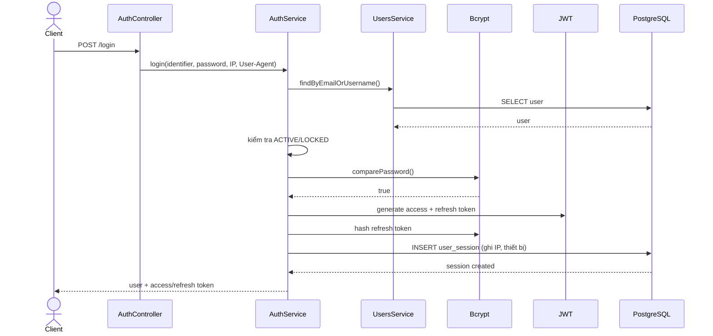
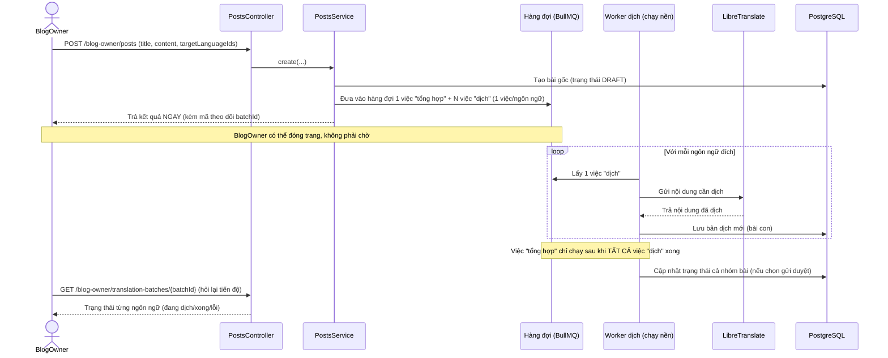
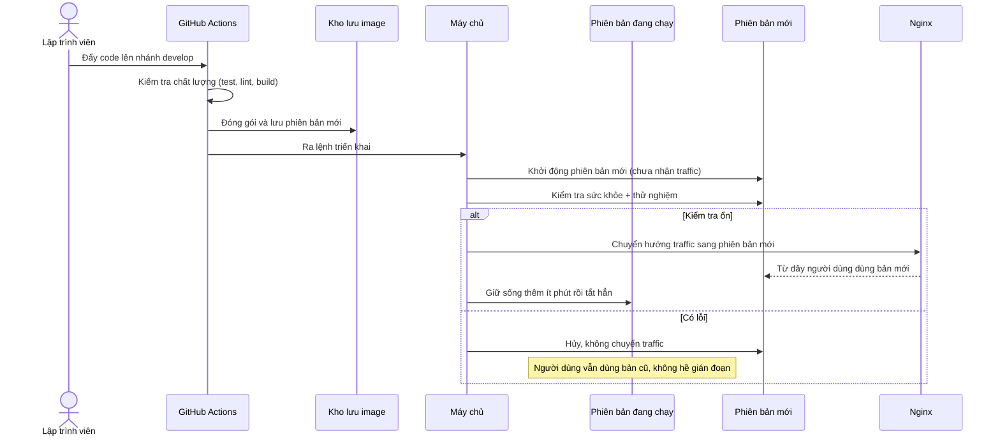

# Nội dung chi tiết Slide báo cáo — Blogy

> Dàn ý nội dung cho từng slide, dùng để tự dựng PowerPoint/Google Slides. Mỗi slide gồm: **Tiêu đề**, **Nội dung hiển thị** (ngắn gọn, dạng gạch đầu dòng — KHÔNG copy nguyên văn cả đoạn lên slide) và **Ghi chú thuyết trình** (những gì nên nói thêm bằng lời, không cần gõ lên slide).

---

## Slide 1 — Trang bìa

**Nội dung hiển thị:**
- **BLOGY** — Nền tảng Blog đa ngôn ngữ
- Đồ án cuối kỳ — [Tên môn học / Lớp]
- Thực hiện: Hoàng, Sơn
- Giảng viên hướng dẫn: [Tên]
- [Ngày báo cáo]

**Ghi chú:** Có thể chèn logo/ảnh chụp trang chủ blogy.id.vn làm nền mờ phía sau cho sinh động, thay vì nền trắng trơn.

---

## Slide 2 — Đặt vấn đề & Mục tiêu

**Nội dung hiển thị:**
- Nhu cầu: một nền tảng chia sẻ bài viết kỹ thuật, có kiểm duyệt nội dung, phục vụ độc giả nhiều ngôn ngữ
- Vấn đề thực tế: dịch nội dung thủ công sang nhiều ngôn ngữ tốn thời gian, không nhất quán
- **Mục tiêu dự án:**
  - Xây dựng đầy đủ vòng đời nội dung: viết → kiểm duyệt → xuất bản → tương tác
  - Tự động hóa việc dịch bài sang nhiều ngôn ngữ
  - Không dừng ở demo — **triển khai thành sản phẩm chạy thật**

**Ghi chú:** Nhấn mạnh gạch đầu dòng cuối — đây là điểm sẽ được khai thác kỹ ở slide 8-9, tạo kỳ vọng cho người nghe.

---

## Slide 3 — Tổng quan hệ thống

**Nội dung hiển thị:** một sơ đồ đơn giản (không dùng sơ đồ kiến trúc kỹ thuật chi tiết ở đây):

```
Người dùng
    │
    ▼
Frontend (Angular)  ──gọi API──▶  Backend (NestJS)
                                        │
                          ┌─────────────┼─────────────┐
                          ▼             ▼             ▼
                     Cơ sở dữ liệu   Lưu trữ ảnh   Dịch tự động
                     (PostgreSQL)   (Cloudinary)   (chạy nền)
```

- 2 repo riêng biệt (backend/frontend), cùng triển khai trên một máy chủ
- Tên miền thật: **blogy.id.vn**

**Ghi chú:** Đây là slide "bức tranh lớn" — không giải thích kỹ, chỉ để người nghe hình dung tổng thể trước khi đi vào chi tiết.

---

## Slide 4 — Vai trò & phân quyền

**Nội dung hiển thị (bảng):**

| Vai trò | Khả năng chính |
|---|---|
| Người dùng thường | Đọc, like, bookmark, bình luận, theo dõi, báo cáo vi phạm |
| Blog Owner | Viết, quản lý bài viết, dịch tự động |
| Content Moderator | Duyệt/từ chối bài, xử lý báo cáo |
| Super Admin | Quản lý người dùng, phân quyền, ngôn ngữ |

**Ghi chú:** Có thể minh họa bằng hình mũi tên "thăng cấp": người dùng thường → (xin duyệt) → Blog Owner, để cho thấy đây là một hệ thống phân quyền có luồng xét duyệt thật, không chỉ gán role tĩnh.

**Phòng khi bị hỏi xoáy** (không cần nói nếu không ai hỏi): 4 vai trò trong bảng thực chất được xếp theo bậc — người quản lý cao hơn tự động dùng được API của vai trò thấp hơn (Super Admin tự vào được API Moderator, Moderator/Super Admin tự vào được API Blog Owner), không cần gán thêm quyền. Nhưng vào được không có nghĩa thao tác được — ví dụ Super Admin vào trang quản lý bài viết của Blog Owner vẫn không thấy bài nào, vì hệ thống chỉ hiển thị đúng bài của người sở hữu thật. Chi tiết đầy đủ ở `ROLE_AND_PERMISSION_MATRIX.md`.

---

## Slide 5 — Tính năng nổi bật

**Nội dung hiển thị (chọn 4, không liệt kê hết mọi endpoint):**
- **Nội dung đa ngôn ngữ**: một bài viết có nhiều bản dịch liên kết với nhau, lượt xem/thích tính gộp theo cả nhóm
- **Dịch tự động chạy nền**: bấm dịch là xong ngay, hệ thống tự dịch phía sau, không cần chờ
- **Quy trình kiểm duyệt**: Nháp → Chờ duyệt → Xuất bản/Từ chối, đúng chuẩn biên tập nội dung thật
- **Dashboard riêng cho từng vai trò**: số liệu trực quan, biểu đồ

**Ghi chú:** Đây là chỗ nên chèn ảnh chụp màn hình thật (giao diện viết bài, giao diện duyệt bài, dashboard) — ảnh thật luôn thuyết phục hơn mô tả bằng chữ.

---

## Slide 5b — Sơ đồ tuần tự: Đăng nhập

**Nội dung hiển thị:** sơ đồ tuần tự (đã đối chiếu lại với code hiện tại, khớp với `docs/Preview Documentation/BUSINESS_WORKFLOWS.md` mục WF-02):



**Ghi chú:** Chọn luồng đăng nhập vì đơn giản, ai cũng hiểu ngay, dùng để mở đầu cho phần sơ đồ kỹ thuật trước khi vào luồng phức tạp hơn ở slide sau.

---

## Slide 5c — Sơ đồ tuần tự: Tạo bài viết + dịch tự động (luồng nổi bật nhất)

**Nội dung hiển thị:**



**Ghi chú:** Đây là sơ đồ **quan trọng nhất** của buổi báo cáo — thể hiện đúng điểm khác biệt lớn nhất của hệ thống: xử lý bất đồng bộ, không chặn người dùng. Nên giải thích thêm: "tổng hợp" chỉ chạy khi mọi bản dịch xong là do dùng cơ chế **Flow** của BullMQ (job cha chỉ chạy sau khi toàn bộ job con hoàn tất) — nói đơn giản: "giống như chỉ tổng kết điểm sau khi mọi bài thi đã được chấm xong".

---

## Slide 6 — Demo trực tiếp

**Nội dung hiển thị:**
- (Slide gần như trống chữ, chỉ ghi) **DEMO** — hoặc nhúng video quay màn hình nếu không demo trực tiếp được

**Kịch bản demo gợi ý (nói, không cần ghi lên slide):**
1. Đăng nhập với tài khoản Blog Owner → viết một bài ngắn → bật dịch sang 2 ngôn ngữ → bấm lưu, cho thấy trả kết quả ngay lập tức (không phải chờ dịch xong)
2. Theo dõi tiến trình dịch (nếu có màn hình progress) hoặc chuyển sang tài khoản Moderator
3. Đăng nhập Moderator → thấy bài đang chờ duyệt → duyệt bài
4. Mở `blogy.id.vn` ở tab ẩn danh → cho thấy bài đã lên trang thật, đổi được ngôn ngữ xem

**Ghi chú:** Nên quay sẵn video 2-3 phút phòng trường hợp demo trực tiếp bị lỗi mạng lúc báo cáo — rủi ro rất hay gặp.

---

## Slide 7 — Kiến trúc kỹ thuật

**Nội dung hiển thị (bảng gọn, không liệt kê hết mọi thư viện):**

| Thành phần | Công nghệ |
|---|---|
| Backend | NestJS, TypeScript |
| Cơ sở dữ liệu | PostgreSQL + Prisma |
| Xử lý nền | Redis + BullMQ |
| Dịch tự động | LibreTranslate (tự triển khai) |
| Frontend | Angular, Tailwind CSS |
| Hạ tầng | Docker, Nginx, GitHub Actions |

- Tổ chức theo **Modular Monolith**: chia theo nhóm chức năng (Public/User/Blog Owner/Moderator/Admin), dùng chung một lớp nghiệp vụ lõi

**Ghi chú:** Không cần giải thích sâu từng công nghệ — mục đích slide này là cho thấy nhóm dùng đúng công nghệ phù hợp với quy mô bài toán, không phải khoe số lượng thư viện.

---

## Slide 8 — Triển khai thật: mô hình Blue-Green

**Nội dung hiển thị:**
- Dự án **không chỉ chạy demo local** — đang chạy thật 24/7 tại `blogy.id.vn`
- Mỗi lần cập nhật code, hệ thống **không hề gián đoạn** với người dùng thật

**Sơ đồ minh họa đơn giản (vẽ 2 hộp):**

```
   [Phiên bản đang chạy] ◀── người dùng đang dùng
   [Phiên bản mới]       ◀── đang cập nhật + kiểm tra kỹ

   Kiểm tra ổn  →  chuyển người dùng sang phiên bản mới
   Có vấn đề    →  không chuyển, người dùng không hề hay biết
```

**Ghi chú:** Đây là khái niệm "blue-green deployment" — giải thích bằng lời: giống như có 2 ca trực thay phiên nhau, ca mới phải được kiểm tra kỹ trước khi được giao việc thật, ca cũ vẫn đứng dự phòng một lúc trước khi nghỉ hẳn.

---

## Slide 8b — Sơ đồ tuần tự: Một lần triển khai (Blue-Green)

**Nội dung hiển thị:**



**Ghi chú:** Nhấn mạnh nhánh "Có lỗi" — đây chính là giá trị cốt lõi của mô hình blue-green: lỗi ở phiên bản mới không bao giờ chạm tới người dùng thật, vì traffic chỉ được chuyển sau khi đã kiểm tra kỹ.

---

## Slide 9 — Triển khai thật: tự động hóa (CI/CD)

**Nội dung hiển thị (dạng luồng ngang):**

```
Đẩy code lên  →  Tự động kiểm tra   →  Tự động đóng gói  →  Tự động đưa lên
(git push)       (test, kiểm tra lỗi)   (Docker image)        máy chủ thật
```

- Một bước kiểm tra thất bại → **dừng ngay, không có bản lỗi nào lên production**
- Toàn bộ quá trình không cần thao tác tay — chỉ cần đẩy code

**Ghi chú:** Có thể chèn ảnh chụp màn hình GitHub Actions thật (các job xanh ✓) — bằng chứng trực quan, dễ thuyết phục hơn mô tả.

---

## Slide 10 — Vượt qua sự cố thật (chọn 1-2 câu chuyện)

**Nội dung hiển thị — Câu chuyện 1:**
- **Vấn đề**: dịch một bài viết dài bị lỗi, dù hệ thống dịch không hề "chết"
- **Nguyên nhân**: dịch vụ dịch chỉ xử lý được một việc tại một thời điểm; cơ chế tự giám sát hiểu nhầm "đang bận" thành "đã hỏng" và khởi động lại giữa chừng
- **Cách xử lý**: nới thời gian chờ trước khi coi là "hỏng thật", để việc dịch dài có đủ thời gian hoàn thành

**Nội dung hiển thị — Câu chuyện 2 (nếu còn thời gian):**
- **Vấn đề**: 2 lần cập nhật code gần nhau khiến bản cũ hơn "đè" lên bản mới hơn, dù hệ thống báo thành công
- **Nguyên nhân**: hai lần cập nhật xử lý độc lập, không cái nào biết cái kia tồn tại
- **Cách xử lý**: thêm bước kiểm tra "commit này có mới hơn bản đang chạy không" trước khi cho phép cập nhật

**Ghi chú:** Đây là slide thể hiện năng lực gỡ lỗi thật — nên nói chậm, rõ ràng nguyên nhân, tránh sa vào thuật ngữ kỹ thuật quá sâu (không cần nói "gunicorn worker", chỉ cần "tiến trình xử lý dịch").

---

## Slide 11 — Số liệu tổng kết

**Nội dung hiển thị (bảng số liệu, để cuối cho ấn tượng):**

| Hạng mục | Số lượng |
|---|---:|
| API endpoint | 92 |
| Bảng dữ liệu | 20 |
| Bài kiểm thử tự động | 518 (100% pass) |
| Vai trò người dùng | 4 |
| Thời gian vận hành thật | 24/7, có tên miền thật |

**Ghi chú:** Chỉ cần đọc to số liệu, không cần giải thích thêm — slide này để "chốt" ấn tượng quy mô công sức đã bỏ ra.

---

## Slide 12 — Phân công nhóm

**Nội dung hiển thị (bảng):**

| Thành viên | Phụ trách |
|---|---|
| **Hoàng** | Nền tảng dùng chung, API công khai, API người dùng, API quản trị |
| **Sơn** | API Blog Owner, API Moderator, hệ thống dịch tự động chạy nền |

**Ghi chú:** Nếu giảng viên hỏi riêng từng người, nên chuẩn bị sẵn 1-2 câu mô tả phần việc khó nhất của bản thân để trả lời tự tin.

---

## Slide 13 — Hướng phát triển tiếp theo

**Nội dung hiển thị:**
- Đăng nhập nhanh qua Google (OAuth2)
- Tìm kiếm bài viết thông minh hơn
- Mở rộng ghi nhận log bảo mật
- Nâng cấp hạ tầng khi có thêm tài nguyên

**Ghi chú:** Cho thấy nhóm hiểu rõ giới hạn hiện tại và có định hướng rõ ràng, không phải "hết ý tưởng".

---

## Slide 14 — Kết thúc

**Nội dung hiển thị:**
- Cảm ơn thầy/cô đã theo dõi
- Website: **blogy.id.vn**
- Repo: [link GitHub backend/frontend]
- Sẵn sàng giải đáp câu hỏi

---

## Gợi ý chung khi trình bày

- **Không đọc chữ trên slide** — slide chỉ là điểm tựa, nội dung chính nói bằng lời.
- **Ảnh chụp màn hình thật luôn tốt hơn mô tả** — ưu tiên chèn ảnh ở slide 5, 6, 9.
- **Cách đưa sơ đồ tuần tự (mermaid) vào PowerPoint**: PowerPoint không tự vẽ được cú pháp mermaid — dán đoạn code trong các slide 5b/5c/8b vào trình vẽ online (ví dụ mermaid.live), xuất ra ảnh PNG/SVG rồi chèn vào slide như ảnh thường. Nếu muốn chỉnh tay, có thể vẽ lại bằng draw.io theo đúng thứ tự mũi tên trong sơ đồ.
- Nếu bị hỏi khó về một chi tiết kỹ thuật không nhớ rõ, có thể trả lời "chi tiết phần này em có ghi đầy đủ trong tài liệu `DEPLOYMENT.md`, em xin phép trả lời khái quát trước..." rồi tra lại — thành thật vẫn tốt hơn đoán bừa.
- Thời lượng gợi ý mỗi slide: slide nội dung ~30-45 giây, slide sơ đồ tuần tự ~1 phút (cần giải thích mũi tên), slide demo có thể 2-3 phút — tổng khoảng 14-17 phút cho 17 slide (14 slide gốc + 3 slide sơ đồ tuần tự 5b/5c/8b). Nếu thời gian báo cáo giới hạn dưới 10 phút, có thể bỏ bớt slide 5b (đăng nhập) vì là luồng cơ bản, giữ lại 5c và 8b vì đây là 2 điểm nhấn khác biệt nhất của dự án.
