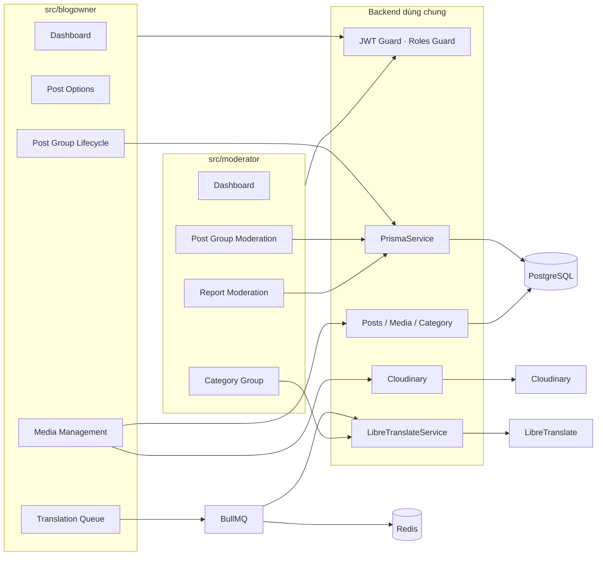

# PHÂN CHIA CÔNG VIỆC — SƠN

> Phạm vi phụ trách: **backend `src/blogowner` và `src/moderator`** của dự án **Quản lý Blog**, bao gồm API Blog Owner, Content Moderator, workflow Post Group đa ngôn ngữ, BullMQ/Redis, LibreTranslate, Category Group và xử lý Reports.

## 1. Thông tin tài liệu

| Thuộc tính       | Nội dung                                                                               |
| ---------------- | -------------------------------------------------------------------------------------- |
| Thành viên       | Sơn                                                                                    |
| Vai trò đề xuất  | Backend Developer — Blog Owner & Content Moderator APIs                                |
| Phạm vi chính    | `src/blogowner`, `src/moderator` và các tích hợp backend trực tiếp phục vụ hai module  |
| Số API phụ trách | **32 endpoint**: 14 Blog Owner + 18 Content Moderator                                  |
| Công nghệ        | NestJS 11, TypeScript, Prisma 7, PostgreSQL, Cloudinary, LibreTranslate, BullMQ, Redis |
| Ngày rà soát     | 15/09/2026                                                                             |
| Căn cứ đánh giá  | Unit/module test và build backend                                                      |

---

## 2. Tổng quan phần việc

Sơn phụ trách hai mảng backend nối trực tiếp thành workflow xuất bản nội dung:

1. **Blog Owner API — 14 endpoint:** dashboard, options, Post Group CRUD, gửi duyệt, media, preview dịch và background translation.
2. **Content Moderator API — 18 endpoint:** dashboard, kiểm duyệt Post Group, Category Group đa ngôn ngữ và xử lý Reports.

Phần triển khai tập trung vào tính nhất quán giữa các phiên bản ngôn ngữ, trạng thái kiểm duyệt, xử lý bất đồng bộ và an toàn dữ liệu khi có nhiều thao tác liên quan cùng một logical article.

### 2.1. Vai trò của phần việc trong kiến trúc



---

## 3. Công việc đã thực hiện trong `src/blogowner`

Triển khai **14 endpoint Blog Owner** cho toàn bộ vòng đời bài viết của chủ blog.

## 3.1. Xây dựng module và phân quyền

`BlogownerApiModule` tổ chức các thành phần chính:

| Thành phần                             | Trách nhiệm                                                    |
| -------------------------------------- | -------------------------------------------------------------- |
| `BlogownerDashboardController/Service` | Summary, activity và featured posts                            |
| `BlogownerOptionsController/Service`   | Language/category/tag active                                   |
| `BlogownerPostsController/Service`     | List/detail/create/update/delete/submit/translation preview    |
| `BlogownerMediaController/Service`     | Standalone upload/delete media theo Post Group                 |
| `BlogownerTranslationController`       | Translation batch progress                                     |
| `BlogownerPostHelperService`           | Ownership, group resolution, state transition, upload/rollback |
| `BlogownerTranslationQueueModule`      | BullMQ queue, worker và status service                         |

Áp dụng:

- `JwtAuthGuard`.
- `RolesGuard` + `@Roles(UserRole.BLOG_OWNER)`.
- `@CurrentUser()` để lấy owner ID từ JWT.
- `ParseIntPipe` cho path ID.
- Entity serializer để ẩn field nội bộ.

## 3.2. Thiết kế Post Group đa ngôn ngữ

Đã chuyển mô hình xử lý bài từ từng Post độc lập sang logical Post Group:

```text
ROOT
├─ Translation EN
├─ Translation JA
└─ ...
```

Các quy tắc đã triển khai:

- Root có `parentPostId=null`.
- Translation trỏ về root.
- List phân trang theo group.
- Filter chọn group khớp nhưng trả toàn bộ version active của group.
- Tổng view/like được aggregate theo group.
- Detail trả context các version ngôn ngữ.
- Update/delete/submit chỉ thực hiện bằng root ID.
- Không cho sửa riêng translation.
- Translation được upsert theo `(parentPostId, languageId)` để tránh duplicate.

## 3.3. Dashboard Blog Owner

Triển khai ba endpoint độc lập:

- `/dashboard/summary`: số logical article theo trạng thái, tổng view/like/comment.
- `/dashboard/activity`: interaction theo ngày, hỗ trợ 1–30 ngày.
- `/dashboard/featured`: top exact Post `PUBLISH` theo views/likes.

Các quyết định nghiệp vụ:

- `postCounts` đếm root.
- Tổng interaction tính trên root + translations.
- Daily likes là net change nên có thể âm.
- Activity luôn trả đủ ngày.
- Featured không group translation; mỗi exact Post tự cạnh tranh.

## 3.4. Options cho bài viết

Đã triển khai dữ liệu lựa chọn được lọc phía backend:

- language chưa xóa và `isActive=true`;
- default language xếp trước;
- category chưa xóa;
- category thuộc language active và Category Group active;
- tag chưa soft-delete.

## 3.5. Create/Update Post Group

Create:

- kiểm tra từ cấm ở `title`/`content` trước khi lưu;
- validate thumbnail file thật trước khi tạo row Post;
- luôn tạo root dưới `DRAFT`;
- xử lý thumbnail/media;
- nếu không có translation thì quyết định `DRAFT`/`PENDING_REVIEW` ngay;
- nếu có translation thì enqueue BullMQ và giữ root/group `DRAFT` trong lúc worker chạy.

Update:

- chỉ root được update;
- khóa cả group nếu có version `PENDING_REVIEW`;
- kiểm tra lại từ cấm tại service để không thể bypass DTO khi gọi nội bộ;
- chống update rỗng;
- giữ toàn bộ translation hiện có;
- thêm language mới khi được chọn;
- dịch lại translations từ root;
- reset review metadata đúng thời điểm;
- thumbnail mới phải qua kiểm tra file thật;
- có cleanup thumbnail/media khi lỗi.

## 3.6. BullMQ và Redis cho background translation

Đã xây dựng workflow:

| Thành phần         | Nội dung                                      |
| ------------------ | --------------------------------------------- |
| Queue              | `blogowner-translation`                       |
| Flow               | `blogowner-translation-flow`                  |
| Child              | `translate-post`                              |
| Parent             | `finalize-translation-batch`                  |
| Storage            | Redis                                         |
| Worker concurrency | xử lý giới hạn đồng thời theo cấu hình module |
| Retry              | attempts + exponential backoff                |
| Business failure   | `UnrecoverableError` với lỗi không thể retry  |
| Stale guard        | `sourceUpdatedAt`                             |

Luồng:

```text
ROOT DRAFT
  ↓
translate target 1 ─┐
translate target 2 ─┼─> finalize
translate target N ─┘
  ↓
DRAFT hoặc PENDING_REVIEW
```

Worker:

- đọc lại root từ DB;
- kiểm tra stale job;
- gọi LibreTranslate;
- kiểm tra `title`/`content` sau dịch; output chứa từ cấm bị `UnrecoverableError` và không ghi DB;
- map Category Group theo target language;
- upsert translation;
- update progress;
- nếu batch cần submit, parent kiểm tra lại toàn bộ group trước khi finalize `PENDING_REVIEW`;
- parent chỉ finalize sau khi các child thành công.

## 3.7. Translation batch progress

Triển khai API:

```http
GET /api/v1/blog-owner/translation-batches/:batchId
```

Trả:

- `QUEUED`;
- `PROCESSING`;
- `COMPLETED`;
- `FAILED`;
- progress toàn batch;
- progress từng target language.

Có ownership check và không trả raw internal failure ra response.

## 3.8. LibreTranslate

Đã chuẩn hóa Blog Owner dùng shared `LibreTranslateService`:

- preview title/content;
- worker dịch title/content;
- `format=html`;
- xử lý lỗi upstream/cấu hình;
- không lưu preview vào database.

Trong clean code cuối đã loại bỏ `TranslationService` legacy riêng của Blog Owner.

## 3.9. Category mapping khi dịch bài

Không dịch lại category name.

Backend:

1. lấy `categoryGroupId` của category nguồn;
2. tìm category cùng group ở target language;
3. dùng category đích cho translation;
4. từ chối job nếu mapping nghiệp vụ không hợp lệ.

Cách này bảo đảm cùng semantic category giữa các ngôn ngữ.

## 3.10. Media và Cloudinary

Đã triển khai:

- thumbnail upload;
- thumbnail **chỉ nhận JPEG / PNG / WEBP thật**, tối đa 10 MB;
- nhận diện thumbnail bằng magic bytes từ buffer;
- bắt buộc MIME và extension khớp định dạng file thực tế;
- chặn HTML/SVG/JS/PDF/ZIP hoặc file giả `.png/.jpg/.webp`;
- không cho Blog Owner truyền trực tiếp `thumbnailUrl`;
- media ảnh/video;
- nhận diện `MediaType`;
- soft-delete media;
- cleanup Cloudinary;
- rollback media đã upload nếu batch upload lỗi;
- cleanup thumbnail mới khi DB update lỗi.

Sau clean code, standalone media được quản lý theo group:

- chỉ root ID được thao tác;
- media gắn root;
- delete phải đúng root;
- `PUBLISH` → cả group `PENDING_REVIEW` trước thao tác;
- `REJECT` → chỉ về `DRAFT` sau thao tác thành công;
- group có `PENDING_REVIEW` → khóa media.

## 3.11. Defense-in-depth cho từ cấm

Ngoài `IsProfanityFree` ở DTO, backend kiểm tra từ cấm ở nhiều lớp:

- Create: service kiểm tra lại title/content trước khi lưu.
- Update: service kiểm tra lại các field title/content được gửi lên.
- Submit: đọc root + translations đang lưu trong DB và chặn nếu bất kỳ version nào chứa từ cấm.
- Translation worker: kiểm tra output từ LibreTranslate trước khi upsert.
- Finalize batch: nếu `submitForReview=true`, kiểm tra toàn group lần cuối trước khi chuyển sang `PENDING_REVIEW`.
- Nội dung HTML được bỏ tag, normalize Unicode/chữ thường và kiểm theo ranh giới từ để tránh false positive kiểu `dm` trong `admin` hoặc `ngu` trong `nguyen`.

## 3.12. Submit và delete toàn group

Submit:

```text
DRAFT root + translations
        ↓
PENDING_REVIEW toàn group
```

Delete:

- chỉ root ID;
- soft-delete root + translations;
- dùng cùng timestamp.

---

## 4. Công việc đã thực hiện trong `src/moderator`

Triển khai **18 endpoint Content Moderator** gồm bốn nhóm chức năng.

## 4.1. Module và phân quyền

Các controller/service chính:

| Thành phần                              | Trách nhiệm                           |
| --------------------------------------- | ------------------------------------- |
| `ModeratorDashboardController/Service`  | Overview, report stats, report trend  |
| `ModeratorPostsController/Service`      | List/detail/approve/reject Post Group |
| `ModeratorCategoriesController/Service` | Category Group đa ngôn ngữ            |
| `ModeratorReportsController/Service`    | List/detail/resolve/reject Reports    |

Toàn bộ route áp dụng:

- `JwtAuthGuard`;
- `RolesGuard`;
- `@Roles(UserRole.CONTENT_MODERATOR)`;
- path ID qua `ParseIntPipe`;
- DTO validation;
- `@CurrentUser()` để ghi reviewer trong thao tác kiểm duyệt.

## 4.2. Dashboard Moderator

Triển khai:

- `GET /moderator/dashboard/overview`;
- `GET /moderator/dashboard/report-stats`;
- `GET /moderator/dashboard/report-trend`.

Nội dung:

- số root post `PENDING_REVIEW`;
- pending report theo POST/COMMENT;
- tổng pending report;
- số Category Group active;
- post/report đã xử lý trong ngày;
- report theo status/reason;
- trend report 7 ngày theo lịch Việt Nam.

Endpoint dashboard aggregate cũ đã được loại bỏ trong clean code cuối.

## 4.3. Kiểm duyệt Post Group

Danh sách:

- mặc định phục vụ bài `PENDING_REVIEW`;
- cho lọc `PENDING_REVIEW`, `PUBLISH`, `REJECT`;
- không cho `DRAFT`;
- list theo root;
- hỗ trợ search/language/category/author/tag/pagination.

Detail:

- đọc full content của version;
- trả author/language/category/tag/media;
- trả reviewer;
- trả translations summary của group;
- không tăng view count.

Approve:

```text
PENDING_REVIEW toàn group
        ↓
PUBLISH toàn group
```

Reject:

```text
PENDING_REVIEW toàn group
        ↓
REJECT toàn group
```

Hai luồng ghi review metadata và dùng transaction/conditional update để giảm race condition giữa nhiều Moderator.

## 4.4. Category Group đa ngôn ngữ

Đã triển khai bảy endpoint:

- list group;
- detail group;
- translate preview;
- create;
- update/upsert;
- delete một translation;
- delete cả group.

Quy tắc xóa cuối:

- xóa một translation riêng lẻ vẫn là **soft-delete**;
- không cho xóa translation active cuối cùng;
- không cho xóa translation đang được `PostCategory` sử dụng;
- xóa cả Category Group là **hard-delete**;
- trước khi hard-delete, backend đếm mọi `PostCategory` tham chiếu các Category thuộc group;
- nếu còn usage thì transaction dừng và group được giữ nguyên;
- nếu không còn usage thì xóa cứng tất cả Category con trước, rồi xóa `CategoryGroup`;
- sau hard-delete có thể tạo lại cùng group `code` và category name/language.

Validation:

- `code` trim/lowercase;
- max 50;
- chỉ `[a-z0-9]`, `-`, `_` theo regex DTO;
- phải có ít nhất một translation khi create;
- không trùng `languageId`;
- category name max 100 và profanity check.

Update chỉ upsert translations có trong payload; translation không gửi lên được giữ nguyên.

## 4.5. Dịch category bằng LibreTranslate

`translate-preview`:

- không ghi DB;
- kiểm tra source/target language;
- nhận một source name;
- dịch sang nhiều target languages;
- trả source metadata và danh sách preview.

Category Group sau đó trở thành nguồn mapping khi Blog Owner dịch post.

## 4.6. Xử lý Reports

List:

- filter target type, status, reason, reporter, post, comment;
- pagination;
- workflow mặc định tập trung report `PENDING`.

Detail:

- trả reporter/reviewer public summary;
- target POST có post context;
- target COMMENT có comment, user, bài cha và context parent/replies cần thiết.

Resolve:

- claim report bằng conditional update;
- transaction;
- POST target được xử lý theo Post Group;
- COMMENT target được soft-delete;
- xử lý report liên quan theo service;
- report → `RESOLVED`;
- lưu reviewer/time/note.

Reject:

- report → `REJECTED`;
- target giữ nguyên;
- lưu reviewer/time/note.

---

## 5. Danh sách API đã triển khai

### 5.1. Blog Owner — 14 endpoint

| Mã  | Method | Endpoint                                          | Chức năng             |
| --- | ------ | ------------------------------------------------- | --------------------- |
| B01 | GET    | `/api/v1/blog-owner/dashboard/summary`            | Dashboard summary     |
| B02 | GET    | `/api/v1/blog-owner/dashboard/activity`           | Activity theo ngày    |
| B03 | GET    | `/api/v1/blog-owner/dashboard/featured`           | Bài nổi bật           |
| B04 | GET    | `/api/v1/blog-owner/options`                      | Language/category/tag |
| B05 | GET    | `/api/v1/blog-owner/posts`                        | Danh sách Post Group  |
| B06 | GET    | `/api/v1/blog-owner/posts/:id`                    | Detail post/group     |
| B07 | POST   | `/api/v1/blog-owner/posts`                        | Tạo bài/group         |
| B08 | PATCH  | `/api/v1/blog-owner/posts/:id`                    | Update root/group     |
| B09 | DELETE | `/api/v1/blog-owner/posts/:id`                    | Delete toàn group     |
| B10 | POST   | `/api/v1/blog-owner/posts/:id/submit`             | Submit toàn group     |
| B11 | POST   | `/api/v1/blog-owner/posts/:id/translate-preview`  | Preview dịch          |
| B12 | POST   | `/api/v1/blog-owner/posts/:postId/media`          | Upload media root     |
| B13 | DELETE | `/api/v1/blog-owner/posts/:postId/media/:mediaId` | Delete media root     |
| B14 | GET    | `/api/v1/blog-owner/translation-batches/:batchId` | Translation progress  |

### 5.2. Content Moderator — 18 endpoint

| Mã  | Method | Endpoint                                                              | Chức năng                    |
| --- | ------ | --------------------------------------------------------------------- | ---------------------------- |
| M01 | GET    | `/api/v1/moderator/dashboard/overview`                                | Dashboard overview           |
| M02 | GET    | `/api/v1/moderator/dashboard/report-stats`                            | Report stats                 |
| M03 | GET    | `/api/v1/moderator/dashboard/report-trend`                            | Report trend                 |
| M04 | GET    | `/api/v1/moderator/posts`                                             | List moderation posts        |
| M05 | GET    | `/api/v1/moderator/posts/:postId`                                     | Post/group detail            |
| M06 | POST   | `/api/v1/moderator/posts/:postId/approve`                             | Approve group                |
| M07 | POST   | `/api/v1/moderator/posts/:postId/reject`                              | Reject group                 |
| M08 | GET    | `/api/v1/moderator/category-groups`                                   | List Category Group          |
| M09 | GET    | `/api/v1/moderator/category-groups/:groupId`                          | Group detail                 |
| M10 | POST   | `/api/v1/moderator/category-groups/translate-preview`                 | Preview category translation |
| M11 | POST   | `/api/v1/moderator/category-groups`                                   | Create group                 |
| M12 | PATCH  | `/api/v1/moderator/category-groups/:groupId`                          | Update group                 |
| M13 | DELETE | `/api/v1/moderator/category-groups/:groupId/translations/:languageId` | Delete translation           |
| M14 | DELETE | `/api/v1/moderator/category-groups/:groupId`                          | Delete group                 |
| M15 | GET    | `/api/v1/moderator/reports`                                           | List reports                 |
| M16 | GET    | `/api/v1/moderator/reports/:reportId`                                 | Report detail                |
| M17 | POST   | `/api/v1/moderator/reports/:reportId/resolve`                         | Resolve report               |
| M18 | POST   | `/api/v1/moderator/reports/:reportId/reject`                          | Reject report                |

Chi tiết contract nằm trong:

- `BLOGOWNER_API_DOCUMENTATION.md`
- `MODERATOR_API_DOCUMENTATION.md`

---

## 6. Kiểm thử và chất lượng

Sau clean code cuối, regression test cho đúng hai module phụ trách:

```text
Test Suites: 24 passed, 24 total
Tests:       184 passed, 184 total
Snapshots:   0 total
```

Build:

```text
npm run build     -> PASS
git diff --check  -> PASS
```

### 6.1. Nhóm test Blog Owner

- `blogowner-api.module.spec.ts`
- `blogowner-dashboard.controller.spec.ts`
- `blogowner-dashboard.service.spec.ts`
- `blogowner-media.service.spec.ts`
- `blogowner-posts.service.spec.ts`
- `blogowner-translation.controller.spec.ts`
- `blogowner-translation-queue.service.spec.ts`
- `blogowner-translation.processor.spec.ts`
- `blogowner-translation-status.service.spec.ts`

Phạm vi test:

- Post Group;
- create/update/submit và profanity defense-in-depth;
- thumbnail magic-byte/MIME/extension validation;
- Media group-safe;
- dashboard;
- queue/flow;
- translation processor;
- progress;
- stale job;
- retry/failure;
- module dependency.

### 6.2. Nhóm test Moderator

- dashboard controller/service;
- posts controller/service/entity;
- categories controller/service/entity/DTO;
- reports controller/service/entity;
- `moderator-api.module.spec.ts`.

Phạm vi:

- dashboard aggregation;
- Post Group moderation;
- approve/reject;
- Category Group hard-delete / translation soft-delete / usage protection;
- translation preview;
- Reports;
- conditional update/transaction;
- response entities.
